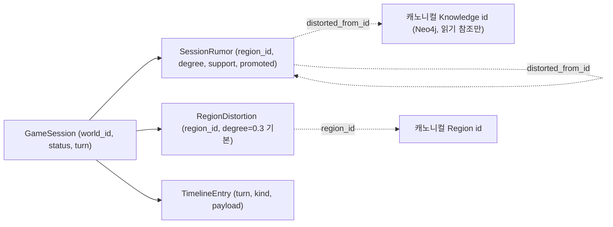

# S1 — Domain Entities (Functional Design)

Unit **S1 (Session Foundation & Infra)**. App Design: `inception/application-design/rumor-session/`.
Covers **FR-R1** + **NFR-R1/R2/R3** + Neo4j `Rumor` 제거.
확정 답: **FD-S1 Q1=B**(리전마다 기본 distortion row 생성) / **Q2=A**(world 존재 검증) / **Q3=A**(하이브리드 컬럼+JSON) / **Q4=A**(`new_id()` uuid4 + DB now) / **Q5=A**(미사용 Neo4j Rumor 테스트만 정리).

세션 레이어 순수 데이터(Pydantic v2, `locus/session/models.py`). 캐노니컬 모델 참조는 **id 문자열로만**(복사 없음, FR-R1.2). 캐노니컬(Neo4j/OpenSearch)은 불변.

---

## 1. Enums (`locus/session/models.py`)

### SessionStatus
```
OPEN    # 진행 중인 세션
CLOSED  # 종료된 세션(이력으로만 열람, 변경 불가)
```

### TimelineKind
GameMaster 턴 동작 1건당 1 항목. (실제 동작 로직은 S2; S1은 enum/구조만 정의.)
```
GENERATE        # 리전 소문 생성
REGENERATE      # 리전 소문 재생성(폐기 후 재생성)
PROMOTE         # support≥threshold → 승격
DEMOTE          # support<threshold → 강등
ADJUST_SUPPORT  # support 수동 조정
ADVANCE_TURN    # 턴 진행(turn++)
SET_DISTORTION  # 리전 distortion_degree 설정
```

---

## 2. GameSession (집계 루트)

| 필드 | 타입 | 설명 |
|---|---|---|
| `id` | `str` | `new_id()`(uuid4) (FD-S1 Q4=A). |
| `world_id` | `str` | 캐노니컬 world 참조. 시작 시 **존재 검증**(FD-S1 Q2=A, BR 참조). |
| `status` | `SessionStatus` | 생성 시 `OPEN`. |
| `turn` | `int` | 생성 시 `0`. GameMaster `advance_turn`마다 +1(S2). |
| `created_at` | `datetime` | DB 서버 시간(`default now`) (FD-S1 Q4=A). |
| `closed_at` | `datetime \| None` | close 시점, 미종료 시 `None`. |

- 한 world 위 **여러 세션 이력** 보관(FR-R1.1). 과거 세션은 읽기 전용 이력.
- S1에서 라이프사이클(start/close/list/get)을 `SessionService`로 제공.

## 3. SessionRumor

| 필드 | 타입 | 설명 |
|---|---|---|
| `id` | `str` | `new_id()`. |
| `session_id` | `str` | 소속 세션. |
| `region_id` | `str` | 캐노니컬 Region 참조(scope). |
| `distorted_from_id` | `str` | 원본 = 캐노니컬 Knowledge id **또는** 다른 SessionRumor id(연쇄, FR-R2.2). |
| `distorted_from_kind` | `str` | `"knowledge"` \| `"rumor"`. |
| `statement` | `str` | LLM 왜곡 텍스트(S2가 채움; S1 모델만 정의). |
| `distortion_degree` | `float [0,1]` | 왜곡 강도. |
| `support` | `float [0,1]` | 지지도(초기값 + 수동 조정, FR-R3.1). |
| `confidence` | `float [0,1]` | = 원본 confidence × (1−degree) (FR-R2.6). |
| `promoted` | `bool` | 승격 여부(기본 `False`; 세션 한정·비영속, FR-R3.2/3.3). |
| `provenance` | `Provenance` | 캐노니컬 `Provenance` 재사용(생성 출처/메서드). |

- S1은 모델·영속화(CRUD)만 보장. 실제 생성/왜곡/승격 로직은 S2.

## 4. RegionDistortion

| 필드 | 타입 | 설명 |
|---|---|---|
| `session_id` | `str` | 소속 세션. |
| `region_id` | `str` | 캐노니컬 Region 참조. |
| `distortion_degree` | `float [0,1]` | 그 리전의 왜곡 강도(GameMaster 보유). |

- **FD-S1 Q1=B**: 세션 시작 시 그 world의 **모든 리전에 기본값 row를 명시 생성**한다(기본 degree=`0.3`).
  - 누락 리전 없이 항상 `(session, region)` row 존재 → 조회 분기 단순화, "미설정" 상태 부재.
  - 리전 목록은 캐노니컬에서 읽음(world 검증과 동일 경로, BR 참조).
- 기본값 상수 `DEFAULT_DISTORTION_DEGREE = 0.3`(약한 왜곡)을 `locus/session/models.py`에 정의.

## 5. TimelineEntry

| 필드 | 타입 | 설명 |
|---|---|---|
| `id` | `str` | `new_id()`. |
| `session_id` | `str` | 소속 세션. |
| `turn` | `int` | 그 동작이 일어난 턴. |
| `kind` | `TimelineKind` | 동작 종류. |
| `summary` | `str` | 사람이 읽는 한 줄 요약. |
| `payload` | `dict` | 가변/중첩 상세(생성 rumor id 목록, 이전/이후 값 등). JSON 컬럼(Q3=A). |
| `created_at` | `datetime` | DB 서버 시간. |

- 정렬 계약: `list_timeline` = **turn 오름차순, 그다음 created_at 오름차순**(FR-R4.2).

---

## 6. 영속화 스키마 매핑 (PostgreSQL, FD-S1 Q3=A 하이브리드)

핵심 필드 = 정규 컬럼(인덱스/쿼리 대상), 가변/중첩 = JSON 컬럼. 상세 DDL/인덱스는 `business-logic-model.md` + Infrastructure Design.

| 테이블 | 정규 컬럼(인덱스 후보) | JSON 컬럼 |
|---|---|---|
| `game_sessions` | id(PK), world_id, status, turn, created_at, closed_at | — |
| `session_rumors` | id(PK), session_id(FK,idx), region_id(idx), distorted_from_id, distorted_from_kind, distortion_degree, support, confidence, promoted | provenance |
| `region_distortions` | session_id(idx), region_id, distortion_degree — PK(session_id, region_id) | — |
| `timeline_entries` | id(PK), session_id(FK,idx), turn, kind, summary, created_at | payload |

- `id`는 애플리케이션 생성(`new_id()` uuid4), `created_at`은 DB `server_default=now()`.

## 7. 제거 — 미사용 Neo4j `Rumor` (AD-R Q6=A, FD-S1 Q5=A)

캐노니컬 Neo4j `Rumor` 노드는 현재 전부 미사용(`rumors=[]`)이며 세션 `SessionRumor`로 대체된다. 제거 범위:

| 위치 | 제거 대상 |
|---|---|
| `locus/models/graph.py` | `class Rumor` |
| `locus/models/io.py` | `Rumor` import, `KnowledgeGraph.rumors` 필드, node label 주석의 `"Rumor"` |
| `locus/storage/graph_mapping.py` | `rumor_to_node`, `node_to_rumor`, `distorted_from_edges` |
| 영속/로딩 | loader / exporter / `persist` 의 rumor 경로, orchestrator의 `rumors=` |

- **유지(Rumor 노드와 무관)**: consensus의 auto-rumor `KnowledgeView`(`is_rumor`/`distortion_degree`)와 `ScopeLink.is_rumor` — 거리 기반 propagated 분류(기획자용). 그대로 둠.
- **테스트(FD-S1 Q5=A)**: Neo4j `Rumor` 직렬화/매핑 전용 테스트만 삭제/정리. consensus auto-rumor view 테스트는 유지.

## 8. 관계 요약 (Mermaid)

- 세션 레이어(PostgreSQL)는 캐노니컬(Neo4j) id를 **참조만** 함(NFR-R2 격리; 세션 쓰기가 캐노니컬을 바꾸지 않음).
