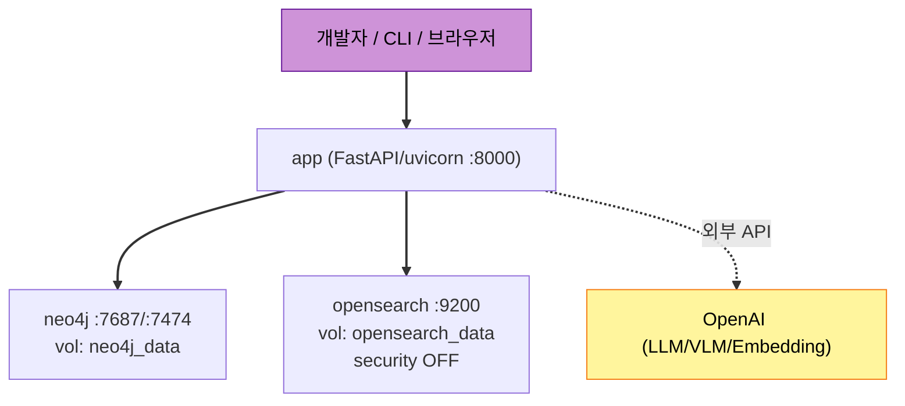

# U1 Foundation — Deployment Architecture

## Docker Compose 토폴로지

## 기동 순서 & 헬스체크
1. **neo4j** 기동 → healthcheck: bolt 포트 응답 / `cypher-shell` ping.
2. **opensearch** 기동 → healthcheck: `GET :9200/_cluster/health` (status yellow/green).
3. **app** 기동(`depends_on: condition: service_healthy`) → 시작 시 **SchemaInitializer** 실행(Neo4j 제약/인덱스 + OpenSearch 인덱스 매핑 생성, idempotent).

## 실행 방식 (ID-Q1=A)
- **풀 컨테이너**: `docker-compose up -d` → app+neo4j+opensearch.
- **호스트 개발**: `docker-compose up -d neo4j opensearch` 후 호스트에서 `uvicorn api.main:app --reload` (env의 URI를 `localhost`로).

## 영속성 (ID-Q3=A)
- named volumes: `neo4j_data`, `opensearch_data`. `docker-compose down`에도 보존, `down -v`로만 초기화.

## 데이터 초기화/시드
- CLI: `locus init-schema`(부트스트랩), `locus build-wiki <real-world-sources>`(상식 Wiki 빌드 — U6), `locus build-world <inputs>`(U9).

## 헬스/리디네스 (앱)
- `GET /health` — 앱·Neo4j·OpenSearch 연결 상태 반환(U8/U9에서 라우터 추가, U1은 연결 점검 유틸 제공).
