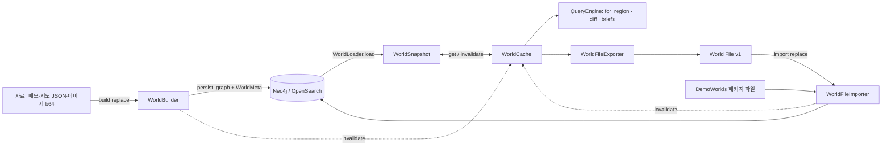

# U2 World File·캐노니컬 기반 — Business Logic Model

**원하시는 것**: 세계관 자료로 월드를 만들고, 그 안에서 소문과 사건이 지형을 따라 퍼지는 것을 겪는 솔로 TRPG.
**이 유닛이 해 주는 것**: 월드가 파일 ↔ 그래프 ↔ 메모리 스냅샷 사이를 잃는 것 없이 오가고, 빌드가 무엇을 못 했는지 말하며, 플레이가 스냅샷을 즉시 읽는 기반.

근거: FD-U2 답(Q1~Q7), 가정 A1~A8·버전·PBT-07·briefs(플랜 "질문 없이 정하는 것"), AD services.md §3.1·3.2, component-methods K3·K4·K5·W6·W9·W10. 전부 기술 중립으로 적되 지금 코드의 이름을 쓴다.

## 0. 흐름 한눈에


## 1. 로더 — `WorldLoader.load(world_id) -> WorldSnapshot` (K3, A5)
```
nodes  = find_nodes(Region) ∪ find_nodes(Entity) ∪ find_nodes(Knowledge) ∪ find_nodes(WikiPrior) ∪ find_nodes(NPC) ∪ find_nodes(WorldMeta)
edges  = get_edges(world_id)                       # 한 번에 읽고 type으로 나눈다
connections = CONNECTED_TO → ConnectionEdge ; scopes = SCOPED_TO → ScopeLink
relations   = RELATED_TO   → Relation       ; prior_links = PRIOR_LINK → WikiPriorLink
npcs.home_region_id ← LIVES_IN (엣지가 없으면 노드 속성 home_region_id를 믿고 warning 로그)
meta = node_to_worldmeta(WorldMeta) if 있음 else None
unscoped = {k.id | k ∉ scopes.knowledge_id ∧ ¬k.is_global}
return WorldSnapshot(...)  # 색인은 모델 validator가 계산
```
- 한 노드의 매핑 실패(옛 값·깨진 속성)는 **그 노드만 건너뛰고** `logger.warning`; 로드 전체를 깨뜨리지 않는다(U1 리뷰 #2의 교훈, BR-U2-16). 건너뛴 id는 `snapshot.load_warnings`에 남긴다.
- 존재하지 않는 월드(노드 0개, meta 없음) → `LookupError("world not found")`. 라우터는 404.

## 2. 캐시 — `WorldCache` (K4, Q6=A)
```
class WorldCache:
    _snapshots: dict[str, WorldSnapshot]; _gen: dict[str, int]; _lock: RLock   # _gen = 월드별 세대 번호
    get(world_id):
        with lock: hit → 반환 ; miss → gen0 = _gen[world_id]
        snap = loader.load(world_id)                    # 락 밖에서 로드(다른 월드 조회를 막지 않음)
        with lock:
            if _gen[world_id] == gen0: _snapshots[world_id] = snap   # 로드 중 무효화가 없었을 때만 저장
        return snap                                     # 세대가 바뀌었으면 캐시에 넣지 않고 그대로 돌려준다(다음 get이 다시 로드)
    invalidate(world_id): with lock: _snapshots.pop(world_id, None); _gen[world_id] += 1
    clear():              with lock: 전부 pop; 모든 _gen += 1
```
- 프로세스 메모리, 명시적 무효화만(TTL 없음). 단일 워커 전제를 `operations.md`와 compose(`--workers 1`)에 적는다. 동기 라우터는 스레드풀에서 돌므로 위 세대 번호가 "로드 중 무효화 → 낡은 스냅샷 저장"을 막는다(BR-U2-17).
- 무효화 호출점(정본 목록): `WorldBuilder.build`의 커밋 단계 이후(`finally`), `WorldFileImporter.import_`의 커밋 단계 이후(`finally`), `DemoWorlds.load`(임포터 안), `WorldEditor`의 모든 쓰기 끝(U3), 증강 `apply/revert` 끝(U3에서 에디터를 쓰므로 동일). 그 밖의 경로는 캐노니컬을 쓰지 않는다(플레이는 읽기 전용).
- 스냅샷은 공유 객체다. 호출자는 바꾸지 않는다(BR-U2-18). 테스트에서 `assert_frozen`은 두지 않고 문서 규칙 + 코드 리뷰로 지킨다(Pydantic `frozen=True`는 파생 색인 계산과 충돌하므로 쓰지 않는다).

## 3. 질의 — `QueryEngine(cache, params)` (K5)
- `knowledge_for_region(world_id, region_id, *, include_hearsay)`: `cache.get` → `compute_consensus(region_id, snapshot=…)`. `KnowledgeView.title`을 `Knowledge.title`에서 채운다(A8). 그 밖의 의미는 U1 그대로.
- `diff_regions`: 그대로(스냅샷 사용).
- `region_briefs(world_id, *, top_k=3) -> list[RegionBrief]`:
  ```
  for r in topo.regions (level 순, 이름 순):
      level_path = 조상 이름 위→아래 + r.name
      direct = [k for s in scopes if s.region_id == r.id and s.scope_type == DIRECT]
      top = sorted(direct, key=(-confidence, id))[:top_k] → title
      RegionBrief(r.id, r.name, r.level, level_path, r.description, top)
  ```
  사건 제안(U7)이 프롬프트에 넣는다. 지식 0개인 지역도 브리프에 들어간다(이름·설명만).

## 4. 수집 결함 수정 (W1: A1·A2·A7·Q3)

### 4.1 이름 해석 규칙 — `resolve_region(...)` (Q3=A) — `world/topology/naming.py`(순수)
```python
LEVEL_RANK: dict[RegionLevel, int] = {          # 넓은 것 → 좁은 것. enum 선언 순서와 무관한 명시 표
    RegionLevel.CONTINENT: 0,
    RegionLevel.PROVINCE: 1,
    RegionLevel.TOWN: 2,
    RegionLevel.DISTRICT: 3,                     # district = 마을 안의 구역(town이 district를 포함)
}
# RegionLevel.TERRAIN(VLM이 승격한 지형)은 위계 레벨이 아니다: 표에 없고, 아래 (c)(d)의 모호성 해소에서
# 제외된다. 지형은 (a) 레벨 정확 일치나 (b) 유일 후보일 때만 붙는다. enum에 값이 추가되면
# `test_level_rank_covers_every_hierarchy_level`이 실패한다.

def index_by_name(regions: list[Region]) -> dict[str, list[Region]]     # normalize_name(name) → 후보들

def resolve_region(
    name: str,
    by_name: dict[str, list[Region]],
    *,
    role: Literal["parent", "hint"],
    child_level: RegionLevel | None = None,   # role == "parent"일 때 필수
    level: RegionLevel | None = None,         # 힌트가 레벨을 명시했을 때
) -> tuple[Region | None, BuildWarning | None]:
    cands = by_name.get(normalize_name(name), [])
    if not cands:                      return None, warn("unresolved: {name}")
    if level is not None:              # (a) 레벨 명시 → 정확 일치만
        exact = [c for c in cands if c.level == level]
        return (pick(exact), None) if exact else (None, warn("level mismatch: {name}/{level}"))
    if role == "parent":               # (c) 자식보다 상위 레벨인 후보 중 가장 좁은 레벨 — 후보가 1개여도 검사한다
        above = [c for c in cands if c.level in LEVEL_RANK and LEVEL_RANK[c.level] < LEVEL_RANK[child_level]]
        if not above:                  return None, warn("no parent-level candidate: {name} for {child_level}")
        best = max(above, key=lambda c: LEVEL_RANK[c.level])
        return pick([c for c in above if c.level == best.level]), (None if len(cands) == 1 else warn("ambiguous parent; chose {best.level}"))
    # role == "hint" (연결 힌트, 지식 region_hint)
    if len(cands) == 1:                return cands[0], None                       # (b) 유일 후보(지형 포함)
    ranked = [c for c in cands if c.level in LEVEL_RANK]                            # (d) 지형 제외, 가장 좁은 레벨
    if not ranked:                     return pick(cands), warn("ambiguous hint among terrain: {name}")
    best = max(ranked, key=lambda c: LEVEL_RANK[c.level])
    return pick([c for c in ranked if c.level == best.level]), warn("ambiguous hint; chose most specific {best.level}")

pick(xs) = sorted(xs, key=lambda r: (r.name, r.id))[0]        # (e) 동률 고정
warn(msg) = BuildWarning(stage="topology"|"ontology", item_id=None, message=msg, severity="warning")
```
- `assign_hierarchy`(부모, `child_level=r.level`), `topology/builder`(연결 힌트), `ontology/builder.scope_knowledge`(지식 힌트) 셋이 **이 함수 하나**를 쓴다. 입력은 항상 `index_by_name(regions)`(수집 단계에는 스냅샷이 없으므로 지역 목록에서 만든다; 스냅샷의 `regions_by_name`도 같은 함수로 만든다). 반환 경고는 그대로 리포트에 오른다.
- 구조화 지도의 `parent`는 이름만 있으므로 role=parent; 지도의 `connections.from/to`는 role=hint; 메모 추출의 `region_hint`는 role=hint(추출기가 레벨을 주면 `level` 사용).

### 4.2 지역 병합 — `merge_regions(hints) -> list[Region]` (A1)
```
key = (normalize_name(name), level)
first-wins: id, name, level, description(비어 있으면 뒤의 것으로 채움), position(첫 non-null), provenance
attributes: 리스트 키(adjacent_names, connections)는 순서 보존 합집합; 스칼라 키는 첫 값, 다르면 warning("attribute conflict", item_id=region.id)
```
구조화 지도가 낸 연결 후보(`attributes.connections`)와 `parent_name`은 병합 뒤에도 남고, 토폴로지 빌더가 그것을 읽는다(지금은 유실).

### 4.3 엔티티 병합 — `merge_entities(entities) -> tuple[list[Entity], EntityIdMap]` (A2)
```
key = (normalize_name(name), entity_type) ; 정본 = 첫 항목 ; id_map[dup.id] = canonical.id
confidence = max ; description = 첫 non-empty ; located_in = 첫 non-null
```
`IngestionService.ingest_all`은 병합 뒤 `relations.source_id/target_id`, `knowledge.about_entity_ids`를 `id_map`으로 재작성하고, 재작성 뒤에도 못 찾는 참조는 warning("dangling reference") + 그 관계 제거.

### 4.4 이미지 입력 — (A7)
`WorldInputs.map_images: list[str]`(base64). `IngestionService`가 `base64.b64decode(validate=True)`; 실패는 `BuildWarning(stage="ingestion", severity="error", message="map image #i is not valid base64")`. API: JSON 본문(base64)과 `multipart/form-data`(`/build/upload`, 파일 필드 `memos[]`, `maps[]`, `images[]`) 둘 다 → 같은 `WorldInputs`.

## 5. 빌드 — `WorldBuilder.build(world_id, inputs, *, replace: bool) -> BuildReport` (W6, A3·A12·A13·NFR-5)
```
counter = LLMCallCounter(shared.llm, vlm, embedding)           # 이 빌드만의 래퍼(공유 상태 없음)
warnings = []; replaced = False
exists = world_id in graph.list_world_ids()                    # 승인된 S4 신규 메서드만 사용(R-07)
if exists and not replace: raise WorldExistsError(world_id)    # 라우터 409 / CLI 종료 1

# ── 준비 단계: 그래프를 건드리지 않는다. 여기서 실패하면 옛 월드는 그대로다 ──
ingestion = ingest_all(wid, inputs)                            → warnings += ingestion.warnings
if ingestion.regions == [] and ingestion.entities == [] and ingestion.knowledge == []:
    return BuildReport(ok=False: error("nothing ingested"), replaced=False)   # 저장 없음
topology  = TopologyBuilder(wiki).build(...)                   → warnings += (계층·힌트 경고)
priors, links = distill/link (LLM)
if len(topology.regions) == 0: warnings += error("no regions produced"); return report(ok=False, replaced=False)

# ── 커밋 단계: 되돌릴 수 없다 ──
try:
    if exists and replace:
        backup = exporter.export(wid) → backup_dir/{wid}-{ts}.world.json   (실패 = warning, 계속)   # BR-U2-11
        graph.delete_world(wid); search.delete_world(wid); replaced = True
    persist_graph(priors, prior_links)             # 온톨로지의 고증이 이 월드의 prior를 검색에서 찾는다(BR-A12)
    kg = OntologyBuilder(...).build(...)           # LLM·임베딩 호출 포함; unscoped_ids = kg.unscoped
    persist_graph(regions, entities, knowledge, connections, scopes, relations, npcs=[])
    persist WorldMeta(id=wid, name=inputs.name or wid, description=inputs.description, updated_at=now, last_writer="build")
finally:
    cache.invalidate(wid)                          # 예외가 나도 낡은 스냅샷을 남기지 않는다
return BuildReport(counts, warnings, unscoped_knowledge_ids, llm_calls=counter.llm, embedding_calls=counter.embedding, replaced)
```
- `ok = error 없음`(Q4=A). persist 실패는 error; 항목 단위 거절·미해석·임베딩 실패·계층 경고는 warning.
- **커밋 단계 안의 실패**(온톨로지 LLM 오류, persist 예외)는 부분 저장을 남긴다. 그 경우 예외를 삼키지 않고 `BuildReport`를 `ok=False, replaced=True`와 error 경고로 채워 돌려주거나(persist 실패), 예외를 그대로 올린다(온톨로지 실패 — 라우터 500, CLI 종료 1). 어느 쪽이든 옛 월드는 `backup_dir`의 World File에 남아 `import`로 되돌릴 수 있다(BR-U2-11). 커밋 전 실패는 옛 월드를 건드리지 않는다.
- 동시 빌드는 빌더 인스턴스가 빌드마다 새로 만들어지므로 상태를 공유하지 않는다(U1에서 이미). 같은 world_id 동시 빌드는 막지 않는다(데모 규모; 문서에 적는다).
- 열린 세션이 있는 월드의 교체 확인은 **라우터**가 한다(§8). 빌더는 모른다(경계 규칙: world → play 금지).

## 6. World File 내보내기 — `WorldFileExporter(cache).export(world_id) -> WorldFile` (W9)
```
s = cache.get(wid)
meta = s.meta or WorldMeta(id=wid, name=wid)
return WorldFile(format_version=1, world={id, name, description}, exported_at=now, <절마다 아래 키로 정렬>)
```
**정렬 키(모든 절, 정본 표 — BR-U2-3과 domain-entities §1.4가 이 표를 가리킨다)**

| 절 | 키 |
|---|---|
| regions, entities, knowledge, priors, npcs, relations | `id` |
| connections | `(source_region_id, target_region_id, kind)` |
| scopes | `(knowledge_id, region_id)` |
| prior_links | `(source_id, target_id, relation)` |

- 항목 안의 리스트(`about_entity_ids`, `derived_from_prior_ids`, `traits`, `provenance.refs`, `attributes.adjacent_names`)는 저장된 순서를 그대로 둔다(Neo4j가 리스트 순서를 보존한다). `attributes` 같은 dict는 `json.dumps(..., sort_keys=True)`로 쓴다. 파일 전체도 `sort_keys=True, indent=2`로 써서 같은 스냅샷이면 바이트가 같다.
- `exported_at`은 왕복 비교에서 제외한다(PBT-02는 `exported_at`을 뺀 dump로 비교). `find_nodes`·`get_edges`의 반환 순서에 기대지 않는다(TP-U2-1은 입력을 섞어도 export가 같음을 본다).
- 옛 `export_world() -> dict`는 `export(...).model_dump(mode="json")`로 대체; `GET /worlds/{w}/export`는 같은 JSON을 준다(옛 키 유지 + 새 절).

## 7. World File 불러오기 — `WorldFileImporter(graph, search, embedding, cache, exporter).import_(world_id, file, *, replace=True, force_remap=False) -> ImportReport` (W9, Q1=A)
```
# 파싱은 호출자(라우터·CLI·DemoWorlds)가 WorldFile.parse(raw_dict)로 한다 — §7.2
source_world_id = file.world.id                                  # v0이면 최상위 world_id에서 왔다(§7.2)
remapped = force_remap or source_world_id != world_id
if remapped: file = remap_ids(file, world_id)                    # §7.1 — world.id와 모든 world_id가 대상이 된다
validate_references(file) → 끊긴 참조는 error 경고 + 항목 제거(scope→없는 knowledge/region, connection→없는 region,
                            npc.home_region_id→없는 region, relation→없는 entity, region.parent_id→없는 region)
exists = world_id in graph.list_world_ids()
if exists and not replace: raise WorldExistsError
try:
    if exists and replace:
        backup = exporter.export(world_id) → backup_dir (실패 = warning)           # BR-U2-11과 같은 안전망
        delete_world(graph, search); replaced = True
    persist_graph(all sections incl. npcs, priors, prior_links, relations)  → warnings
        # 다른 월드의 id와 충돌해 유일 제약 위반이 나면 error("id collision with another world; retry with remap=true")
    persist WorldMeta(id=wid, name=file.world.name, description, format_version=1, updated_at=now, last_writer="import")
finally:
    cache.invalidate(wid)
return ImportReport(world_id, format_version=file.format_version, source_world_id, remapped, replaced, counts, warnings)
```
### 7.1 결정적 id 재매핑 — `remap_ids(file, target_world_id) -> WorldFile` (순수, `world/worldfile/remap.py`)
```
NAMESPACE_LOCUS = uuid.UUID("5d0f3a3e-2c7b-4f1e-9a8c-7b6d5e4f3a21")    # 고정 상수(schema.py). 바꾸면 재현성이 깨지므로 바꾸지 않는다
if file.world.id == target_world_id: return file                         # 항등: 이미 대상 월드의 파일이다
new(old) = str(uuid5(NAMESPACE_LOCUS, f"{target_world_id}:{old}"))
모든 절의 id와 참조 필드(parent_id, source_region_id/target_region_id, knowledge_id, region_id, source_id/target_id,
about_entity_ids, derived_from_prior_ids, located_in, home_region_id, wiki_prior_ref, provenance.refs)를 new()로 바꾸고,
모든 항목의 world_id와 file.world.id를 target_world_id로 바꾼다
```
- 성질(TP-U2-2): **결정성**(같은 입력 → 같은 출력) + **재매핑 뒤 항등**(`remap_ids(f, T).world.id == T`이므로 `remap_ids(remap_ids(f, T), T) == remap_ids(f, T)`). "같은 파일을 같은 대상에 두 번" 넣으면 두 번째는 항등이라 같은 id가 나온다.
- 재매핑된 월드를 export → 같은 world_id로 import하면 `world.id == T`라 id가 보존된다(Q1=A의 "한 번 재매핑 뒤 안정").
- 세션 레이어의 `distorted_from_id` 같은 캐노니컬 참조는 **같은 world_id 재로드**에서만 유지된다(다른 world_id로 옮기면 세션은 원래 월드 것이다).

### 7.2 파싱 — `WorldFile.parse(raw: dict) -> WorldFile` (`world/worldfile/schema.py`)
```
if "format_version" not in raw:                                   # v0 = U1까지의 export JSON
    if "world_id" not in raw: raise UnsupportedWorldFile("not a world file")            # 라우터 422
    return WorldFile(format_version=0, world={id: raw["world_id"], name: raw["world_id"]},
                     regions=raw.get("regions", []), connections=..., entities=..., knowledge=..., scopes=...,
                     relations=[], priors=[], prior_links=[], npcs=[])
if raw["format_version"] != 1: raise UnsupportedWorldFile(version, supported=[1])      # 422 + 지원 목록
return WorldFile.model_validate(raw)                              # 절 안 필수 필드가 빠지면 ValidationError → 422
```
- v0의 `world.id`는 파일의 최상위 `world_id`다. 그래서 월드 A의 옛 export를 B로 넣으면 `source ≠ target`으로 재매핑이 일어난다(R-01). 항목별 `world_id`도 재매핑이 통일한다.

## 8. API 조율 (A4·A5; 라우터가 경계를 잇는다)
| 경로 | 동작 |
|---|---|
| `POST /api/world/worlds/{w}/build?replace=&confirm=` (JSON base64) / `.../build/upload` (multipart) | `replace` 기본 true. 월드가 있고 play 경계가 있으면 `sessions.list(w)`로 열린 세션 수 확인 → `confirm=true` 없이는 **409** `{open_sessions: n}`; confirm이면 각 세션 `close` 뒤 빌드. play 경계가 없으면 확인 없이 진행 |
| `GET /api/world/worlds/{w}/file` | `WorldFile` JSON(다운로드 헤더). `GET .../export`는 같은 본문(호환) |
| `POST /api/world/worlds/{w}/file?replace=&confirm=&remap=` (JSON 본문 또는 multipart 파일) | `WorldFile.parse`(v0/v1; 다른 버전·비월드파일 **422**) → 열린 세션 확인(위와 같음) → `import_(force_remap=remap)` → `ImportReport`(닫은 세션 id 포함). `remap=true`는 id 충돌 복구용 강제 재매핑 |
| `GET /api/world/worlds` | `list_world_ids` + 각 월드의 `WorldMeta`(없으면 id만)·지역 수(`len(find_nodes(w, "Region"))`)·(play 있으면) 열린 세션 수. 프로토콜 확장 없음 |
| `GET /api/world/demos` · `POST /api/world/worlds/{w}/demo/{name}?confirm=` | `DemoWorlds.list()` · `load(name, w, replace=True)`(열린 세션 확인 동일) |
| `GET /api/knowledge/worlds/{w}/briefs?top_k=` | `region_briefs` |
- 라우터의 열린 세션 처리는 `api/routers/world.py`의 헬퍼 `_confirm_replace(w, confirm, play)` 하나로 모은다(빌드·import·데모 공통).

## 9. 데모 — `DemoWorlds` (W10, Q5=A)
- 패키지 데이터 `locus/world/demo/worlds/aldermoor.world.json`(v1, 손으로 옮김: 지역 5, 연결 1(blocked), 엔티티(마을 시장 Tomas, 강, 산맥), 관계 1~2, 지식 8~10(global 1 포함), 스코프, prior 0~2, NPC 지역당 1~2명) + `manifest.json`(`[{name, title, description, file}]`).
- `list() -> list[DemoInfo]`, `load(name, world_id, *, replace=True) -> ImportReport`(임포터 사용; **LLM 호출 0**, 임베딩은 search가 있고 embedding이 있으면 호출됨 — NFR-4의 "API 키 없이도 에디터·지도"를 위해 embedding=None이면 색인 텍스트만 저장), `build_from_sources(name, world_id) -> BuildReport`(옛 `--demo` 경로; 개발용).
- 패키징: `pyproject`의 `package-data`에 `locus/world/demo/worlds/*.json` 포함(Docker에서도 동작). 로드는 `WorldFile.parse` → `import_`(v1 파일이라 재매핑은 `world.id`(="aldermoor") ≠ 대상일 때 일어난다).

## 10. LLM 호출 계수 — `LLMCallCounter` (`shared/llm/counting.py`)
`LLMProvider`·`VLMProvider`·`EmbeddingProvider`를 감싸 `complete/structured/describe_image/embed` 호출을 센다. 빌드마다 새 인스턴스; 빌더 팩토리에 감싼 제공자를 넘긴다. 다른 경계는 쓰지 않는다(턴 예산은 U4가 별도로 다룬다).

## 11. CLI (`locus/__main__.py`)
`locus world build --world W --inputs in.json [--replace/--no-replace] [--force]`, `locus world export --world W --out f.json`, `locus world import --world W --file f.json [--force]`, `locus world demo --list | --name aldermoor --world W [--force]`, `locus world list`. 옛 `build-world`·`export`는 같은 함수를 부르는 별칭으로 한 사이클 남긴다. `--force` = 열린 세션이 있어도 닫고 진행(없으면 종료 코드 1과 안내). ok가 아니면 종료 코드 1.

## 12. 프론트 (`web/src/api/world.ts`만)
`getWorldFile(w)`, `importWorldFile(w, file, {confirm})`, `listWorlds()`, `listDemos()`, `loadDemo(w, name, {confirm})`, `buildWorld(w, inputs, {replace, confirm})`, `regionBriefs(w)`. 화면은 U3.
