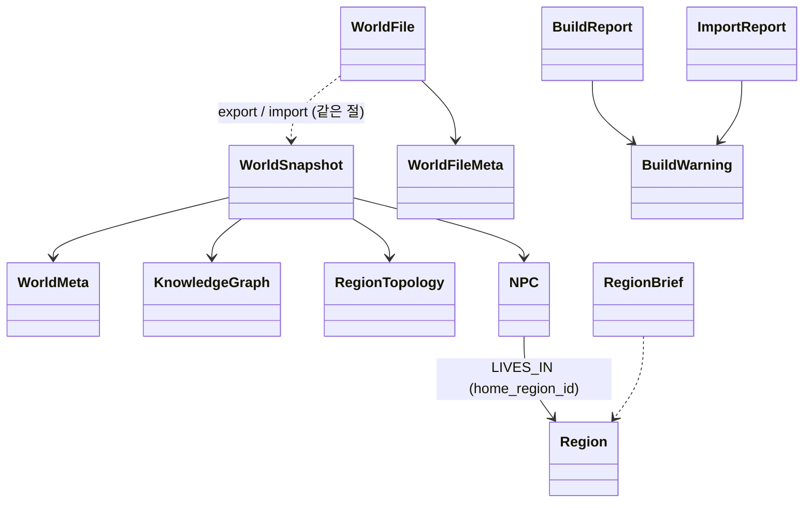

# U2 World File·캐노니컬 기반 — Domain Entities

근거: FD-U2 답 Q1=A(id 규칙)·Q2=A(`:WorldMeta`)·Q3=A(동명 해석)·Q4=A(severity)·Q5=A(데모 파일)·Q6=A(캐시)·Q7=B(NPC 색인), AD S1·S4·K3·K4·K5·W9, FR-B8·F1·NFR-3. 모델은 `locus/shared/models`(경계 공용)에 두고, World File 스키마만 `locus/world/worldfile/schema.py`에 둔다(파일 형식은 world 경계의 계약).

## 1. 새 엔티티

### 1.1 `WorldMeta` (Q2=A) — `shared/models/graph.py`
| 필드 | 타입 | 뜻 |
|---|---|---|
| `id` | str | = `world_id`. Neo4j `:WorldMeta` 노드의 키. `world_id` 속성도 같은 값으로 가져 `delete_world`(`MATCH (n {world_id})`)가 함께 지운다 |
| `name` | str | 표시 이름. 기본값 `world_id` |
| `description` | str \| None | 한 줄 설명 |
| `format_version` | int = 1 | 마지막으로 이 월드를 쓴 World File 버전(빌드도 1) |
| `updated_at` | datetime | 마지막 쓰기(빌드·import·편집). UTC |
| `last_writer` | `"build" \| "import" \| "edit"` | 마지막으로 바꾼 경로(목록·디버그용) |

- 저장: `:WorldMeta {id, world_id, name, description, format_version, updated_at, last_writer}`; `NODE_LABELS`에 `WorldMeta` 추가(유일 제약 `id`).
- 없을 수도 있다(U2 이전에 만든 월드). 로더는 없으면 `WorldMeta(id=world_id, name=world_id)`를 **만들어 주지 않고** `snapshot.meta=None`으로 둔다; export는 그때 기본값으로 채운다(BR-U2-3).

### 1.2 `NPC` (FR-F1, Q7=B) — `shared/models/graph.py`
| 필드 | 타입 | 뜻 |
|---|---|---|
| `id` | str (uuid) | |
| `world_id` | str | |
| `name` | str | |
| `role` | str | 예: "innkeeper", "mayor". 자유 문자열, 영어 |
| `description` | str | persona. 대화 프롬프트에 그대로 들어간다(U5). 영어(R2-6, 임베딩) |
| `home_region_id` | str | `LIVES_IN` 대상 Region id. 스냅샷 기준으로 존재해야 한다(BR-U2-12) |
| `traits` | list[str] = [] | 짧은 성격 태그, 영어 |
| `provenance` | Provenance | 데모 파일 = `input`, 에디터 = `input`(generated_by="user"), U-F3 초안 = `inferred` |

- 저장: `:NPC` 노드(`NODE_LABELS` 추가) + `LIVES_IN` 엣지(`NPC → Region`). 검색 문서 `npc_doc(npc) -> SearchDoc(label="NPC", text=f"{name} ({role}): {description}", ...)` — `SearchDoc.label` 값 집합에 `NPC`를 더한다(기존 값 Knowledge/Entity/WikiPrior; 기존 호출은 `label` 필터를 쓰므로 오염 없음). 임베딩 포함(Q7=B). `search.delete_world`가 `world_id` term으로 함께 지운다.

### 1.3 `WorldSnapshot` (AD S1, K3) — `shared/models/graph.py`
| 필드 | 타입 | 뜻 |
|---|---|---|
| `world_id` | str | |
| `meta` | WorldMeta \| None | 1.1 |
| `kg` | KnowledgeGraph | entities, knowledge, scopes, **relations**(A5: 로더가 `RELATED_TO`를 다시 읽음), priors, prior_links |
| `topo` | RegionTopology | regions, connections |
| `npcs` | list[NPC] | |
| `regions_by_id` | dict[str, Region] | 파생 색인(모델 생성 시 계산, `model_validator`) |
| `regions_by_name` | dict[str, list[Region]] | `normalize_name` 키 → 후보들(동명이레벨 대비, Q3) |
| `npcs_by_region` | dict[str, list[NPC]] | |
| `unscoped_knowledge_ids` | list[str] | 어느 스코프에도 없고 `is_global`도 아닌 지식(A4; 에디터가 지정) |
| `load_warnings` | list[BuildWarning] | 로더가 건너뛴 노드·엣지(BR-U2-16). `stage="load"`, `item_id`=노드/엣지 id |

승인된 component-methods의 `WorldSnapshot`은 `world_id, kg, topo, npcs, regions_by_id, npcs_by_region`이다. **확장 필드**: `meta`(Q2=A), `regions_by_name`(Q3=A 해석용), `unscoped_knowledge_ids`(A4), `load_warnings`(BR-U2-16). 모순은 없고 더한 것뿐이다.

- `KnowledgeGraph`에 `priors: list[WikiPrior]`, `prior_links: list[WikiPriorLink]`를 더한다(지금은 별도 저장만 하고 로더가 안 읽음; World File에 담아야 하므로 읽는다).
- 불변으로 다룬다(캐시가 공유). 쓰기 경로는 새 스냅샷을 만든다(Q6=A).

### 1.4 `WorldFile` v1 (FR-B8, Q1=A) — `world/worldfile/schema.py`
```python
class WorldFileMeta(BaseModel):  # world 절
    id: str; name: str; description: str | None = None

NAMESPACE_LOCUS = uuid.UUID("5d0f3a3e-2c7b-4f1e-9a8c-7b6d5e4f3a21")   # id 재매핑 네임스페이스(고정)

class WorldFile(BaseModel):
    model_config = ConfigDict(extra="ignore")        # 상위 호환: 모르는 필드는 무시
    format_version: int                              # 파일에서 읽은 값: 1(v1) 또는 0(v0 = 옛 export, parse()가 채움)
    @classmethod
    def parse(cls, raw: dict) -> "WorldFile": ...    # v0/v1 판별·검증의 단일 입구(BLM §7.2)
    world: WorldFileMeta
    exported_at: datetime | None = None
    regions: list[Region]; connections: list[ConnectionEdge]
    entities: list[Entity]; relations: list[Relation]
    knowledge: list[Knowledge]; scopes: list[ScopeLink]
    priors: list[WikiPrior]; prior_links: list[WikiPriorLink]
    npcs: list[NPC]
```
- 모든 항목은 도메인 모델 그대로(`model_dump`)다 — 옛 export JSON(`world_id, regions, connections, entities, knowledge, scopes`)의 **상위 집합**이다. 옛 파일은 `format_version` 없음 → `parse()`가 v0으로 읽어 `world={id: raw["world_id"], name: raw["world_id"]}`(파일의 원본 월드 id — 대상 world_id가 아니다), 빠진 절은 `[]`.
- 직렬화 순서: BLM §6의 정렬 키 표(절마다 `id`; connections `(source, target, kind)`; scopes `(knowledge_id, region_id)`; prior_links `(source, target, relation)`) + `json.dumps(sort_keys=True)` — 저장→로드→저장이 바이트 단위로 같게(PBT-02).

### 1.5 `ImportReport` — `shared/models/reports.py`
| 필드 | 타입 | 뜻 |
|---|---|---|
| `world_id` | str | 대상 |
| `format_version` | int | 읽은 파일의 버전(v0 포함) |
| `source_world_id` | str | 파일의 `world.id` |
| `remapped` | bool | Q1=A: 대상 ≠ 원본(또는 `force_remap`)이라 id를 재매핑했는가 |
| `forced` | bool | 호출자가 `remap=true`로 강제했는가(id 충돌 복구) |
| `backup_path` | str \| None | 교체 전 옛 월드를 내보낸 파일(BR-U2-11) |
| `replaced` | bool | 기존 월드를 지우고 넣었는가 |
| `closed_session_ids` | list[str] | 라우터가 닫은 세션(플레이 경계; 서비스는 채우지 않음) |
| `counts` | dict[str, int] | 절별 개수 |
| `warnings` | list[BuildWarning] | severity 포함(persist 실패 = error) |
| `ok` | bool (computed) | error 없음 |

### 1.6 `RegionBrief` (K5, FR-D2) — `shared/models/io.py`
`region_id, name, level, level_path: list[str]`(최상위→자기 이름), `description: str | None`, `top_knowledge: list[str]`(DIRECT 지식 `title` 상위 k, 확신도 내림차순·id 순).

### 1.7 `EntityIdMap` (A2) — `world/ingestion/mapping.py`
`dict[str, str]`(병합 전 id → 정본 id). 타입 별칭. 관계·`about_entity_ids`·`located_in` 재작성에 쓴다.

## 2. 바뀌는 엔티티

### 2.1 `BuildWarning` (Q4=A)
`severity: Literal["warning", "error"] = "warning"` 추가. `stage`는 `ingestion | topology | wiki | ontology | persist-graph | persist-search | embed | import`.

### 2.2 `BuildReport` (A13, NFR-5)
| 추가 필드 | 뜻 |
|---|---|
| `unscoped_knowledge_ids: list[str]` | 스코프 못 한 지식(A4) |
| `llm_calls: int` | 이 빌드의 LLM·VLM 호출 수(임베딩 제외; `embedding_calls`는 별도) |
| `embedding_calls: int` | |
| `replaced: bool` | 기존 월드를 지웠는가(A3) |
| `ok` | **계산**: `not any(w.severity == "error")` (더 이상 항상 True가 아님) |
| `errors` (property) | severity=error인 경고 목록 |

### 2.3 `WorldInputs` (A7) — `world/ingestion/service.py`
`map_images: list[str]`(base64), `concept_arts: list[str]`(base64). 디코드는 `IngestionService`가 한다; 잘못된 base64는 severity=error 경고(입력 하나가 통째로 안 읽힘)로 리포트에 남고 나머지는 계속한다.

### 2.4 `IngestionResult`
`warnings: list[BuildWarning]`로 통일(옛 `errors: list[str]`는 severity로 흡수). `entity_id_map: EntityIdMap`(병합 결과, 디버그·테스트용).

### 2.5 `Region.attributes` 규약(A1)
병합이 보존하는 키: `parent_name: str`, `adjacent_names: list[str]`, `connections: list[{to, kind}]`(구조화 지도), `terrain_kind: str`, `origin: str`. 리스트 키는 합집합, 스칼라 키는 첫 값 유지(BR-U2-6).

## 3. 관계 그림


## 4. 저장 매핑 추가 (`shared/storage/graph_mapping.py`)
`worldmeta_to_node / node_to_worldmeta`, `npc_to_node / node_to_npc`, `lives_in_edges(npcs)`, `edge_to_relation(edge)`, `npc_doc(npc)`. `persist_graph(..., npcs=, meta=)`가 이들을 쓴다. 저장 포트 변경은 승인된 S4 그대로 **`GraphRepository.list_world_ids()` 하나**(`MATCH (n) RETURN DISTINCT n.world_id`; Neo4j·인메모리·테스트 가짜 모두 구현). 월드 존재 여부는 `world_id in list_world_ids()`, 지역 수는 `find_nodes(world_id, "Region")`로 얻는다(프로토콜 확장 없음). `NODE_LABELS`에 `NPC`, `WorldMeta`를 더한다(유일 제약 `id`).
