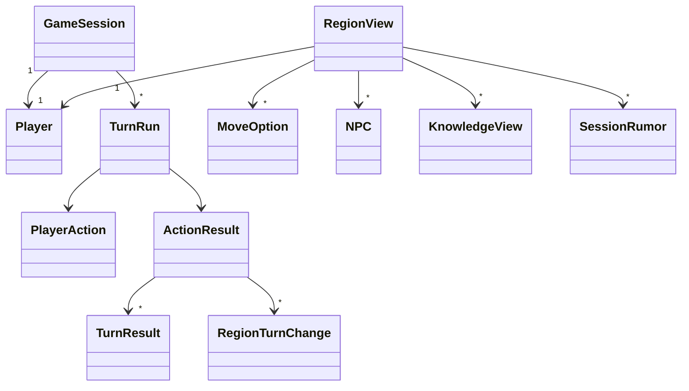

# U4 플레이어 모드 — Domain Entities

근거: FD-U4 답 Q1=A(이동 비용)·Q2=A(상한·예산)·Q3=A(프로세스 락)·Q4=A(즉시 응답 + 배경 턴)·Q5=A(요약 범위)·Q6=A(LLM 없을 때), AD P1·P2·P3·P5·P6·P7·P11, FR-C1·C2·C3·C5·C6·E1·E3·D3, 가정 A-2·A-3·A-5. 모델은 `locus/play/models.py`(play 도메인), 조정값은 `locus/shared/config/tuning.py::PlayTuning`.

## 1. 새 엔티티

### 1.1 `Player` (FR-C1, A-3)
| 필드 | 타입 | 뜻 |
|---|---|---|
| `id` | str (uuid) | |
| `session_id` | str | 세션당 **한 명**(솔로). `players.session_id` 유일 |
| `name` | str | 1~40자 |
| `region_id` | str | 현재 위치(캐노니컬 지역 id, 참조만) |
| `turns_spent` | int ≥ 0 | 이 플레이어의 행동이 소모한 턴 합 |
| `created_at` | datetime \| None | DB 서버 시간 |

`PlayerCreate(name: str, start_region_id: str)` — 둘 다 필수(US-3.1). 시작 지역은 세션 시작 시점 스냅샷에 있어야 한다.

### 1.2 `PlayerAction` (FR-C3; 판별 유니온, `type`으로 구분)
| 종류 | 필드 | 턴 비용 | 뜻 |
|---|---|---|---|
| `MoveAction` | `type="move"`, `to_region_id` | `move_cost`(Q1) | 현재 지역과 `CONNECTED_TO`로 이어진 통과 가능 지역으로 이동 |
| `WaitAction` | `type="wait"` | 1 | 기다린다 |
| `EndTalkAction` | `type="end_talk"`, `npc_id` | 1 | 대화를 마친다. U4에서는 턴 소모만; 대화·판단은 U5·U6 |

`action=None`(GM 수동 턴) = 1턴. `Declare`는 U6.

### 1.3 `MoveOption` (FR-C2/C5)
| 필드 | 타입 | 뜻 |
|---|---|---|
| `region_id`, `region_name` | str | 목적지(이름 표시, D3) |
| `kind` | ConnectionKind | 연결 종류 |
| `weight` | float 0~1 | 연결 가중치 |
| `cost_turns` | int | `move_cost`(Q1); 통과 불가면 0 |
| `passable` | bool | `blocked`·가중치 0은 False(A-2) |
| `reason` | str \| None | 통과 불가 사유("blocked pass") |

### 1.4 `RegionView` (FR-C5, US-3.2) — 플레이어 화면 하나의 데이터
| 필드 | 타입 | 뜻 |
|---|---|---|
| `session_id`, `turn` | | |
| `player` | Player | |
| `region_id`, `region_name`, `level`, `description` | | 스냅샷에서 |
| `level_path` | list[str] | 최상위 → 현재 지역 이름(K5 `level_path` 재사용) |
| `npcs` | list[NPC] | `snapshot.npcs_by_region[region_id]` |
| `facts` | list[KnowledgeView] | `region_known` = direct + inherited + global |
| `hearsay` | list[KnowledgeView] | 전언(`is_hearsay`, `path_decay`) |
| `rumors` | list[SessionRumor] | 이 지역의 활성 세션 소문(왜곡도 표시) |
| `moves` | list[MoveOption] | `move_options` |
| `turn_running` | bool | 이 세션에 진행 중인 `TurnRun`이 있는가(가드 상태) |
| `llm_available` | bool | 소문·대화·턴 소문 생성이 가능한가(Q6) |

### 1.5 `TurnRun` (Q4=A) — 한 행동이 일으킨 턴 처리의 실행 기록
| 필드 | 타입 | 뜻 |
|---|---|---|
| `id` | str | |
| `session_id` | str | |
| `action` | PlayerAction \| None | None = GM 수동 턴 |
| `cost_turns` | int ≥ 1 | 돌릴 턴 수 |
| `status` | `running` \| `done` \| `failed` | |
| `started_turn` | int | 시작 시점 세션 턴 |
| `started_at`, `finished_at` | datetime \| None | |
| `result` | ActionResult \| None | done일 때 |
| `error` | str \| None | failed일 때(내부 정보 없이 한 줄) |

세션당 `running`은 최대 1개(가드, Q3). 프로세스 재시작 시 `running` 행은 `failed("interrupted")`로 닫는다.

### 1.6 `ActionResult` (US-3.4)
| 필드 | 타입 | 뜻 |
|---|---|---|
| `session` | GameSession | 처리 뒤 상태(턴 번호) |
| `player` | Player \| None | GM 세션(플레이어 없음)이면 None (R-02) |
| `turns` | list[TurnResult] | 턴 수만큼(기존 `TurnResult` 그대로 — 기존 테스트 보존) |
| `changes` | list[RegionTurnChange] | 플레이어가 있으면 **플레이어 시점**: 현재 지역 + 직접 이웃(Q5); 플레이어가 없으면(GM 세션) 모든 지역. `region_name` 채움 |
| `narration` | list[str] | 템플릿 문장(LLM 없음, U4): "Riverton: 2 new rumors, 1 promoted" 식 |
| `llm_calls` | int | 이 실행의 LLM 호출 수(NFR-5) |
| `budget_exhausted` | bool | 어느 턴에서든 예산이 다해 소문 추가를 멈췄는가 |
| `llm_available` | bool | Q6 |

### 1.7 `LlmBudget` (내부, 순수 카운터)
`LlmBudget(max_calls)`: `remaining`, `take(n) -> None`(시도한 호출 n을 차감; 시도 = 생성기 체인의 degree 단계 수), `used`, `exhausted`. 턴마다 새로 만든다(턴당 예산, Q2). 생성기 포트 `generate_chain`의 시그니처는 바꾸지 않는다: 호출자가 `degrees`를 예산·상한에 맞게 잘라 넘기고 그 길이를 `take` 한다(R-01).

### 1.8 `TurnGuard` (Q3=A, 내부)
프로세스 안 `dict[session_id, running_run_id]` + `Lock`. `acquire(session_id, run_id)`는 이미 있으면 `TurnInProgressError`(409), `release(session_id)`는 `finally`에서, `is_running(session_id)`, `assert_idle(session_id)`(진행 중이면 `TurnInProgressError`; GM의 세션 상태 쓰기 라우트가 부른다, R-06). 인메모리·PG 어댑터와 무관(서비스 계층 객체 하나를 `PlayContainer`가 가진다).

## 2. 바뀌는 엔티티
| 엔티티 | 변경 |
|---|---|
| `TimelineKind` | `+ SESSION_STARTED, SESSION_CLOSED, PLAYER_MOVED, PLAYER_WAITED, TURN_RUN_FAILED` (기존 값·순서 유지) |
| `RegionTurnChange` | `+ region_name: str` (D3; `shape_region_changes`가 스냅샷 이름으로 채움) |
| `TurnResult` | `+ llm_calls: int`, `+ budget_exhausted: bool`, `+ rumors_skipped_regions: list[str]`(예산·상한으로 추가 못 한 지역) |
| `GameSession` | 변경 없음(`turn`은 턴마다 +1) |
| `PlayTuning` | `+ max_move_cost: int = 5`, `+ max_new_rumors_per_region_turn: int = 2`, `+ max_llm_calls_per_turn: int = 8` (env `PLAY_MAX_MOVE_COST`, `RUMOR_MAX_NEW_PER_REGION_TURN`, `LLM_MAX_CALLS_PER_TURN`) |
| `PlayContainer` | `+ play: PlayService`, `+ guard: TurnGuard`, `+ runs: TurnRunStore`(repo), `+ executor: TurnExecutor`(배경 실행기; 테스트는 동기 스텁) |
| `RumorService` | `+ append_for_turn(session, region_id, *, distortion, budget, max_new, min_source_support) -> list[SessionRumor]`(저장하지 않고 초안만 돌려줌); `append_for_region`·`generate_rumors`·`regenerate_region`은 그대로(저장함) |
| `TurnAdvancer` | `advance(session_id, action=None, *, promotion_threshold) -> ActionResult`(P7 형태·동기), `+ begin(session_id, action, *, promotion_threshold) -> TurnRun`(플레이어 경로, 배경 실행) |

## 3. 저장 (PostgreSQL, `locus/play/storage/schema.py`; 추가만, idempotent)
| 테이블 | 열 |
|---|---|
| `players` | `id PK`, `session_id UNIQUE idx`, `name`, `region_id`, `turns_spent int`, `created_at` |
| `turn_runs` | `id PK`, `session_id idx`, `status idx`, `action JSON NULL`, `cost_turns int`, `started_turn int`, `started_at`, `finished_at NULL`, `result JSON NULL`, `error TEXT NULL` |

## 4. 포트 (`locus/play/ports.py`; AD-R3 분할 유지)
```python
class PlayerStore(Protocol):
    def create_player(self, player: Player) -> Player: ...
    def get_player(self, session_id: str) -> Player | None: ...
    def update_player(self, player: Player) -> Player: ...

class TurnRunStore(Protocol):
    def create_run(self, run: TurnRun) -> TurnRun: ...
    def get_run(self, session_id: str, run_id: str) -> TurnRun | None: ...
    def update_run(self, run: TurnRun) -> TurnRun: ...
    def list_runs(self, session_id: str, status: str | None = None) -> list[TurnRun]: ...
    def fail_stale_runs(self, *, reason: str) -> int: ...   # 시작 시 running -> failed

class PlayUnitOfWork(Protocol):            # 한 트랜잭션: 같은 store 메서드를 uow 위에서
    sessions: SessionStore; players: PlayerStore; rumors: RumorStore; events: EventStore
    distortions: DistortionStore; timeline: TimelineStore; runs: TurnRunStore
    def __enter__(self) -> PlayUnitOfWork: ...
    def __exit__(self, exc_type, exc, tb) -> None: ...      # 예외면 rollback, 아니면 commit

class PlayRepository(..., PlayerStore, TurnRunStore, Protocol):
    def uow(self) -> PlayUnitOfWork: ...
```
- `PostgresPlayRepository`(R-04): 모든 SQL을 `Connection`을 받는 `_PgStores(conn)`(store 프로토콜 전부 구현)로 옮긴다. 리포지토리의 기존 메서드는 `with engine.begin() as conn: return _PgStores(conn).<method>(...)`(호출마다 자동 커밋, 지금과 같은 동작); `uow()`는 `engine.begin()` 하나를 열고 그 `_PgStores(conn)`를 UoW로 돌려준다(예외면 SQLAlchemy가 rollback). 지금 11곳의 `engine.begin()`이 이 한 형태로 모인다.
- `InMemoryPlayRepository`(R-04): 리포지토리 전역 `threading.RLock`. 모든 store 메서드는 락 안에서 실행. `uow()`는 진입 시 락을 잡고(UoW가 끝날 때까지 보유) 상태를 깊은 복사로 스냅샷, 예외면 복원하고 락을 놓는다. UoW 안에는 LLM 호출이 없으므로(BR-U4-14) 보유 시간은 밀리초 단위이고, 다른 스레드는 그동안 대기하므로 UoW 중간 상태를 읽거나 롤백에 쓰기를 잃지 않는다.
- 오프라인 테스트: PG 어댑터 테스트는 지금처럼 `sqlite://`(단일 스레드, UoW 커밋·롤백 계약 포함). 스레드 테스트(TP-U4-6)는 인메모리 리포지토리로만 하고, 배경 실행기는 테스트에서 동기 스텁(`submit`이 즉시 실행)으로 바꾸므로 SQLite가 스레드를 넘지 않는다. 계약 테스트 공유(`tests/play/test_repository_contract.py` 확장).

## 5. 오류
| 오류 | HTTP | 뜻 |
|---|---|---|
| `TurnInProgressError` | 409 | 세션에 진행 중인 TurnRun이 있다 |
| `InvalidActionError(ValueError)` | 400 | 이어지지 않은 지역, 통과 불가, 모르는 NPC, 시작 지역 없음 |
| `SessionClosedError` | 409 | 기존 |
| `WorldNotFoundError(LookupError)` | 404 | 기존 |

## 6. 관계 그림

