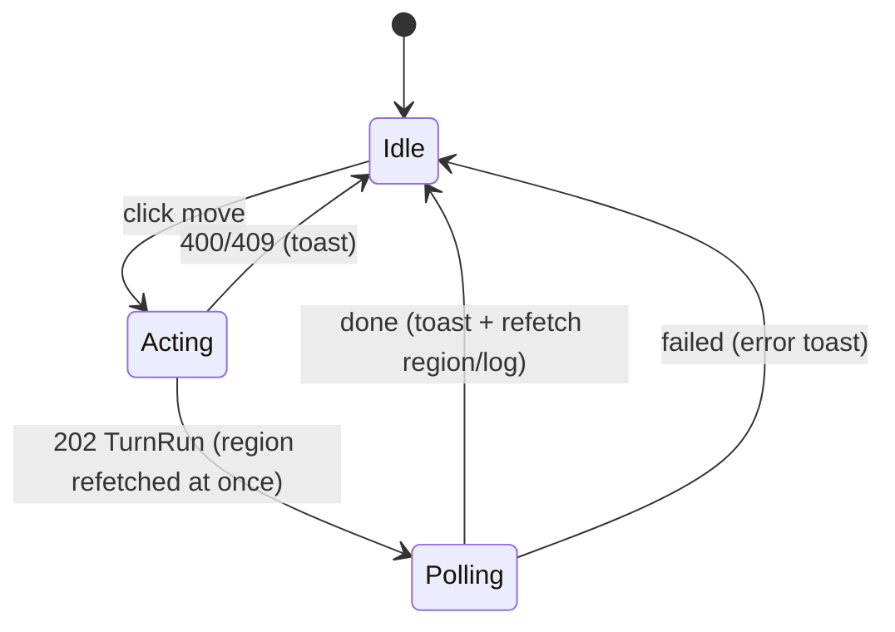

# U4 플레이어 모드 — Frontend Components (`/play/:sessionId`, F3)

근거: FD-U4 Q4=A(즉시 응답 + 폴링)·Q5=A(요약 범위)·Q6=A(LLM 배너), US-3.1~3.4, US-1.4, FR-C5·C6·D3. 기존 자산: `web/src/ui/*`(Doodly 디자인 시스템: Button·Panel·Card·Badge·Modal·Range·Toast·NotificationCenter·LocalizedText), `web/src/i18n.ts`, `routes/{AppNav,EditorPage,GmPage,PlayPage}.tsx`, `api/{play,gm}.ts`. 화면은 한국어 라벨(X3 방침), 데이터(지역·지식)는 영어 + `*_ko`.

## 1. 컴포넌트 트리
```
PlayPage (/play/:sessionId)
├── AppNav (기존)
├── LlmBanner            — llm_available=false일 때만 (US-1.4)
├── RegionScene          — 지역 이름·계층 경로·설명 · NPC 목록 · 들리는 이야기(facts/hearsay/rumors)
│   └── LocalizedText ×N (기존)
├── MovePanel            — 이동 옵션 목록(종류·비용·통과 불가 표시) → act(move)
├── ActionBar            — 기다리기 → act(wait) · 턴 진행 표시(TurnRun running)
├── TurnSummaryToast     — done된 TurnRun의 changes/narration (NotificationCenter 재사용)
└── PlayLog              — GET /log 목록(플레이어 시점)

EditorPage / SessionBar (기존)
└── NewSessionForm       — 이름 + 시작 지역 선택 → POST /worlds/{w}/sessions → navigate(/play/{sid})

GmPage / SessionPanel (기존, U4에서는 변경 없음)
└── advance → 동기 TurnResult(기존 계약 유지) · 409 "turn in progress"는 기존 오류 표시로 보임
```

## 2. 컴포넌트별 정의

### 2.1 `PlayPage`
- **상태**: `session: GameSession | null`, `view: RegionView | null`, `run: TurnRun | null`(진행 중/최근), `error`, `log: TimelineEntry[]`, `toasts: Notif[]`.
- **로드**: `getSession(sid)` → `getRegion(sid)` → `getLog(sid)`. `run.status === "running"`이면 폴링 시작.
- **행동 처리(Q4=A)**: `act(action)` → 202 `TurnRun` → (Move면) 곧바로 `getRegion`으로 새 지역 화면 → 700ms 간격 폴링 `getTurnRun(sid, run.id)` → `done`이면 `TurnSummaryToast`에 `changes`/`narration`, `getRegion`·`getLog` 재조회; `failed`면 오류 토스트(사유 한 줄). 409(진행 중)면 "턴이 진행 중입니다" 토스트. 400이면 사유 표시.
- **stale 방지**: `sessionIdRef`(GmPage와 같은 패턴)로 라우트가 바뀐 뒤 도착한 응답을 버린다.
- **API**: `playApi.getSession`, `getPlayer`, `getRegion`, `act`, `getTurnRun`, `getLog`.

### 2.2 `RegionScene`
- **props**: `view: RegionView`.
- **표시**: 제목 = `region_name`(ko 있으면 `LocalizedText`), 부제 = `level_path.join(" > ")`, 설명. NPC 카드(이름·역할, U5에서 "말하기" 버튼 자리). "들리는 이야기": `facts`(Badge `direct/inherited/global`), `hearsay`(Badge `hearsay` + `decay`), `rumors`(Badge `rumor` + `d0.30` + 승격 표시). 항목은 `knowledge-item-*`/`rumor-*` testid 유지.
- **규칙**: UUID 노출 없음(BR-U4-22).

### 2.3 `MovePanel`
- **props**: `moves: MoveOption[]`, `disabled: boolean`(진행 중), `onMove(regionId)`.
- **표시**: 행마다 `region_name · kind · {cost_turns}턴`; `passable=false`면 흐리게 + "지나갈 수 없음(blocked)" 라벨, 버튼 비활성. 정렬은 서버 순서 유지.

### 2.4 `ActionBar`
- **props**: `running: TurnRun | null`, `onWait()`, `disabled`.
- **표시**: "기다리기(1턴)" 버튼; 진행 중이면 진행 바 "세계가 움직이는 중… (N턴)"과 버튼 비활성.

### 2.5 `TurnSummaryToast`
- 기존 `NotificationCenter`에 `Notif{region_id, title: 지역 이름, body: changeSummary(rc)}`를 넣는다(SessionPanel의 `changeSummary` 재사용 → `web/src/features/play/summary.ts`로 옮겨 공유). `budget_exhausted`면 "LLM 예산이 다해 일부 소문을 건너뜀" 한 줄 추가.

### 2.6 `PlayLog`
- **props**: `entries: TimelineEntry[]`. 기존 `timelineText(kind, payload, turn, summary)`(i18n) 재사용; `PLAYER_MOVED/WAITED/SESSION_STARTED/CLOSED/TURN_RUN_FAILED` 템플릿을 `i18n.ts`에 추가(`region_name` 사용).

### 2.7 `LlmBanner`
- `view.llm_available === false`일 때: "LLM 키가 없어 소문·대화가 생성되지 않습니다. 이동과 지도는 동작합니다." (US-1.4)

### 2.8 `NewSessionForm` (US-3.1)
- **위치**: `SessionBar`의 "New Session" 버튼 → 모달. **필드**: 이름(필수, 1~40자), 시작 지역(`select`, 현재 로드된 월드의 지역 이름; 에디터의 `data.regions`). 제출 → `playApi.startSession(worldId, {name, start_region_id})` → `/play/{session.id}`로 이동.
- GM 화면의 "New Session"은 플레이어 없는 GM 세션을 만들던 기존 동작을 유지하되 같은 폼을 쓴다(이름·지역 생략 가능 → 기존 API 호출).

### 2.9 `SessionPanel`(GM) — U4에서는 변경 없음
- GM `advance`는 동기 `TurnResult`를 그대로 돌려주므로(BLM §8, R-03) 기존 알림 경로가 그대로 동작한다. 플레이어 턴이 진행 중일 때의 409는 기존 오류 표시(`error` 상태)로 보이고, 전용 토스트·폴링은 U7.

## 3. 상태 흐름 (Move)


## 4. API 타입 (`web/src/types.ts`, `web/src/api/play.ts`, `gm.ts`)
`Player`, `PlayerCreate`, `PlayerAction`(`{type:"move", to_region_id} | {type:"wait"} | {type:"end_talk", npc_id}`), `MoveOption`, `RegionView`, `TurnRun`, `ActionResult`(`TurnResult`·`RegionTurnChange{region_name}` 확장). 함수: `startSession(w, body?)`, `getPlayer`, `getRegion`, `act`, `getTurnRun`, `listTurnRuns`, `getLog`; `gmApi`는 변경 없음.

## 5. 테스트(vitest)
- `PlayPage`: 로드 → RegionScene에 이름·경로·NPC·이야기 표시(EX-13); Move 클릭 → `act` 호출·`getRegion` 즉시 재조회·폴링 → done 토스트(EX-7); 409 토스트; `llm_available=false` 배너(EX-16); blocked 옵션 비활성(TP-U4-2 UI).
- `NewSessionForm`: 이름·지역 필수, 제출 → `startSession` → 이동.
- `SessionPanel`: 기존 테스트 그대로(변경 없음).
