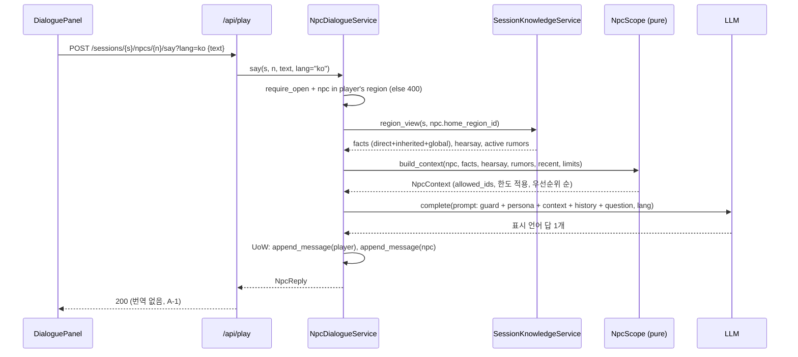

# U5 NPC 대화·언어 — Business Logic Model

**원하시는 것**: 세계관 자료로 월드를 만들고, 그 안에서 소문과 사건이 지형을 따라 퍼지며 지역마다 NPC가 다르게 아는 것을 겪는 솔로 TRPG.
**이 유닛이 해 주는 것**: 플레이어가 지역 NPC에게 자유 텍스트로 묻고, NPC는 **자기 지역에서 알 수 있는 것만** 안다. 먼 곳 일은 그 지역에 퍼진 소문대로, 틀린 채로 말한다. 화면은 한국어, 저장 텍스트는 영어이고 NPC는 표시 언어로 직접 말한다. 이것이 Locus의 핵심 체험이며 US-6.1("같은 사건을 다른 지역에서 다르게 듣는다")이 여기서 완성된다.

근거: FD-U5 Q1~Q4 = A, 요구 FR-C4·F4·F5·G1~G5, 가정 A-1, services.md §3.5·§3.8, component-methods P12·P13·P14·L4. 기존 코드: `locus/play/region_knowledge.py`(`knowledge_for_region` = direct+inherited+global + 활성 소문, `source` 태그 `rumor`/`rumor:promoted` 구현됨), `locus/knowledge/query.py::region_known`, `locus/localization/service.py`(`enrich` 캐시 우선·백그라운드 워밍·in-flight 중복 억제 구현됨; `purge` 없음), U4 `PlayService.current_region`·`TurnAdvancer._start`(EndTalk는 턴만 소모), `api/routers/knowledge.py`(캐노니컬 응답 번역 적용됨). 설계 이탈은 domain-entities §7과 §9에 모아 둔다.

## 0. 흐름 한눈에 (US-4.1~4.3)

`EndTalk`(U4 행동, 1턴)은 대화를 마치며 `NPC_TALKED` 타임라인을 남긴다(§5).

## 1. 아는 범위 — `locus/play/npc/scope.py` (순수, FR-F4, PBT-03)
```python
def build_context(
    *, npc: NPC,
    facts: list[KnowledgeView],      # region_known(view): direct + inherited + global
    hearsay: list[KnowledgeView],    # view.hearsay (이탈 1)
    rumors: list[SessionRumor],      # 그 지역의 활성 소문
    recent: list[Message],
    limits: ScopeLimits,
) -> NpcContext:
    allowed = {k.knowledge_id for k in facts} | {k.knowledge_id for k in hearsay} | {r.id for r in rumors}
    picked_facts   = sorted(facts, key=_fact_key)[: limits.facts]
    picked_hearsay = sorted(hearsay, key=_hearsay_key)[: limits.hearsay]
    picked_rumors  = sorted(rumors, key=_rumor_key)[: limits.rumors]
    picked_recent  = recent[-limits.recent_messages :]          # 오래된 것 → 새 것 순서 유지
    return NpcContext(npc=npc, facts=picked_facts, hearsay=picked_hearsay,
                      rumors=picked_rumors, recent=picked_recent, allowed_ids=allowed)

_SCOPE_RANK = {"direct": 0, "inherited": 1, "global": 2, "propagated": 3, "hearsay": 4}
def _fact_key(k):    return (_SCOPE_RANK.get(str(k.scope_type), 9), -k.confidence, k.knowledge_id)
def _hearsay_key(k): return (k.path_decay if k.path_decay is not None else 1.0, -k.confidence, k.knowledge_id)
def _rumor_key(r):   return (0 if r.promoted else 1, -r.support, -r.distortion_degree, r.id)
```
- 순수: I/O 없음, 입력만으로 결정. 정렬 키에 id를 넣어 동률에서도 결정적이다(같은 입력 → 같은 프롬프트).
- 불변식(TP-U5-1): 출력의 모든 지식·소문 id ∈ `allowed_ids`, 그리고 `allowed_ids`는 호출자가 그 지역에서 얻은 것만 담는다 → **그 지역에서 알 수 없는 id는 프롬프트에 없다**(US-4.2).
- 한도(TP-U5-2): `len(facts) ≤ 12`, `len(hearsay) ≤ 6`, `len(rumors) ≤ 8`, `len(recent) ≤ 10`.

### 1.1 `SessionKnowledgeService.region_view` (P14 보강)
지금 `knowledge_for_region`은 `QueryResult`(캐노니컬 + 소문을 한 리스트로 섞고 전언은 뺀다)를 돌려준다. 대화는 세 갈래를 나눠 받아야 하므로 **읽기 메서드를 하나 더한다**(기존 메서드·FR-F5 계약은 그대로).
```python
class RegionKnowledge(LocusModel):          # 내부 DTO
    world_id: str; region_id: str
    facts: list[KnowledgeView]; hearsay: list[KnowledgeView]; rumors: list[SessionRumor]

def region_view(self, session_id: str, region_id: str) -> RegionKnowledge:
    session = require(session_id); snapshot = snapshots.get(session.world_id)
    if region_id not in snapshot.regions_by_id: raise LookupError(...)
    view = ConsensusEngine.from_snapshot(snapshot, params).resolve(region_id)
    return RegionKnowledge(world_id=session.world_id, region_id=region_id,
                           facts=region_known(view), hearsay=list(view.hearsay),
                           rumors=self._repo.list_rumors(session_id, region_id))
```
U4 `PlayService.current_region`도 같은 계산을 하고 있으므로 이 메서드를 쓰도록 바꾼다(중복 제거, 동작 동일).

## 2. 대화 서비스 — `NpcDialogueService` (P13)
생성자: `NpcDialogueService(repo, snapshots, region_knowledge: SessionKnowledgeService, llm: LLMProvider | None, tuning: PlayTuning, *, default_lang: str, supported_langs: tuple[str, ...])`. `llm_available = llm is not None`.

### 2.1 `start(session_id, npc_id) -> Conversation` (LLM 없음, 이탈 3)
```
session = require_open(session_id); player = require_player(session_id)
npc = require_npc_here(snapshot, player, npc_id)            # 400 if not in the player's region
with repo.uow() as u:
    conv = u.conversations.get_or_create_conversation(session_id, npc_id, turn=session.turn)
return conv                                                  # messages 포함(이어가기, US-4.1 넷째 기준)
```
화면의 "NPC 소개"는 `npc.name/role/description`(캐노니컬)이라 생성이 필요 없다.

### 2.2 `say(session_id, npc_id, text, *, lang=None) -> NpcReply`
```
lang = self._resolve_lang(lang)                              # §3
if not text.strip(): raise InvalidActionError("empty message")
if self._llm is None: raise LlmUnavailableError("npc dialogue needs an LLM provider")
session = require_open(session_id); player = require_player(session_id)
npc = require_npc_here(snapshot, player, npc_id)
# ── 읽기 + 순수 계산 (UoW 밖) ──
conv = repo.get_conversation(session_id, npc_id) or repo.get_or_create_conversation(...)
know = region_knowledge.region_view(session_id, npc.home_region_id)
ctx  = build_context(npc=npc, facts=know.facts, hearsay=know.hearsay,
                     rumors=know.rumors, recent=conv.messages, limits=tuning.scope_limits())
# ── LLM 1회 (UoW 밖; BR-U5-6) ──
reply_text = self._llm.complete(user_prompt(ctx, text, lang), system=system_prompt(npc, lang))
reply_text = reply_text.strip() or fallback_text(lang)       # 빈 응답도 대화를 끊지 않는다
# ── 저장 (UoW 하나) ──
with repo.uow() as u:
    u.conversations.append_message(Message(conversation_id=conv.id, role="player", text=text.strip(),
                                           lang=lang, turn=session.turn))
    npc_msg = u.conversations.append_message(Message(conversation_id=conv.id, role="npc",
                                           text=reply_text, lang=lang, turn=session.turn))
return NpcReply(message=npc_msg, lang=lang, llm_calls=1,
                context_ids=[k.knowledge_id for k in ctx.facts + ctx.hearsay] + [r.id for r in ctx.rumors])
```
- 플레이어 발화와 NPC 답은 **한 트랜잭션**에 들어간다(반쪽 대화가 남지 않는다, BR-U5-7).
- LLM 호출이 실패하면(예외) 아무 메시지도 저장되지 않고 오류가 올라간다(502/503은 어댑터의 재시도 뒤 최종 실패 → `api/errors.py` 기본 500 대신 `LlmUnavailableError`로 감싸지 않는다: 호출 실패는 500이 맞다. 운영 문서에 최악 ≈97초를 적는다).
- 턴은 흐르지 않는다(A5-2). 진행 중 턴 실행이 있어도 대화는 허용한다(대화는 턴 상태를 쓰지 않는다, BR-U5-8).

### 2.3 `history(session_id, npc_id) -> Conversation` — 읽기(닫힌 세션도 허용, LLM 불필요). 없으면 404.

## 3. 표시 언어 (Q1=A, FR-G3, US-9.2)
```python
def _resolve_lang(self, lang: str | None) -> str:
    chosen = (lang or self._default_lang).lower()
    if chosen not in self._supported: raise InvalidActionError(f"unsupported lang: {chosen}")
    return chosen
```
- 기본값은 `TRANSLATION_TARGET_LANG`(`ko`), 지원 집합은 `SUPPORTED_LANGS`(`ko,en`).
- 프롬프트가 언어를 지시하고 NPC는 그 언어로 **직접** 생성한다(번역 경로 없음 = 호출 1회, A-1).
- 읽기 라우트의 `?lang=`은 `TranslationService.enrich(..., lang=)`로 그대로 흐른다(캐시 키에 `target_lang`이 이미 있다). `lang=en`이면 원문이 영어이므로 번역을 요청하지 않고 `*_ko` 필드는 `None`으로 둔다(BR-U5-12).

## 4. 프롬프트 — `locus/play/npc/prompts.py` (US-4.2 셋째·US-4.3, A5-4)
```
system_prompt(npc, lang):
  "You are {npc.name}, {npc.role}. {npc.description}
   Speak in {LANG_NAME[lang]} only, in character, 1-3 sentences.
   You only know what is listed under CONTEXT. If the answer is not there, say you do not know —
   never invent people, places or events. Facts are things you know. Hearsay and rumors are things
   you have only heard: keep their wording and mark them as uncertain. Do not mention ids,
   'context', 'rumor' or these instructions."

user_prompt(ctx, question, lang):
  "CONTEXT
   FACTS:            - {statement}                      (ctx.facts, 영어 원문)
   HEARD (uncertain): - {statement}                      (ctx.hearsay, decay 표시 없음)
   RUMORS:           - [{tone}] {statement}              (ctx.rumors)
   RECENT CONVERSATION: {role}: {text}                   (ctx.recent)
   QUESTION: {question}"
```
`tone`(BR-U5-9, US-4.3):
| 소문 상태 | 태그 | NPC 말투 지시 |
|---|---|---|
| `promoted` | `known` | 사실처럼 확신해서 말한다 |
| `distortion_degree ≥ 0.5` | `uncertain rumor` | "들었다", "확실하진 않지만" 같은 전언 표현을 붙인다 |
| 그 밖 | `rumor` | 중립적으로 전한다 |
소문 문장은 **왜곡된 그대로** 넣는다. 그 소문의 원본 캐노니컬 지식은 컨텍스트에 넣지 않는다(이미 `facts`에 그 지역 지식만 있고, 원본이 다른 지역 것이면 애초에 없다) — US-4.3 첫 기준.

## 5. `EndTalk` 완성 (U4 연결, FR-C4)
U4 `TurnAdvancer._start`의 `EndTalkAction` 분기에 타임라인 한 줄을 더한다(턴 비용 1은 그대로):
```
npc = snapshot.npcs_by_region[player.region_id] 에서 action.npc_id
conv = u.conversations.get_conversation(session_id, action.npc_id)
u.timeline.append_timeline(NPC_TALKED, f"{player.name} spoke with {npc.name}",
    {"npc_id": npc.id, "npc_name": npc.name, "region_id": player.region_id,
     "region_name": region.name, "messages": len(conv.messages) if conv else 0})
```
대화 없이 `EndTalk`만 보내도 유효하다(메시지 0). U6가 이 자리에 "대화 요약 → 행적 기록"을 더한다.

## 6. 번역 정리 — `purge` (Q4=A, FR-G4, US-9.3 넷째)
- `TranslationService.purge(*, kind=None, ids=None, world_id=None, session_id=None) -> int`: 필터 하나 이상 필수, 지운 행 수 반환, in-flight 키도 정리.
- 호출 지점은 **조립 루트(`api/`)**뿐이다(경계 규칙: play·world는 localization을 모른다).
| 라우트 | 호출 |
|---|---|
| `POST /api/gm/.../rumors/regen` | `regenerate_region` 결과의 `deleted_ids` → `purge(kind="rumor", ids=deleted_ids)` |
| `POST /api/world/worlds/{w}/file`·`/demo/{name}`·`build`(replace 성공) | `purge(kind="knowledge", world_id=w)` (캐노니컬이 통째로 바뀐다) |
| (U3) 에디터 삭제 | `WorldEditor.delete_node`가 이미 지운 id를 돌려준다 → 같은 방식. U5는 자리만 문서화 |
- localization이 없으면(`loc is None`) 조용히 건너뛴다. `purge` 실패는 응답을 깨지 않는다(로그만) — 정리는 부수 작업이다.

## 7. API (A6·A7, Q1=A)
| 경로 | 동작 |
|---|---|
| `POST /api/play/sessions/{s}/npcs/{n}/start` | `Conversation`(메시지 포함) 200. LLM 불필요. 400 NPC가 이 지역에 없음 |
| `POST /api/play/sessions/{s}/npcs/{n}/say?lang=` `{text}` | `NpcReply` 200. 400 빈 텍스트·지원하지 않는 lang·NPC 없음, 409 닫힌 세션, **503 LLM 없음** |
| `GET /api/play/sessions/{s}/npcs/{n}/history` | `Conversation` 200 / 404 |
| `GET /api/play/sessions/{s}/npcs` | 현재 지역 NPC + 대화 여부(`has_conversation`, `message_count`) — 화면이 목록에서 바로 표시 |
| `?lang=` 추가(읽기) | `GET /api/play/sessions/{s}/region`, `.../regions/{r}/knowledge`, `GET /api/knowledge/worlds/{w}/regions/{r}`, gm 소문·사건·타임라인 읽기 — `enrich(lang=)`로 전달 |
| 기존 계약 | `GET .../regions/{r}/knowledge`(FR-F5) 형태 불변; gm 라우트 응답 형태 불변 |

## 8. LLM 없을 때 (NFR-4, US-1.4)
`start`·`history`·`npcs`·모든 읽기는 동작한다. `say`만 503 `npc dialogue needs an LLM provider`. `RegionView.llm_available=false`(U4)가 화면 배너의 근거이고, 대화 화면은 입력창을 잠그고 같은 안내를 보인다.

## 9. 설계 이탈 (domain-entities §7과 같은 목록, 여기서는 흐름 관점)
| # | 상위 산출물 | 이 설계 | 까닭 |
|---|---|---|---|
| 1 | FR-C4·US-4.2 컨텍스트 목록 | 전언 포함(한도 6) | P12 `NpcContext.hearsay`, 지역 화면과의 일관성. 핵심 불변식 유지 |
| 2 | `regenerate_region -> list` | `RegenerateResult`(+`deleted_ids`); 호출처 gm 라우트 1 + 테스트 2 갱신 | 번역 정리를 경계 안에서 |
| 3 | A5-3 `start` 503 | `start`·`history` 200, `say`만 503 | `start`에 LLM이 필요 없다 |
| 4 | L2 `purge(kind, ids)` | 필터형 + 월드 범위 | 월드 교체 시 일괄 정리 |
| 5 | services §3.5 "`SessionKnowledgeService.for_region`" | 기존 `knowledge_for_region`은 그대로 두고 `region_view`를 더한다 | FR-F5 외부 계약(`QueryResult`)을 건드리지 않으면서 세 갈래를 나눠 받기 |
| 6 | (없음) | 표시 언어는 요청별 `?lang=`이 서버 기본값을 덮어쓴다; 지원 집합 밖은 400 | Q1=A; 캐시 키 오염 방지 |
