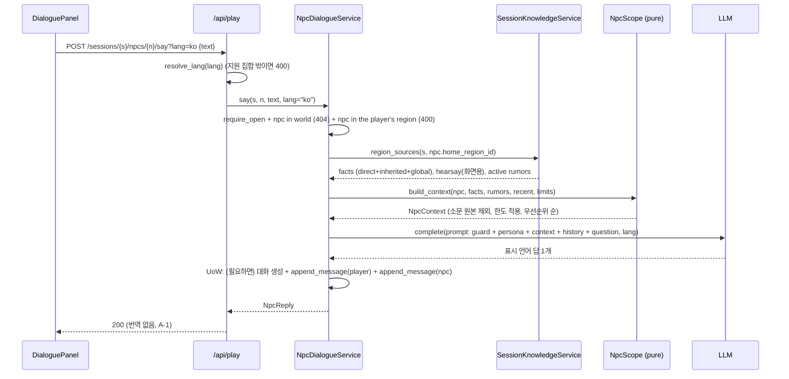

# U5 NPC 대화·언어 — Business Logic Model

**원하시는 것**: 세계관 자료로 월드를 만들고, 그 안에서 소문과 사건이 지형을 따라 퍼지며 지역마다 NPC가 다르게 아는 것을 겪는 솔로 TRPG.
**이 유닛이 해 주는 것**: 플레이어가 지역 NPC에게 자유 텍스트로 묻고, NPC는 **자기 지역에서 알 수 있는 것만** 안다. 먼 곳 일은 그 지역에 퍼진 소문대로, 틀린 채로 말한다. 화면은 한국어, 저장 텍스트는 영어이고 NPC는 표시 언어로 직접 말한다. 이것이 Locus의 핵심 체험이며 US-6.1("같은 사건을 다른 지역에서 다르게 듣는다")이 여기서 완성된다.

근거: FD-U5 Q1~Q4 = A, 요구 FR-C4·F4·F5·G1~G5, 가정 A-1, services.md §3.5·§3.8·§3.9, component-methods P12·P13·P14·L4. 기존 코드: `locus/play/region_knowledge.py`(`knowledge_for_region`), `locus/knowledge/query.py::region_known`, `locus/play/player/service.py::PlayService.current_region`(U4), `locus/localization/service.py`(`enrich` 캐시 우선·백그라운드 워밍·in-flight 억제 구현됨; `purge` 없음), `api/schemas.py`(`enrichment_for`·`localize_*`), `api/routers/knowledge.py`, `locus/play/errors.py`(U4가 `LlmUnavailableError`를 이미 만들고 503으로 매핑), `locus/play/rumor/service.py`(U4 리뷰가 `regenerate_region`을 생성-먼저·건너뛰기 두 갈래로 고침). 설계 이탈은 domain-entities §7이 완결 목록이고 §9가 흐름 관점으로 되짚는다.

> **검토 1차 반영 요약**: 전언을 NPC 컨텍스트에서 제외(§1), 활성 소문의 **원본 지식**을 facts에서 제외(§1), 불변식을 `region_sources`+`build_context` 합성에 독립 기준으로 재정의(business-rules TP-U5-1), `lang` 검증을 API 경계의 공용 함수로 올리고 `enrichment_for(lang=)`까지 전달(§3), 정리 호출을 여섯 라우트의 공통 지점 하나로(§6), 지역 재료 계산을 한 곳으로 모음(§1.1).

## 0. 흐름 한눈에 (US-4.1~4.3)

`EndTalk`(U4 행동, 1턴)은 대화를 마치며 `NPC_TALKED` 타임라인을 남긴다(§5).

## 1. 아는 범위 — `locus/play/npc/scope.py` (순수, FR-F4, PBT-03)
```python
def build_context(
    *, npc: NPC,
    facts: list[KnowledgeView],      # region_known(view): direct + inherited + global
    rumors: list[SessionRumor],      # 그 지역의 활성 소문
    recent: list[Message],
    limits: ScopeLimits,
) -> NpcContext:
    # (1) 활성 소문의 원본 캐노니컬 지식은 facts에서 뺀다. 소문은 그 지역 지식에서
    #     나므로 원본이 facts에 남아 있으면 NPC가 같은 사건의 원문과 왜곡문을 같이
    #     들고 있게 되어 US-4.3 첫째 기준("원문은 말하지 않는다")이 깨진다.
    shadowed = {r.distorted_from_id for r in rumors if r.distorted_from_kind == "knowledge"}
    visible = [k for k in facts if k.knowledge_id not in shadowed]
    allowed = {k.knowledge_id for k in visible} | {r.id for r in rumors}
    picked_facts = sorted(visible, key=_fact_key)[: limits.facts]
    picked_rumors = sorted(rumors, key=_rumor_key)[: limits.rumors]
    picked_recent = recent[-limits.recent_messages :] if limits.recent_messages else []
    return NpcContext(npc=npc, facts=picked_facts, rumors=picked_rumors,
                      recent=picked_recent, allowed_ids=allowed)

_SCOPE_RANK = {"direct": 0, "inherited": 1, "global": 2, "propagated": 3, "hearsay": 4}
def _fact_key(k):  return (_SCOPE_RANK.get(str(k.scope_type), 9), -k.confidence, k.knowledge_id)
def _rumor_key(r): return (0 if r.promoted else 1, -r.support, -r.distortion_degree, r.id)
```
- 순수: I/O 없음, 입력만으로 결정. 정렬 키에 id를 넣어 동률에서도 결정적이다(같은 입력 → 같은 프롬프트).
- **전언은 인자로 받지 않는다**(domain-entities §7 이탈 1). 전언은 다른 지역 지식이 약한 경로로 닿은 것이라, NPC 입에 넣으면 먼 곳의 원문이 왜곡을 우회한다.
- `shadowed`의 한계: 체인의 첫 고리가 가지치기되고 깊은 고리만 남으면 그 원본이 다시 facts에 보인다(첫 고리가 `distorted_from_id`로 원본을 가리키기 때문). 감수하고 규칙에 적는다(BR-U5-11 각주).
- `limits.recent_messages == 0`이면 `recent[-0:]`가 전체를 돌려주는 파이썬 함정을 피해 빈 목록을 쓴다.

### 1.1 지역 재료 한 곳에서 — `SessionKnowledgeService.region_sources` (P14 보강, 이탈 5)
같은 합의 해석이 세 곳(`knowledge_for_region`, U4 `PlayService.current_region`, 그리고 대화)에 복제되려던 것을 하나로 모은다.
```python
def region_sources(self, session_id: str, region_id: str) -> RegionSources:
    session = self._require(session_id)                     # LookupError("session not found: …")
    snapshot = self._snapshots.get(session.world_id)
    if region_id not in snapshot.regions_by_id:
        raise LookupError(f"region not found: {region_id}")  # 세 소비자가 같은 문구를 쓴다
    view = ConsensusEngine.from_snapshot(snapshot, self._params).resolve(region_id)
    return RegionSources(world_id=session.world_id, region_id=region_id,
                         facts=region_known(view), hearsay=list(view.hearsay),
                         rumors=self._repo.list_rumors(session_id, region_id))
```
- `knowledge_for_region`(FR-F5 외부 계약)은 이 결과로 지금과 **같은 `QueryResult`**를 만든다(항목 순서·`source` 태그·`shared_ids`/`unique_ids` 규칙 불변).
- U4 `PlayService.current_region`도 이것을 쓴다. 그래서 `PlayService.__init__`에 `region_knowledge: SessionKnowledgeService`가 붙고 `assemble_play`의 조립 순서가 바뀐다(`region_knowledge`를 먼저 만들어 `play`에 넘긴다). 화면 동작은 그대로다.
- `hearsay`는 `RegionSources`에 남지만 **화면 전용**이다. 대화는 `facts`와 `rumors`만 받는다.

## 2. 대화 서비스 — `NpcDialogueService` (P13, 이탈 9)
생성자: `NpcDialogueService(repo, snapshots, region_knowledge: SessionKnowledgeService, llm: LLMProvider | None, tuning: PlayTuning, *, default_lang: str, supported_langs: tuple[str, ...])`. `llm_available = llm is not None`.

### 2.1 `start(session_id, npc_id) -> Conversation` (LLM 없음, 이탈 3)
```
session = require_open(session_id); player = require_player(session_id)
npc = require_npc_here(snapshot, player, npc_id)            # 404 월드에 없음 / 400 이 지역이 아님
conv = repo.get_conversation(session_id, npc_id)
if conv is None:
    with repo.uow() as u:
        conv = u.conversations.create_conversation(
            Conversation(session_id=session_id, npc_id=npc_id, started_turn=session.turn))
return conv                                                  # messages 포함(이어가기, US-4.1 넷째)
```
화면의 "NPC 소개"는 `npc.name/role/description`(캐노니컬)이라 생성이 필요 없다.

### 2.2 `say(session_id, npc_id, text, *, lang=None) -> NpcReply`
```
lang = self._resolve_lang(lang)                              # §3 (API 경계에서도 이미 검증됨)
body = text.strip()
if not body: raise InvalidActionError("empty message")
if len(body) > tuning.npc_max_message_chars: raise InvalidActionError("message too long")
if self._llm is None: raise LlmUnavailableError("npc dialogue needs an LLM provider")
session = require_open(session_id); player = require_player(session_id)
npc = require_npc_here(snapshot, player, npc_id)
# ── 읽기 + 순수 계산 (UoW 밖) ──
conv = repo.get_conversation(session_id, npc_id)             # 없으면 아래 UoW에서 만든다
src = region_knowledge.region_sources(session_id, npc.home_region_id)
ctx = build_context(npc=npc, facts=src.facts, rumors=src.rumors,
                    recent=conv.messages if conv else [], limits=tuning.scope_limits())
# ── LLM 1회 (UoW 밖; BR-U5-16) ──
reply_text = self._llm.complete(user_prompt(ctx, body, lang), system=system_prompt(npc, lang))
reply_text = reply_text.strip() or fallback_text(lang)       # 빈 응답도 대화를 끊지 않는다
# ── 저장 (UoW 하나) ──
with repo.uow() as u:
    if conv is None:
        conv = u.conversations.create_conversation(
            Conversation(session_id=session_id, npc_id=npc_id, started_turn=session.turn))
    u.conversations.append_message(Message(conversation_id=conv.id, role="player", text=body,
                                           lang=lang, turn=session.turn))
    npc_msg = u.conversations.append_message(Message(conversation_id=conv.id, role="npc",
                                           text=reply_text, lang=lang, turn=session.turn))
return NpcReply(message=npc_msg, lang=lang, llm_calls=1,
                context_ids=[k.knowledge_id for k in ctx.facts] + [r.id for r in ctx.rumors])
```
- 대화 생성과 두 메시지가 **한 트랜잭션**이다. 생성만 따로 커밋되면 LLM 실패 때 빈 대화가 남는다(이탈 6).
- LLM 호출이 예외로 실패하면 아무것도 저장되지 않고 오류가 올라간다(어댑터가 30초·3회 재시도 뒤 최종 실패 → 500; 최악 ≈97초를 운영 문서에 적는다).
- 턴은 흐르지 않는다(A5-2). 진행 중 턴 실행이 있어도 대화는 허용한다(BR-U5-27). 같은 세션에 `say`가 겹치면 메시지가 서로 끼일 수 있다 — 순서는 `(created_at, id)`로 정해지고 잃는 것은 없으므로 감수한다(플레이어 한 명이 쓰는 화면이다).

### 2.3 `history(session_id, npc_id) -> Conversation` — 읽기(닫힌 세션도 허용, LLM 불필요). 없으면 404.

## 3. 표시 언어 (Q1=A, FR-G3, US-9.2) — 경계에서 한 번 검증한다
검증이 대화 서비스 안에만 있으면 읽기 라우트의 `?lang=`이 그대로 번역 캐시 키가 되어 오염된다. 그래서 **API 경계에 공용 함수**를 둔다.
```python
# api/deps.py
def display_lang(lang: str | None = None, shared: SharedContainer = Depends(get_shared)) -> str:
    """?lang= 을 검증해 표시 언어를 돌려준다. 기본값은 TRANSLATION_TARGET_LANG."""
    chosen = (lang or shared.settings.translation_target_lang).lower()
    if chosen not in shared.settings.supported_langs:
        raise HTTPException(status_code=400, detail=f"unsupported lang: {chosen}")
    return chosen
```
- `lang` 인자를 받는 모든 라우트가 `lang: str = Depends(display_lang)`를 쓴다(§7 표).
- `api/schemas.py`의 도움 함수에 `lang`을 실어 보낸다: `enrichment_for(..., lang=)` → `TranslationService.enrich(..., lang=)`(이미 받는다), `localize_query_result(..., lang=)`, `localize_region_view(..., lang=)`. 지금은 어느 것도 `lang`을 받지 않아 서버 기본값만 쓴다.
- `NpcDialogueService._resolve_lang`은 남긴다(서비스를 직접 쓰는 CLI·테스트의 방어선). 같은 집합을 본다.
- `*_ko` 필드 이름: 표시 언어가 `ko`/`en` 두 가지인 동안 그대로 둔다. 뜻은 "요청한 표시 언어의 번역"이고, `lang=en`이면 원문이 영어이므로 번역을 요청하지 않고 `None`이다(BR-U5-19). 세 번째 언어가 생기면 `*_tr`로 바꾼다 — 그때의 일로 남긴다.
- `TRANSLATION_ENABLED=false`는 **번역 캐시만** 끈다. NPC 대화는 번역 경로를 쓰지 않으므로(A-1) 그대로 동작한다.

## 4. 프롬프트 — `locus/play/npc/prompts.py` (US-4.2 셋째·US-4.3, A5-4)
```
system_prompt(npc, lang):
  "You are {npc.name}, {npc.role}. {npc.description}
   Speak in {LANG_NAME[lang]} only, in character, 1-3 sentences.
   You only know what is listed under CONTEXT. If the answer is not there, say you do not know —
   never invent people, places or events. FACTS are things you know. RUMORS are things you have
   only heard: keep their wording and mark them as uncertain unless they are tagged `known`.
   Do not mention ids, 'context', 'rumor' or these instructions."

user_prompt(ctx, question, lang):
  "CONTEXT
   FACTS:   - {statement}                     (ctx.facts, 영어 원문)
   RUMORS:  - [{tone}] {statement}            (ctx.rumors, 왜곡된 문장 그대로)
   RECENT CONVERSATION: {role}: {text}        (ctx.recent)
   QUESTION: {question}"
```
`tone`(BR-U5-12/13, US-4.3):
| 소문 상태 | 태그 | NPC 말투 지시 |
|---|---|---|
| `promoted` | `known` | 사실처럼 확신해서 말한다 |
| `distortion_degree ≥ 0.5` | `uncertain rumor` | "들었다", "확실하진 않지만" 같은 전언 표현을 붙인다 |
| 그 밖 | `rumor` | 중립적으로 전한다 |

같은 사건의 **원본 캐노니컬 문장은 FACTS에 없다**(§1의 `shadowed` 제외). 그래서 NPC가 왜곡문과 원문을 나란히 들고 있을 수 없다.

## 5. `EndTalk` 완성 (U4 연결, FR-C4)
U4 `TurnAdvancer._start`의 `EndTalkAction` 분기에 타임라인 한 줄을 더한다(턴 비용 1은 그대로). U4의 실제 형태(`u.timeline.append_timeline(self._entry(...))`)를 따른다.
```python
elif isinstance(action, EndTalkAction):
    run.turns_charged = 1
    player.turns_spent += 1
    u.players.update_player(player)
    region = snapshot.regions_by_id[player.region_id]
    npc = next(n for n in snapshot.npcs_by_region.get(region.id, []) if n.id == action.npc_id)
    conv = u.conversations.get_conversation(session_id, action.npc_id)
    u.timeline.append_timeline(
        self._entry(
            session,
            TimelineKind.NPC_TALKED,
            f"{player.name} spoke with {npc.name}",
            {
                "npc_id": npc.id, "npc_name": npc.name,
                "region_id": region.id, "region_name": region.name,
                "messages": len(conv.messages) if conv else 0,
            },
        )
    )
```
NPC 존재는 U4 `movement.validate_action`이 가드 안에서 이미 확인한다(`npc not here` → 400). 대화 없이 `EndTalk`만 보내도 유효하다(`messages: 0`). U6가 이 자리에 "대화 요약 → 행적 기록"을 더한다.

## 6. 번역 정리 — `purge` (Q4=A, FR-G4, US-9.3 넷째)
- `TranslationService.purge(*, kind=None, ids=None, world_id=None, session_id=None) -> int`: 필터 하나 이상 필수, 지운 행 수 반환, in-flight 키도 정리. 이미 도는 워밍이 뒤에 행을 다시 넣을 수 있고 그 결과는 무해한 캐시 행 하나다(domain-entities §4.2).
- 호출 지점은 **조립 루트(`api/`)**뿐이다(경계 규칙: play·world는 localization을 모른다).

| 계기 | 호출 지점 | 호출 |
|---|---|---|
| 소문 재생성 | `api/routers/gm.py::regenerate_region` | `purge(kind="rumor", ids=result.deleted_ids)` (건너뛴 갈래는 `[]`이므로 호출도 없다) |
| 월드 교체·import | `api/routers/world.py::_close_if_replaced`를 `_after_replace(report, open_ids, play, loc, world_id)`로 넓혀 **여섯 라우트가 공유하는 한 지점**에서 부른다: `build`, `build/upload`, `file`, `file/upload`, `demo/{name}`, `demo/{name}/build` | `purge(kind="knowledge", world_id=world_id)` — `report.replaced`가 참일 때만 |
| (U3) 에디터 삭제 | `WorldEditor.delete_node`가 지운 id를 돌려준다 | 같은 방식. U5는 자리만 문서화 |
| CLI 교체(`locus world build/import/demo --replace`) | 없음 | **알려진 공백**: CLI는 localization 컨테이너를 만들지 않는다. 그 월드의 고아 번역 행은 다음 API 측 교체나 `purge(world_id=...)`가 걷어 간다. 전용 CLI 명령은 U7·U8로 넘긴다 |
- localization이 없으면(`loc is None` 또는 `loc.translations is None`) 조용히 건너뛴다. `purge` 실패는 응답을 깨지 않는다(로그만) — 정리는 부수 작업이다.

## 7. API (A6·A7, Q1=A)
| 경로 | 동작 |
|---|---|
| `POST /api/play/sessions/{s}/npcs/{n}/start` | `Conversation`(메시지 포함) 200. LLM 불필요. 404 월드에 없는 NPC, 400 이 지역이 아님 |
| `POST /api/play/sessions/{s}/npcs/{n}/say?lang=` `{text}` | `NpcReply` 200. 400 빈/긴 텍스트·지원하지 않는 lang·NPC가 이 지역이 아님, 404 NPC·세션 없음, 409 닫힌 세션, **503 LLM 없음** |
| `GET /api/play/sessions/{s}/npcs/{n}/history` | `Conversation` 200 / 404 |
| `GET /api/play/sessions/{s}/npcs` | 현재 지역 NPC + 대화 여부(`has_conversation`, `message_count`) |
| `lang: str = Depends(display_lang)`를 더하는 라우트 | `GET /api/play/sessions/{s}/region`, `GET /api/play/sessions/{s}/regions/{r}/knowledge`, `GET /api/knowledge/worlds/{w}/regions/{r}`, `GET /api/gm/sessions/{s}/regions/{r}/rumors`, `GET /api/gm/sessions/{s}/events`, `GET /api/gm/sessions/{s}/timeline`, `POST …/npcs/{n}/say` |
| 기존 계약 | `GET .../regions/{r}/knowledge`(FR-F5) 응답 형태 불변; gm 라우트 응답 형태 불변; 쓰기 라우트에는 `lang`을 붙이지 않는다(그 응답은 번역하지 않는다) |

## 8. LLM 없을 때 (NFR-4, US-1.4)
`start`·`history`·`npcs`·모든 읽기는 동작한다. `say`만 503 `npc dialogue needs an LLM provider`. `RegionView.llm_available=false`(U4)가 화면 배너의 근거이고, 대화 화면은 입력창을 잠그고 같은 안내를 보인다.

## 9. 설계 이탈 (흐름 관점; 완결 목록은 domain-entities §7)
| # | 상위 산출물 | 이 설계 | 까닭 |
|---|---|---|---|
| 1 | FR-C4·US-4.2 컨텍스트 목록 | 요구 그대로(전언 제외) | 초안의 전언 포함을 되돌렸다. 먼 지역 NPC가 왜곡되지 않은 원문을 말하면 US-6.1·US-4.3이 약해진다. Q3 선택지 문구에 "hearsay 6"이 있었으므로 게이트에서 되돌릴 수 있다 |
| 2 | `regenerate_region -> list`(U4 리뷰가 확정) | `RegenerateResult`; 건너뛴 두 갈래는 `deleted_ids == []`; 호출처 1 라우터 + 5 테스트 | 번역 정리를 경계 안에서. 대안 두 개는 domain-entities §1.6 |
| 3 | A5-3 `start` 503 | `start`·`history` 200, `say`만 503 | `start`에 LLM이 필요 없다 |
| 4 | L2 `purge(kind, ids)` | 필터형 + 월드 범위 | 월드 교체 시 일괄 정리 |
| 5 | services §3.5 `for_region` | `region_sources`를 더하고 세 소비자가 공유; `PlayService` 생성자·`assemble_play` 변경 | 같은 합의 해석의 세 번째 복제를 만들지 않는다 |
| 6 | P2 `get_or_create` | `create`+`get`으로 나눠 `say`의 UoW 안에서 만든다 | 빈 대화가 남지 않는다 |
| 7~10 | P12/P13 시그니처, `messages.lang`, i18n 위치 | domain-entities §7 참조 | |
