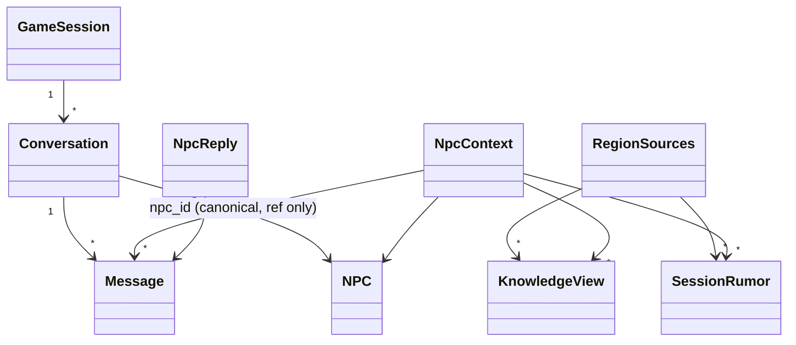

# U5 NPC 대화·언어 — Domain Entities

근거: FD-U5 답 Q1=A(서버 기본 + 요청별 `lang`)·Q2=A(ko 통일 + en 사전)·Q3=A(컨텍스트 한도)·Q4=A(삭제·재생성 라우트에서 즉시 정리), 요구 FR-C4·F4·F5·G1~G5, 가정 A-1, component-methods P2·P3·P12·P13·P14·L2/L4, 플랜 가정 A5-1~A5-10. 대화 모델은 `locus/play/models.py`, 순수 컨텍스트는 `locus/play/npc/scope.py`, 조정값은 `locus/shared/config/tuning.py::PlayTuning`, 번역은 `locus/localization/`.

> **검토 1차 반영**: 전언(hearsay)은 NPC가 아는 범위에서 **뺀다**(§7 이탈 1). 요구 FR-C4·US-4.2가 나열한 세 갈래 + 소문 + NPC 설명만 들어간다.

## 1. 새 엔티티 (play)

### 1.1 `Conversation` (P2·P3, A5-1)
| 필드 | 타입 | 뜻 |
|---|---|---|
| `id` | str (uuid) | |
| `session_id` | str | |
| `npc_id` | str | 캐노니컬 NPC id(참조만). `(session_id, npc_id)` 유일 — 세션·NPC당 대화 하나 |
| `started_turn` | int ≥ 0 | 처음 말을 건 턴 |
| `messages` | list[Message] | 시간순. 저장은 별 테이블, 조회 시 채운다 |
| `created_at` | datetime \| None | DB 서버 시간 |

### 1.2 `Message` (P2)
| 필드 | 타입 | 뜻 |
|---|---|---|
| `id` | str (uuid) | |
| `conversation_id` | str | |
| `role` | `"player"` \| `"npc"` | |
| `text` | str | 1~`max_message_chars`(기본 500)자. 표시 언어 그대로 저장(번역 캐시에 넣지 않는다, A-1) |
| `lang` | str | 그 메시지가 생성된 표시 언어(`ko`/`en`). 언어를 바꿔 이어가도 이력이 무엇으로 쓰였는지 남는다 (A5-8에 없던 열 — §7 이탈 7) |
| `turn` | int ≥ 0 | 말한 시점의 세션 턴 |
| `created_at` | datetime \| None | DB 서버 시간. 정렬은 `(created_at, id)` |

### 1.3 `NpcContext` (P12; 순수 함수의 출력)
| 필드 | 타입 | 뜻 |
|---|---|---|
| `npc` | NPC | 이름·역할·설명(페르소나) |
| `facts` | list[KnowledgeView] | 이 지역에서 아는 정적 지식(direct → inherited → global 순, 한도 이하). **활성 소문의 원본은 빠진다**(BR-U5-11) |
| `rumors` | list[SessionRumor] | 이 지역의 활성 세션 소문(승격 → 지지도 높은 순) |
| `recent` | list[Message] | 최근 대화(오래된 것 → 새 것, 한도 이하) |
| `allowed_ids` | set[str] | 이 호출에 넘어온 지식·소문 id 전체. 프롬프트 조립이 그 밖을 쓰지 않았음을 확인하는 데만 쓴다(불변식의 기준은 §7 이탈 1과 business-rules TP-U5-1이 정하는 **독립 기준**이다) |

P12의 `hearsay` 필드는 두지 않는다(§7 이탈 1).

### 1.4 `ScopeLimits` (Q3=A에서 전언 항목을 뺀 것)
`ScopeLimits(facts=12, rumors=8, recent_messages=10)`. `PlayTuning`에서 만들어 넘긴다(§2). 0은 "넣지 않는다"를 뜻한다(`recent_messages=0` → 빈 목록).

### 1.5 `NpcReply` (P13)
| 필드 | 타입 | 뜻 |
|---|---|---|
| `message` | Message | NPC가 한 말(저장된 행) |
| `lang` | str | 생성 언어 |
| `llm_calls` | int | 항상 1(A5-2) |
| `context_ids` | list[str] | 이 답에 들어간 지식·소문 id(감사·테스트용, 응답에도 포함) |

### 1.6 `RegenerateResult` (Q4=A / §7 이탈 2)
U4 코드 리뷰가 `regenerate_region`을 "먼저 생성하고, 초안이 불완전하거나 씨앗이 없으면 **아무것도 지우지 않는다**"로 바꿨다. 그 세 갈래를 그대로 실어야 한다.

| 필드 | 타입 | 뜻 |
|---|---|---|
| `kept` | list[SessionRumor] | 보존된 승격 소문(교체가 일어난 경우) 또는 손대지 않은 기존 소문 전체(건너뛴 경우) |
| `fresh` | list[SessionRumor] | 새로 저장된 소문. 건너뛴 경우 `[]` |
| `deleted_ids` | list[str] | 지운 소문 id. **건너뛴 두 갈래에서는 반드시 `[]`** |
| `skipped_reason` | `None` \| `"llm_incomplete"` \| `"no_sources"` | 타임라인 payload와 같은 값 |
| `rumors` | property | `kept + fresh` — 지금 라우터가 돌려주는 목록과 같다 |

바뀌는 호출처(전수): `api/routers/gm.py::regenerate_region` 1곳 + 테스트 5곳(`tests/play/test_play_services.py` 84·100·181·203, `tests/play/test_player_mode.py` 935). 모두 `result.rumors`로 읽게 고친다.

반환형 확장은 유일한 방법이 아니다. 대안은 (a) 라우터가 호출 전후의 소문 id를 비교해 차집합을 구하기, (b) 서비스가 `on_deleted: Callable[[list[str]], None]` 콜백을 받기다. (a)는 "승격은 보존"이라는 규칙을 라우터가 다시 알아야 하고 경합에 약하다. (b)는 경계를 지키지만 흐름이 숨는다. 반환형을 고른 까닭은 값이 타입으로 드러나고 테스트가 쉽기 때문이다.

## 2. 바뀌는 엔티티
| 엔티티 | 변경 |
|---|---|
| `TimelineKind` | `+ NPC_TALKED = "npc_talked"` (끝에 추가). `EndTalk` 행동이 기록(U4 `TurnAdvancer._start`) |
| `PlayTuning` | `+ npc_max_facts: int = 12`, `npc_max_rumors: int = 8`, `npc_max_recent_messages: int = 10`, `npc_max_message_chars: int = 500` — 모두 `ge=0`(문자 수는 `ge=1`). env `NPC_MAX_FACTS`·`NPC_MAX_RUMORS`·`NPC_MAX_RECENT_MESSAGES`·`NPC_MAX_MESSAGE_CHARS` |
| `Settings` | 기존 `translation_target_lang`이 표시 언어의 **기본값**이 된다(Q1=A). `+ supported_langs: tuple[str, ...] = ("ko", "en")` (env `SUPPORTED_LANGS`, 쉼표 구분, 비어 있으면 기본값) |
| `PlayContainer` | `+ dialogue: NpcDialogueService` (항상 조립; LLM 없으면 `say`만 503 — §7 이탈 3) |
| `PlayUnitOfWork`·`PlayRepository` | `+ conversations: ConversationStore` |
| `SessionKnowledgeService` | `+ region_sources(session_id, region_id) -> RegionSources`; 기존 `knowledge_for_region`이 이것을 써서 만든다(§7 이탈 5) |
| `PlayService` | 생성자에 `region_knowledge: SessionKnowledgeService` 추가, `current_region`이 같은 계산을 쓴다(U4 생성자·조립 변경 — §7 이탈 5) |
| `RumorService.regenerate_region` | 반환형 `list[SessionRumor]` → `RegenerateResult`(§1.6) |

### 2.1 `RegionSources` (내부 DTO; U4의 `RegionView`와 다른 것)
| 필드 | 타입 | 뜻 |
|---|---|---|
| `world_id`, `region_id` | str | |
| `facts` | list[KnowledgeView] | `region_known(view)` = direct + inherited + global |
| `hearsay` | list[KnowledgeView] | `view.hearsay`. **화면 전용**(U4 지역 화면). NPC 컨텍스트에는 넘기지 않는다 |
| `rumors` | list[SessionRumor] | 그 지역의 활성 세션 소문 |

한 지역의 "재료"를 한 번 계산해 세 소비자(NPC 컨텍스트, 플레이어 화면, 외부 NPC 계약 `QueryResult`)가 나눠 쓴다. 이름이 `RegionView`(화면 한 장의 데이터)와 겹치지 않게 `RegionSources`로 둔다.

## 3. 저장 (PostgreSQL, `locus/play/storage/schema.py`; 추가만, idempotent)
| 테이블 | 열 |
|---|---|
| `conversations` | `id PK`, `session_id idx`, `npc_id`, `started_turn int`, `created_at`; `UNIQUE (session_id, npc_id)` |
| `messages` | `id PK`, `conversation_id idx`, `role`, `text TEXT`, `lang`, `turn int`, `created_at`; 조회는 `ORDER BY created_at, id`(U4 리뷰 #1의 트랜잭션 내 동시각 문제를 피해 `next_timestamp()`로 찍는다) |

## 4. 포트

### 4.1 `ConversationStore` (`locus/play/ports.py`; AD-R3 분할 유지)
```python
class ConversationStore(Protocol):
    def create_conversation(self, conversation: Conversation) -> Conversation: ...  # ValueError if it exists
    def get_conversation(self, session_id: str, npc_id: str) -> Conversation | None: ...  # messages 채움
    def append_message(self, message: Message) -> Message: ...
    def list_conversations(self, session_id: str) -> list[Conversation]: ...          # messages 없이
```
P2는 `get_or_create/append_message/list_by_session`이라 적었다. `get_or_create`를 `create`+`get`으로 나눈 까닭은 `say`가 대화 생성과 두 메시지를 **한 트랜잭션**에 넣어야 해서다(§7 이탈 6). `PlayUnitOfWork.conversations`에 노출하고 인메모리 트윈도 같은 계약(U4의 락·열림 규칙 그대로)을 따른다.

### 4.2 `TranslationStore.purge` (Q4=A, L2 "purge lands in U5")
```python
class TranslationStore(Protocol):
    ...
    def purge(
        self,
        *,
        kind: str | None = None,
        ids: list[str] | None = None,
        world_id: str | None = None,
        session_id: str | None = None,
    ) -> int: ...      # 지운 행 수. 필터가 하나도 없으면 ValueError (전체 삭제 방지)
```
`TranslationService.purge(**같은 필터) -> int`가 감싸고 in-flight 집합에서도 해당 키를 지운다.

**감수하는 경합**: 이미 실행 중인 워밍은 `purge` 뒤에 행을 다시 넣을 수 있다. 결과는 원본이 없는 캐시 행 하나이고 정확성에는 영향이 없다(읽기는 원본이 있는 항목만 조회한다). 다음 정리나 월드 범위 정리가 걷어 간다. 워밍에 검증을 더하는 것은 U7로 넘긴다.

## 5. 오류
| 오류 | HTTP | 뜻 |
|---|---|---|
| `LlmUnavailableError` | 503 | **U4에서 이미 만들어져 `api/errors.py`가 503으로 매핑한다.** U5는 `say`에서 재사용만 한다 |
| `InvalidActionError` | 400 | 플레이어가 그 NPC의 **지역에 없다** / 빈 텍스트 / 너무 긴 텍스트 / 지원하지 않는 `lang` |
| `LookupError` | 404 | 세션 없음 / NPC가 그 **월드에 없다** / 대화 없음 |
| `SessionClosedError` | 409 | 닫힌 세션에 `say` |

NPC 관련 두 갈래를 나눈다: 월드에 없는 id는 404, 월드에 있으나 플레이어가 그 지역에 없으면 400.

## 6. 관계 그림


## 7. 설계 이탈 (승인 시 함께 받는 것)
| # | 상위 산출물이 말한 것 | 이 설계 | 까닭 |
|---|---|---|---|
| 1 | FR-C4·US-4.2: 컨텍스트 = direct+inherited+global + 활성 소문 + NPC 설명 | **요구 그대로. 전언은 넣지 않는다** | 1차 초안은 전언을 넣었다. 전언은 **다른 지역의** 캐노니컬 지식이 약한 경로로 닿은 것이라, 넣으면 먼 지역 NPC가 왜곡되지 않은 원문을 말할 수 있어 US-6.1("같은 사건을 다른 지역에서 다르게 듣는다")과 US-4.3을 약하게 만든다. **주의**: 질문 FD-U5 Q3의 선택지 문구에 "hearsay 6"이 들어 있었다. 사람이 전언을 넣기를 원한다면 게이트에서 되돌릴 수 있다(한도 하나와 프롬프트 한 묶음이 늘어난다) |
| 2 | `regenerate_region -> list[SessionRumor]`(U4 리뷰가 확정한 모양) | `RegenerateResult`(+`deleted_ids`, `skipped_reason`); 건너뛴 두 갈래는 `deleted_ids == []` | 라우터가 지운 소문의 번역 행을 정리해야 하고(Q4=A) play는 localization을 부를 수 없다. 대안 두 개는 §1.6에 적었다 |
| 3 | 플랜 가정 A5-3: LLM 없으면 `start`·`say` 503 | `start`·`history`는 200, `say`만 503 | `start`는 대화 행 생성 + 페르소나 반환뿐이라 LLM이 필요 없다. 키 없이도 대화 화면을 열어 볼 수 있다(US-1.4) |
| 4 | L2: `purge(source_kind, source_ids)` | 필터형 `purge(kind=, ids=, world_id=, session_id=)` | 월드 교체·import 때 그 월드의 번역 행을 한 번에 정리해야 한다 |
| 5 | services.md §3.5 "`SessionKnowledgeService.for_region`" | `region_sources`를 더하고 **기존 `knowledge_for_region`과 U4 `PlayService.current_region`이 그것을 쓴다**. `PlayService` 생성자에 `region_knowledge`가 붙고 `assemble_play`가 바뀐다 | 같은 합의 해석이 세 곳에 복제돼 있었다. FR-F5의 외부 계약(`QueryResult`) 형태는 그대로 |
| 6 | P2 `ConversationStore.get_or_create/append_message/list_by_session` | `create_conversation`/`get_conversation`/`append_message`/`list_conversations` | 대화 생성과 두 메시지를 한 트랜잭션에 넣어야 한다(생성만 따로 커밋되면 LLM 실패 때 빈 대화가 남는다) |
| 7 | A5-8의 `messages` 열 목록 | `+ lang` | 언어를 바꿔 이어간 이력이 무엇으로 쓰였는지 남긴다 |
| 8 | P12 `build_context(*, npc, known, rumors, recent, limits)`·`NpcContext(... hearsay ...)` | `build_context(*, npc, facts, rumors, recent, limits)`, `hearsay` 필드 없음 | 이탈 1의 결과 |
| 9 | P13 `NpcDialogueService.__init__(llm, uow_factory, cache, region_knowledge, tuning, lang)`·`say(session_id, npc_id, text)` | `__init__(repo, snapshots, region_knowledge, llm, tuning, *, default_lang, supported_langs)`, `say(session_id, npc_id, text, *, lang=None)`, `NpcReply(+lang, +context_ids)` | 이 저장 계층은 `repo`가 `uow()`를 준다(U4). 언어는 요청별이므로 인자로 받는다(Q1=A) |
| 10 | (없음) | 프론트 i18n은 기존 `web/src/i18n.ts` 한 파일을 확장한다(unit-of-work가 적은 `web/src/i18n/` 디렉터리가 아니다) | 사전 두 개와 언어 상태뿐이라 파일 하나로 충분하다 |
