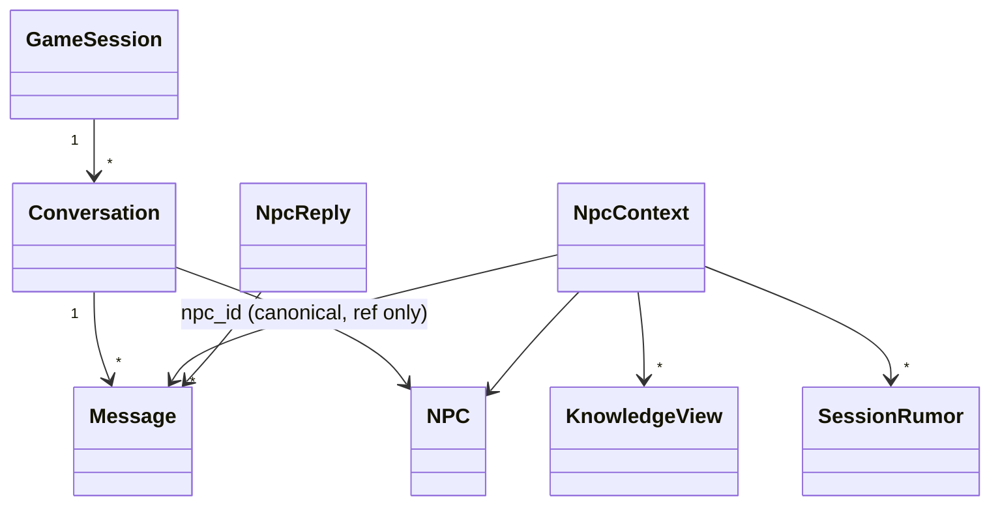

# U5 NPC 대화·언어 — Domain Entities

근거: FD-U5 답 Q1=A(서버 기본 + 요청별 `lang`)·Q2=A(ko 통일 + en 사전)·Q3=A(컨텍스트 한도 12/6/8/10)·Q4=A(삭제·재생성 라우트에서 즉시 정리), 요구 FR-C4·F4·F5·G1~G5, 가정 A-1, component-methods P2·P3·P12·P13·P14·L2/L4, 플랜 가정 A5-1~A5-10. 대화 모델은 `locus/play/models.py`, 순수 컨텍스트는 `locus/play/npc/scope.py`, 조정값은 `locus/shared/config/tuning.py::PlayTuning`, 번역은 `locus/localization/`.

## 1. 새 엔티티 (play)

### 1.1 `Conversation` (P2·P3, A5-1)
| 필드 | 타입 | 뜻 |
|---|---|---|
| `id` | str (uuid) | |
| `session_id` | str | |
| `npc_id` | str | 캐노니컬 NPC id(참조만). `(session_id, npc_id)` 유일 — 세션·NPC당 대화 하나 |
| `started_turn` | int ≥ 0 | 처음 말을 건 턴 |
| `messages` | list[Message] | 시간순. 저장은 별 테이블, 조회 시 채운다 |
| `created_at` | datetime \| None | DB 서버 시간 |

### 1.2 `Message` (P2)
| 필드 | 타입 | 뜻 |
|---|---|---|
| `id` | str (uuid) | |
| `conversation_id` | str | |
| `role` | `"player"` \| `"npc"` | |
| `text` | str | 표시 언어 그대로 저장(번역 캐시에 넣지 않는다, A-1) |
| `lang` | str | 그 메시지가 생성된 표시 언어(`ko`/`en`). 언어를 바꿔 이어가도 이력이 무엇으로 쓰였는지 남는다 |
| `turn` | int ≥ 0 | 말한 시점의 세션 턴 |
| `created_at` | datetime \| None | DB 서버 시간 |

### 1.3 `NpcContext` (P12; 순수 함수의 출력)
| 필드 | 타입 | 뜻 |
|---|---|---|
| `npc` | NPC | 이름·역할·설명(페르소나) |
| `facts` | list[KnowledgeView] | 이 지역에서 아는 정적 지식(direct → inherited → global 순, 한도 이하) |
| `hearsay` | list[KnowledgeView] | 약한 경로로 닿은 전언(§4 이탈 1) |
| `rumors` | list[SessionRumor] | 이 지역의 활성 세션 소문(승격 → 지지도 높은 순) |
| `recent` | list[Message] | 최근 대화(오래된 것 → 새 것, 한도 이하) |
| `allowed_ids` | set[str] | 넣을 수 있었던 모든 지식·소문 id(입력 전체). 불변식 검증의 기준 |

### 1.4 `ScopeLimits` (Q3=A; 순수 함수 인자)
`ScopeLimits(facts=12, hearsay=6, rumors=8, recent_messages=10)`. `PlayTuning`에서 만들어 넘긴다(§3).

### 1.5 `NpcReply` (P13)
| 필드 | 타입 | 뜻 |
|---|---|---|
| `message` | Message | NPC가 한 말(저장된 행) |
| `lang` | str | 생성 언어 |
| `llm_calls` | int | 항상 1(A5-2) |
| `context_ids` | list[str] | 이 답에 들어간 지식·소문 id(감사·테스트용, 응답에도 포함) |

## 2. 바뀌는 엔티티
| 엔티티 | 변경 |
|---|---|
| `TimelineKind` | `+ NPC_TALKED = "npc_talked"` (끝에 추가). `EndTalk` 행동이 기록(U4 `TurnAdvancer._start`) |
| `PlayTuning` | `+ npc_max_facts=12`, `npc_max_hearsay=6`, `npc_max_rumors=8`, `npc_max_recent_messages=10` (env `NPC_MAX_FACTS`, `NPC_MAX_HEARSAY`, `NPC_MAX_RUMORS`, `NPC_MAX_RECENT_MESSAGES`) |
| `Settings` | 기존 `translation_target_lang`이 표시 언어의 **기본값**이 된다(Q1=A). `+ supported_langs: tuple[str, ...] = ("ko", "en")` (env `SUPPORTED_LANGS`, 쉼표 구분) |
| `PlayContainer` | `+ dialogue: NpcDialogueService` (항상 조립; LLM 없으면 `say`만 503 — §4 이탈 3) |
| `PlayUnitOfWork` | `+ conversations: ConversationStore` |
| `RumorService.regenerate_region` | 반환형 `list[SessionRumor]` → `RegenerateResult`(§1.6) — §4 이탈 2 |
| `SessionRumor`·`Knowledge` | 변경 없음 |

### 1.6 `RegenerateResult` (Q4=A / §4 이탈 2)
| 필드 | 타입 | 뜻 |
|---|---|---|
| `kept` | list[SessionRumor] | 보존된 승격 소문 |
| `fresh` | list[SessionRumor] | 새로 만든 소문 |
| `deleted_ids` | list[str] | 지운 소문 id — 라우터가 이 id의 번역 행을 정리한다 |
| `rumors` | property | `kept + fresh` (기존 응답 형태 유지) |

## 3. 저장 (PostgreSQL, `locus/play/storage/schema.py`; 추가만, idempotent)
| 테이블 | 열 |
|---|---|
| `conversations` | `id PK`, `session_id idx`, `npc_id`, `started_turn int`, `created_at`; `UNIQUE (session_id, npc_id)` |
| `messages` | `id PK`, `conversation_id idx`, `role`, `text TEXT`, `lang`, `turn int`, `created_at` |

## 4. 포트

### 4.1 `ConversationStore` (`locus/play/ports.py`; AD-R3 분할 유지)
```python
class ConversationStore(Protocol):
    def get_or_create_conversation(self, session_id: str, npc_id: str, *, turn: int) -> Conversation: ...
    def get_conversation(self, session_id: str, npc_id: str) -> Conversation | None: ...   # messages 채움
    def append_message(self, message: Message) -> Message: ...
    def list_conversations(self, session_id: str) -> list[Conversation]: ...               # messages 없이
```
`PlayRepository`에 합치고 `PlayUnitOfWork.conversations`에 노출한다. 인메모리 트윈도 같은 계약(락·UoW 규칙은 U4 그대로).

### 4.2 `TranslationStore.purge` (Q4=A, L2 "purge lands in U5")
```python
class TranslationStore(Protocol):
    ...
    def purge(
        self,
        *,
        kind: str | None = None,
        ids: list[str] | None = None,
        world_id: str | None = None,
        session_id: str | None = None,
    ) -> int: ...      # 지운 행 수. 필터가 하나도 없으면 ValueError (전체 삭제 방지)
```
`TranslationService.purge(**같은 필터) -> int`가 감싸고(예외를 삼켜 0을 돌려주는 대신 그대로 올린다 — 호출자는 라우터), in-flight 집합에서도 해당 키를 지운다.

## 5. 오류
| 오류 | HTTP | 뜻 |
|---|---|---|
| `LlmUnavailableError(RuntimeError)` | 503 | LLM 제공자가 없는데 `say`를 불렀다(`api/errors.py` 매핑 추가) |
| `InvalidActionError` | 400 | 플레이어가 그 NPC의 지역에 없다 / NPC가 그 월드에 없다 / 지원하지 않는 `lang` / 빈 `text` |
| `LookupError` | 404 | 세션·NPC·대화 없음 |
| `SessionClosedError` | 409 | 닫힌 세션에 `say` |

## 6. 관계 그림


## 7. 설계 이탈 (승인 시 함께 받는 것)
| # | 상위 산출물이 말한 것 | 이 설계 | 까닭 |
|---|---|---|---|
| 1 | FR-C4·US-4.2: 컨텍스트 = direct+inherited+global + 활성 소문 + NPC 설명"만" | **전언(hearsay)도 넣는다**(한도 6, Q3=A) | component-methods P12의 `NpcContext.hearsay`가 이미 전언 칸을 둔다. 전언은 정의상 그 지역에서 닿는 지식이라 핵심 불변식("R에서 알 수 없는 지식 id는 없다")은 그대로다. U4 지역 화면이 플레이어에게 이미 "들은 이야기"로 보여 주므로, NPC가 그것을 모르면 화면과 대화가 어긋난다 |
| 2 | `RumorService.regenerate_region -> list[SessionRumor]` | `RegenerateResult`(+`deleted_ids`) | 라우터가 지운 소문의 번역 행을 정리해야 하고(Q4=A), 경계 규칙상 play는 localization을 부를 수 없다. 규칙("승격은 보존")을 라우터에 복제하지 않는 유일한 방법 |
| 3 | 플랜 가정 A5-3: LLM 없으면 `start`·`say` 503 | `start`·`history`는 200, `say`만 503 | `start`는 대화 행 생성 + 페르소나 반환뿐이라 LLM이 필요 없다. 키 없이도 대화 화면을 열어 볼 수 있다(US-1.4) |
| 4 | L2: `purge(source_kind, source_ids)` | 필터형 `purge(kind=, ids=, world_id=, session_id=)` | 월드 교체·import 때 그 월드의 번역 행을 한 번에 정리해야 한다(U2가 캐노니컬을 통째로 지운다) |
