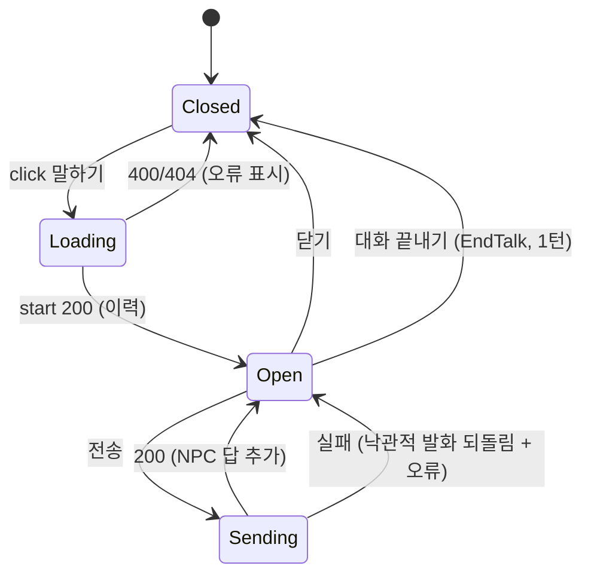

# U5 NPC 대화·언어 — Frontend Components

근거: FD-U5 Q1=A(요청별 `lang`)·Q2=A(ko 통일 + en 사전), US-4.1·4.3, US-9.1·9.2·9.4, FR-G5. 기존 자산: U4의 `web/src/features/play/`(`RegionScene`·`MovePanel`·`ActionBar`·`PlayLog`·`LlmBanner`·`NewSessionForm`·`summary.ts`), `web/src/ui/*`(Doodly 프리미티브 + `LocalizedText` 원문 토글), `web/src/i18n.ts`(ko 전용 사전 + `timelineText`), `web/src/api/{http,play,gm,world,knowledge}.ts`, `routes/{AppNav,EditorPage,GmPage,PlayPage}.tsx`.

## 1. 컴포넌트 트리 (바뀌는 곳만)
```
AppNav (기존)
└── LangToggle                     — 표시 언어 ko/en (localStorage 기억, 모든 요청의 ?lang=)

PlayPage (U4)
├── RegionScene (U4)
│   └── NpcList                    — NPC 카드 + "말하기" 버튼 (US-4.1 첫째)
├── DialoguePanel                  — 이력 · 입력 · 전송 · 진행 표시 · 대화 끝내기(EndTalk)
├── MovePanel · ActionBar · PlayLog · LlmBanner (U4, 라벨만 사전으로)
└── (U4) NotificationCenter

Toolbar · RegionPanel · SessionBar · SessionPanel · AugmentPanel · EditorPage
└── 남은 영어 라벨을 i18n 사전으로 (Q2=A)
```

## 2. 컴포넌트별 정의

### 2.1 `LangToggle` (`features/play/LangToggle.tsx`) — Q1=A, US-9.4
- **상태**: 없음. 언어는 `i18n`의 모듈 상태이며 `localStorage["locus.lang"]`에 남는다.
- **표시**: `ko | en` 두 버튼(`data-testid="lang-ko"` / `lang-en"`), 현재 언어가 눌린 모양.
- **동작**: `setLang(next)` → 사전 언어가 바뀌고, 이후 모든 API 요청에 `?lang=next`가 붙는다. 화면은 `useLang()`이 돌려주는 값에 의존하므로 다시 그려지고, 현재 화면의 데이터는 다시 조회한다(번역 필드가 언어별로 다르다).
- **자리**: `AppNav` 오른쪽. 모든 화면에 보인다.

### 2.2 `i18n.ts` 확장 (Q2=A)

기존 `web/src/i18n.ts` **한 파일**을 넓힌다(unit-of-work가 적은 `web/src/i18n/` 디렉터리가 아니다 — domain-entities §7 이탈 10). 사전 두 개와 언어 상태뿐이다.
```ts
type Lang = "ko" | "en";
const dicts: Record<Lang, Record<string, string>> = { ko: {...}, en: {...} };
let current: Lang = readStoredLang() ?? "ko";
export function lang(): Lang
export function setLang(next: Lang): void      // localStorage + subscriber 알림
export function useLang(): Lang                 // 리렌더용 구독 훅
export function t(key: string, params?): string  // 현재 언어 사전 → 없으면 ko → 없으면 key
export function timelineText(kind, payload, turn, summary?): string  // 기존 계약 유지
```
- `en` 사전은 `ko`와 **같은 키 집합**을 가진다(테스트로 강제). 빠진 키는 `ko`로 떨어져 화면이 비지 않는다.
- U4가 넣은 플레이 라벨과 타임라인 템플릿에 `en`을 채우고, `npc.*`·`dialogue.*` 키를 새로 더한다.
- U5가 만드는 타임라인 종류의 템플릿도 두 언어로 더한다: `timeline.npc_talked`(ko "{npc_name}와 대화 · {region_name}" / en "spoke with {npc_name} · {region_name}"). 빠지면 `timelineText`가 요약문으로 떨어져 `PlayLog`에 영어 원문이 보인다.

### 2.3 남은 영어 라벨 정리 (FR-G5, US-9.4 첫째)
| 파일 | 지금 | 키 |
|---|---|---|
| `Toolbar.tsx` | Load / Build demo / Load demo world / Pick map | `toolbar.load`·`toolbar.buildDemo`·`toolbar.loadDemo`·`toolbar.pickMap` |
| `RegionPanel.tsx` | "Region knowledge" 등 | `region.title`·`region.shared`·`region.unique`·`region.empty` |
| `SessionBar.tsx` | Session / New Session / Close / — none — | `session.title`·`session.new`·`session.close`·`session.none` |
| `SessionPanel.tsx` | 남은 영어 조각 | 기존 `gm.*` 키 재사용 |
| `AugmentPanel.tsx` | "Knowledge augmentation" 등 | `augment.*` |
| `EditorPage.tsx` | "No world loaded…" 안내 | `editor.noWorld` |
| `AppNav.tsx` | Editor / GM / Play | `nav.editor`·`nav.gm`·`nav.play` (제품명 "Locus"는 그대로) |
- 라벨 문자열을 단언하는 기존 테스트는 `t("...")`로 바꾼다(문구가 아니라 키를 검증).

### 2.3a 전언은 화면에만 (검토 1차 R-01)
`RegionScene`의 "들은 이야기"(U4)는 그대로 둔다. 그것은 그 지역에 희미하게 닿은 캐노니컬 지식을 **플레이어에게** 보여 주는 칸이다. NPC가 아는 범위에는 들어가지 않으므로(BR-U5-7), 화면에 보이는 전언을 물어도 NPC는 모른다고 할 수 있다. 화면 문구로 그 차이를 드러낸다: 제목을 `t("play.hearsay")`("들은 이야기") 아래 작은 글씨로 `t("play.hearsayHint")`("이 지역에 희미하게 닿은 이야기입니다. 사람들이 다 아는 것은 아닙니다.")를 둔다.

### 2.4 `NpcList` (`features/play/NpcList.tsx`) — US-4.1 첫째
- **props**: `npcs: NPC[]`, `activeNpcId: string | null`, `disabled: boolean`(LLM 없음), `onTalk(npcId)`.
- **표시**: U4가 `RegionScene`에 두었던 NPC 카드를 여기로 옮기고, 카드마다 "말하기"(`npc-{id}-talk-btn`)를 둔다. 이름·역할은 그대로, 설명은 카드 안 작은 글씨. 대화가 있으면 배지(`dialogue.has`)로 표시한다.
- **LLM 없음**: 버튼은 눌리지만 `DialoguePanel`이 입력창을 잠그고 안내를 보인다(`start`는 동작하므로 이력은 열린다, BR-U5-29).

### 2.5 `DialoguePanel` (`features/play/DialoguePanel.tsx`) — US-4.1, 4.3, 9.2
- **props**: `sessionId`, `npc: NPC`, `llmAvailable: boolean`, `onClose()`, `onEndTalk()`.
- **상태**: `messages: Message[]`, `draft: string`, `sending: boolean`, `error`.
- **로드**: 열릴 때 `playApi.startDialogue(sessionId, npc.id)` → 대화 + 이력. 실패는 패널 안에 표시한다.
- **보내기**: `sending`이면 전송 막음. `playApi.say(sessionId, npc.id, draft, lang())` → 낙관적으로 플레이어 발화를 붙이고, 응답의 NPC 메시지를 붙인다. 실패하면 낙관적 발화를 되돌리고 오류를 보인다(BR-U5-3의 원자성과 화면을 맞춘다).
- **표시**: 말풍선 목록(`role`로 좌우), NPC 이름·역할 머리글, 입력창 + 전송(`dialogue-send-btn`), "대화 끝내기"(`dialogue-end-btn` → `EndTalk` 1턴), 진행 중 표시. 대화문은 표시 언어로 생성된 원문이라 `LocalizedText`를 쓰지 않는다(토글 없음, A-1).
- **LLM 없음**: 입력창·전송 비활성 + `t("dialogue.noLlm")`. 이력은 보인다.
- **턴 중**: U4의 `busy`와 무관하게 대화는 허용한다(BR-U5-27). "대화 끝내기"만 `busy`일 때 비활성(턴을 소모하므로).

### 2.6 `PlayPage` 연결
- `activeNpcId` 상태를 더한다. `NpcList`의 "말하기"가 그것을 세우고 `DialoguePanel`을 연다. `onEndTalk`은 U4의 `act({type:"end_talk", npc_id})`를 부르고 패널을 닫는다.
- 언어가 바뀌면(`useLang()`) 지역 화면을 다시 조회한다.

## 3. API 계층 (Q1=A)
- `api/http.ts`: `http()`가 쿼리에 현재 언어를 붙이는 `withLang(path)` 도움 함수를 제공한다. 번역이 붙는 읽기 경로와 `say`만 사용한다(쓰기 라우트는 그대로).
- `api/play.ts`: `startDialogue(sid, npcId)`, `say(sid, npcId, text)`, `dialogueHistory(sid, npcId)`, `listNpcs(sid)`; `getRegion`·`sessionKnowledge`에 `?lang=` 추가.
- `api/{gm,knowledge}.ts`: 읽기 라우트에 `?lang=` 추가.
- `types.ts`: `Conversation`, `Message`, `NpcReply`, `Lang`.

## 4. 상태 흐름 (한 번의 대화)


## 5. 테스트(vitest)
- `DialoguePanel`: 열면 이력이 보인다; 전송 → `say` 호출·NPC 답 추가; 실패 → 낙관적 발화 되돌림; LLM 없으면 입력 비활성 + 안내; "대화 끝내기" → `act(end_talk)`.
- `NpcList`: 카드와 버튼, 대화 있음 배지.
- `LangToggle` / `i18n`: `ko`·`en` 키 집합이 같다; `setLang("en")` → 라벨이 영어로 바뀌고 이후 요청에 `?lang=en`이 붙고 지역 화면을 다시 조회한다.
- 라벨: 정리한 컴포넌트에 하드코딩 영어가 없다(`t()` 경유).
- 기존 U4 `play.test.tsx`와 `components.test.tsx`는 라벨 단언만 키 기반으로 갱신한다.
