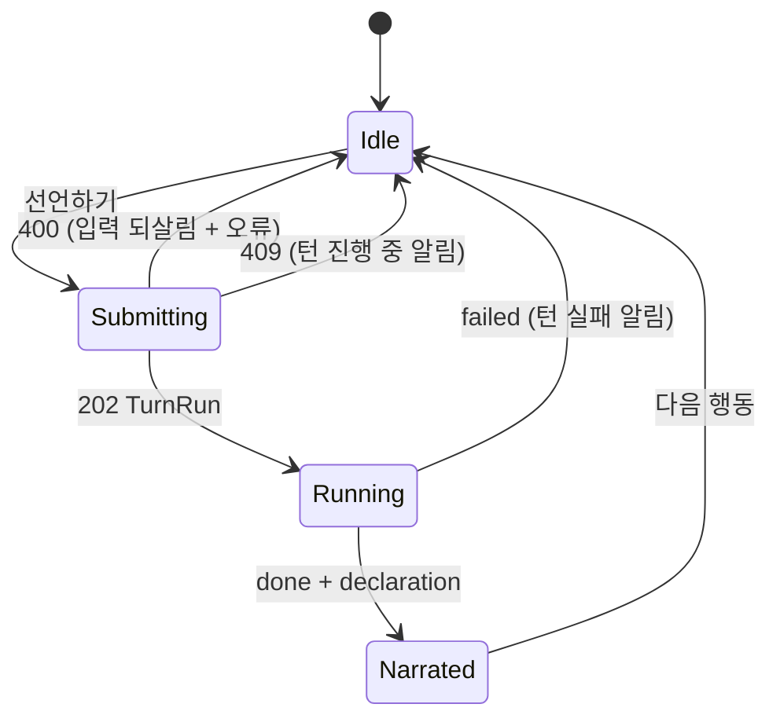

# U6 행적·전파 — Frontend Components

근거: US-4.5(선언과 서술), US-5.6(GM 행적 패널), US-6.5(행적 소문 표시), 가정 A6-13, U5 자산(`i18n.ts` ko·en 사전, `withLang`, `LocalizedText`, `features/play/*`, `GmPage`·`SessionPanel`). GM 화면의 기능별 분할은 U7이므로, U6은 지금 GM 화면에 패널 하나를 더한다.

## 1. 컴포넌트 트리 (바뀌는 곳만)
```
PlayPage
├── RegionScene
│   └── 소문 줄: 행적 기원이면 "행적" 배지            (US-6.5)
├── NarrationCard            — 마지막 선언의 서술        (US-4.5)
├── ActionBar                — 기다리기 + 선언 입력      (US-4.5)
└── PlayLog                  — GM 전용 줄을 뺀다

GmPage
├── SessionPanel             — 소문 목록에 "행적" 배지
└── DeedPanel (features/gm/) — 행적·판단·도달 지역·취소  (US-5.6)
```

## 2. 컴포넌트별 정의

### 2.1 `ActionBar` 확장 (`features/play/ActionBar.tsx`)
- **props 추가**: `onDeclare(text: string)`. `disabled`는 지금처럼 턴 진행 중이다.
- **표시**
  - 여러 줄 입력 `declare-input`이 있고 placeholder는 `t("play.declarePlaceholder")`다.
  - 글자 수 `{n}/{max}`를 보인다. `max`는 `DECLARE_MAX_CHARS = 300` 상수이고, 서버가 최종 판단한다.
  - 버튼 `declare-btn`의 라벨은 `t("play.declare")`("선언하기 (1턴)")다.
- **동작**
  - 공백을 뺀 텍스트가 비었거나 `max`를 넘으면 버튼이 꺼진다.
  - 누르면 `onDeclare(text)`를 부르고 입력을 비운다.
  - 서버가 400을 주면 `PlayPage`가 오류를 보이고, 입력은 되살린다(낙관적 비움을 되돌린다).

### 2.2 `NarrationCard` (`features/play/NarrationCard.tsx`, 새 파일)
- **props**: `narration: Narration | null`
- **표시**
  - 제목은 `t("play.narrationTitle")`, 본문은 `narration.text`다. 표시 언어로 생성된 원문이라 원문 토글이 없다(Q3=A).
  - `narration.llm_calls === 0`이면 작은 글씨로 `t("play.narrationFallback")`을 보인다.
- **수명**
  - 선언 실행이 끝나 `result.declaration`이 있으면 `PlayPage`가 세운다.
  - 다음 행동을 시작하면 지운다.

### 2.3 `PlayPage` 연결
- `declare(text)`는 `act({type: "declare", text})`를 부른다. 기존 `act`를 재사용하므로 202·폴링·409 알림이 그대로다.
- 폴링이 끝나면 `current.result?.declaration`을 `NarrationCard`에 넘긴다.
- 선언 실행이 도는 동안에는 `ActionBar`의 진행 표시가 그대로 보인다. 서술은 결과와 함께 온다(A6-1).

### 2.4 행적 배지
- `RegionScene`의 소문 줄과 `SessionPanel`의 소문 카드에 배지를 단다. `r.origin_kind === "deed"`이면 `<Badge tone="event">{t("badge.deed")}</Badge>`다.
- 승격 배지와 함께 보일 수 있다.

### 2.5 `PlayLog` — GM 전용 줄 제외
- `GM_ONLY_KINDS = ["deed_appraised", "deed_seeded", "rumor_spread"]`인 줄은 플레이어 기록에서 뺀다.
- NPC가 무엇을 전하기로 했는지는 플레이어에게 숨긴 정보다. 소문은 다른 지역에 가서 들어야 한다(US-6.5의 경험).
- 전체 관점 필터(C6)는 U7이다.

### 2.6 `DeedPanel` (`features/gm/DeedPanel.tsx`, 새 파일) — US-5.6
- **props**: `sessionId`, `closed: boolean`, `onChanged()`(소문이 바뀌었으니 `SessionPanel`을 다시 읽게 한다)
- **상태**: `deeds: DeedViewOut[]`, `error`, `confirm: DeedViewOut | null`, `busy`
- **로드**
  - 열 때와 언어가 바뀔 때(`useLang()`) `gmApi.listDeeds(sessionId)`를 부른다. `withLang`이 붙는다.
  - 새 턴 뒤에는 `GmPage`의 `sessionRev`가 바뀌므로 `key`로 다시 읽는다.
- **표시** (최신 순)
  - 행적 카드 머리에는 종류 배지(`t("deed.kind.<kind>")`), 지역 이름, `t4`, 목격자 이름을 둔다.
  - 본문은 `LocalizedText(ko=text_ko, original=text)`다. 선언이면 원문 `declaration`을 작은 글씨로 덧붙인다.
  - 판단 줄마다 NPC 이름, `✓`/`✗`(`noteworthy`), `salience` 두 자리, `slant`, `LocalizedText(retelling)`을 보인다.
  - 도달 지역은 이름 목록에 활성/전체 소문 수를 붙인다(예: "리버턴 · 하이크랙 (2/3)").
  - 취소된 행적은 흐리게 보이고 `t("deed.voided")` 배지를 단다. 취소 버튼은 없다.
- **취소**
  - `void-{id}` 버튼을 누르면 `Modal`이 `t("deed.voidConfirm", {n: 활성 소문 수})`로 확인을 받는다.
  - 확인하면 `gmApi.voidDeed(sessionId, id)`를 부르고, 목록을 다시 읽은 뒤 `onChanged()`를 부른다.
  - 409는 `t("play.turnInProgress")` 알림이다.
  - 닫힌 세션에서는 버튼이 꺼진다.
- **비었을 때**: `t("deed.none")`

## 3. API·타입
- **`api/play.ts`**: `act`가 `withLang`을 쓴다. 서버는 선언에서만 `lang`을 읽으므로 다른 행동에는 무해하다.
- **`api/gm.ts`**: `listDeeds(sid)`는 `withLang`을 쓴다. `voidDeed(sid, deedId)`는 `POST`다.
- **`types.ts`**
  - `DeclareAction`을 `PlayerAction`에 더한다. `Narration`을 새로 둔다.
  - `Deed`, `DeedAppraisal`, `DeedViewOut`을 새로 둔다. 번역 필드와 이름 필드(`region_name`, `npc_name`, `witness_names`, `reached_region_names`)를 가진다.
  - `SessionRumor`에 `origin_kind`·`origin_deed_id`·`origin_appraisal_id`·`spread_from_region_id`를 더한다. `ActionResult`에 `declaration`을 더한다.

## 4. i18n (ko·en 같은 키 집합, U5 규칙)
| 키 | ko | en |
|---|---|---|
| `play.declare` | 선언하기 (1턴) | Declare (1 turn) |
| `play.declarePlaceholder` | 무엇을 하시겠습니까? | What do you do? |
| `play.chars` | {n}/{max}자 | {n}/{max} chars |
| `play.narrationTitle` | 세계의 응답 | The world answers |
| `play.narrationFallback` | 서술을 만들 LLM이 없어 행동만 기록했습니다 | No LLM to narrate: only the action was recorded |
| `badge.deed` | 행적 | deed |
| `deed.title` | 행적 | Deeds |
| `deed.kind.arrival` / `.statement` / `.declared_action` | 도착 / 발언 / 선언 | arrival / statement / declared |
| `deed.witnesses` | 목격 | witnessed by |
| `deed.appraisals` | 판단 | appraisals |
| `deed.reached` | 도달 지역 | reached |
| `deed.void` | 취소 | Void |
| `deed.voidConfirm` | 이 행적과 그 소문 {n}건을 없던 일로 합니다. 되돌릴 수 없습니다. | Void this deed and its {n} rumor(s)? This cannot be undone. |
| `deed.voided` | 취소됨 | voided |
| `deed.none` | 아직 행적이 없습니다 | No deeds yet |
| `timeline.action_declared` | 선언 · {region_name} | declared · {region_name} |
| `timeline.deed_recorded` | 발언 기록 · {npc_name} | statement recorded · {npc_name} |
| `timeline.deed_appraised` | {npc_name}의 판단 · {region_name} | {npc_name} appraised · {region_name} |
| `timeline.deed_seeded` | 행적 소문 · {region_name} | deed rumor · {region_name} |
| `timeline.rumor_spread` | 소문 전파: {from_region_name} → {region_name} | rumor spread: {from_region_name} → {region_name} |
| `timeline.deed_voided` | 행적 취소 | deed voided |
- 이름 뒤 조사는 받침과 무관한 "의"와 부호만 쓴다. U5 코드 게이트 판단 1과 같은 까닭이다.

## 5. 상태 흐름 (선언 한 번)


## 6. 테스트 (vitest)
- **`ActionBar`**: 빈 입력이나 301자에서 버튼이 꺼진다. 턴 진행 중에도 꺼진다. 누르면 `onDeclare`가 공백을 뺀 텍스트로 불린다.
- **`PlayPage`**
  - 선언하면 `act`가 `{type: "declare", text}`로 불린다. 폴링이 끝나면 `NarrationCard`에 서술이 보인다.
  - 400이면 입력이 되살아나고 오류가 보인다.
- **배지**: `origin_kind="deed"` 소문에 "행적" 배지가 붙는다(지역 화면과 GM 소문 목록).
- **`PlayLog`**: `deed_appraised`·`deed_seeded`·`rumor_spread` 줄이 없고, `action_declared` 줄은 있다.
- **`DeedPanel`**
  - 판단 두 개와 도달 지역이 보인다.
  - 취소하면 확인창이 뜨고 `voidDeed`가 불린 뒤 `onChanged`가 불린다. 409면 알림이 뜬다. 취소된 행적에는 버튼이 없다.
- **i18n**: ko·en 키 집합이 같다(기존 테스트가 새 키도 덮는다).
