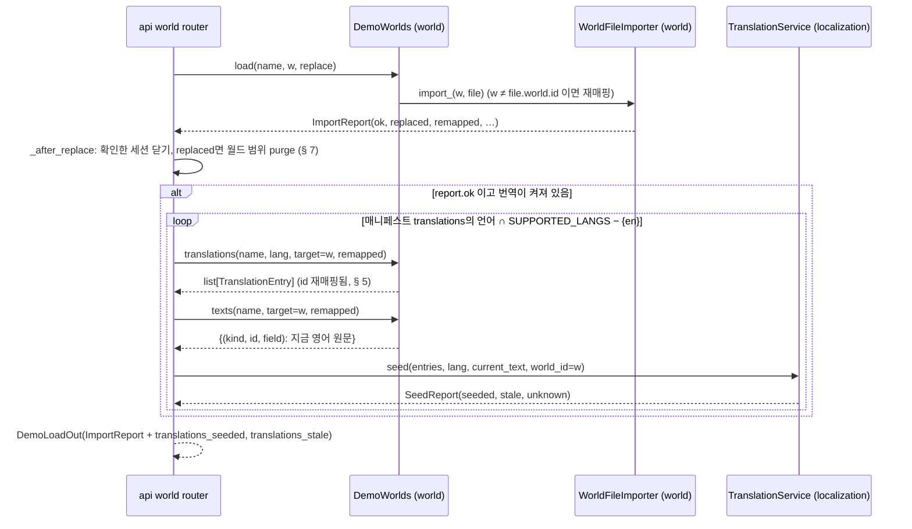

# V3 한국어 표시 백엔드 — Business Logic Model

**원하시는 것**: Purpose Restructure 주기에서 넘긴 일을 처리해 솔로 TRPG를 다듬는 것. 이번 주기는 새 TRPG·판타지 디자인으로 화면 다시 만들기, 결과가 틀리는 결함 고치기, 시한 있는 부채 정리다.
**지금 하는 것**: V3 Functional Design. 데모 번역이 파일에서 캐시를 거쳐 화면 응답에 닿는 흐름과, 그 사이의 검사·재매핑·지우기를 정한다.

자료 모양은 `domain-entities.md`, 규칙 번호(BR-V3-*)는 `business-rules.md`에 있다.

---

## 1. 누가 무엇을 하나 (경계)

| 경계 | 하는 일 | import |
|---|---|---|
| **shared** `models/i18n.py` | `TranslationEntry`, `TranslationFile`, `TRANSLATABLE_FIELDS`, `source_hash` | 바닥 |
| **world** | 아래 세 가지를 맡는다. 번역 캐시는 모른다 | shared, knowledge |
|  | - `worldfile/texts.py` [새]: `translatable_texts(file)`, 순수 |  |
|  | - `worldfile/remap.py`: `remapped_id`(공개) |  |
|  | - `demo/`: 번역 파일 읽기·검사·재매핑, 카드 문구 |  |
| **localization** | `TranslationService` | shared |
|  | - 키 없이도 만든다 |  |
|  | - `seed`, `carry` |  |
|  | - 새 종류의 `enrich`·`purge` |  |
| **play** | 가산 id 둘(`RegionView.level_path_ids`, `deed_seeded`의 `npc_id`) | knowledge, shared. localization을 import하지 않는다 |
| **knowledge** | `level_path_ids(region, snapshot)` [새] | shared |
| **api**(합성 루트) | 두 경계를 잇는다: 시딩 호출, 이름표, 카드·월드 목록 칸, purge 지점, 씨앗→사건 옮기기 | 모두 |
| **CLI** `locus/__main__.py`(합성 루트) | `world demo`가 불러온 뒤 시딩한다 | 모두 |

world와 localization은 서로 모른다. 둘을 잇는 것은 늘 합성 루트(api, CLI)다. world는 `TranslationEntry` 목록과 지금 원문(`dict[(kind, id, field), str]`)을 주고, localization은 그것을 캐시에 넣는다.

## 2. 키 없는 번역 서비스

```
assemble_localization(shared)
  번역 꺼짐(TRANSLATION_ENABLED=false) ─→ translations=None (지금과 같음)
  SQL 엔진 없음 ────────────────────────→ translations=None (지금과 같음)
  LLM 있음 ─────────────────────────────→ TranslationService(store, Translator(llm), warm=스레드 풀)  (지금과 같음)
  LLM 없음 ─────────────────────────────→ TranslationService(store, translator=None)                  [새]
```

LLM이 없는 서비스가 할 수 있는 일과 하지 않는 일:
- **한다**:
  - `enrich`: 캐시만 읽는다.
  - `seed`, `carry`, `purge`
- **하지 않는다**: 캐시에 없는 항목을 백그라운드로 번역하는 warm. `enrich`는 빠진 항목을 예약하지 않고 그냥 원문으로 둔다(BR-V3-02).

화면 쪽 결과:
- 키 없이도 시딩된 데모는 한국어로 보인다.
- 시딩되지 않은 텍스트는 영어로 남는다. 직접 만든 월드, 에디터에서 고친 문장, 세션 소문이 그렇다. 소문은 애초에 키 없이는 생기지 않는다.

## 3. 데모 불러오기 → 지우기 → 시딩 (API)

`POST /api/world/worlds/{w}/demo/{name}?replace=&confirm=`



텍스트 대안:
1. 불러오기는 지금과 같다. LLM을 부르지 않는다.
2. 교체였으면 그 월드의 번역을 먼저 지운다(§ 7). 지우기가 먼저여야 막 넣은 번역을 지우지 않는다.
3. 불러오기가 성공했을 때(`ok`)만 시딩한다. 실패하면 옛 월드가 남는다. 그 위에 새 파일의 번역을 넣지 않는다.
4. 언어마다 번역 항목과 지금 원문을 world에서 받아 localization에 넘긴다.
5. 시딩은 덧붙이는 일이다. 실패는 기록만 남긴다. 응답(불러오기 결과)을 깨지 않는다(지금 `purge_translations`와 같은 규칙).
6. "지금 원문"은 방금 가져온 World File에서 계산한다. 저장된 월드를 다시 읽지 않는다. 가져오기가 `ok`이면 저장된 원문과 같다.

**`TranslationService.seed(entries, *, lang, current_text, world_id) -> SeedReport`**:
```
for entry in entries (파일 순서):
    now = current_text.get(entry.key)
    now 없음 또는 빈 원문      → unknown += 1, 버림
    source_hash(entry.source) ≠ source_hash(now) → stale += 1, 버림
    그 밖                      → 행 Translation(kind, id, field, lang, text=entry.text,
                                    source_hash=source_hash(now), world_id, session_id=None)
upsert_many(행들)   # 같은 키의 기존 행(예: 예전 warm 결과)을 덮는다
seeded = 넣은 행 수   (저장 실패 → 기록하고 SeedReport(seeded=0, …))
```
- 같은 키가 파일에 두 번 있으면 나중 것이 이긴다. CI 검사가 이것을 문제로 막는다(BR-V3-08).
- 지식 행도 `world_id`를 적는다. 그래서 다음 교체 때 함께 지워진다.

## 4. CLI `locus world demo --name N --world W`

```
assemble_shared(llm=False) → … → demos.load(N, W)        (지금과 같음)
_print_report(...)                                          (지금과 같음)
번역 켜짐?  아니면 "translations: off" 한 줄, 끝
PostgreSQL 닿음? (assemble_localization이 서비스를 만들었나)
    아니면 "translations: skipped (database unreachable)" 한 줄, 끝
replaced면 월드 범위 purge (§ 7, API와 같은 함수)
§ 3의 시딩 루프 → "translations: ko seeded 123, stale 0, unknown 0" 한 줄
종료 코드: 불러오기 결과대로. 시딩은 종료 코드를 바꾸지 않는다
```
- CLI도 합성 루트라 world와 localization을 함께 import할 수 있다(`tests/test_boundaries.py:28`).
- 시딩 루프는 api와 CLI가 같은 순서로 부른다. 두 루트가 공유할 한 함수를 둘 곳이 없으므로(locus는 api를 import하지 않음) 각 루트에서 세 줄로 쓴다. 테스트는 두 경로를 모두 본다(TP-V3-9).

## 5. 번역 항목의 id 옮기기 (설계 리뷰 R-07)

`DemoWorlds.translations(name, lang, *, target_world_id, remapped) -> list[TranslationEntry]`

```
file = 데모 World File;  entries = 번역 파일의 항목(읽지 못하면 [] + 경고)
ids = file_ids(file)                       # remap.py: 파일 안 regions·entities·relations·knowledge·priors·npcs·event_seeds의 id
for entry:
    kind == "world":
        entry.id == file.world.id → id = target_world_id     # 월드 항목은 언제나 대상 월드 id로
        그 밖                     → 그대로 (seed에서 unknown)
    remapped 이고 entry.id ∈ ids → id = remapped_id(target_world_id, entry.id)
    그 밖                        → 그대로
```
- `remapped_id(target, old) = str(uuid5(NAMESPACE_LOCUS, f"{target}:{old}"))`이다. `remap_ids`가 파일 안 id에 쓰는 바로 그 식이다. `remap_ids`도 이 함수를 쓰게 바꿔 규칙이 한 곳에 있게 한다.
- `remapped`는 가져오기 보고서의 값을 그대로 쓴다. 가져오기와 같은 판단이다.
- `DemoWorlds.texts(name, *, target_world_id, remapped)`는 같은 World File을 같은 규칙으로 옮긴 뒤 `translatable_texts`를 돌린다. `remapped`면 `remap_ids`, 아니면 `set_world_id`를 쓴다. 그래서 항목 id와 원문 키가 늘 같은 공간에 있다.

## 6. 번역 파일 검사와 실행

### 6.1 검사 (`_read_manifest` → `_check`, CI는 `check_packaged`)

```
DemoInfo 검증 실패                         → 항목 빠짐, problem            (지금과 같음; i18n 형식 포함)
_check(info):
    World File 읽기·경로·소스 파일          → 항목 빠짐, problem            (지금과 같음)
    file.world.id ≠ info.name              → 항목 빠짐, problem  [새, FR-C11, Q4=A]
    시작 지역 없음·통로 없음                 → 항목 빠짐, problem            (지금과 같음)
_check_translations(info, file):  (항목은 남음, problem만 더함 — Q3=A)  [새]
    lang 키마다:
        경로가 매니페스트 폴더 밖          → "translations ko: path outside the demo folder: …"
        읽기·JSON·형식(format·version)·모델 오류 → "translations ko: unreadable: …"
        파일 lang ≠ 키                     → "translations ko: file says lang xx"
        파일 world_id ≠ file.world.id      → "translations ko: made for world …"
        같은 (kind, id, field) 둘 이상      → "translations ko: duplicate …(첫 3개)"
        지금 월드에 없는 키                  → "translations ko: unknown …(첫 3개)"
        원문이 지금과 다른 항목             → "translations ko: stale region-saltwake.name: file 'Saltwake Harbour' ≠ world 'Saltwake Harbor'"(첫 3개, 원문은 60자에서 자름)
        번역이 없는 원문(빈 원문 제외)       → "translations ko: 4 texts untranslated: …(첫 5개)"
```
- `problems`는 지금처럼 시작할 때 경고로 남는다. CI 이미지 잡의 `check_packaged()`가 하나라도 있으면 실패시킨다. 그래서 출고 데모는 늘 전부 번역돼 있다(Q3=A).
- 검사는 `remapped=False`, `target=file.world.id`로 원문을 계산한다. 출고 데모는 자기 이름으로 불러오고(FR-C11), 그때 재매핑이 없기 때문이다.

### 6.2 실행

- 검사에서 번역 문제가 나온 데모도 목록에 남고, 플레이할 수 있다.
- `translations()`는 읽을 수 있는 항목만 돌려준다. 원문이 바뀌었거나 없는 키인 항목은 `seed`가 버린다. 그 텍스트는 영어로 보인다.
- 파일 전체를 읽지 못하면 `[]`과 경고 한 줄이다. 데모는 영어로 불러온다.

## 7. 지우기(purge) 지점

정합성은 지우기에 기대지 않는다. 화면에 보일지는 "지금 원문의 해시와 맞는가"로 정해지고(BR-V3-01), 읽기는 살아 있는 원문만 찾는다. 지우기는 표를 깔끔하게 두는 일이다. 그래서 지우기가 실패해도 기록만 남기고 응답을 깨지 않는다(지금 규칙).

| 때 | 지우는 것 | 호출 |
|---|---|---|
| 월드 교체(`report.replaced`) — 빌드·업로드 빌드·World File 두 경로·데모 불러오기·데모 소스 빌드 | 그 월드의 모든 행 + 월드 이름 행 | `purge(world_id=w)` + `purge(kind="world", ids=[w])` (지금의 `kind="knowledge", world_id=w`를 넓힘) |
| 에디터 지역 삭제 | 지운 지역·NPC·씨앗 | `purge(ids=report.deleted_ids, world_id=w)` |
| 에디터 NPC 삭제 | 그 NPC | `purge(kind="npc", ids=[npc_id], world_id=w)` |
| 에디터 지식 삭제, 보강 되돌리기 | 지식 | 지금과 같음 |
| 이름·설명 고침 | 없음 | 해시가 어긋나 저절로 쓰이지 않는다 |

- 세션 내용 행(소문·사건·행적)은 `world_id`가 없어서 월드 교체 purge에 걸리지 않는다. 지금처럼 세션 쪽 규칙을 따른다.
- 월드 목록의 warm은 `kind="world"` 행을 `world_id=None`으로 쓴다(`enrich`가 한 번에 여러 월드를 받기 때문). 그래서 월드 이름 행은 id로 지운다.

## 8. 이름표 `GET /api/world/worlds/{w}/names?lang=`

```
lang = display_lang(?lang=)                             # 400 unsupported_lang (지금 규칙)
lang == en 이거나 번역 꺼짐                              → 빈 WorldNamesOut (200)
snapshot = world.cache.get(w)                           # 없는 월드 → 404 not_found
regions  = enrich(snapshot.topo.regions, kind="region", fields=[name, description], world_id=w, lang)
npcs     = enrich(snapshot.npcs, kind="npc", fields=[name, role, description], world_id=w, lang)
seeds    = enrich(snapshot.event_seeds, kind="event_seed", fields=[title, description], world_id=w, lang)
world    = enrich([snapshot.meta], kind="world", fields=[name, description], world_id=w, lang)  # meta 없으면 {}
→ WorldNamesOut(world_id=w, lang, world=world.get(w, {}), regions, npcs, event_seeds)
```
- 캐시만 읽는다. LLM이 있으면 빠진 항목은 지금처럼 백그라운드 warm에 넘어간다. 그래서 직접 만든 월드도 다음 읽기부터 한국어가 된다.
- 세션이 아니라 월드의 이름표다. 플레이 화면은 세션의 `world_id`로 부른다.
- 화면은 id로 찾고, 맵에 없으면 자기가 가진 영어를 쓴다. 시간선 `payload`의 굳은 이름도 옆의 id로 찾는다(Q5=A).

## 9. 월드 목록·데모 목록의 칸

- `GET /api/world/worlds?lang=`: 목록 행 전부에 `enrich(kind="world", fields=[name, description], world_id=None)`를 한 번 한다. 그 결과로 `name_ko`·`description_ko`를 채운다.
- `GET /api/world/demos?lang=`: `DemoInfoOut.of(info, lang)`가 `info.i18n.get(lang)`에서 `title_ko`·`description_ko`·`credits_ko`를 고른다. 번역 캐시와 무관하므로 키·DB가 없어도 한국어 카드다.

## 10. 씨앗에서 시작한 사건의 번역 (BR-V3-17)

`POST /api/gm/sessions/{s}/seeds/{seed}/start`

```
event = seeds.start(s, seed)          # event.description = seed.description 또는 seed.title (seeds.py:62)
carry(sources=[("event_seed", seed, "description"), ("event_seed", seed, "title")],
      target=("event", event.id, "description"), text=event.description,
      langs=SUPPORTED_LANGS − {en}, session_id=s)
```
- `carry`는 언어마다 source 행을 읽는다. 해시가 `text`와 맞는 첫 행을 target 키로 옮겨 쓴다. 맞는 행이 없으면 아무것도 하지 않는다.
- LLM이 필요 없다. 그래서 키 없이 시작한 데모 씨앗 사건도 GM 사건 목록에서 한국어다.
- 시작 응답은 지금처럼 번역 칸을 비운다(쓰기 응답 규칙). 다음 사건 읽기(`GET events`)가 옮겨진 행을 찾는다.

## 11. 가산 id

- `knowledge.query.level_path_ids(region, snapshot) -> list[str]`: `level_path`와 같은 순서의 조상 id 목록이다. `RegionView.level_path_ids`가 이 값을 싣는다. 화면은 경로의 각 이름을 이름표로 찾는다.
- `deed_seeded` 기록 `payload`에 `npc_id`를 더한다. `npc_name`은 그대로 둔다(옛 기록과 호환).
- 둘 다 가산이다. 옛 화면은 새 칸을 모른 채 지금처럼 동작한다(NFR-5).

## 12. 바뀌지 않는 것 (FR-L4)

- 저장 언어는 영어다. 시딩은 번역 캐시에만 쓴다. 그래프·색인·임베딩은 건드리지 않는다.
- World File v1 형식은 그대로다. 번역은 World File 밖의 별도 파일이다. 내보내기·`/file`에 한국어가 섞이지 않는다.
- 대화·서술 생성 언어 규칙(`?lang=`)은 그대로다.
- **알려진 한계**:
  - LLM이 쓰는 글(NPC 대사, 서술, 소문)은 이름표를 모른다. 그래서 대사 안에서는 "Saltwake Harbor"나 LLM이 고른 음역이 나올 수 있다.
  - 이름표를 프롬프트에 넣는 일은 play가 번역을 알아야 하는 일이라 이번 범위 밖이다. 다음 주기 목록에 적는다.
