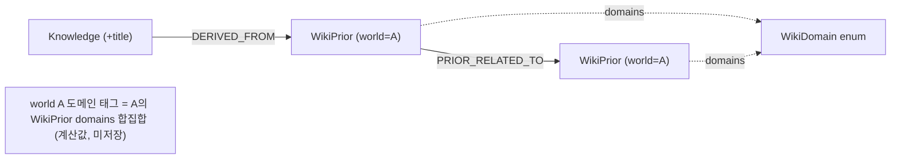

# Unit-A — Domain Entities (Functional Design)

영역 1+2+3. 기술 비종속 도메인 모델 변경. 코드: `locus/models/{graph,enums}.py` 외.
확정 답: FD-A Q1=X→World 노드 없음 / Q2=A(기획자 전용 다중 world) / Q3=A(world 내부 엣지) / Q4=A(고정 enum) / Q5=A(WikiPriorLink) / Q6=A(title 검색 포함) / CL-A1=A / CL-A2=A.

## 1. 변경: `Knowledge` (영역 3)
| 필드 | 변경 | 설명 |
|---|---|---|
| `title` | **신규, 필수** | 짧은 한 줄 제목 / UI 대표 라벨. `statement`(전체 내용)·`topic`(분류)와 구분. LLM 생성, fallback 존재(BR-A2). (FR-IM3.1/3.2/3.3) |

- `topic`, `statement`, 기타 필드는 그대로 유지.
- 직렬화/검색: `knowledge_doc.text` = `title + statement + topic`(Q6=A).

## 2. 신규 Enum: `WikiDomain` (영역 2, FD-A Q4=A)
공유 도메인 taxonomy(고정 enum). world 태그·WikiPrior 도메인이 **같은 어휘** 사용(CL1=A).

```
GEOGRAPHY, GEOLOGY, CLIMATE, ECOLOGY, ECONOMY, LOGISTICS,
CULTURE, HISTORY, POLITICS, RELIGION, MILITARY, TECHNOLOGY, OTHER
```
- `OTHER`는 분류 실패 시 안전망(BR-A5).
- 최종 목록은 구현 시 확정 가능(추가/삭제 자유). LLM이 이 enum 중에서 선택.

## 3. 변경: `WikiPrior` (영역 1+2)
| 필드 | 변경 | 설명 |
|---|---|---|
| `world_id` | **신규, 필수** | 더 이상 예약 파티션(`__realworld__`)이 아니라 소속 world. (FR-IM1.2) |
| `domains` | **신규** `list[WikiDomain]` (1+개) | 공유 taxonomy. LLM 분류(distill 시) + 사용자 편집(authoring). 비면 `[OTHER]`. (FR-IM2.1/2.2, CL2=C) |
| `prior_type` | 유지 | 기존 4종(terrain_rule/climate/logistics/fact). domains와 직교(보조 분류). |

## 4. 신규: `WikiPriorLink` (영역 2, FD-A Q5=A)
WikiPrior 간 직접 엣지(커뮤니티 + cross-domain). 그래프엔 **엣지로만** 저장(노드 없음).

```
WikiPriorLink:
  world_id: str            # 항상 동일 world (Q3=A, BR-A6)
  source_id: str           # WikiPrior id
  target_id: str           # WikiPrior id
  relation: str            # LLM이 붙인 관계 라벨 (예: "reinforces", "implies", "contrasts")
  weight: float [0,1]      # 연결 강도
  cross_domain: bool       # source/target 도메인이 다르면 True (검색 확장·시각화용 플래그)
  provenance: Provenance
```
- 저장 단방향, 의미상 대칭(무방향 단순화). 그래프 엣지 타입: `PRIOR_RELATED_TO`.
- world 경계를 넘지 않음(Q3=A).

## 5. `World` (영역 1) — 그래프 영속화 안 함 (CL-A1=A)
- `World` 모델은 경량 DTO로 유지(빌드 리포트/export 표시용). **그래프 노드로 저장하지 않음.**
- `kind`의 `"realworld"` 특수 취급 제거(`kind`는 평범한 라벨로 남기되 realworld 분기 삭제).
- **world의 도메인 태그**: 별도 저장 없이 그 world의 WikiPrior `domains` 합집합을 **필요 시 계산**(BR-A11). 기획자 교차참조에서만 사용.

## 6. 제거 (영역 1, Q4=B/Q15=B 클린 컷)
- `REALWORLD_WORLD_ID` (`locus/__init__.py`).
- `load_bundled_realworld`, `locus/commonsense_wiki/bundled.py`.
- `examples/realworld_sample/`.
- `World.kind=="realworld"` 분기, `commonsense_wiki/*`·`neo4j_repo`의 realworld 가정.

## 7. 그래프 스키마 영향 (storage)
- 노드 라벨: `World` 라벨 영속화 경로 제거(또는 미사용). `WikiPrior` 노드에 `world_id`·`domains` 반영.
- 엣지 타입 추가: `PRIOR_RELATED_TO`(WikiPriorLink).
- `Knowledge` 노드/문서에 `title` 반영.

## 8. 관계 요약 (Mermaid)

- 교차참조: world A의 도메인으로 **전 world WikiPrior 글로벌 검색**(기획자 전용, 엣지 아님 — 쿼리 시점 read-through). (CL-A2=A)
