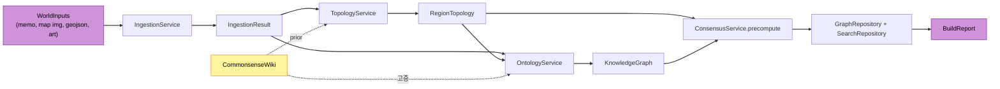
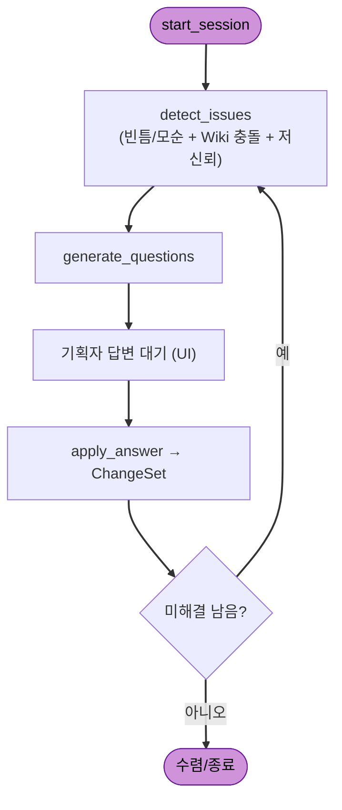
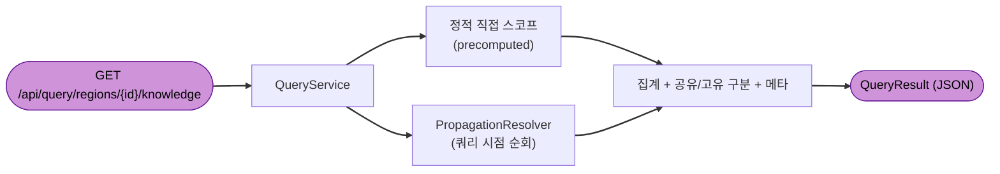

# Component Dependencies — Locus

## Dependency Matrix (행이 열에 의존)

| ↓의존 \ 대상→ | Ingestion | Topology | Ontology | Consensus | Wiki | Augment | Query | LLM | Storage | Models |
|---|---|---|---|---|---|---|---|---|---|---|
| **Ingestion** | – | | | | | | | ✓ | | ✓ |
| **Topology** | (입력) | – | | | ✓ | | | | ✓ | ✓ |
| **Ontology** | (입력) | (입력) | – | | ✓ | | | | ✓ | ✓ |
| **Consensus** | | (topo) | (kg) | – | | | | | ✓ | ✓ |
| **Wiki** | ✓(build) | ✓(build) | ✓(build) | | – | | | ✓ | ✓ | ✓ |
| **Augmentation** | | | (kg) | ✓ | ✓ | – | | ✓ | ✓ | ✓ |
| **Query** | | | | ✓ | | | – | | ✓ | ✓ |
| **LLM** | | | | | | | | – | | ✓ |
| **Storage** | | | | | | | | (임베딩) | – | ✓ |

- `Models`는 모든 모듈이 의존(공유 계약), 자신은 무의존 → **순환 없음**.
- `Storage`/`LLM`은 leaf(코어 capability가 의존, 역방향 없음).
- `Wiki`는 build 시 Ingestion/Topology/Ontology를 **재사용**하지만, 그 모듈들은 평소 Wiki를 **읽기만**(가중·고증) → build 경로는 Service 계층(S6)이 조율해 모듈 간 직접 순환을 피함.

## Communication Patterns
- **In-process 함수 호출**: 모든 코어 모듈 간 통신은 동일 프로세스 메서드 호출(모놀리스).
- **Repository 경유 영속화**: 모듈은 `GraphRepository`/`SearchRepository` 인터페이스에만 의존(어댑터가 Neo4j/OpenSearch 구현). (AD-Q5=A)
- **Provider 경유 LLM/VLM**: 모듈은 `LLMProvider`/`VLMProvider`에만 의존(LangChain+OpenAI 구현). (AD-Q4=C)
- **API 경계**: web/CLI ↔ 백엔드는 REST(JSON). authoring/serving 라우터 분리. (AD-Q6=A)

## Data Flow — World Build (동기 순차)

## Data Flow — Augmentation (LangGraph 루프)

## Data Flow — Query (하이브리드)

