# Follow-up Cycle — Application Design

**원하시는 것**: Purpose Restructure 주기에서 넘긴 일을 처리해 솔로 TRPG를 다듬는 것. 이번 주기는 셋이다: 새 TRPG·판타지 디자인으로 네 화면 다시 만들기, 결과가 틀리는 결함 고치기, 시한 있는 부채 정리.
**지금 하는 것**: Application Design(Standard). 새로 생기거나 자리가 바뀌는 구성 요소와 그 계약을 정한다. 화면별 배치와 세부 규칙은 유닛별 Functional Design에서 정한다.

**입력**:
- `inception/requirements/follow-up-requirements.md`(승인)
- `inception/plans/follow-up-execution-plan.md`(승인)
- `inception/plans/follow-up-application-design-plan.md`(Q1~Q6 답)
- `inception/reverse-engineering/*`

**세부 문서**(이 문서는 그 요약이다):
- [`components.md`](components.md): 구성 요소와 책임
- [`component-methods.md`](component-methods.md): 시그니처
- [`services.md`](services.md): 흐름(S1~S9)
- [`component-dependency.md`](component-dependency.md): 의존 행렬과 유닛 사이 계약

---

## 1. 설계 결정 (Q1~Q6, 모두 A)

| # | 결정 | 근거·효과 | 닫는 것 |
|---|---|---|---|
| Q1 | **세션별 짧은 쓰기 잠금**(`TurnGuard.short_write`) | GM 리스는 지금처럼 함께 쥐어 턴과 배타를 유지한다. 읽고-쓰는 구간만 세션마다 줄 세우고, LLM은 잠금 밖에서 부른다. 닫기도 같은 잠금 안에서 한다. 프로세스 안 잠금이라 오프라인 테스트로 겹침을 재현할 수 있다 | #9, #12, RE-P01, RE-P06, 피드백 몫 이중 기록, RE-P02 |
| Q2 | **턴과 GM 작업을 따로 표시**(`RegionView.gm_busy`, `GmBusyError` 409 `gm_busy`) | 배타는 유지하고 보이는 방식만 바꾼다. 플레이어 문장에서 내부값을 뺀다 | #5(a), RE-P12 일부 |
| Q3 | **다시 빌드할 때 옛 NPC·씨앗을 이어 붙임**(`carry_over`, 순수) | (이름, 단계)로 새 지역에 맞추고, 못 맞춘 것은 경고로 남긴다. LLM 비용이 없다. 백업이 실패하면 교체하지 않는다 | RE-W18, RE-W04, 리뷰 R-04 |
| Q4 | **데모 카드 문구와 월드 이름도 한국어** | 매니페스트에 언어별 카드 문구를 두고, 월드 이름·설명은 데모 번역 파일에 넣는다 | UX-05, 리뷰 R-02 |
| Q5 | **headless 라이브러리(Radix 계열) + 우리 토큰** | 대화상자·탭·선택 상자의 접근성 동작을 빌려 쓴다. 자동 접근성 게이트가 없는 이번 주기의 위험을 줄인다. JS 예산(1.3배) 안 | UX-11, FR-S6 |
| Q6 | **오류 응답에 `code`** | `{"detail", "code"}`로 가산 변경한다. 프론트는 `code`로 문장을 고르고 문자열 매칭을 없앤다 | UX-06, FR-D9 |

## 2. 구성 요약

```mermaid
flowchart TB
    subgraph Web["web (V2 base, V4 V6 V8 screens)"]
        Tokens["tokens and fonts (TRPG tone, one theme)"]
        UI["ui primitives on headless library"]
        Layout["layout AppShell SplitView Section"]
        Map["map WorldMap (fits container)"]
        Fmt["format labels and words"]
        Err["errors describeError by code"]
        Hooks["hooks useResource useAction"]
        Screens["home play gm editor"]
    end
    subgraph Api["api"]
        ErrC["error code contract"]
        Tr["translated fields"]
        Seed["demo translation seeding"]
        Rec["lifespan recover_interrupted"]
    end
    subgraph Back["locus"]
        Guard["play TurnGuard short_write, gm_busy"]
        GmSvc["play GM write services in short_write"]
        L10n["localization new kinds, seed"]
        Demo["world DemoWorlds i18n, translations, checks"]
        Build["world WorldBuilder backup gate, carry_over"]
        Cons["knowledge consensus best_origins"]
        Store["shared persist WorldMeta last, labeled delete"]
    end
    Screens --> Layout
    Screens --> UI
    Screens --> Map
    Screens --> Fmt
    Screens --> Hooks
    Hooks --> Err
    UI --> Tokens
    Screens -.->|"HTTP"| ErrC
    Screens -.->|"HTTP"| Tr
    Seed --> Demo
    Seed --> L10n
    Tr --> L10n
    Rec --> Guard
    GmSvc --> Guard
    Build --> Store
    Cons --> Store
```

텍스트 대안:
- **웹**: V2가 토큰·글꼴, 프리미티브(headless 위), 배치 틀, 지도, 표기 규칙, 오류 문장, 요청 도우미를 세운다. 화면(V4·V6·V8)은 그 위에서만 그린다.
- **api**: 오류 `code` 계약, 번역 칸, 데모 시딩(world와 localization을 잇는 곳), 시작 때 끊긴 run 복구.
- **play**: `TurnGuard`의 짧은 쓰기 잠금과 상태 구별. GM 쓰기 서비스는 읽고-쓰는 구간을 그 안에 둔다.
- **localization**: 번역 종류(지역·NPC·씨앗·월드)와 시딩.
- **world**: 데모 i18n·번역 파일·검사 강화, 빌드의 백업 관문과 이어 붙이기, World File 중복 id 거절.
- **knowledge·shared**: 최선 출처 합의, WorldMeta 마지막 저장, 라벨 있는 읽기·삭제.

## 3. 요구사항의 자리

| 요구사항 | 구성 요소 | 유닛 |
|---|---|---|
| FR-D1~D3 시안·토큰·글꼴 | 토큰, 글꼴 묶음 | V2(FD에서 HTML 시안) |
| FR-D4, FR-S5, FR-S6 프리미티브·상태·접근성 | `ui/`(headless 위), `StatusView`, `ConfirmDialog` | V2 |
| FR-D5, FR-D6, FR-D7 배치 틀·지도 | `layout/`, `map/` | V2(변형은 V4·V6·V8) |
| FR-D8, FR-L1 표기·사전 | `format/`, `i18n/` | V2 |
| FR-D9 오류 문장 | `errors/` + api 오류 `code` | V2 |
| FR-D10 문서 머리 | `index.html` | V9 |
| FR-S1·S2 홈·플레이 | 화면 | V4 |
| FR-S3 GM | 화면 | V6 |
| FR-S4 에디터 | 화면 | V8(P1) |
| FR-L2·L3·L4 번역 범위·데모 한국어판 | `TranslationService`, `DemoWorlds`, `TranslationEntry`, api 시딩·칸 | V3 |
| FR-C1·C2 GM 겹침·닫기 | `TurnGuard.short_write`, GM 쓰기 서비스, `SessionService` | V5 |
| FR-C3 재시작 보상 | `TurnAdvancer.recover_interrupted`, lifespan | V5 |
| FR-C4 지운 지역 사건 | `TurnAdvancer` | V5 |
| FR-C5 바쁨 표시 | `gm_busy`, `GmBusyError` | V5(+V4 화면) |
| FR-C6 합의 | `best_origins` | V7 |
| FR-C7 캐시 순서 | `persist_graph`, `WorldCache` | V7 |
| FR-C8·C9 백업·이어 붙이기 | `WorldBuilder`, `carry_over`, `WorldFileImporter` | V7 |
| FR-C10 중복 id·라벨 | `duplicate_ids`, `GraphRepository(label=)` | V7 |
| FR-C11 매니페스트 | `DemoWorlds._check` | V3 |
| FR-C12 보강 `needs` | `questions.NEEDS` | V7(+V8 카드) |
| FR-C13 늦은 답·이중 실행 | `hooks/` | V2(도구) + V4·V6·V8(적용) |
| FR-C14 남은 항목 기록 | `next-cycle.md` | V9 |
| FR-T1 CI | `ci.yml` | V1 |
| FR-T2~T7 | audit, mypy+CI, 문서, env, 테스트 위생, 라이브 시나리오 | V9. mypy CI 게이트는 11건을 0으로 만든 뒤에야 켤 수 있다. 그래서 V1에서 11건을 함께 고치지 않으면 V9에서 켠다 |

**유닛 조정 하나**: FR-C11(매니페스트 검사)은 데모 매니페스트를 바꾸는 V3에 둔다. 실행 계획 초안은 V7에 두었다. 같은 파일을 두 유닛이 고치지 않게 하려는 것이다.

## 4. 감수한 위험이 닫히는 곳

| 리뷰 지적 | 정리 |
|---|---|
| R-01 에디터를 P1로 넘길 때의 경계 | V2가 공유 프리미티브·표기·상태 처리를 앱 전체에 적용한다. V8을 넘기면 에디터 **배치**(FR-S4 목록)만 넘어간다. 에디터 안의 지역 대화상자(`MapCanvas` Dialog, `BuildPanel`)는 V2가 공유 `Dialog`로 바꾼다 |
| R-02 데모 카드 문구 | Q4=A로 범위에 들어왔다(V3) |
| R-03 U8 이월 묶음 | V9가 `next-cycle.md`에 명시한다 |
| R-04 다시 빌드 동작 | Q3=A로 정했다(이어 붙이기, V7) |
| R-05 확인 방법 | V2 NFR light(대비 계산, 브라우저 범위, 폭 상한 값)와 B&T 체크리스트 |
| R-06 브랜치 | Workflow Planning에서 정했다(PR #4 병합 → `feat/follow-up`) |

## 5. 경계·호환 확인

- **경계 행렬은 그대로다.** 새 공통 모델 `TranslationEntry`를 shared에 둔다. world·localization을 잇는 것은 api와 CLI(합성 루트)다.
- **API는 가산 변경만 한다.** 오류 응답의 `code`, 번역 칸, `RegionView.gm_busy`, `ImportReport`·`BuildReport`의 새 칸이 더해진다. `turn_running`의 뜻은 좁아진다(턴만). 웹이 유일한 소비자이고 같은 주기에 함께 바뀐다.
- **데이터 형식**:
  - World File v1: 그대로다.
  - 매니페스트: 선택 칸 둘(`i18n`, `translations`)이 생긴다.
  - 데모 번역 파일: 새 형식이고 World File 밖이다.
  - `translations` 테이블: 테이블은 그대로이고 `source_kind` 값만 는다.
  - 세션 테이블: 변경 없다(Q1=A는 프로세스 안 잠금).
- **새 의존성**: 웹은 headless 라이브러리(Radix 계열, MIT)와 새 글꼴(공개 라이선스)을 들인다. 백엔드는 새 의존성이 없다. 정확한 패키지와 크기는 V2 NFR light에서 정한다.
