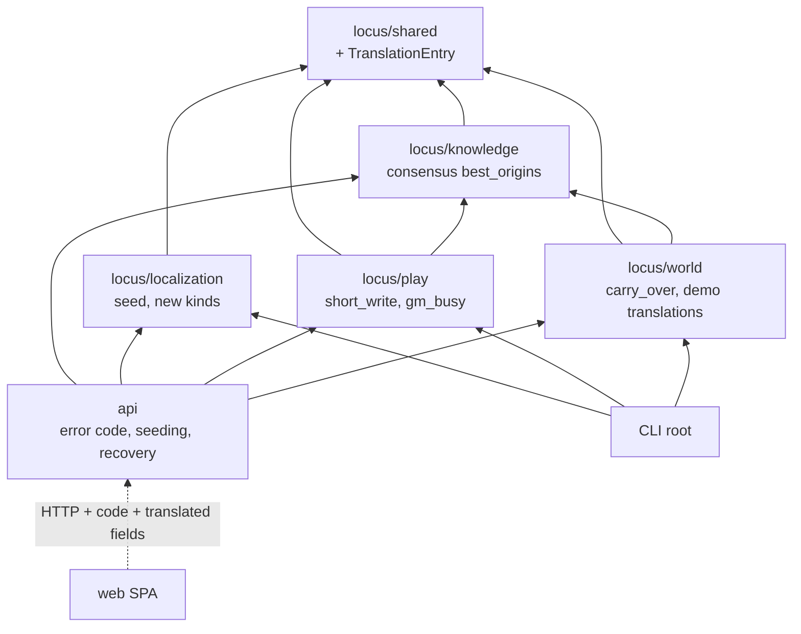
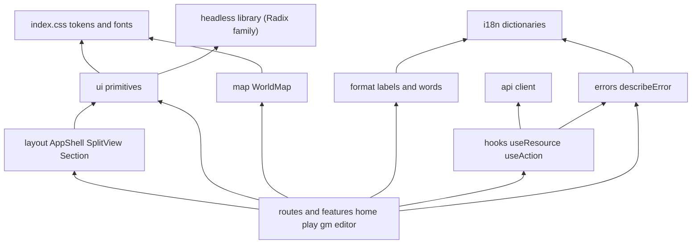

# Follow-up Cycle — Component Dependencies

> 의존 관계와 통신 방식이다. **경계 규칙은 바뀌지 않는다**(`tests/test_boundaries.py`).
> - `shared ← knowledge ← {world, play}`
> - `localization → shared`만
> - `locus/**`는 `api`를 import하지 않는다
> - play는 localization과 world를 import하지 않는다

## 1. 백엔드 의존 행렬 (이번 주기에 새로 생기는 화살표)

| From \ To | shared | knowledge | world | play | localization | api |
|---|---|---|---|---|---|---|
| **shared** | ✓ | – | – | – | – | – |
| **knowledge** | ✓ | ✓ | – | – | – | – |
| **world** | ✓ (+`TranslationEntry`) | ✓ | ✓ (+`carry_over`) | – | – | – |
| **play** | ✓ | ✓ | – | ✓ (+`short_write`, `GmBusyError`) | – | – |
| **localization** | ✓ (+`TranslationEntry`) | – | – | – | ✓ (+`seed`) | – |
| **api** (합성 루트) | ✓ | ✓ | ✓ (+`DemoWorlds.translations`, `remapped_id`) | ✓ (+`recover_interrupted`, `gm_busy`) | ✓ (+`seed`, 새 종류) | ✓ (+오류 `code`) |
| **CLI** (합성 루트) | ✓ | ✓ | ✓ | ✓ | ✓ (지금은 스키마만, +시딩) | – |

- **새로 생기는 경계 사이 화살표는 없다.** CLI는 이미 localization을 import한다(`init-schema --localization`). 이번에는 같은 경계에서 `seed`를 더 쓸 뿐이다. CLI는 합성 루트라서 경계 테스트가 허용한다(`__main__` 면제).
- `TranslationEntry`를 shared에 두는 까닭이 있다. world는 데모 번역 파일을 **읽고**, localization은 그것을 **캐시에 넣는다**. 두 경계는 서로 import할 수 없으므로 공통 모델이 바닥에 있어야 한다.
- world와 localization을 잇는 것은 api(그리고 CLI)다. 경계 행렬은 그대로다.

텍스트 대안:
- 백엔드 화살표는 지난 주기와 같다. CLI → localization은 이미 있고(스키마), 이번에는 시딩을 더 쓴다.
- 웹은 HTTP로만 api에 닿는다. 오류 `code`와 새 번역 칸이 계약에 더해진다.

## 2. 웹 내부 의존 (V2가 세우는 층)

텍스트 대안:
- 화면 → (배치 틀, 프리미티브, 지도, 표기 규칙, 요청 도우미, 오류 문장).
- 프리미티브 → (토큰, headless 라이브러리).
- 표기 규칙·오류 문장 → 사전.
- 요청 도우미 → (API 클라이언트, 오류 문장).
- **규칙**: 화면은 원색 값, 원문 enum, `String(e)`를 직접 쓰지 않는다. 각각 토큰, 표기 규칙, 오류 문장을 거친다. V2 코드 리뷰와 B&T 체크리스트가 이 규칙을 확인한다(R-1: 자동 게이트 없음).

## 3. 통신 방식

| 경로 | 방식 | 이번 주기의 변화 |
|---|---|---|
| web → api | REST JSON, fetch | 오류 응답에 `code`, 번역 칸 추가, 요청 취소(AbortController) |
| api → 경계 | 함수 호출(DI 컨테이너) | 데모 시딩, 복구 호출 |
| play 안 GM 쓰기 ↔ 턴 | 프로세스 안 잠금(`TurnGuard`) | 짧은 쓰기 잠금 추가, 상태 구별 |
| localization → PostgreSQL | SQLAlchemy | `source_kind` 값 추가(테이블 변경 없음) |
| world → Neo4j | Cypher | 라벨 있는 읽기·삭제, WorldMeta 마지막 저장 |

## 4. 유닛 사이 계약 (Units Generation 입력)

| 내는 유닛 | 받는 유닛 | 계약 |
|---|---|---|
| V2 디자인 시스템 | V4·V6·V8 화면 | `ui/`·`layout/`·`map/`·`format/`·`errors/`·`hooks/`의 공개 API(§ component-methods 1). V8을 넘겨도 에디터는 V2의 공유 프리미티브·표기·상태 처리를 입는다(R-01 정리) |
| V2 (api 오류 계약) | V4·V5·V6 | 오류 응답 `{"detail", "code"}`와 코드 목록. 코드 목록은 V2에서 정하고, V5가 `gm_busy` 등을 더한다 |
| V3 한국어 백엔드 | V4 홈·플레이(V6·V8도 씀) | 번역 칸(`region_name_ko`, `npcs[].name_ko`, `title_ko`…), 데모 카드 `title_ko`·`description_ko`·`credits_ko` |
| V5 GM 정확성 | V6 GM 화면, V4 플레이 | `RegionView.gm_busy`, 409 `gm_busy`·`turn_running` 코드, 세션 닫기 동작 |
| V7 월드 정확성 | V8 에디터 | 보강 `needs`(대상 종류별), 빌드 리포트의 이어 붙이기 수와 경고 |
| V1 CI | 모든 유닛 | 새 액션 버전·러너에서 네 잡이 녹색 |
| V9 부채·문서 | — | 마지막. 모든 유닛의 결과를 문서에 반영한다 |
