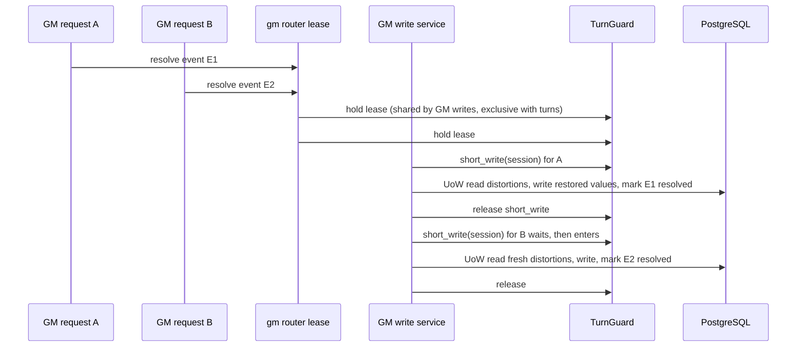
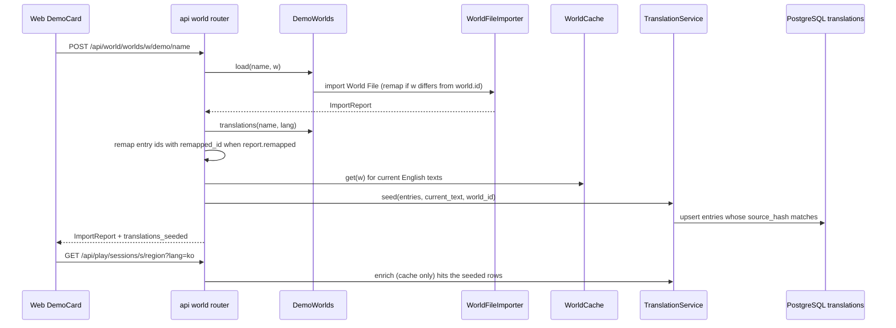
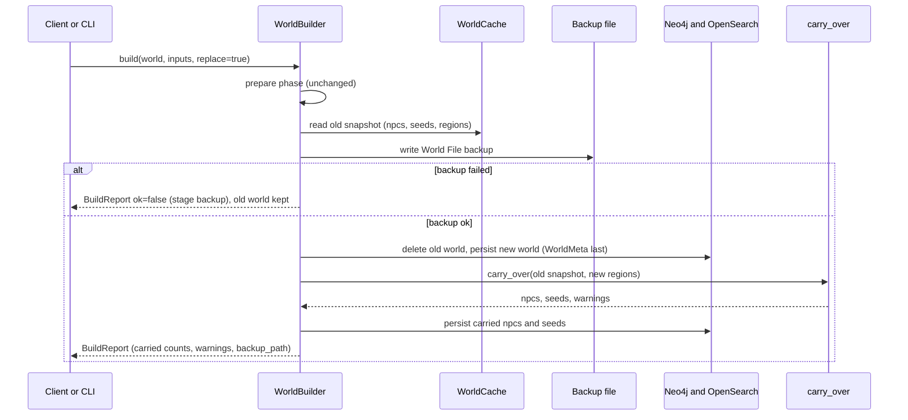
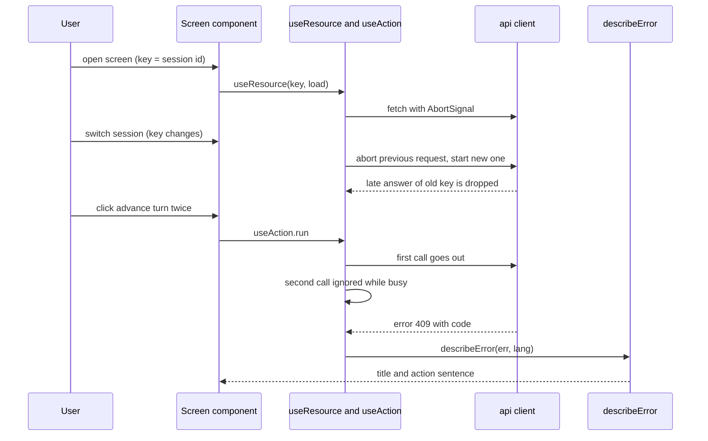

# Follow-up Cycle — Services

> 서비스의 책임과, 이번 주기에 바뀌는 흐름이다. 지금 흐름(턴, 대화, 빌드)은 `inception/reverse-engineering/architecture.md` Data Flow가 설명하고, 여기서는 **바뀌는 부분만** 적는다.

---

## S1. GM 짧은 쓰기 (V5, FR-C1·C2, Q1=A)

**책임**
- GM 쓰기의 **읽고-쓰는 구간**을 세션마다 하나씩 줄 세운다.
- 그 구간 안에서 세션이 열려 있는지 다시 확인한다.

**참여**
- 라우터 `_idle`: GM 리스로, 지금처럼 함께 쥔다.
- `TurnGuard.short_write`(새).
- GM 쓰기 서비스: 사건, 씨앗, 소문, 행적, 왜곡도.
- `SessionService.close_session`.

텍스트 대안:
1. 두 GM 요청은 지금처럼 리스를 함께 쥔다. 턴과는 여전히 배타다.
2. 각 서비스가 읽고-쓰는 구간에 들어갈 때 `short_write(session)`를 쥔다. B는 A가 끝날 때까지 짧게 기다린다. 타임아웃이 지나면 409 `gm_busy`다.
3. B는 A가 쓴 **새 값**을 읽고 쓴다. 그래서 두 복원이 모두 반영된다(#9). 씨앗 시작도 "진행 중인가" 확인과 생성이 한 구간 안에 있어, 두 번째 시작은 409가 된다(#12). 지지도 조정도 그 사이 바뀐 `active`를 읽어 되살리지 않는다(RE-P01).
4. LLM을 부르는 쓰기(소문 생성·재생성, 사건 제안)는 LLM 호출을 잠금 밖에서 한다. **저장 구간만** 잠금 안에 둔다. 그래서 일괄 생성 다섯 개가 동시에 LLM을 부르고, 저장만 차례로 한다.
5. 세션 닫기와 월드 교체의 닫기도 `short_write` 안에서 상태를 바꾼다. 그 뒤 들어오는 저장 구간은 "세션 닫힘"을 보고 쓰지 않는다(RE-P02).

**세부 규칙은 V5 FD에서 정한다**: 타임아웃 값, 각 서비스의 구간 경계, 절대값 쓰기를 증분으로 바꿀지, 승인의 상태 조건 쓰기.

## S2. 플레이어에게 보이는 바쁨 상태 (V5·V4, FR-C5, Q2=A)

**책임**: 턴 진행과 GM 작업을 구별해 보인다.

- `PlayService.current_region`이 `RegionView.turn_running = guard.turn_running(s)`, `gm_busy = guard.gm_busy(s)`를 채운다.
- 플레이어가 행동했는데 GM 리스가 있으면 `GmBusyError`가 난다. 응답은 409에 `code: "gm_busy"`이고, 문장에 내부값이 없다.
- 플레이 화면은 두 상태 모두에서 행동 버튼을 잠근다. 문장은 다르다("세계가 움직이는 중…" / "GM이 세계를 손보는 중…"). `gm_busy`이면 짧은 간격으로 다시 읽는다(상한 있음).

## S3. 데모 불러오기 + 한국어판 시딩 (V3, FR-L2·L3, Q4=A)

**책임**: 키 없이 불러온 데모를 처음부터 표시 언어로 보이게 한다.

**참여**: `DemoWorlds`(world), `WorldFileImporter`(world), `TranslationService.seed`(localization), 라우터 `world.py`(api, 두 경계를 잇는 곳), CLI `world demo`.

텍스트 대안:
1. 데모를 불러오는 것은 지금과 같다(LLM 없음).
2. 라우터가 데모의 번역 항목을 받는다. 월드 id가 파일 id와 다르면 `remapped_id`로 항목 id를 옮긴다.
3. 캐시에서 지금 영어 원문을 꺼낸다. 시딩은 원문 해시가 맞는 항목만 캐시에 넣는다(낡은 번역은 버린다).
4. 이후 읽기는 지금처럼 캐시 전용이다. 시딩된 항목은 바로 hit이라 키 없이도 한국어다.
5. 홈 데모 카드는 매니페스트의 언어별 문구(`i18n.ko`)에서 바로 고른다. 번역 캐시와 무관하다.
6. CLI `world demo`는 PostgreSQL에 닿고 번역이 켜져 있을 때 같은 시딩을 한다.

**번역 종류 확장(FR-L2)**: `region`(name, description), `npc`(name, role, description), `event_seed`(title, description), `world`(name, description).
- 키가 있으면 지금처럼 백그라운드 warm으로 채운다. 데모 밖 월드도 한국어가 된다.
- 지우는 때는 셋이다: 월드 교체(월드 범위 전체), 에디터의 지역·NPC 삭제(id 범위), 편집으로 원문이 바뀜(해시가 어긋나 자동으로 쓰이지 않음).

## S4. 다시 빌드 — 옛 NPC·씨앗 이어 붙이기 (V7, FR-C8·C9, Q3=A)

**책임**: 교체 빌드가 제작자의 손작업(NPC·씨앗)을 잃지 않게 한다. 백업이 실패하면 교체하지 않는다.

텍스트 대안:
1. 준비 단계는 그대로다.
2. 커밋 전에 옛 스냅샷에서 NPC·씨앗·지역을 읽어 둔다.
3. 백업에 실패하면 여기서 멈춘다. 옛 월드를 그대로 두고 `ok=false`로 보고한다.
4. 백업이 되면 지금처럼 교체한다. `WorldMeta`는 마지막에 쓴다(FR-C7).
5. `carry_over`가 옛 NPC의 집 지역과 옛 씨앗의 지역을 (이름, 단계)로 새 지역에 맞춘다. 못 맞춘 것은 경고로 보고하고 붙이지 않는다(백업에는 남는다).
6. 리포트에 이어 붙인 수와 경고가 실린다. README는 "빌드는 지역·연결·지식을 만들고, NPC는 에디터에서 더하며, 다시 빌드해도 남는다"로 고친다.

## S5. 재시작 때 끊긴 턴 run 복구 (V5, FR-C3)

**책임**: 프로세스가 죽어 끊긴 run도 실패한 run과 같게 보상한다.

- `api/main.py` lifespan이 시작할 때 `TurnAdvancer.recover_interrupted()`를 부른다.
- `running` run마다 `_fail`과 같은 보상을 한다:
  - 넘어간 턴만큼만 청구를 남기고 나머지는 환불한다.
  - 0턴이면 이동을 되돌리고 그 run의 행적·판단을 지운다.
  - `turn_run_failed`를 기록한다(error `interrupted`).
- 실패 보상과 재시작 보상이 같은 함수 하나를 쓴다. 지금은 따로라서 RE-P03이 생겼다.

## S6. 지운 지역의 사건 (V5, FR-C4)

**책임**: 월드에서 지운 지역을 대상으로 하는 활성 사건이 왜곡도를 계속 쓰지 않게 한다.
- 턴 계산(`_compute_events`)에서 대상 지역이 스냅샷에 없는 사건은 적용하지 않는다.
- 해소로 바꿀지, 건너뛰고 GM에게 보일지는 V5 FD에서 정한다.

## S7. 합의 출처 고르기 (V7, FR-C6)

**책임**: 한 지역의 지식 보기가 엣지·출처 순서와 무관하게 같게 나오게 한다.
- 순수 함수 `best_origins`가 지식마다 경로 가중이 가장 큰 출처를 고른다. 동률이면 지역 id 순으로 고정한다.
- `compute_consensus`가 그 결과로 propagated와 hearsay를 나눈다.
- 속성 테스트: 연결 순서를 섞어도 결과가 같다. 고른 출처의 가중이 최대다(PBT-03).

## S8. 화면의 요청 흐름 (V2가 만들고 V4·V6·V8이 씀, FR-C13·FR-D9·FR-S5)

**책임**
- 늦은 답을 버린다.
- 진행 중인 쓰기를 다시 실행하지 않는다.
- 오류를 사용자 문장으로 보인다.
- 로딩·빈 상태·오류를 같은 모양으로 보인다.

텍스트 대안:
1. 읽기는 `useResource(key, load)`로 한다. 키(세션 id 등)가 바뀌거나 언마운트되면 앞 요청을 abort하고, 늦은 답은 버린다. #14 꼴과 RE-F07·F11·F14를 막는다.
2. 쓰기는 `useAction`으로 한다. 진행 중에 다시 누르면 아무것도 하지 않고, 버튼은 `busy`로 꺼진다(RE-F02, #12의 웹 쪽).
3. 오류는 `describeError`가 `code`로 사전 문장을 고른다. 모르는 코드는 상태 코드별 일반 문장이 된다.
4. 화면은 `StatusView`로 로딩·빈 상태·오류를 보인다(FR-S5).

## S9. 서비스 책임 요약 (바뀌는 것만)

| 서비스 | 바뀌는 책임 | 유닛 |
|---|---|---|
| `TurnGuard` | 짧은 쓰기 잠금, 턴과 GM 상태 구별 | V5 |
| `EventService`, `SeedService`, `RumorService`, `DeedService`, `DistortionService` | 읽고-쓰는 구간을 잠금 안으로, 그 안에서 열림 재확인 | V5 |
| `SessionService` | 닫기를 잠금 안에서 | V5 |
| `TurnAdvancer` | 끊긴 run 복구, 지운 지역의 사건 | V5 |
| `PlayService` | `gm_busy` 칸 | V5 |
| `TranslationService` | 새 번역 종류, `seed` | V3 |
| `DemoWorlds` | 카드 문구 i18n, 번역 파일, 검사 강화 | V3 |
| `WorldBuilder`, `WorldFileImporter` | 백업 실패 시 멈춤, 이어 붙이기(빌드), 중복 id 거절(불러오기) | V7 |
| `consensus`, `WorldCache`, `persist_graph` | 최선 출처, 버전 순서 | V7 |
| `AugmentationService`(questions) | 대상 종류별 `needs`, 빈 변경 기록 안 함 | V7 |
| api `errors`·`schemas`·`world` 라우터·lifespan | `code`, 번역 칸, 시딩, 복구 호출 | V2(오류 계약)·V3·V5 |
