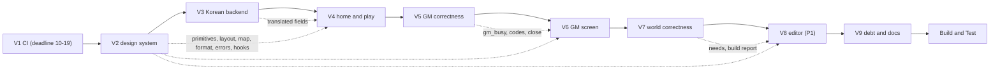

# Follow-up Cycle — Unit Dependencies

> 유닛 사이 의존, 실행 순서, 계약, 사람이 기다리게 하는 지점이다. 근거: `unit-of-work.md`, `component-dependency.md` § 4.

## 1. 의존 행렬

행이 열에 기댄다(✓ = 앞 유닛의 결과가 필요, ◦ = 있으면 쓰지만 없어도 동작).

| 유닛 \ 기대는 곳 | V1 | V2 | V3 | V4 | V5 | V6 | V7 | V8 | V9 |
|---|---|---|---|---|---|---|---|---|---|
| **V1** CI | – | | | | | | | | |
| **V2** 디자인 시스템 | | – | | | | | | | |
| **V3** 한국어 백엔드 | | ◦ (오류 `code`) | – | | | | | | |
| **V4** 홈·플레이 | | ✓ | ✓ | – | ◦ (`gm_busy`) | | | | |
| **V5** GM 정확성 | | ✓ (오류 `code` 목록) | | | – | | | | |
| **V6** GM 화면 | | ✓ | ✓ | | ✓ | – | | | |
| **V7** 월드 정확성 | | | | | | | – | | |
| **V8** 에디터 | | ✓ | ✓ | | | | ✓ (`needs`, 빌드 리포트) | – | |
| **V9** 부채·문서 | ✓ (ci.yml) | ✓ | ✓ | ✓ | ✓ | ✓ | ✓ | ◦ | – |

- **순환 없음.** 모든 화살표가 앞 순서를 가리킨다.
- **V4 → V5(◦)**: 플레이 화면은 `gm_busy`를 표시해야 하는데, 그 칸은 V5가 더한다.
  - V4는 칸이 없으면 false로 다루고, 가짜 응답으로 표시를 테스트한다.
  - V5의 완료 조건에 "플레이 화면이 실제 `gm_busy`로 바뀐다"를 넣는다.
  - 이렇게 하면 화면 순서(Q3=A: 홈·플레이 먼저)를 바꾸지 않아도 된다.
- **V7은 독립이다**(백엔드만). V5 다음에 두는 것은 순서상의 선택이다. V8이 V7의 결과(`needs`, 빌드 리포트 칸)를 쓴다.

## 2. 실행 순서와 크리티컬 패스

텍스트 대안:
- **순서**: V1 → V2 → V3 → V4 → V5 → V6 → V7 → V8 → V9 → Build and Test(한 유닛씩).
- **크리티컬 패스**: V2(디자인 시스템) → V4 → V6 → V8. 화면 유닛 셋이 모두 V2에 기댄다. V2의 시안 고르기가 가장 긴 사람 대기다.
- **시한**: V1은 2026-10-19 전에 병합까지 끝나야 한다. V1은 작아서(설정 파일 하나) 주기 첫날에 PR을 낸다.
- **넘길 수 있는 것**: V8(P1). 넘기면 V9가 그 사실을 `next-cycle.md`에 적는다.

## 3. 유닛 사이 계약

| 내는 유닛 | 받는 유닛 | 계약 | 깨지면 |
|---|---|---|---|
| V2 | V4·V6·V8 | `ui/`·`layout/`·`map/`·`format/`·`errors/`·`hooks/`의 공개 API(설계 component-methods § 1). 받는 유닛은 원색 값·원문 enum·`String(e)`를 쓰지 않는다 | 화면마다 복사 패턴이 다시 생긴다(UX-11) |
| V2 | V3·V5 | 오류 응답 `{"detail", "code"}`. V2가 코드 목록의 틀과 기존 코드를 정하고, V3·V5가 새 코드를 더한다 | 화면이 오류 문장을 고르지 못한다 |
| V3 | V4·V6·V8 | 번역 칸: `region_name_ko`, `description_ko`, `npcs[].{name,role,description}_ko`, 씨앗 `title_ko`·`description_ko`, 월드 `name_ko`·`description_ko`, 데모 카드 `title_ko`·`description_ko`·`credits_ko` | 한국어 화면에 영어 본문이 남는다 |
| V5 | V4·V6 | `RegionView.gm_busy`, 409 `turn_running`/`gm_busy` 코드, 세션 닫기와 GM 쓰기의 순서 | 플레이어가 기다리는 까닭을 모르거나, 닫힌 세션에 쓰기가 남는다 |
| V7 | V8 | 보강 `needs`(대상 종류별), 빌드 리포트의 이어 붙이기 수와 경고 | 에디터 카드에 맞지 않는 칸이 나온다 |
| V1 | 모든 유닛 | 새 액션·러너에서 CI GREEN | 유닛 PR이 CI에서 깨진다 |

## 4. 같은 파일을 여러 유닛이 고치는 곳 (조정)

| 파일 | 유닛 | 조정 |
|---|---|---|
| `web/src/i18n/*`(사전) | V2·V4·V6·V8·V9 | 키를 더하기만 한다. 지우는 것은 V9에서 한 번에 한다. 키 일치 테스트가 매 유닛을 지킨다 |
| `api/errors.py`, `api/main.py` | V2(틀)·V5(새 오류) | V2가 `ERROR_CODES` 표를 만들고, V5는 그 표에 줄을 더한다 |
| `api/schemas.py` | V3(번역 칸)·V5(`gm_busy`) | 서로 다른 모델을 고친다 |
| `api/routers/world.py` | V3(시딩·purge)·V5(교체 점검의 뜻) | V5는 점검 한 곳만 고친다 |
| `locus/world/demo/*` | V3 | FR-C11을 V7에서 V3로 옮겨 한 유닛만 고친다(설계 결정) |
| 지도 `web/src/map/*` | V2(바탕)·V4·V6·V8(변형) | 변형은 props와 모드로만 더한다. 바탕 컴포넌트를 화면별로 복사하지 않는다 |
| `.github/workflows/ci.yml` | V1·V9 | V1은 액션·러너, V9는 mypy 단계만 |
| `README.md` | V7(빌드·NPC 문장)·V9(나머지) | V7은 그 문장 하나만 고친다 |

## 5. 사람이 기다리게 하는 지점

| 유닛 | 지점 | 무엇을 보시는가 |
|---|---|---|
| V1 | 코드 뒤 | 푸시·PR·병합(시한 10-19) |
| V2 | FD | HTML 시안 2~3안에서 고르기(비공개 Artifact) |
| V2 | 코드 뒤 | 기존 네 화면에 새 프리미티브를 입힌 캡처 |
| V4·V6·V8 | FD | 화면 배치안 승인 |
| V4·V6·V8 | 코드 뒤 | 1280·390px 캡처(가짜 API, 비공개 Artifact) |
| V5·V7 | FD | 규칙 승인 |
| 모든 유닛 | FD·NFR·코드 계획·코드 승인 | AI-DLC 승인 지점 |
| Build and Test | — | 실제 스택 화면 체크리스트, compose 기동 허락, 라이브 시나리오(키) |
