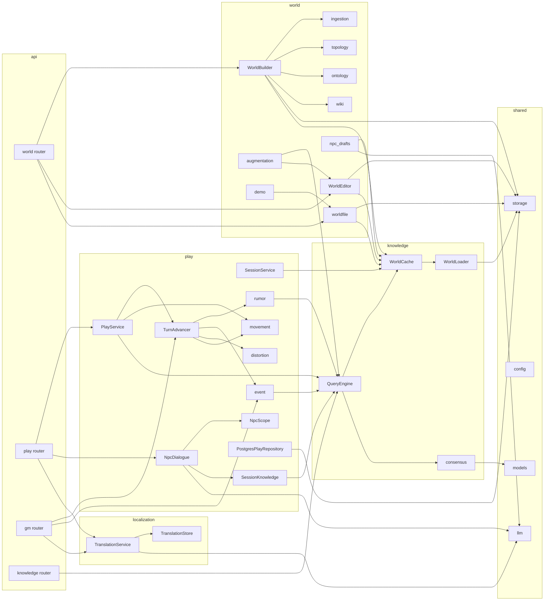
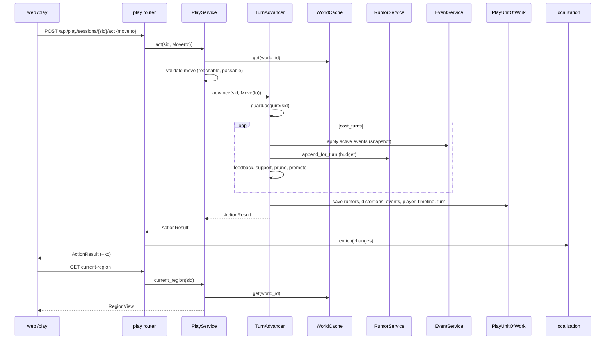

# Component Dependency — Purpose Restructure (2026-09-29)

## 1. 경계 의존 행렬 (허용 방향만 ●)

| import 하는 쪽 ↓ / 되는 쪽 → | shared | knowledge | world | play | localization | api |
|---|---|---|---|---|---|---|
| **shared** | – | ✗ | ✗ | ✗ | ✗ | ✗ |
| **knowledge** | ● | – | ✗ | ✗ | ✗ | ✗ |
| **world** | ● | ● | – | ✗ | ✗ | ✗ |
| **play** | ● | ● | ✗ | – | ✗ | ✗ |
| **localization** | ● | ✗ | ✗ | ✗ | – | ✗ |
| **api** | ● | ● | ● | ● | ● | – |

- 이 행렬은 `tests/test_boundaries.py`가 AST로 검사한다(US-7.2). `world ↔ play`는 서로 모른다. play가 캐노니컬에서 필요한 것은 전부 `knowledge`(스냅샷·합의·질의)로 얻는다.
- `web`은 `api` 계약(OpenAPI)만 본다.

## 2. 컴포넌트 수준 주요 의존



텍스트 대안:
- knowledge: `QueryEngine` → `WorldCache` → `WorldLoader` → storage; `QueryEngine` → consensus.
- world: `WorldBuilder`가 수집·토폴로지·온톨로지·wiki·storage·캐시를 쓴다. `WorldEditor`·`worldfile`은 storage와 캐시를, `augmentation`은 `QueryEngine`과 `WorldEditor`를, `demo`는 `worldfile`을, `npc_drafts`는 캐시와 LLM을 쓴다.
- play: `PlayService` → `TurnAdvancer`·movement·`QueryEngine`; `TurnAdvancer` → rumor·event·distortion·movement; rumor·event → `QueryEngine`; `NpcDialogue` → `NpcScope`·`SessionKnowledge`·LLM; `SessionKnowledge` → `QueryEngine`; 저장소 어댑터 → storage(sql).
- localization: `TranslationService` → `TranslationStore`·LLM.
- api: world 라우터 → builder·editor·worldfile; play 라우터 → PlayService·NpcDialogue·번역; gm 라우터 → TurnAdvancer·EventService·번역; knowledge 라우터 → QueryEngine.

## 3. 통신 패턴
- **동기, in-process 호출**. 서비스 사이에 이벤트 버스·큐는 두지 않는다(데모 규모).
- **DI는 생성자 주입 + 경계 컨테이너**. 라우터는 `Depends(get_<boundary>)`로 컨테이너를 받는다. 문자열 `app.state` 조회 없음.
- **포트로만 외부 I/O**: Neo4j·OpenSearch·PostgreSQL·OpenAI는 각각 `GraphRepository`·`SearchRepository`·play/localization Store·`LLMProvider` 뒤에 있다. 오프라인 테스트는 인메모리 어댑터와 fake LLM으로 돈다(play는 계약 테스트를 PG(SQLite)와 인메모리 둘 다에 돌린다).
- **캐시 무효화는 명시 호출**. world의 쓰기 서비스가 `WorldCache.invalidate`를 부른다. play는 무효화를 부르지 않는다(읽기만).
- **번역은 API 계층에서만**. 도메인 응답에 `_ko`를 입히는 것은 라우터 + `api/schemas`의 일이다.
- **LLM 호출은 트랜잭션 밖**. 결과를 모은 뒤 UoW 하나로 저장한다.

## 4. 데이터 흐름

### 4.1 월드 구성 → 플레이 (읽기 경로)
```
World File / 자료 ──(world: build·import)──▶ Neo4j(+OpenSearch) ──(knowledge: loader)──▶ WorldSnapshot ──(cache)──▶ play(PlayService·Turn·NPC)
                                                       ▲                                        │
                                                       └──── world: editor 쓰기 → invalidate ◀──┘
```

### 4.2 플레이어 행동 시퀀스



텍스트 대안: UI가 행동을 보내면 라우터 → PlayService가 스냅샷으로 검증 → TurnAdvancer가 가드를 잡고 비용만큼 턴을 돌리며(사건 적용, 소문 추가(예산), 되먹임·지지도·가지치기·승격) → UoW 하나로 저장 → ActionResult → 라우터가 번역을 입혀 응답 → UI는 현재 지역을 다시 읽는다(캐시라 즉시).

### 4.3 NPC 대화 시퀀스 (텍스트)
UI `say` → play 라우터 → `NpcDialogueService.say` → 위치 확인(스냅샷) → `SessionKnowledgeService.for_region`(캐노니컬 known + 활성 소문) → `NpcScope.build_context`(순수) → 프롬프트 → LLM 1회 → 메시지 2건 저장(UoW) → `NpcReply` → UI. 번역 없음.

### 4.4 사건 제안 (텍스트)
gm 라우터(`n ≤ 5`) → `EventService.suggest` → `QueryEngine.region_briefs`(캐시) + 최근 사건 → `EventSuggester`(LLM) → 지역 이름을 id로 해석 → SUGGESTED 저장 + 타임라인 → 응답(+ko).

## 5. 역방향 의존·부채 해소 매핑 (RE §D → 새 위치)

| RE 부채 | 새 설계 |
|---|---|
| `config → session` import | S2 `PlayTuning`은 shared의 dataclass. play가 shared를 읽는다(방향 정상). |
| `SourceKind.SESSION_*`, `KnowledgeView.*_ko` | S1: 경계 중립 `SourceKind`; `_ko`는 `api/schemas`로. |
| `init-schema`가 PG까지 생성 | 경계별 `SchemaInitializer`(shared canonical / play / localization) + CLI 플래그. |
| `canonical_known`이 세션 전용 | K5 `region_known` 일반 API. |
| 조립 루트 하나, `app.state` 문자열 | 경계별 `assemble_*` + 컨테이너 + `Depends`. |
| 번역이 세션 도메인·저장소에 있음 | localization 경계, 자체 `TranslationStore`. |
| 비대한 `SessionRepository` | P2 관심사별 7포트 + `PlayUnitOfWork`, 어댑터 하나. |
| `GameMasterService` 파사드 | 제거. `TurnAdvancer.advance(action)`이 진입점. |
| 캐노니컬 읽는 경로 둘(`find_nodes` vs `WorldLoader`) + 지역 확인 4곳 중복 | `WorldCache.get` 하나. |
| 용어 충돌 rumor / distortion_degree / session | hearsay / path_decay / AugmentationRun (`application-design.md` §5). |
| 조정값 분산 | S2 `*Tuning` dataclass, `Settings`에서 채움. |
| `orchestrator`가 wiki를 직접 생성·`hasattr` | W6 생성자 주입 + 빌드마다 새 빌더 인스턴스. |
| 쓰기만 하는 엣지(`RELATED_TO` 등) | K3가 `RELATED_TO`·`LIVES_IN` 재독; 나머지는 FD에서 유지·제거 결정. |
| 헬퍼 중복(정규화 6, clamp 5) | `shared/models/util.py`(`clamp01`), `world/ingestion/mapping.normalize_name` 하나. |
| `SessionPanel` god component | F4 GM 패널 5개로 분할, F3 플레이 화면 별도. |

## 6. 변경 (2026-09-29): 행적·판단·전파 의존

- 경계 행렬(§1)은 변하지 않는다. 새 컴포넌트는 모두 play 안에 있다.
- 컴포넌트 추가 의존: `P6 PlayService → P16 DeedService, P17 GmNarrator, P13 NpcDialogueService(appraise)` · `P7 TurnAdvancer → P16(seeds_for_turn), P19 plan_spread, P8(seed_from_appraisal, spread)` · `P13 → P16(pending deeds 읽기는 P6이 넘김)` · `P9 EventSuggester → P16(최근 행적)` · `P19 → K2 best_path_weights` · `A7 gm router → P16`.
- 데이터 흐름(텍스트): `Declare` → GmNarrator(LLM) → Deed(declared_action) / `Move` → Deed(arrival) / `EndTalk` → Deed(statement) + NpcDialogueService.appraise(LLM) → DeedAppraisal → [턴] seeds_for_turn → RumorService.seed(LLM) → SessionRumor(origin=deed, 지역 = NPC 지역) → [턴] plan_spread(순수) → RumorService.spread(LLM/대상) → 이웃 지역 SessionRumor(더 왜곡) → NpcScope → 먼 지역 NPC가 전언으로 말함.
- 부채 매핑 추가: "세션 소문이 지역에 갇힘(RE C11 관련)" → P19 전파 단계로 세션 기원 내용이 토폴로지를 따라 흐른다. 캐노니컬 기원은 여전히 hearsay가 담당(중복 없음).
