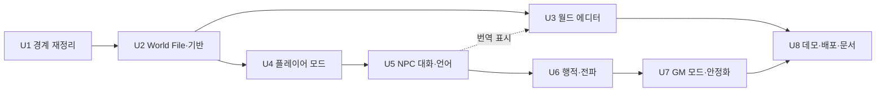

# Unit of Work Dependency — Purpose Restructure (2026-09-29)

## 1. 의존 행렬 (행 = 유닛, 열 = 선행 유닛; ● 필수 선행, ○ 있으면 좋음)

| 유닛 ↓ / 선행 → | U1 | U2 | U3 | U4 | U5 | U6 | U7 |
|---|---|---|---|---|---|---|---|
| **U1 경계 재정리** | – | | | | | | |
| **U2 World File·기반** | ● | – | | | | | |
| **U3 월드 에디터** | ● | ● | – | | ○(번역 표시 재사용) | | |
| **U4 플레이어 모드** | ● | ● | | – | | | |
| **U5 NPC 대화·언어** | ● | ● | | ● | – | | |
| **U6 행적·전파** | ● | ● | | ● | ● | – | |
| **U7 GM 모드·안정화** | ● | ● | | ● | ○ | ● | – |
| **U8 데모·배포·문서** | ● | ● | ● | ● | ● | ● | ● |

- **U3와 U4~U7은 서로 독립**이다. 에디터 없이 플레이를 만들 수 있고(개발용 월드는 U2의 Aldermoor World File), 플레이 없이 에디터를 만들 수 있다.
- **U7이 U6에 기대는 이유**: GM 화면의 `DeedPanel`·`WorldStateOverlay`(행적 소문 도달 표시)·사건 제안 컨텍스트(행적)가 U6 산출물을 쓴다.
- **U8이 전부에 기대는 이유**: 데모 콘텐츠는 NPC·사건·행적을 포함하고(U2·U6·U7), 에디터로 저작하며(U3), 라이브 시나리오가 전 흐름을 돈다.

## 2. 의존 그림

텍스트 대안: U1 → U2 → (U3 | U4 → U5 → U6 → U7) → U8. U3는 U5의 번역 표시를 재사용하면 좋다(필수 아님).

## 3. 실행 순서 (UOW-R2 = A, 플레이 먼저)

| 순서 | 유닛 | 왜 이 자리인가 | 끝났을 때 |
|---|---|---|---|
| 1 | U1 | 모든 것의 자리. 의미 불변이라 회귀로 검증 | 305 GREEN + boundaries, 앱 기동 |
| 2 | U2 | 플레이·에디터가 함께 딛는 기반(NPC, 파일, 캐시, 결함) | World File 왕복 PBT, 데모 로드 LLM 0회 |
| 3 | U4 | 시간 진행의 진입점과 플레이어 | 이동 PBT, 상한·가드 |
| 4 | U5 | NPC가 말한다 → **US-6.1 동작** | 아는 범위 PBT |
| 5 | U6 | 행적이 퍼진다 → **US-6.5 동작** (핵심, 약 60% 지점) | 전파 PBT |
| 6 | U7 | GM 화면·안정화로 플레이 축 마무리 | E2 시나리오 |
| 7 | U3 | 에디터 — 데모 콘텐츠 저작 도구 | E2 스토리 8개 |
| 8 | U8 | 데모·배포·문서 → Build&Test | 통합 GREEN + 라이브 시나리오 |

- **시간이 모자랄 때 남는 것**: 5까지 끝나면 "에디터 없이 데모 월드 + 플레이 + 행적 소문"이 돌아간다. 이것만으로 목적 문장을 보여 줄 수 있다. 그 경우 U8의 README·Docker만 앞당겨 마무리한다.

## 4. 조정 지점 (Coordination Points)
- **API 계약 동결**: U1이 접두어·DTO 이름을 정하면 U4~U7·U3는 그 위에 엔드포인트를 더한다. 기존 엔드포인트 의미는 U1에서 바뀌지 않는다.
- **World File v1 스키마(U2)**: U3(편집 결과 저장), U6(행적은 파일에 넣지 않음 — 세션 레이어), U8(데모 콘텐츠)이 공유. 스키마 변경은 `format_version`을 올린다.
- **`WorldSnapshot`·`WorldCache`(U2)**: U4~U7이 읽기 전용으로 쓴다. 무효화는 U3(편집)·U2(빌드·import)만 호출한다.
- **`TurnAdvancer.advance(action)`(U4)**: U6이 턴 루프에 두 단계를 더한다. U4는 단계 훅 자리를 비워 둔다(순서: 사건 → 캐노니컬 소문 → [행적 씨앗] → [전파] → 되먹임 → 지지도 → 가지치기 → 승격 → 저장).
- **`LlmBudget`(U4)**: U5 대화·U6 판단/서술/전파·U7 제안이 같은 예산 객체를 받는다.
- **`enrich` 반환 매핑(U1·U5)**: 라우터만 호출한다. 도메인 코드는 번역을 모른다.
- **PlayTuning(S2)**: U4가 이동·상한, U6이 전파·판단, U7이 나머지를 채운다. 키 이름은 설계 `component-methods.md`대로.

## 5. 테스트 체크포인트

| 유닛 | 회귀 | 새 PBT (blocking) | 예시 테스트 | 라이브(운영자) |
|---|---|---|---|---|
| U1 | 305 전부 | – | `test_boundaries`, 포트 계약(PG-SQLite·인메모리) | 앱 기동 |
| U2 | 전부 | World File 왕복(02), 병합 보존(03) | A1·A2·A3·A7·A11 회귀 예시 | 데모 로드 |
| U4 | 전부 | 이동 단조성(03), 소문·예산 상한(03) | 동시 턴 409, 4턴 폭주 재현 → 상한 이내 | 세션·이동 |
| U5 | 전부 | 아는 범위(03) | 범위 밖 질문 → 모른다 | US-6.1 |
| U6 | 전부 | 전파 불변식(03) | 판단 없음 → 소문 없음, 취소 → 비활성화 | US-6.5 |
| U7 | 전부 | (advisory) | E2·E4·E5·E6 예시 | GM 흐름 |
| U3 | 전부 | (advisory) | 보강 답 적용·되돌리기, cascade | 에디터 흐름 |
| U8 | 전부 + 통합 | seed 로깅(08) | – | 전체 라이브 시나리오 |

## 6. 되돌리기 (Rollback)
- 유닛마다 커밋. 실패한 유닛은 그 커밋만 되돌린다.
- U1은 의미 불변이라 되돌리기 쉽다. U2 이후는 데이터 재생성(데모 로드, `init-schema --play`)으로 복구한다.
- U6·U7의 시뮬레이션 규칙 변경은 `PlayTuning` 값으로 끌 수 있게 둔다(예: `spread_min_weight=1.0`이면 전파 없음).
