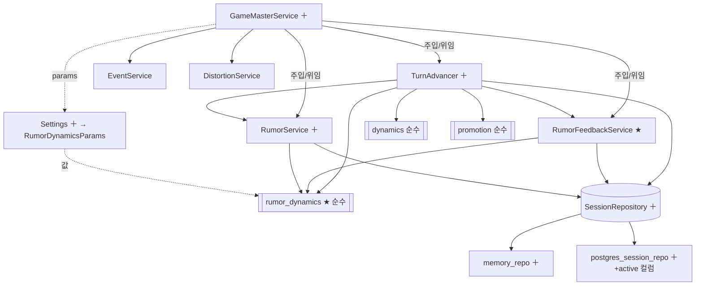

# 하드닝 & 루머 동역학 — Component Dependencies

> 의존 방향과 데이터 흐름. 신규(★)·확장(＋) 표시. 캐노니컬 레이어 불변.

## 의존 매트릭스 (행 → 열: "행이 열을 사용")

| ↓사용 \ 대상→ | rumor_dynamics★ | dynamics | promotion | RumorService＋ | FeedbackSvc★ | TurnAdvancer＋ | SessionRepo＋ | Settings＋ |
|---|:--:|:--:|:--:|:--:|:--:|:--:|:--:|:--:|
| GameMasterService＋ | · | · | · | ● | ● | ● | ● | ● |
| TurnAdvancer＋ | ● | ● | ● | ● | ● | · | ● | (params) |
| RumorFeedbackService★ | ● | · | · | · | · | · | ● | (params) |
| RumorService＋ | ● | · | · | · | · | · | ● | · |
| rumor_dynamics★ | · | · | · | · | · | · | · | · (순수, 무의존) |

- `rumor_dynamics`(순수)는 **아무 것도 의존하지 않음** — 모델 타입만 참조. PBT 대상.
- `RumorDynamicsParams`는 `Settings`에서 조립되어 `TurnAdvancer`·`RumorFeedbackService`·(간접) `RumorService`로 **주입**(값 전달).

## 의존 그래프



## 데이터 흐름 (advance_turn 1턴)

```
Settings ─조립→ RumorDynamicsParams ─주입→ {TurnAdvancer, FeedbackSvc, RumorService}

[이벤트] active events ─dynamics→ region_distortion Δ ─┐
                                                       ├→ influenced_regions
[증식]   append_for_region(min_source_support) ─RumorService─is_eligible_source(rumor_dynamics)→ 새 루머(활성 소스만)
[피드백] active rumors ─rumor_dynamics.region_feedback→ region_distortion Δ ─→ influenced_regions ∪
[감쇠]   rumors ─decay_support(reinforced=influenced)→ support↓
[정리]   partition_prunable(floor, promoted 예외) → prunable.active=False
[승격]   promotion.evaluate(활성 생존 루머)
[영속]   SessionRepository.upsert_rumors(rumors)  ← 1 트랜잭션 (FR-H5)
[기록]   TimelineEntry(ADVANCE_TURN, +pruned/feedback) ; TurnResult 반환
```

## 통신 패턴
- **동기 in-process 메서드 호출**(기존과 동일). 이벤트버스/비동기 없음.
- **포트 경유 영속화**: 모든 DB 접근은 `SessionRepository` Protocol(인메모리/Postgres/SQLite 교체 가능).
- **순수 함수 경계**: 상태 변이는 서비스가, 계산은 `rumor_dynamics`/`dynamics`/`promotion`이 — 단방향(서비스→순수). 순수 모듈은 서비스를 역참조하지 않음.

## U-H2(독립) — 의존 없음
- `web/SessionPanel`(FR-H6): 프론트 단독, `api.ts` read 병렬화.
- `orchestrator`(FR-H7)·`map_image_ingestor`(FR-H8): **캐노니컬 빌드 경로**, 세션 컴포넌트와 무관. U-H1과 상호 의존 없음(병렬/후행 가능).
