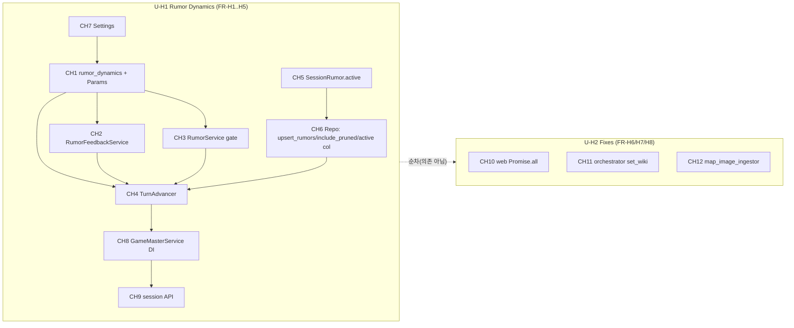

# 하드닝 & 루머 동역학 — Unit Dependencies

> 2 단위. 캐노니컬 레이어 불변. 단위 간 코드 의존 없음(순차는 리스크 관리 목적).

## 단위 의존 매트릭스

| 단위 \ 의존 → | 캐노니컬(불변) | 세션 레이어(Phase 1/2) | U-H1 | U-H2 |
|---|:--:|:--:|:--:|:--:|
| **U-H1** Rumor Dynamics | 읽기 전용(WorldLoader/topology) | 확장(models/repo/services/turn) | — | 없음 |
| **U-H2** Fixes | CH11/CH12는 빌드 경로 수정 | CH10은 세션 read UI만(계약 불변) | **없음** | — |

- **U-H1 ↔ U-H2 상호 의존 없음**: U-H1은 세션 레이어(PostgreSQL) 동역학, U-H2는 프론트 표시 + 캐노니컬
  빌드 파이프라인(Neo4j/OpenSearch). 교차 코드 없음 → 병렬 가능. 문서상 순차(U-H1→U-H2).

## 빌드 순서

## 단위 내부(U-H1) 컴포넌트 빌드 순서
1. **CH7 Settings + CH5 model + CH6 repo**(토대: 파라미터·`active`·배치·컬럼) — 서로 독립, 병렬 가능.
2. **CH1 rumor_dynamics**(순수, Settings에서 조립되는 Params 타입 사용).
3. **CH2 FeedbackService / CH3 RumorService gate**(CH1 순수 함수 사용).
4. **CH4 TurnAdvancer**(CH1/CH2/CH3/CH6 조합).
5. **CH8 GameMasterService**(DI 조립) → **CH9 API**(표면화).

## U-H2 내부
- CH10 / CH11 / CH12 상호 독립 — 임의 순서. CH11/CH12는 조사 우선(결함 시에만 수정).

## 통신 패턴
- 전부 동기 in-process 메서드 호출 + `SessionRepository` 포트 경유 영속화(기존과 동일).
- 순수 모듈(`rumor_dynamics`)은 서비스를 역참조하지 않음(단방향 서비스→순수).
