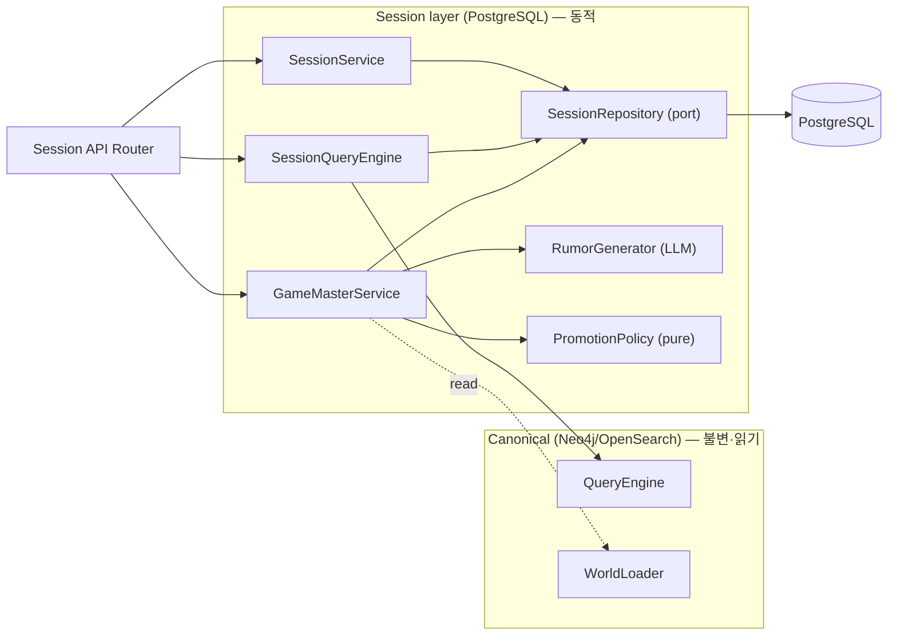

# Component Dependency — Rumor Distortion / Game Session (Phase 1)

## 의존 매트릭스
| 컴포넌트 | 의존 대상 |
|---|---|
| SessionService | SessionRepository |
| GameMasterService | SessionRepository, RumorGenerator, PromotionPolicy, WorldLoader/GraphRepository(캐노니컬 읽기) |
| RumorGenerator | LLMProvider |
| PromotionPolicy | (없음 — 순수) |
| SessionQueryEngine | QueryEngine(캐노니컬), SessionRepository |
| PostgresSessionRepository | SQLAlchemy Engine(설정 session_db_url) |
| InMemorySessionRepository | (없음) |
| Session API Router | SessionService, GameMasterService, SessionQueryEngine (app.state) |

## 통신 패턴
- 모든 세션 영속화는 **SessionRepository 포트** 경유(어댑터 교체 가능: Postgres/in-memory). 기존 Graph/Search 포트 컨벤션과 동일.
- 캐노니컬 접근은 **읽기 전용**: GameMasterService/SessionQueryEngine → WorldLoader/QueryEngine(Neo4j). 세션 쓰기는 캐노니컬을 절대 변경하지 않음(NFR-R2 불변식).
- LLM은 RumorGenerator만 사용(생성). 순수 로직(PromotionPolicy)과 분리(테스트성).

## 레이어 경계 (데이터 흐름)

## 캐노니컬 영향
- **무변경**: Neo4j/OpenSearch 스키마·빌드·쿼리. 단, 정리(cleanup)로 **미사용 Neo4j `Rumor` 노드 모델/매핑 제거**(AD-R Q6=A).
- consensus auto-rumor `KnowledgeView`는 유지(기획자용; 세션 NPC 쿼리에선 제외).

## 신규 외부 의존
- **PostgreSQL**(docker-compose 서비스, Infrastructure Design S1) + **SQLAlchemy**(파이썬 의존성).
