# Execution Plan — Locus

## Detailed Analysis Summary

### Project Nature
- **Type**: Greenfield, system-wide, Complex.
- **Primary Changes**: 새 시스템 전체 구축 — 멀티모달 수집 파이프라인, 토폴로지/온톨로지 빌더, 컨센서스·왜곡 엔진, 상식 Wiki(디지털 트윈), 인터랙티브 지식 보강 Q&A, 검토·편집 웹 UI, 쿼리 API, 그래프/검색 저장소.

### Change Impact Assessment
- **User-facing changes**: Yes — 기획자용 검토·편집 웹 UI + 보강 Q&A.
- **Structural changes**: Yes — 신규 아키텍처(파이프라인 + 그래프 스토어 + 검색 + API + UI).
- **Data model changes**: Yes — 그래프 스키마(지역 노드/계층, 엔티티/관계, 지식 스코프, variant/소문, 상식 Wiki prior).
- **API changes**: Yes — 쿼리 REST API(외부 소비 계약) 신규.
- **NFR impact**: Yes — 하이브리드 컨센서스 성능, LLM/VLM 제공자 추상화, OpenSearch 의미검색, Docker Compose, PBT(Partial).

### Risk Assessment
- **Risk Level**: Medium-High — 신규 도메인 개념(공간 컨센서스, 상식 Wiki), 멀티모달 LLM/VLM 불확실성, 다중 저장소(Neo4j+OpenSearch) 통합.
- **Rollback Complexity**: Easy (greenfield — 되돌릴 기존 시스템 없음).
- **Testing Complexity**: Complex (그래프 정확도, 컨센서스 로직, 멀티모달 해석, UI/API 통합).

## Workflow Visualization

```mermaid
flowchart TD
    Start(["User Request"])

    subgraph INCEPTION["INCEPTION PHASE"]
        WD["Workspace Detection<br/><b>COMPLETED</b>"]
        RE["Reverse Engineering<br/><b>SKIP (greenfield)</b>"]
        RA["Requirements Analysis<br/><b>COMPLETED</b>"]
        US["User Stories<br/><b>COMPLETED</b>"]
        WP["Workflow Planning<br/><b>IN PROGRESS</b>"]
        AD["Application Design<br/><b>EXECUTE</b>"]
        UP["Units Planning<br/><b>EXECUTE</b>"]
        UG["Units Generation<br/><b>EXECUTE</b>"]
    end

    subgraph CONSTRUCTION["CONSTRUCTION PHASE"]
        FD["Functional Design<br/><b>EXECUTE</b>"]
        NFRA["NFR Requirements<br/><b>EXECUTE</b>"]
        NFRD["NFR Design<br/><b>EXECUTE</b>"]
        ID["Infrastructure Design<br/><b>EXECUTE</b>"]
        CG["Code Generation<br/><b>EXECUTE</b>"]
        BT["Build and Test<br/><b>EXECUTE</b>"]
    end

    subgraph OPERATIONS["OPERATIONS PHASE"]
        OPS["Operations<br/><b>PLACEHOLDER</b>"]
    end

    Start --> WD
    WD --> RA
    RA --> US
    US --> WP
    WP --> AD
    AD --> UP
    UP --> UG
    UG --> FD
    FD --> NFRA
    NFRA --> NFRD
    NFRD --> ID
    ID --> CG
    CG --> BT
    BT --> OPS
    OPS --> End(["Complete"])

    style WD fill:#4CAF50,stroke:#1B5E20,stroke-width:3px,color:#fff
    style RA fill:#4CAF50,stroke:#1B5E20,stroke-width:3px,color:#fff
    style US fill:#4CAF50,stroke:#1B5E20,stroke-width:3px,color:#fff
    style WP fill:#4CAF50,stroke:#1B5E20,stroke-width:3px,color:#fff
    style CG fill:#4CAF50,stroke:#1B5E20,stroke-width:3px,color:#fff
    style BT fill:#4CAF50,stroke:#1B5E20,stroke-width:3px,color:#fff
    style RE fill:#BDBDBD,stroke:#424242,stroke-width:2px,stroke-dasharray: 5 5,color:#000
    style AD fill:#FFA726,stroke:#E65100,stroke-width:3px,stroke-dasharray: 5 5,color:#000
    style UP fill:#FFA726,stroke:#E65100,stroke-width:3px,stroke-dasharray: 5 5,color:#000
    style UG fill:#FFA726,stroke:#E65100,stroke-width:3px,stroke-dasharray: 5 5,color:#000
    style FD fill:#FFA726,stroke:#E65100,stroke-width:3px,stroke-dasharray: 5 5,color:#000
    style NFRA fill:#FFA726,stroke:#E65100,stroke-width:3px,stroke-dasharray: 5 5,color:#000
    style NFRD fill:#FFA726,stroke:#E65100,stroke-width:3px,stroke-dasharray: 5 5,color:#000
    style ID fill:#FFA726,stroke:#E65100,stroke-width:3px,stroke-dasharray: 5 5,color:#000
    style OPS fill:#BDBDBD,stroke:#424242,stroke-width:2px,stroke-dasharray: 5 5,color:#000
    style Start fill:#CE93D8,stroke:#6A1B9A,stroke-width:3px,color:#000
    style End fill:#CE93D8,stroke:#6A1B9A,stroke-width:3px,color:#000

    linkStyle default stroke:#333,stroke-width:2px
```

## Phases to Execute

### 🔵 INCEPTION PHASE
- [x] Workspace Detection (COMPLETED)
- [x] Reverse Engineering (SKIPPED — greenfield)
- [x] Requirements Analysis (COMPLETED)
- [x] User Stories (COMPLETED)
- [x] Execution Plan (IN PROGRESS)
- [ ] Application Design — **EXECUTE**
  - **Rationale**: 다수의 신규 컴포넌트·서비스(수집/토폴로지/온톨로지/컨센서스/Wiki/보강/UI/API/저장소)와 그 경계·의존·서비스 계층을 정의해야 함.
- [ ] Units Planning — **EXECUTE**
  - **Rationale**: 복잡한 시스템을 병렬 개발 가능한 작업 단위(Unit)로 분해해야 함(9개 capability Epic 기반).
- [ ] Units Generation — **EXECUTE**
  - **Rationale**: 위 분해를 실제 Unit 정의로 산출(각 Unit이 Construction에서 독립 진행).

### 🟢 CONSTRUCTION PHASE (per-unit loop)
- [ ] Functional Design — **EXECUTE**
  - **Rationale**: 신규 데이터 모델/그래프 스키마와 복잡한 비즈니스 로직(컨센서스 전파, 왜곡 표현, Wiki 가중·고증, 보강 질문 생성).
- [ ] NFR Requirements — **EXECUTE**
  - **Rationale**: 하이브리드 컨센서스 성능, LLM/VLM 제공자 추상화, 임베딩 모델 선택, OpenSearch, PBT(Partial). (Security 확장 OFF는 이미 결정.)
- [ ] NFR Design — **EXECUTE**
  - **Rationale**: NFR Requirements 산출을 논리 컴포넌트·패턴으로 반영.
- [ ] Infrastructure Design — **EXECUTE**
  - **Rationale**: Docker Compose 구성(앱+Neo4j+OpenSearch) 및 의존성·헬스체크 매핑.
- [ ] Code Generation — **EXECUTE (ALWAYS)**
  - **Rationale**: 각 Unit별 구현·테스트 생성.
- [ ] Build and Test — **EXECUTE (ALWAYS)**
  - **Rationale**: 빌드·단위/통합 테스트·검증.

### 🟡 OPERATIONS PHASE
- [ ] Operations — PLACEHOLDER
  - **Rationale**: 향후 배포·모니터링 워크플로우(현재 범위 외).

## Stages to Skip
- Reverse Engineering — greenfield, 분석할 기존 코드 없음.

## Extension Configuration (carried)
- Security Baseline: **OFF** (Q-Security=B).
- Property-Based Testing: **Partial** — 순수 함수·직렬화 round-trip (Q-PBT=B).

## Estimated Plan Size
- **Total stages to execute**: 7 conditional + 2 always (CG, BT) across Construction; per-unit loop runs for each Unit defined in Units Generation.
- **예상 Unit 수**: 6~9 (Units Generation에서 확정; capability Epic 기반).

## Success Criteria
- **Primary Goal**: 샘플 세계관 자료 입력 → 사람 추가작업 없이 지역 토폴로지 + 지역 스코프 지식 그래프 자동 생성, 쿼리 시 공유/고유 지식 구분 반환 (SC-1, SC-2), Wiki 기반 고증 1건 이상 자동 생성 (SC-4).
- **Key Deliverables**: 수집 파이프라인, 토폴로지/온톨로지 빌더, 컨센서스 엔진, 상식 Wiki, 보강 Q&A, 검토·편집 UI, 쿼리 API, Docker Compose 스택.
- **Quality Gates**: 단위/통합 테스트 통과, PBT(Partial) 통과, SC-1·SC-2·SC-4 충족.
