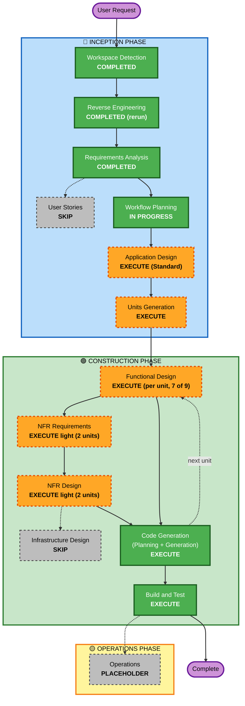

# Follow-up Cycle — Execution Plan

**원하시는 것**: Purpose Restructure 주기에서 넘긴 일을 처리해 솔로 TRPG를 다듬는 것. 이번 주기는 셋을 한다: 새 TRPG·판타지 디자인으로 네 화면을 다시 만들기, 결과가 틀리는 결함 고치기, 시한 있는 기술 부채 정리.
**지금 하는 것**: Workflow Planning. 남은 단계 가운데 무엇을 실행하고 건너뛸지, 어떤 순서로 코드를 바꿀지 정한다. 이 계획이 Application Design → Units Generation → 유닛별 Construction의 뼈대가 된다.

**입력**:
- `inception/reverse-engineering/*`(승인 2026-10-07): `screen-inventory.md`, `code-quality-assessment.md`, `architecture.md`, `component-inventory.md`, `technology-stack.md`, `dependencies.md`.
- `inception/requirements/follow-up-requirements.md`(승인; 리뷰 지적 R-01~R-06은 Accepted risk).
- User Stories는 건너뛴다(같은 페르소나·여정, 수용 기준은 FR·UX 표).

---

## Detailed Analysis Summary

### Transformation Scope (Brownfield)
- **Transformation Type**: 두 가지가 섞인 변화다.
  - **프론트엔드 재설계**: 디자인 시스템, 배치 틀, 네 화면을 바꾼다.
  - **백엔드 국소 변경**: 세 경계 안에서 동시성·합의·번역 범위를 바꾼다.
  - 패키지 경계, 배포 모델(Docker Compose), API 경로 구조는 그대로다.
- **Primary Changes**:
  1. `web/src`: 새 토큰·글꼴·프리미티브·배치 틀·표기 규칙을 만들고(FR-D), 홈·플레이·GM·에디터를 옮긴다(FR-S). 사전을 확장하고(FR-L1), 늦은 답과 이중 실행을 막는다(FR-C13).
  2. `locus/localization` + `api/schemas.py`: 번역 종류를 넓히고(지역·NPC·씨앗, FR-L2), 데모 번역 파일을 불러온다(FR-L3, `locus/world/demo`).
  3. `locus/play`: GM 쓰기를 직렬화한다(FR-C1). 닫기와 GM 쓰기를 맞춘다(FR-C2). 재시작 보상(FR-C3), 지운 지역의 사건(FR-C4), `turn_running` 정의(FR-C5)를 다룬다.
  4. `locus/knowledge` + `locus/shared/storage` + `locus/world`:
     - 합의 전파를 최선 경로로 바꾼다(FR-C6).
     - 캐시 버전 순서를 바로잡는다(FR-C7).
     - 백업이 실패하면 교체를 멈춘다(FR-C8).
     - 다시 빌드해도 NPC·씨앗을 지킨다(FR-C9).
     - 중복 id를 거절하고 라벨 있는 삭제를 쓴다(FR-C10). 매니페스트를 검사한다(FR-C11). 보강 `needs`가 대상 종류를 본다(FR-C12).
  5. CI·문서·테스트 위생: CI 액션(FR-T1), audit(FR-T2), mypy 0과 게이트(FR-T3), 문서(FR-T4), env(FR-T5), 테스트 위생(FR-T6), 라이브 시나리오(FR-T7).
- **Related Components**:
  - `tests/**`: 바뀐 동작과 새 속성 테스트.
  - `web/src/__tests__/**`: 202개 가운데 클래스·문구에 기대는 것을 고친다. testid는 유지한다.
  - `README.md`, `CLAUDE.md`, `operations.md`, `web/README.md`, `next-cycle.md`.
  - `.github/workflows/ci.yml`, `env.example`, `scripts/live_scenario.py`.

### Change Impact Assessment
- **User-facing changes**: **Yes**. 네 화면의 모양과 배치가 모두 바뀐다(새 톤, 2열, 플레이 지도). 키 없는 데모가 한국어로 보인다. GM 쓰기와 닫기는 확인을 받고, 이중 실행이 막힌다.
- **Structural changes**: **작다**. 경계는 그대로다. 프론트 `ui/`가 새 프리미티브와 배치 틀로 바뀌고, 화면별 복사 패턴(대화상자 넷, 알림 셋, select)을 걷어 낸다.
- **Data model changes**: **작다**.
  - `translations` 테이블은 그대로이고, `source_kind` 값만 늘어난다.
  - 데모 폴더에 번역 파일 형식이 새로 생긴다(World File 밖).
  - 세션 테이블은 직렬화 방식에 따라 잠금 행이나 열 하나가 생길 수 있다. Application Design에서 정한다.
- **API changes**: **가산**. 응답에 새 번역 칸이 생긴다(지역·NPC·씨앗). 409·503 detail에 기계가 읽는 코드가 생길 수 있다(FR-D9). 기존 경로와 칸은 그대로다.
- **NFR impact**: **Yes**. 대비 AA(NFR-3), 글꼴·JS 크기 예산(NFR-4), 사람 화면 확인(NFR-2, 감수한 위험 R-1), 동시성 재현 테스트(NFR-10), mypy 0(NFR-1).

### Component Relationships (Brownfield)

| Component | Change Type | Change Reason | Priority |
|---|---|---|---|
| `web/src/ui`, `index.css`, 배치 틀(새) | Major (다시 만듦) | FR-D | Critical |
| `web/src/routes/*`, `features/{home,play,gm,editor}` | Major (옮김 + 배치) | FR-S, FR-C13 | Critical (에디터는 Important, P1) |
| `web/src/i18n.ts`, 표기 규칙(새) | Major (확장) | FR-L1, FR-D8, FR-D9 | Critical |
| `locus/localization`, `api/schemas.py` | Minor (종류 확장) | FR-L2 | Critical |
| `locus/world/demo` + 데모 번역 파일(새) | Minor (새 파일 형식) | FR-L3, FR-C11 | Critical |
| `locus/play/{turn/guard,event,rumor,deeds,session_service}`, `api/main.py` lifespan | Major (동시성·보상) | FR-C1~C5 | Critical |
| `locus/knowledge/consensus.py`, `cache.py`, `shared/storage/{persistence,neo4j_repo}.py` | Minor (규칙 수정) | FR-C6, C7, C10 | Critical |
| `locus/world/{build.py, worldfile/*, augmentation/questions.py}` | Minor | FR-C8, C9, C10, C12 | Important |
| `.github/workflows/ci.yml` | Configuration | FR-T1, FR-T3 | Critical (2026-10-19) |
| 문서·`env.example`·`scripts/live_scenario.py`·`tests/**` 위생 | Configuration/Minor | FR-T2, T4~T7 | Important |

### Risk Assessment
- **Risk Level**: **High**.
  - 네 화면 전체를 새 디자인으로 바꾼다.
  - GM 쓰기의 동시성 규칙을 바꾼다.
  - 레이아웃 자동 게이트가 없다(Q7=B, 감수한 위험 R-1).
- **Rollback Complexity**: **Moderate**. 유닛마다 커밋을 나누면 git으로 되돌릴 수 있다. 데이터 형식은 가산이다(번역 종류, 데모 번역 파일). 직렬화에 테이블 변경이 생기면 Application Design에서 되돌림 방법을 함께 정한다.
- **Testing Complexity**: **Complex**.
  - 화면은 사람이 확인한다.
  - 동시성은 끼워 넣기 재현 테스트로 확인하고, PostgreSQL 실제 잠금은 운영자가 확인한다.
  - 합의는 속성 테스트(순서 무관)로 확인한다.
  - vitest의 대량 수정이 따른다.

---

## Workflow Visualization



텍스트 대안:
```text
Phase 1: INCEPTION
- Workspace Detection (COMPLETED)
- Reverse Engineering (COMPLETED, full rerun)
- Requirements Analysis (COMPLETED)
- User Stories (SKIP)
- Workflow Planning (IN PROGRESS)
- Application Design (EXECUTE, Standard)
- Units Generation (EXECUTE)
Phase 2: CONSTRUCTION (per unit, in order)
- Functional Design (EXECUTE for 7 of 9 units)
- NFR Requirements + NFR Design (EXECUTE light for 2 units)
- Infrastructure Design (SKIP)
- Code Generation (EXECUTE, every unit)
- Build and Test (EXECUTE, once after all units)
Phase 3: OPERATIONS
- Operations (PLACEHOLDER)
```

---

## Phases to Execute

### 🔵 INCEPTION PHASE
- [x] Workspace Detection (COMPLETED 2026-10-07)
- [x] Reverse Engineering (COMPLETED — full rerun, approved 2026-10-07)
- [x] Requirements Analysis (COMPLETED — approved 2026-10-07)
- [x] User Stories — **SKIP**
  - **Rationale**: 페르소나(P-Builder / P-Player / P-GM / P-Viewer)와 여정이 지난 주기와 같다. 이번 일은 같은 여정의 화면과 결함이다. 수용 기준은 FR 표와 UX-01~42가 맡는다.
- [x] Execution Plan (IN PROGRESS)
- [ ] Application Design — **EXECUTE (Standard)**
  - **Rationale**: 새로 생기는 구성 요소와 규칙의 자리를 먼저 정해야 유닛을 나눌 수 있다.
    - (1) 프론트 디자인 시스템 구성: 토큰 층, 프리미티브 목록, 배치 틀, 표기 규칙 모듈, 오류 문장 매핑, 상태 표시.
    - (2) 번역 종류 확장과 데모 번역 파일. 형식, 해시, 불러오는 자리(API 경로와 CLI 경로), purge 범위가 정할 거리다.
    - (3) GM 쓰기 직렬화의 자리(설계 메모 12). 프로세스 안 세션 잠금인지 DB 행 잠금인지, 닫기·교체·재시작과 어떻게 맞물리는지, `turn_running`을 어떻게 정의할지 정한다.
    - (4) 다시 빌드 때 NPC·씨앗을 넘기는 길(FR-C9). 리뷰 R-04에 따라 사람에게 제품 동작을 묻는다.
  - 화면별 배치는 각 유닛의 FD에서 정한다.
- [ ] Units Planning — **SKIP (별도 단계 없음)**
  - **Rationale**: 지난 주기처럼 Units Generation 안에서 계획과 생성을 함께 한다.
- [ ] Units Generation — **EXECUTE**
  - **Rationale**: 일이 여러 묶음이고 순서 제약이 있다(CI 시한 10-19, 디자인 시스템이 화면보다 먼저, 정확성 백엔드가 GM 화면보다 먼저). 아래 초안을 확정한다.

### 🟢 CONSTRUCTION PHASE (유닛 초안 기준)
- [ ] Functional Design — **EXECUTE (9 유닛 중 7)**
  - **Rationale**:
    - 디자인 시스템 유닛은 FR-D1에 따라 FD에서 HTML 시안 2~3안을 만들어 사람에게 고르게 한다.
    - 화면 유닛 셋은 화면별 배치안을 승인받는다(가정 A-5: GM 정보 구성).
    - 번역 백엔드, GM 정확성, 월드 정확성은 규칙과 속성(PBT-01)을 정한다.
  - **SKIP**: CI 시한(설정 변경뿐), 부채·문서 마무리(정해진 목록을 처리).
- [ ] NFR Requirements — **EXECUTE light (2 유닛)**
  - **Rationale**:
    - 디자인 시스템: 대비 AA를 어떻게 확인할지, 글꼴 크기 예산(부분 집합·unicode-range), JS 크기 1.3배 상한, 브라우저 범위(리뷰 R-05).
    - GM 정확성: 동시성 재현 테스트 방식, PostgreSQL 잠금 운영자 확인(NFR-10).
  - 나머지 유닛은 지난 주기의 NFR이 그대로 맞는다.
- [ ] NFR Design — **EXECUTE light (같은 2 유닛)**
  - **Rationale**: 위 NFR을 패턴으로 옮긴다(글꼴 subset 파이프라인, 직렬화 패턴). 지난 주기처럼 NFR 하나의 light 노트로 묶을 수 있다.
- [ ] Infrastructure Design — **SKIP**
  - **Rationale**: 배포 모델, compose, 이미지가 그대로다. CI 변경은 설정 파일 수정이라 코드 생성에서 다룬다. 운영 위생(non-root, 다이제스트 고정)은 범위 밖이다.
- [ ] Code Generation — **EXECUTE (ALWAYS, 9 유닛)**
- [ ] Build and Test — **EXECUTE (ALWAYS)**
  - **Rationale**: 게이트 전부(NFR-1)와 사람 화면 확인 체크리스트(NFR-2)를 돌린다. 1280·390px, 대비 확인 방법, 브라우저·기기를 적는다(R-05). 라이브 시나리오와 PostgreSQL 동시성은 운영자가 확인한다.

### 🟡 OPERATIONS PHASE
- [ ] Operations — PLACEHOLDER(`operations.md` 갱신, `next-cycle.md` 갱신)

---

## 유닛 초안 (Units Generation에서 확정)

순서는 Q3=A(디자인 시스템 → 홈·플레이 → GM → 에디터)와 C-4(CI 시한)를 따른다.

| 순서 | 유닛 | 요구사항 | FD | NFR | 비고 |
|---|---|---|---|---|---|
| 1 | **V1 CI 시한 정리** | FR-T1 | SKIP | SKIP | **2026-10-19 전.** main에서 짧은 브랜치를 따로 내서 작은 PR로 먼저 올리는 것을 권한다(그때 다시 여쭙는다) |
| 2 | **V2 디자인 시스템** | FR-D1~D10, FR-S6(프리미티브 접근성) | **HTML 시안 2~3안** → 사람이 고름 | light | 공유 프리미티브를 갈아 끼우면 에디터도 새 모습을 입는다(리뷰 R-01: 에디터 배치를 넘겨도 프리미티브·표기·공통 상태는 V2·V4에서 들어간다) |
| 3 | **V3 한국어 표시 백엔드** | FR-L2, L3, L4 | 실행 | SKIP | 리뷰 R-02(데모 카드 문구·월드 이름)는 이 유닛의 FD에서 넣을지 다시 여쭙는다 |
| 4 | **V4 홈·플레이 화면** | FR-S1, S2, S5, FR-L1, FR-C13(홈·플레이 쪽) | 배치안 | SKIP | 휴대폰 폭 포함(CQ4=A) |
| 5 | **V5 GM 쓰기 정확성(백엔드)** | FR-C1~C5 | 실행(직렬화, `turn_running`) | light | NFR-10 끼워 넣기 재현 테스트 |
| 6 | **V6 GM 화면** | FR-S3, FR-C13(GM 쪽) | 배치안(가정 A-5) | SKIP | V5의 새 오류·상태를 쓴다 |
| 7 | **V7 월드·지식 정확성** | FR-C6~C12 | 실행(R-04 제품 결정 포함) | SKIP | RE-W01 속성 테스트(PBT-03) |
| 8 | **V8 에디터 화면 (P1)** | FR-S4 | 배치안 | SKIP | 시간이 모자라면 next-cycle로 넘긴다. 넘겨도 V2의 프리미티브와 표기는 이미 적용돼 있다 |
| 9 | **V9 부채·문서 마무리** | FR-T2~T7, FR-C14, FR-D10 | SKIP | SKIP | `next-cycle.md` 갱신(리뷰 R-03의 U8 이월 묶음 명시) |

### Module Update Strategy
- **Update Approach**: Sequential. 유닛 하나를 FD부터 코드와 리뷰까지 마친 뒤 다음으로 간다. 지난 주기와 같다.
- **Critical Path**:
  - V2 디자인 시스템 → V4·V6·V8 화면.
  - V3 번역 백엔드 → V4(한국어 데모).
  - V5 GM 정확성 → V6 GM 화면.
  - V1은 독립이고 시한이 있어 맨 앞에 둔다.
- **Coordination Points**:
  - `api/schemas.py`의 번역 칸(V3 → V4·V6·V8).
  - 오류 detail 코드(V5 → V6, FR-D9 문장 매핑).
  - `ui/` 프리미티브 API(V2 → 화면 유닛).
  - `i18n.ts` 사전 키(모든 웹 유닛).
- **Testing Checkpoints**:
  - 유닛마다 게이트 전부(pytest, vitest, ruff, black, tsc, mypy)를 돌린다.
  - V2, V4, V6, V8 뒤에는 사람이 화면을 한 번 본다(빠른 확인).
  - B&T에서 전체 체크리스트를 돈다.
- **Rollback**: 유닛마다 커밋을 나눈다. 디자인 시스템은 V2에서 공유 프리미티브를 한 번에 바꾸므로, V2 커밋을 되돌리면 옛 모습으로 돌아간다.

### 들고 가는 감수한 위험 (요구사항 리뷰)
- **R-01** 에디터를 넘길 때의 경계: V2·V4에서 공유 프리미티브, 표기, 공통 상태를 화면 전체에 적용하는 것으로 정리한다(위 표 비고). Units Generation에서 문장으로 확정한다.
- **R-02** 데모 카드 문구·월드 이름: V3 FD에서 넣을지 사람에게 다시 묻는다.
- **R-03** U8 이월 묶음(§3 22건, §2 11건, 메모 3·4·6~10): V9에서 `next-cycle.md`에 명시한다.
- **R-04** 다시 빌드 때 NPC·씨앗: Application Design(또는 V7 FD)에서 제품 동작을 묻는다.
- **R-05** 확인 방법(대비, 브라우저, 폭 상한): V2 NFR light와 B&T 체크리스트에서 정한다.
- **R-06** 브랜치: Workflow Planning에서 정했다. PR #4를 병합한 뒤 main에서 `feat/follow-up`을 만든다.

---

## Package Change Sequence (Brownfield)
1. `.github/workflows/ci.yml`(V1)
2. `web/src/{index.css, ui/*, 배치 틀, 표기 규칙}`(V2)
3. `locus/localization` + `api/schemas.py` + `locus/world/demo`(V3)
4. `web/src/{routes,features}/{home,play}`(V4)
5. `locus/play/*` + `api/main.py` + `api/routers/gm.py`(V5)
6. `web/src/{routes,features}/gm`(V6)
7. `locus/knowledge` + `locus/shared/storage` + `locus/world`(V7)
8. `web/src/{routes,features}/editor`(V8)
9. 문서, `tests` 위생, `scripts/live_scenario.py`, `env.example`(V9)

## Estimated Timeline
- **Total Stages (남은 것)**: Application Design, Units Generation, 유닛 9개 × (FD/NFR/Code)(FD 7, NFR light 2), Build and Test.
- **Estimated Duration**: AI 작업 4~6일 정도다(지난 주기 8유닛, 3~4일). 사람이 기다리게 하는 지점이 셋 있다: V2 시안 고르기, 화면별 배치안 승인, B&T 화면 확인. 그 시간은 따로 든다.
- **시한**: V1(FR-T1)은 2026-10-19 전.

## Success Criteria
- **Primary Goal**: 데모 방문자가 키 없이, 휴대폰이나 데스크톱에서, 한국어로 된 새 TRPG 톤 화면에서 플레이를 시작한다. GM 쓰기와 합의 결과가 순서·겹침과 무관하게 바르다.
- **Key Deliverables**:
  - 고른 디자인 시안과 그 토큰·프리미티브(V2).
  - 새 네 화면(V4·V6·V8).
  - 데모 한국어판(V3).
  - 동시성·합의·백업 수정(V5·V7).
  - CI 액션, mypy 게이트, audit 0(V1·V9).
  - 갱신된 문서와 `next-cycle.md`.
- **Quality Gates**:
  - pytest·vitest·ruff·black·tsc가 GREEN이고, mypy 0, npm audit runtime 0과 dev 0(NFR-1).
  - PBT Partial을 준수한다(RE-W01 순서 무관 속성).
  - 사람 화면 체크리스트를 통과한다(NFR-2).
  - CI 네 잡이 새 액션 버전과 러너에서 GREEN이다.
- **Integration Testing**: 라이브 시나리오(운영자, 키 있음)가 PASS다. 10a는 강화된 단언으로 본다. 키 없는 데모를 compose로 띄워 한국어로 보이는지 확인한다.
- **Operational Readiness**: `operations.md`를 이번 주기 절로 갱신한다. PostgreSQL 동시성 운영자 확인 절차를 적는다.
