# Execution Plan — MVP Improvements Cycle

> Brownfield 개선 사이클. 완료된 Locus MVP(117 tests) 위 증분.
> 요구사항: `aidlc-docs/inception/requirements/mvp-improvements-requirements.md`

## Detailed Analysis Summary

### Transformation Scope (Brownfield)
- **Transformation Type**: Application-layer enhancement + legacy 제거 리팩터링 (인프라 변경 없음).
- **Primary Changes**:
  - `__realworld__` 예약 파티션 제거 → world별 WikiPrior + 도메인 태그 기반 read-through 교차 참조.
  - WikiPrior 도메인 taxonomy + WikiPrior 간 직접 엣지(임베딩 후보 + LLM 판정).
  - `Knowledge.title` 필수 추가(LLM 생성).
  - VLM 추출 지형: 신규 지형 Region 승격(인제스터) + 이름 오추출 병합(OntologyBuilder).
- **Related Components**: `locus/__init__`, `locus/models/{graph,enums,io}`, `locus/commonsense_wiki/*`, `locus/ontology/{builder,similarity,corroboration}`, `locus/ingestion/{map_image_ingestor,concept_art_ingestor,text_ingestor,schemas}`, `locus/topology/builder`, `locus/storage/{graph_mapping,neo4j_repo,persistence}`, `locus/query/*`, `api/routers/authoring`, CLI(`__main__`), `examples/*`.

### Change Impact Assessment
- **User-facing changes**: No (웹 UI 제외, Q17=B). API 계약은 일부 변경(위키 빌드 시그니처, world 참조 파라미터).
- **Structural changes**: Yes — 위키 저장/참조 모델 변경, 신규 엣지 타입.
- **Data model changes**: Yes — `Knowledge.title`, `WikiPrior.domains`+`world_id`, WikiPrior 엣지, world 도메인 태그.
- **API changes**: Yes (minor) — `build_wiki`/wiki lookup 시그니처, 교차 참조 파라미터; `__realworld__` 전용 엔드포인트/CLI 동작 변경.
- **NFR impact**: Yes — 엣지 생성 비용 가드(임베딩 top-k → LLM), 교차 참조 쿼리 범위 제한. (요구사항 NFR-IM1~5)

### Component Relationships (Brownfield)
- **Primary Components**: `commonsense_wiki` (영역 1·2), `models` (영역 1·2·3), `ingestion`+`ontology`+`topology` (영역 3·4).
- **Shared Components**: `storage/graph_mapping` (노드/엣지 직렬화 — 위키 엣지·title·도메인 반영), `models` (전 영역 의존).
- **Dependent Components**: `query`(교차 참조 조회), `api/authoring`(위키 빌드/upsert), CLI(`build-wiki`/`build-world`).
- **Supporting**: tests (레거시 제거로 갱신/삭제), `examples/`(realworld_sample 제거, demo 갱신).
- Change Type: models=Major(필수 필드/구조) · commonsense_wiki=Major · ingestion/ontology/topology=Major · storage=Minor · query/api/CLI=Minor.

### Risk Assessment
- **Risk Level**: Medium (`__realworld__` 제거가 다수 파일에 걸침; 데이터 폐기·재빌드 전제라 마이그레이션 리스크는 없음).
- **Rollback Complexity**: Easy (git; 인프라 변경 없음).
- **Testing Complexity**: Moderate–Complex (LLM/임베딩/VLM mock 갱신 필요, 신규 엣지·승격 로직 테스트 추가).

## Workflow Visualization

```mermaid
flowchart TD
    Start(["MVP Improvements Request"])

    subgraph INCEPTION["INCEPTION PHASE"]
        WD["Workspace Detection<br/><b>COMPLETED</b>"]
        RA["Requirements Analysis<br/><b>COMPLETED</b>"]
        US["User Stories<br/><b>SKIP</b>"]
        WP["Workflow Planning<br/><b>IN PROGRESS</b>"]
        AD["Application Design<br/><b>SKIP</b>"]
        UG["Units Generation<br/><b>SKIP (defined here)</b>"]
    end

    subgraph CONSTRUCTION["CONSTRUCTION PHASE"]
        FDA["Unit-A Functional Design<br/><b>EXECUTE</b>"]
        CGA["Unit-A Code Generation<br/><b>EXECUTE</b>"]
        FDB["Unit-B Functional Design<br/><b>EXECUTE</b>"]
        CGB["Unit-B Code Generation<br/><b>EXECUTE</b>"]
        BT["Build and Test<br/><b>EXECUTE</b>"]
    end

    subgraph OPERATIONS["OPERATIONS PHASE"]
        OPS["Operations<br/><b>PLACEHOLDER</b>"]
    end

    Start --> WD
    WD --> RA
    RA --> US
    US --> WP
    WP --> AD
    AD --> UG
    UG --> FDA
    FDA --> CGA
    CGA --> FDB
    FDB --> CGB
    CGB --> BT
    BT --> OPS
    OPS --> End(["Complete"])

    style WD fill:#4CAF50,stroke:#1B5E20,stroke-width:3px,color:#fff
    style RA fill:#4CAF50,stroke:#1B5E20,stroke-width:3px,color:#fff
    style WP fill:#FFA726,stroke:#E65100,stroke-width:3px,color:#000
    style US fill:#BDBDBD,stroke:#424242,stroke-width:2px,stroke-dasharray: 5 5,color:#000
    style AD fill:#BDBDBD,stroke:#424242,stroke-width:2px,stroke-dasharray: 5 5,color:#000
    style UG fill:#BDBDBD,stroke:#424242,stroke-width:2px,stroke-dasharray: 5 5,color:#000
    style FDA fill:#FFA726,stroke:#E65100,stroke-width:3px,stroke-dasharray: 5 5,color:#000
    style CGA fill:#4CAF50,stroke:#1B5E20,stroke-width:3px,color:#fff
    style FDB fill:#FFA726,stroke:#E65100,stroke-width:3px,stroke-dasharray: 5 5,color:#000
    style CGB fill:#4CAF50,stroke:#1B5E20,stroke-width:3px,color:#fff
    style BT fill:#4CAF50,stroke:#1B5E20,stroke-width:3px,color:#fff
    style Start fill:#CE93D8,stroke:#6A1B9A,stroke-width:3px,color:#000
    style End fill:#CE93D8,stroke:#6A1B9A,stroke-width:3px,color:#000
    linkStyle default stroke:#333,stroke-width:2px
```

## Units (defined in this plan — Q16=C)
- **Unit-A — Model & Wiki Structure**: 영역 1(real_world 삭제+교차참조) + 영역 2(WikiPrior 커뮤니티) + 영역 3(Knowledge.title). FR-IM1.*, FR-IM2.*, FR-IM3.*.
- **Unit-B — Ingestion Connection**: 영역 4(VLM orphan 해소 — Region 승격 + 병합). FR-IM4.*.
- **빌드 순서**: Unit-A → Unit-B (B의 VLM 병합/승격 로직이 A의 도메인/노드 모델 변경에 의존).

## Phases to Execute

### 🔵 INCEPTION PHASE
- [x] Workspace Detection (COMPLETED — brownfield resume)
- [x] Reverse Engineering (SKIPPED — 기존 `aidlc-docs/` 설계 문서가 RE 자료 대체)
- [x] Requirements Analysis (COMPLETED)
- [x] User Stories (SKIPPED)
  - **Rationale**: brownfield enhancement, 기존 페르소나(P1 내러티브/P2 월드/P3 NPC 런타임)·스토리가 행위자를 이미 커버. 신규 사용자 워크플로 없음.
- [x] Workflow Planning (IN PROGRESS → 본 문서)
- [ ] Application Design - **SKIP**
  - **Rationale**: 신규 최상위 컴포넌트/서비스 없음. 변경은 기존 컴포넌트(commonsense_wiki/ontology/ingestion/models) 경계 내 확장. 신규 메서드는 unit-local이라 per-unit Functional Design에서 정의.
- [ ] Units Generation - **SKIP (units defined in this plan)**
  - **Rationale**: 2-unit 분할이 Requirements(Q16=C)에서 사용자와 확정·문서화됨. 별도 단위 생성 산출물 불요.

### 🟢 CONSTRUCTION PHASE (per-unit loop: Unit-A → Unit-B)
- [ ] Functional Design - **EXECUTE** (Unit-A, Unit-B 각각)
  - **Rationale**: 신규/변경 데이터 모델(title, WikiPrior domains/edges/world_id, Region 승격, 교차참조 쿼리)과 비자명한 로직(임베딩+LLM 엣지, VLM 병합/승격)의 상세 설계 필요.
- [ ] NFR Requirements - **SKIP** (Unit-A, Unit-B)
  - **Rationale**: NFR은 요구사항 NFR-IM1~5에 이미 포착(성능 가드/파티셔닝/테스트 가능성). 기존 MVP의 U2~U10과 동일하게 per-unit NFR-R 생략.
- [ ] NFR Design - **SKIP** (NFR-R 생략에 종속)
- [ ] Infrastructure Design - **SKIP**
  - **Rationale**: 인프라 변경 없음(동일 Neo4j/OpenSearch/Docker). 신규 클라우드 리소스 없음.
- [ ] Code Generation - **EXECUTE** (ALWAYS; Unit-A, Unit-B 각각)
  - **Rationale**: 구현 및 테스트 생성.
- [ ] Build and Test - **EXECUTE** (ALWAYS)
  - **Rationale**: 전체 빌드/테스트/회귀 검증(레거시 제거 반영, 신규 로직 테스트).

### 🟡 OPERATIONS PHASE
- [ ] Operations - PLACEHOLDER

## Package Change Sequence (Brownfield)
1. **models** (`graph`/`enums`/`io`) — title 필수, WikiPrior domains/world_id, 신규 엣지·도메인 타입 (모든 것의 기반).
2. **storage/graph_mapping** — 신규 필드/엣지 직렬화.
3. **commonsense_wiki** (`base`/`builder`/`distiller`/`admin`, `bundled` 제거) — world별 위키 + 도메인 분류 + 엣지 생성 + 교차참조 lookup.
4. **ontology** (`builder`/`similarity`/`corroboration`) — title 채움, VLM case1 병합.
5. **ingestion** (`map_image`/`concept_art`/`text`/`schemas`) — VLM case2 Region 승격, title 추출.
6. **topology/builder** — 승격된 Region 편입.
7. **query / api / CLI / examples** — 교차참조 조회, `__realworld__` 잔재 제거, demo 갱신.
- (1→2→3 는 Unit-A, 4·5·6 의 VLM 부분은 Unit-B; title은 Unit-A.)

## Estimated Timeline
- **Total Stages (execute)**: 5 (Workflow Planning + Unit-A FD/CodeGen + Unit-B FD/CodeGen + Build&Test).
- **Estimated Duration**: 짧음~중간 (집중된 2-unit 증분).

## Success Criteria
- **Primary Goal**: 4개 개선 반영 — `__realworld__` 제거+교차참조, WikiPrior 커뮤니티/엣지, Knowledge.title, VLM orphan 제거.
- **Key Deliverables**: 갱신된 `locus/` 모듈, 신규/갱신 테스트, 갱신 CLI/api, 갱신 demo·문서.
- **Quality Gates**: 오프라인 테스트 GREEN(레거시 테스트 갱신 후), ruff/black 클린, orphan VLM entity 0, `__realworld__` 잔재 0.
- **Integration Testing**: 위키 빌드(world별)+교차참조 쿼리, VLM 인제스션→Region 승격→토폴로지 편입 end-to-end (라이브 operator-run).
