# Purpose Restructure — Execution Plan

**원하시는 것**: 월드를 만들고 그 안에서 소문·사건이 지형을 따라 퍼지며 지역마다 NPC가 다르게 아는 것을 겪는 솔로 TRPG로 Locus를 다시 짜는 것(포트폴리오·데모).
**지금 하는 것**: Workflow Planning — 남은 단계 가운데 무엇을 실행하고 무엇을 건너뛸지, 어떤 순서로 코드를 바꿀지 정한다. 이 계획이 Application Design → Units Generation → 유닛별 Construction의 뼈대가 된다.

**입력**: `inception/reverse-engineering/*`(승인), `inception/requirements/purpose-restructure-requirements.md`(승인), `inception/user-stories/{personas,stories}.md`(승인, 9 Epic · 43 스토리).

---

## Detailed Analysis Summary

### Transformation Scope (Brownfield)
- **Transformation Type**: **Architectural** — 단일 컴포넌트 변경이 아니라 패키지 경계 자체를 다시 긋고(FR-A), 새 도메인(플레이어·이동·NPC 대화·World File)을 더하고, UI의 중심을 GM 콘솔에서 플레이어 화면으로 옮긴다. 배포 모델은 그대로(로컬 Docker Compose)다.
- **Primary Changes**:
  1. `locus/` 14개 하위 패키지를 다섯 경계(world / knowledge / play / localization / shared)로 재배치하고 역방향 의존을 끊는다.
  2. `api/` 조립 루트를 경계별로 나누고 라우터 경로를 경계에 맞춘다.
  3. `web/`를 에디터 / 플레이어 / GM 모드 세 화면 구조로 재구성한다.
  4. 새 모델: Player(세션 상태), NPC(캐노니컬 노드), World File(저장 포맷 v1), 대화 이력.
  5. 결함 수정: 수집 병합(A1·A2·A11), 재빌드 중복(A3), 미해석 지식(A4), 이미지 전송(A7), 보강 Q&A(B1~B6), 소문 폭주(C1·C2), 턴 동시성(C3), Docker 기동(F).
- **Related Components**: `tests/`(import 경로 전면 갱신 + 신규 PBT), `Dockerfile`·`docker-compose.yml`·`.dockerignore`, `README.md`·`CLAUDE.md`·`operations.md`, `examples/demo_world`(TRPG 데모 월드로 확장), `pyproject.toml`·`requirements.txt`.

### Change Impact Assessment
- **User-facing changes**: **Yes** — 화면 세 개(에디터·플레이어·GM 모드)로 재구성, 자료 업로드, 지도 편집, NPC 대화, 이동, 원클릭 데모, 지역 이름 표시, UI 언어 통일.
- **Structural changes**: **Yes** — 경계 재정리, 포트 분할(`SessionRepository` → 관심사별), 조립 루트 분리, 용어 분리(rumor / distortion_degree / session), 번역 모듈 독립.
- **Data model changes**: **Yes** — 캐노니컬: `:NPC` 노드 + `LIVES_IN`, 관계(RELATED_TO) 재독, World File `format_version`. 세션(PostgreSQL): `players`, `npc_conversations`(또는 유사), 소문 비활성화 방식 통일, 포트 분리에 따른 테이블 소유 이동. Q4=A라 마이그레이션 코드는 두지 않고 스키마를 새로 만든다(기존 데이터는 재생성).
- **API changes**: **Yes (호환 깸)** — 경계별 접두어(예: `/api/world`, `/api/play`, `/api/gm`), World File import, 플레이어·이동·대화 엔드포인트, 업로드(multipart), 세션 지역 지식 API는 유지(FR-F5). 프론트 `api.ts`·`types.ts` 전면 갱신.
- **NFR impact**: **Yes** — NFR-3 응답성(세션 단위 월드 캐시; 지금은 질의마다 전체 로드), NFR-5 LLM 비용 상한(턴당·빌드당), NFR-1 회귀 없음(305 테스트 이동), NFR-2 PBT Partial(4개 불변식), NFR-4 데모 기동, NFR-9 월드 교체 시 세션 보호.

### Component Relationships (Brownfield)
- **Primary Components**: `locus/session` → play 경계(가장 큰 이동, 2.2k줄) · `locus/{ingestion,topology,ontology,commonsense_wiki,augmentation,services}` → world 경계 · `locus/{consensus,query}` → knowledge 경계 · `locus/translation` → localization 경계 · `locus/{models,config,llm,storage(base·neo4j·opensearch·mapping·persistence·schema)}` → shared.
- **Infrastructure Components**: `Dockerfile`(api/ 포함), `.dockerignore`(신규), `docker-compose.yml`(프로파일 정리), `web/Dockerfile`, (P2) `.github/workflows`.
- **Shared Components**: `locus/models`(세션·번역 필드 제거, NPC 추가), `locus/config`(경계별 설정 객체, 조정값 집약), `locus/llm`(변경 없음, 새 호출자 추가).
- **Dependent Components**: `api/main.py`(조립), `api/routers/*`(경로·서비스 이름), `web/src/api.ts`·`types.ts`(계약), `tests/**`(import 경로), `locus/__main__.py`(CLI: init-schema 분리, import 명령 추가).
- **Supporting Components**: `README.md`, `CLAUDE.md`, `aidlc-docs/operations/operations.md`, `examples/demo_world/*`.

| Component | Change Type | Change Reason | Priority |
|---|---|---|---|
| `locus/session` → play | Major (이동 + 신규 player/npc 대화 + 안정화) | 목적 중심 축 | Critical |
| `locus/{ingestion,topology,ontology,wiki,augmentation,services}` → world | Major (이동 + 결함 수정 + World File + NPC 편집) | 월드 에디터 | Critical |
| `locus/{consensus,query}` → knowledge | Minor (이동 + `canonical_known` 일반화 + 캐시) | 순수 코어 | Important |
| `locus/translation` → localization | Minor (이동 + 자체 포트) | 세션 의존 제거 | Important |
| `locus/models`·`config` | Minor (필드 제거·추가, 조정값 집약) | 역방향 의존 제거 | Critical |
| `locus/storage/postgres_session_repo` | Major (play 경계로 이동, 포트 분할, 테이블 추가) | FR-A4 | Critical |
| `api/` | Major (조립 분리, 경로 변경, 신규 라우터) | FR-A3·A6, FR-C·D | Critical |
| `web/` | Major (3화면 구조, 에디터·플레이어 신규) | E2~E5 스토리 | Critical |
| `tests/` | Major (경로 갱신 + 신규 PBT·계약) | NFR-1·2 | Critical |
| Docker·compose·dockerignore | Configuration | FR-H2 | Important |
| README·CLAUDE.md·operations | Documentation | FR-H1·H3, NFR-8 | Important |
| `examples/demo_world` | Content (10~15 지역, NPC, 사건 씨앗) | FR-B3 | Important |
| CI | New (P2) | FR-H5 | Optional |

### Risk Assessment
- **Risk Level**: **High** — 시스템 전반이 움직이고(약 9k줄 백엔드 + 2k줄 프론트), 새 도메인이 셋 들어오며, 실행 검증(라이브 LLM·DB)은 운영자 수동이다. 완화: 유닛 1(경계 재정리)을 **동작 불변**으로 먼저 끝내고 305 테스트를 GREEN으로 만든 뒤에만 기능 유닛으로 넘어간다. 각 유닛 끝에 오프라인 전체 테스트를 돈다.
- **Rollback Complexity**: **Moderate** — Q4=A로 호환을 깨므로 되돌리기는 git 브랜치 단위(유닛별 커밋). 데이터는 재생성 가능(데모 월드·세션). 프로덕션 소비자 없음.
- **Testing Complexity**: **Complex** — 경로 이동 뒤 전체 회귀, 새 PBT 4종(왕복·단조성·상한·아는 범위), API 계약 테스트 재작성, 프론트 컴포넌트 테스트 재구성, 라이브 데모 시나리오(US-6.1)는 운영자 실행.

---

## Workflow Visualization

```mermaid
flowchart TD
    Start(["User Request: 목적 재정립"])

    subgraph INCEPTION["INCEPTION PHASE"]
        WD["Workspace Detection<br/><b>COMPLETED</b>"]
        RE["Reverse Engineering<br/><b>COMPLETED</b>"]
        RA["Requirements Analysis<br/><b>COMPLETED</b>"]
        US["User Stories<br/><b>COMPLETED</b>"]
        WP["Workflow Planning<br/><b>IN PROGRESS</b>"]
        AD["Application Design<br/><b>EXECUTE</b>"]
        UG["Units Generation<br/><b>EXECUTE</b>"]
    end

    subgraph CONSTRUCTION["CONSTRUCTION PHASE - per unit loop x7"]
        FD["Functional Design<br/><b>EXECUTE</b> (new-logic units)"]
        NFR["NFR Requirements + Design<br/><b>EXECUTE light</b> (play, editor units)"]
        ID["Infrastructure Design<br/><b>EXECUTE light</b> (demo/deploy unit only)"]
        CG["Code Generation<br/>(Planning + Generation)<br/><b>EXECUTE</b>"]
        BT["Build and Test<br/><b>EXECUTE</b>"]
    end

    subgraph OPERATIONS["OPERATIONS PHASE"]
        OPS["Operations<br/><b>PLACEHOLDER</b> (docs + CLAUDE.md update)"]
    end

    Start --> WD --> RE --> RA --> US --> WP --> AD --> UG --> FD --> NFR --> ID --> CG
    CG -.->|"next unit"| FD
    CG --> BT --> OPS --> End(["Complete"])

    style WD fill:#4CAF50,stroke:#1B5E20,stroke-width:3px,color:#fff
    style RE fill:#4CAF50,stroke:#1B5E20,stroke-width:3px,color:#fff
    style RA fill:#4CAF50,stroke:#1B5E20,stroke-width:3px,color:#fff
    style US fill:#4CAF50,stroke:#1B5E20,stroke-width:3px,color:#fff
    style WP fill:#4CAF50,stroke:#1B5E20,stroke-width:3px,color:#fff
    style CG fill:#4CAF50,stroke:#1B5E20,stroke-width:3px,color:#fff
    style BT fill:#4CAF50,stroke:#1B5E20,stroke-width:3px,color:#fff
    style AD fill:#FFA726,stroke:#E65100,stroke-width:3px,stroke-dasharray: 5 5,color:#000
    style UG fill:#FFA726,stroke:#E65100,stroke-width:3px,stroke-dasharray: 5 5,color:#000
    style FD fill:#FFA726,stroke:#E65100,stroke-width:3px,stroke-dasharray: 5 5,color:#000
    style NFR fill:#FFA726,stroke:#E65100,stroke-width:3px,stroke-dasharray: 5 5,color:#000
    style ID fill:#FFA726,stroke:#E65100,stroke-width:3px,stroke-dasharray: 5 5,color:#000
    style OPS fill:#BDBDBD,stroke:#424242,stroke-width:2px,stroke-dasharray: 5 5,color:#000
    style INCEPTION fill:#BBDEFB,stroke:#1565C0,stroke-width:3px,color:#000
    style CONSTRUCTION fill:#C8E6C9,stroke:#2E7D32,stroke-width:3px,color:#000
    style OPERATIONS fill:#FFF59D,stroke:#F57F17,stroke-width:3px,color:#000
    style Start fill:#CE93D8,stroke:#6A1B9A,stroke-width:3px,color:#000
    style End fill:#CE93D8,stroke:#6A1B9A,stroke-width:3px,color:#000

    linkStyle default stroke:#333,stroke-width:2px
```

**Text alternative**
- INCEPTION: Workspace Detection (완료) → Reverse Engineering (완료) → Requirements Analysis (완료) → User Stories (완료) → Workflow Planning (진행 중) → Application Design (**실행**) → Units Generation (**실행**)
- CONSTRUCTION, 유닛 7개를 차례로: Functional Design (**실행**, 새 로직이 있는 유닛) → NFR Requirements + Design (**가볍게 실행**, 플레이·에디터 유닛) → Infrastructure Design (**가볍게 실행**, 데모·배포 유닛만) → Code Generation (**실행**) → 다음 유닛 … → Build and Test (**실행**)
- OPERATIONS: Placeholder (operations.md, CLAUDE.md, README 최종 갱신)

---

## Phases to Execute

### 🔵 INCEPTION PHASE
- [x] Workspace Detection (COMPLETED 2026-09-29)
- [x] Reverse Engineering (COMPLETED — 9 artifacts, 목적 지도 포함)
- [x] Requirements Analysis (COMPLETED — FR-A~I, NFR-1~9, 가정 A-1~5)
- [x] User Stories (COMPLETED — 9 Epic · 43 스토리)
- [x] Workflow Planning (IN PROGRESS — 이 문서)
- [ ] **Application Design — EXECUTE**
  - **Rationale**: 경계 다섯 개의 실제 패키지 이름·배치, 포트 분할(`SessionRepository` → 세션/소문/사건/타임라인/플레이어/대화 + `TranslationRepository`), 조립 루트 분리, API 접두어, 용어 분리, 새 컴포넌트(Player, Movement, NPC Dialogue, World File import, 세션 월드 캐시, Editor 서비스)와 그 메서드·규칙을 정해야 유닛을 나눌 수 있다. RE §D의 부채(비대한 포트, 파사드 과잉, 조립 루트 하나)를 여기서 해소한다.
- [ ] **Units Generation — EXECUTE**
  - **Rationale**: 43 스토리·9 FR 영역이 백엔드·API·프론트·인프라·문서에 걸친다. 순서가 중요하다(경계 재정리가 먼저, 그 위에 기능). 아래 "Package Change Sequence"가 초안이며 Units Generation에서 확정한다.

### 🟢 CONSTRUCTION PHASE (유닛마다 반복)
- [ ] **Functional Design — EXECUTE (조건부, 유닛별)**
  - **Rationale**: World File 포맷·왕복 규칙, 이동 비용 공식(A-5)·턴 소모, NPC 아는 범위·프롬프트 가드, 소문 상한·씨앗 규칙, 에디터 편집 규칙·보강 통합, 데모 월드 콘텐츠 규칙은 새 비즈니스 로직이다. PBT-01(advisory)에 따라 각 FD에 "Testable Properties" 절을 둔다. **경계 재정리 유닛(동작 불변)은 FD를 건너뛰고 Application Design을 설계 근거로 삼는다.**
- [ ] **NFR Requirements — EXECUTE light (조건부, 유닛별)**
  - **Rationale**: NFR-3(세션 단위 월드 캐시, 즉시 응답), NFR-5(턴·빌드 LLM 호출 상한), NFR-6(업로드 검증, `n` 상한), PBT-09(hypothesis 확인)는 플레이·에디터·안정화 유닛에 걸린다. 이전 사이클처럼 유닛별 `nfr/nfr-light.md` 한 장으로 요구와 설계를 함께 적는다. 새 기술 스택 선택은 없다(C-3, C-4).
- [ ] **NFR Design — EXECUTE light (NFR Requirements와 합쳐 한 산출물)**
  - **Rationale**: 캐시 무효화 규칙, 동시성 가드(FR-E3), 호출 카운터 위치 같은 패턴은 정해야 하지만 규모가 작아 별도 문서로 나누지 않는다.
- [ ] **Infrastructure Design — EXECUTE light (데모·배포 유닛만)**
  - **Rationale**: 새 인프라는 없다(C-4). Dockerfile에 `api/` 포함, `.dockerignore`, compose 프로파일 정리, (P2) CI 워크플로만 다룬다. 나머지 유닛은 SKIP.
- [ ] **Code Generation — EXECUTE (ALWAYS, 유닛별 Part 1 계획 + Part 2 생성)**
  - **Rationale**: 각 유닛 끝에 오프라인 전체 테스트(pytest + vitest) GREEN, ruff/black/tsc clean을 확인한다. PBT-02/03/07/08/09는 blocking.
- [ ] **Build and Test — EXECUTE (ALWAYS, 모든 유닛 뒤)**
  - **Rationale**: 통합 오프라인 스위트, PBT seed 로깅(PBT-08), 라이브 데모 시나리오(US-1.1 기동 → US-1.3 데모 → US-6.1 "같은 사건을 다르게 듣는다")를 운영자 실행 문서로 남긴다.

### 🟡 OPERATIONS PHASE
- [ ] Operations — PLACEHOLDER
  - **Rationale**: `operations.md`·`CLAUDE.md`·README 최종 갱신(FR-H1, NFR-8). 배포·모니터링 워크플로는 범위 밖.

### 건너뛰는 단계
- **Units Planning**(별도 단계로서) — 이 저장소의 관행대로 Units Generation 안에서 계획 질문과 산출물을 함께 다룬다.
- **Infrastructure Design**(데모·배포 유닛 이외) — 새 인프라 없음.
- **Functional Design**(경계 재정리 유닛) — 동작 불변 이동이라 설계는 Application Design이 대신한다.

---

## Package Change Sequence (Brownfield) — 유닛 초안

Units Generation에서 확정한다. 순서의 원칙은 둘이다. ① **먼저 경계를 옮기고 동작을 바꾸지 않는다**(테스트 GREEN 유지). ② 그 위에 **데모 흐름 순서**(만들기 → 플레이 → 대화 → 개입 → 띄우기)로 기능을 쌓되, 데이터 기반(World File·NPC 모델)을 먼저 놓는다.

| # | 유닛(초안) | 범위 | 주요 스토리 | FR | 의존 |
|---|---|---|---|---|---|
| U1 | **경계 재정리** (동작 불변) | 다섯 경계로 패키지 이동, 역방향 의존 제거, 포트 분할, 조립 루트 분리, 용어 분리, API 접두어, 조정값 집약, 테스트 경로 갱신, Docker `api/` 포함(작은 수정이라 여기서) | US-7.1, 7.2, 7.4, 8.5, 1.1(일부) | FR-A1~A7, FR-H2(일부), NFR-1·7 | — |
| U2 | **World File + 캐노니컬 기반** | World File v1 저장·로드(CLI·API), NPC 모델(`:NPC`, `LIVES_IN`), 관계 재독, 수집 병합·재빌드·미해석 지식 결함 수정, 이미지 전송, 빌드 리포트 | US-6.2, 6.3, 2.7, 2.1(백엔드), 2.4(모델) | FR-B1(백엔드), B4, B5, B8, B10, F1 | U1 |
| U3 | **월드 에디터** | 업로드 화면, 지도 편집(지역·연결·가중치), 지식·스코프 편집, NPC 배치·제안, 보강 Q&A 통합·수리, wiki 근거 표시, 월드 목록, 저장·불러오기 UI | US-2.1~2.8, 6.4 | FR-B1~B3(UI), B6, B7, B9, F2, F3 | U2 |
| U4 | **플레이어 모드** | Player 모델·저장, 세션 시작·배치, 이동 규칙(비용·blocked), 행동→턴, 현재 지역 화면, 세션 단위 월드 캐시, 지역 이름 표시 | US-3.1~3.4, 6.1(기반) | FR-C1~C3, C5, D3, NFR-3 | U2 |
| U5 | **NPC 대화 + 언어** | 아는 범위 순수 함수, 대화 엔드포인트·이력, 프롬프트 가드, 번역 모듈 독립(`TranslationRepository`), 캐노니컬 번역, NPC 표시 언어, UI 라벨 통일 | US-4.1~4.3, 9.1~9.4 | FR-C4, F4, F5, G1~G5 | U4 |
| U6 | **GM 모드 + 안정화** | GM 모드 전환 UI, 사건 제안 컨텍스트·n 상한, 타임라인·알림 이름 표시, 플레이 로그, 세계 상태 오버레이, 소문 상한·씨앗 규칙, 승격 면제 축소, 턴 동시성, 상태 기계·계보 | US-5.1~5.5, 8.1~8.4 | FR-D1~D5, E1~E6, C6, NFR-5 | U4 |
| U7 | **데모·배포·문서** | TRPG 데모 월드 콘텐츠(10~15 지역, NPC, 사건 씨앗) + 원클릭 로드, API 키 없는 둘러보기, `.dockerignore`·compose 정리·requirements 정합·라이선스·peer, README 전면 갱신, 진행 중 기능 표시, (P2) CI | US-1.1~1.4, 7.3, 7.5, 7.6, 6.1(시나리오) | FR-B3, H1~H5, I, NFR-4·8 | U3, U5, U6 |

- **Update Approach**: Sequential (U1 → U2 → U3 → U4 → U5 → U6 → U7). U3와 U4는 서로 독립이라 병행할 수 있지만, 이 저장소는 단일 작업자라 순차를 기본으로 둔다.
- **Critical Path**: U1(모든 것의 자리) → U2(데이터 기반) → U4 → U5(핵심 스토리 US-6.1은 U5까지 있어야 동작).
- **Coordination Points**: U1 뒤 API 접두어·`types.ts` 계약 동결 → U3~U6 프론트가 그 위에 쌓임 · World File 스키마(U2)는 U3(편집)·U7(데모 콘텐츠)이 공유 · 세션 지역 지식 API(FR-F5)는 U4~U5에서 유지 확인.
- **Testing Checkpoints**: U1 끝 — 기존 305 GREEN, import 방향 테스트 추가 · U2 끝 — World File 왕복 PBT · U4 끝 — 이동 비용 단조성 PBT · U5 끝 — 아는 범위 불변식 PBT · U6 끝 — 소문 상한 PBT · U7 끝 — Build&Test 통합 + 라이브 시나리오 문서.
- **Rollback Strategy**: 유닛마다 커밋(또는 PR). 실패 시 그 유닛 커밋만 되돌린다. U1은 동작 불변이라 되돌리기 쉽고, U2 이후는 데이터 재생성으로 복구한다(Q4=A).

---

## Estimated Timeline
- **Total Stages**: INCEPTION 2 (Application Design, Units Generation) + CONSTRUCTION 유닛 7 × (FD ≤1 + NFR-light ≤1 + Infra ≤1 + CodeGen 2 parts) ≈ 26 stage-steps + Build and Test 1 + Operations 1 ≈ **30 stage-steps**.
- **Estimated Duration**: 이전 사이클 기준(UX 개선 3 유닛 = 1 작업일)으로 **약 3~4 작업일**(승인 대기 제외). U1과 U3가 가장 크다.

## Success Criteria
- **Primary Goal**: 관람자가 `.env` 두 값과 명령 하나로 데모를 띄우고, 데모 월드에서 플레이어로 이동·대화하며, 같은 사건을 다른 지역에서 다르게 듣는 것(US-6.1)을 겪는다. 저장소 최상위 패키지 이름만 보고 목적을 짚는다(US-7.1).
- **Key Deliverables**: 다섯 경계로 재배치된 `locus/` · 경계별 조립·라우터 · World File 저장·로드 · 월드 에디터 · 플레이어 모드 · NPC 대화 · GM 모드 · 안정화된 턴 엔진 · TRPG 데모 월드 · 기동되는 Docker · 새 README.
- **Quality Gates**: 유닛마다 오프라인 전체 테스트 GREEN(기존 305 + 신규), ruff/black/tsc clean, PBT-02/03/07/08/09 준수(blocking), import 방향 테스트 통과, 각 유닛 Code Generation 뒤 표준 2-옵션 승인.
- **Integration Testing**: Build and Test에서 통합 오프라인 스위트 + 라이브 시나리오(기동 → 데모 로드 → 세션 → 이동 → 대화 → GM 사건 → 턴 → 다른 지역 대화) 운영자 실행 문서.
- **Operational Readiness**: `operations.md`·`CLAUDE.md`·README가 새 구조·명령·진행 중 기능과 일치(NFR-8).

## Extension Compliance (this stage)
- **Security Baseline**: 비활성(No) — N/A.
- **PBT (Partial)**: 이 단계에 적용되는 blocking 규칙 없음(PBT-09 프레임워크 선택은 NFR 단계, PBT-01~08은 FD·CodeGen·Build&Test). 계획에 PBT 체크포인트를 유닛별로 명시했다 — compliant.
