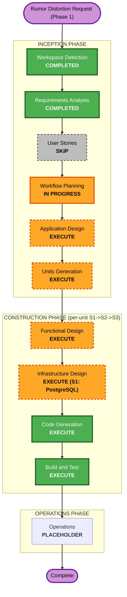

# Execution Plan — Rumor Distortion / Game Session cycle (Phase 1)

> Brownfield 신규 기능. 요구사항: `inception/requirements/rumor-distortion-requirements.md`.
> 동적 게임 세션 레이어(PostgreSQL) 도입. Event/타임라인 동적 진화는 Phase 2.

## Detailed Analysis Summary

### Transformation Scope (Brownfield)
- **Type**: Cross-system — 신규 인프라(PostgreSQL) + 백엔드 신규 레이어/포트/서비스 + API + 웹.
- **Primary changes**: GameSession 레이어, `SessionRepository` 포트(+PG 어댑터+mock), Rumor 생성/지지도/승격, GameMaster·턴·Timeline, NPC 세션 쿼리 규칙, 웹 세션 UI.
- **Canonical layer (Neo4j/OpenSearch)**: **불변** — 읽기 참조만.

### Change Impact Assessment
- **User-facing**: Yes — 웹(세션 UI, 소문 생성 버튼, 과거 세션 열람).
- **Structural**: Yes — 신규 세션 레이어/포트, 쿼리 경로 분기(세션 컨텍스트).
- **Data model**: Yes (additive, PostgreSQL) — GameSession/SessionRumor/RegionDistortion/TimelineEntry. 캐노니컬 모델 무변경.
- **API**: Yes — 신규 세션/소문/턴/타임라인 라우터.
- **NFR/Infra**: Yes — PostgreSQL 신규 인프라.

### Risk Assessment
- **Risk**: Medium-High (신규 인프라 + 신규 레이어 + NPC 쿼리 의미 변경).
- **Rollback**: Easy (additive; 캐노니컬 불변; git).
- **Testing**: Moderate-Complex (SessionRepository in-memory mock, LLM mock, 승격/강등·타임라인 순수 로직 + 회귀).

## Workflow Visualization

## Units (proposed; finalized in Units Generation)
- **Unit-S1 — Session Foundation & Infra**: 세션 도메인 모델, `SessionRepository` 포트 + **PostgreSQL 어댑터** + in-memory mock, `GameSession` 생애주기 서비스, 설정/팩토리, docker-compose PostgreSQL, 세션 CRUD API. **Infrastructure Design 여기서.**
- **Unit-S2 — Rumor Engine**: RumorGenerator(LLM 강도별 체인 왜곡), support·승격/강등 순수 로직, GameMaster 턴, Timeline, 세션-aware NPC 쿼리 규칙(FR-R5), 관련 API(generate/advance-turn/adjust-support/timeline).
- **Unit-S3 — Web UI**: 세션 생성/선택/종료, 리전 소문 생성 버튼, support/distortion 표시, 과거 세션·타임라인 열람, dead `buildWiki` 정리.
- **빌드 순서**: S1 → S2 → S3.

## Phases to Execute

### 🔵 INCEPTION
- [x] Workspace Detection (COMPLETED) · [x] Requirements (COMPLETED) · [x] User Stories (SKIP — 기획자 대상, 기존 페르소나)
- [x] Workflow Planning (본 문서)
- [ ] **Application Design — EXECUTE**
  - **Rationale**: 신규 컴포넌트/서비스(SessionRepository 포트, PG 어댑터, SessionService, RumorGenerator, GameMaster, Timeline, 세션 API)와 그 의존관계 정의 필요.
- [ ] **Units Generation — EXECUTE**
  - **Rationale**: 인프라+백엔드+웹에 걸친 복합 변경 → 3 단위로 분해(S1/S2/S3).

### 🟢 CONSTRUCTION (per-unit S1→S2→S3)
- [ ] **Functional Design — EXECUTE** (각 단위)
  - **Rationale**: 세션 데이터 모델, 승격/강등·confidence·타임라인 로직, 쿼리 규칙 등 상세 설계.
- [ ] **NFR Requirements — EXECUTE (light, S1·S2)** / SKIP (S3)
  - **Rationale**: 신규 저장소/포트의 신뢰성·격리·graceful·테스트성. (요구사항 NFR-R로 대부분 포착; per-unit은 가볍게.)
- [ ] **NFR Design — EXECUTE (light, S1·S2)**
- [ ] **Infrastructure Design — EXECUTE (S1)**
  - **Rationale**: PostgreSQL 신규 인프라(docker-compose 서비스, 볼륨, env, 마이그레이션/스키마 부트스트랩).
- [ ] **Code Generation — EXECUTE** (ALWAYS, 각 단위)
- [ ] **Build and Test — EXECUTE** (ALWAYS)

### 🟡 OPERATIONS
- [ ] Operations — PLACEHOLDER

## Package Change Sequence (Brownfield)
1. **config / docker-compose / 신규 `locus/session/` 패키지** (S1): 모델·포트·PG 어댑터·mock·세션 서비스.
2. **api** (S1): 세션 CRUD 라우터 + main 와이어링.
3. **locus/session/ 엔진 + consensus/query 연계** (S2): RumorGenerator·GameMaster·Timeline·승격/강등·세션 쿼리 규칙.
4. **api** (S2): 소문/턴/타임라인 라우터.
5. **web/** (S3): 세션 UI·생성 버튼·열람·buildWiki 정리.

## Success Criteria
- **Primary**: Phase 1 동작 — 세션 생성 → 리전 소문(강도별 체인) 생성 → support 조정 → 턴 진행(승격/강등) → 타임라인 기록 → NPC 쿼리(Knowledge+승격+Rumor) → 과거 세션 열람.
- **Quality gates**: 오프라인 테스트 GREEN(세션 in-memory mock + LLM mock), ruff/black/tsc 클린, 캐노니컬 불변(회귀), `buildWiki` dead-call 0.
- **Integration**: PostgreSQL 라이브 + 세션 end-to-end(operator-run).

## Estimated Timeline
- 3 단위(S1→S2→S3), 각 FD(+S1 Infra)→CodeGen, 마지막 Build&Test. 중간 규모.
