# Rumor / Game-Session **Phase 2** — Execution Plan (Workflow Planning)

> Brownfield 신규 기능 사이클. 입력: `inception/requirements/rumor-phase2-requirements.md`(APPROVED).
> 범위: Event 엔티티 + Event→동적 distortion 진화 + support 자동 진화 + 이벤트→소문 갱신 + 웹. 캐노니컬 불변, 세션 레이어 additive.

## Detailed Analysis Summary

### Transformation Scope (Brownfield)
- **Transformation Type**: Application-layer feature addition (no infra transformation).
- **Primary Changes**: 세션 레이어(`locus/session/`)에 Event 엔티티·동적 진화 엔진·LLM EventSuggester·GameMasterService 확장 추가; `api/routers/session.py` 라우트 추가; `web/` SessionPanel 확장.
- **Related Components**: `locus/storage/postgres_session_repo.py`(Event CRUD + ensure_schema), `locus/session/{models,repository,memory_repo,game_master,promotion}.py`, `locus/topology`(거리 전파 재사용), `locus/consensus`(전파 메커니즘 참조), CLI `init-schema`(테이블 additive).

### Change Impact Assessment
- **User-facing changes**: Yes — SessionPanel에 Event 생성/제안 승인/목록/해소/ distortion 시각화(FR-P8).
- **Structural changes**: No — 기존 2-레이어/포트 구조 유지. 신규 컴포넌트는 세션 레이어 내부에 additive.
- **Data model changes**: Yes (additive) — 신규 `SessionEvent` + `session_events` 테이블; `TimelineKind`/`TurnResult` 확장. 캐노니컬 모델 불변.
- **API changes**: Yes (additive) — Event 생성/목록/해소, LLM 제안/승인, advance_turn 확장. 기존 라우트 시그니처 불변.
- **NFR impact**: Yes (light) — LLM graceful, 결정론적 순수 로직, 회귀 GREEN, 인프라 무변경.

### Component Relationships
- **Primary Component**: `locus/session/` (신규 event 모듈 + game_master 확장).
- **Shared Components**: `SessionRepository` 포트(+Postgres/InMemory 어댑터), `locus/models`(LocusModel/Provenance), `locus/topology`(거리), `locus/consensus`(전파).
- **Dependent Components**: `api/routers/session.py`, `web/src`(SessionPanel/api.ts/types).
- **Supporting Components**: CLI `init-schema`, tests.
- Change types: 모두 **Minor (additive, 호환)** — breaking 없음.

### Risk Assessment
- **Risk Level**: **Medium** (다단계 턴 시뮬레이션 로직 + LLM 통합, 그러나 캐노니컬 불변·additive).
- **Rollback Complexity**: **Moderate** (세션 레이어 격리, 신규 테이블/모듈 제거로 복구; 캐노니컬 영향 0).
- **Testing Complexity**: **Moderate** (LLM/DB 포트 모킹, 순수 로직 PBT; advance_turn 시퀀스 통합 시나리오).

## Workflow Visualization

```mermaid
flowchart TD
    Start(["Phase 2 Request"])

    subgraph INCEPTION["🔵 INCEPTION PHASE"]
        WD["Workspace Detection<br/><b>COMPLETED</b>"]
        RA["Requirements Analysis<br/><b>COMPLETED</b>"]
        US["User Stories<br/><b>SKIP</b>"]
        WP["Workflow Planning<br/><b>EXECUTE</b>"]
        AD["Application Design<br/><b>EXECUTE</b>"]
        UG["Units Generation<br/><b>EXECUTE</b>"]
    end

    subgraph CONSTRUCTION["🟢 CONSTRUCTION PHASE (per-unit loop ×3)"]
        FD["Functional Design<br/><b>EXECUTE</b>"]
        NFR["NFR (light)<br/><b>EXECUTE</b>"]
        ID["Infrastructure Design<br/><b>SKIP</b>"]
        CG["Code Generation<br/>(Planning + Generation)<br/><b>EXECUTE</b>"]
        BT["Build and Test<br/><b>EXECUTE</b>"]
    end

    subgraph OPERATIONS["🟡 OPERATIONS PHASE"]
        OPS["Operations<br/><b>PLACEHOLDER</b>"]
    end

    Start --> WD
    WD --> RA
    RA --> US
    US --> WP
    WP --> AD
    AD --> UG
    UG --> FD
    FD --> NFR
    NFR --> ID
    ID --> CG
    CG --> BT
    BT --> OPS
    OPS --> End(["Complete"])

    style WD fill:#4CAF50,stroke:#1B5E20,stroke-width:3px,color:#fff
    style RA fill:#4CAF50,stroke:#1B5E20,stroke-width:3px,color:#fff
    style WP fill:#4CAF50,stroke:#1B5E20,stroke-width:3px,color:#fff
    style CG fill:#4CAF50,stroke:#1B5E20,stroke-width:3px,color:#fff
    style BT fill:#4CAF50,stroke:#1B5E20,stroke-width:3px,color:#fff
    style AD fill:#FFA726,stroke:#E65100,stroke-width:3px,stroke-dasharray: 5 5,color:#000
    style UG fill:#FFA726,stroke:#E65100,stroke-width:3px,stroke-dasharray: 5 5,color:#000
    style FD fill:#FFA726,stroke:#E65100,stroke-width:3px,stroke-dasharray: 5 5,color:#000
    style NFR fill:#FFA726,stroke:#E65100,stroke-width:3px,stroke-dasharray: 5 5,color:#000
    style US fill:#BDBDBD,stroke:#424242,stroke-width:2px,stroke-dasharray: 5 5,color:#000
    style ID fill:#BDBDBD,stroke:#424242,stroke-width:2px,stroke-dasharray: 5 5,color:#000
    style OPS fill:#FFF59D,stroke:#F57F17,stroke-width:2px,color:#000
    style Start fill:#CE93D8,stroke:#6A1B9A,stroke-width:3px,color:#000
    style End fill:#CE93D8,stroke:#6A1B9A,stroke-width:3px,color:#000

    linkStyle default stroke:#333,stroke-width:2px
```

## Phases to Execute

### 🔵 INCEPTION PHASE
- [x] Workspace Detection (COMPLETED — brownfield resume)
- [x] Reverse Engineering (SKIPPED — brownfield, 기존 코드 숙지됨)
- [x] Requirements Analysis (COMPLETED — APPROVED)
- [x] User Stories — **SKIP**
  - **Rationale**: 기존 persona(P2 월드/레벨 디자이너 = GameMaster, P3 NPC 런타임)가 actor를 커버. 신규 사용자 유형 없음. Phase 1도 SKIP.
- [x] Workflow Planning — **EXECUTE** (this document)
- [ ] Application Design — **EXECUTE**
  - **Rationale**: 신규 컴포넌트/서비스 — `SessionEvent` 모델, EventEngine(distortion delta + 토폴로지 전파 + support 진화 순수 로직), LifecyclePolicy(category→one_shot/persistent), LLM `EventSuggester`, `GameMasterService` advance_turn 확장, `SessionRepository` Event CRUD. 컴포넌트/메서드/의존성 정의 필요.
- [ ] Units Generation — **EXECUTE**
  - **Rationale**: 백엔드 엔진 → API → 웹 단위 분할. Phase 1(S1/S2/S3) 패턴 계승, 3개 단위 제안.

### 🟢 CONSTRUCTION PHASE (per-unit loop)
- [ ] Functional Design (per-unit) — **EXECUTE**
  - **Rationale**: 신규 데이터 모델 + 결정론적 진화 로직 + lifecycle 규칙 + advance_turn 시퀀스. 단위별 도메인/비즈니스 규칙 설계 필요.
- [ ] NFR Requirements / NFR Design — **EXECUTE (light)**
  - **Rationale**: Phase 1처럼 단일 light 노트(NFR-P1~P6: 포트/격리/LLM graceful/결정론/회귀/인프라 무변경). 별도 무거운 질문 라운드 불필요.
- [ ] Infrastructure Design — **SKIP**
  - **Rationale**: 신규 인프라 없음(NFR-P6). 기존 PostgreSQL 재사용; `session_events`는 ensure_schema additive(코드 변경으로 처리, 인프라 설계 불요).
- [ ] Code Generation (per-unit) — **EXECUTE (ALWAYS)**
  - **Rationale**: 구현 계획 + 코드/테스트 생성.
- [ ] Build and Test — **EXECUTE (ALWAYS)**
  - **Rationale**: 오프라인 GREEN(backend pytest + frontend vitest) + 라이브 시나리오 문서화.

### 🟡 OPERATIONS PHASE
- [ ] Operations — **PLACEHOLDER** (operations.md에 Phase 2 워크플로 노트 추가 — 인프라 변화 없음)

## Proposed Units (Units Generation에서 확정)
- **P1 — Event Foundation**: `SessionEvent` 모델 + `SessionRepository` Event CRUD(Postgres + in-memory) + ensure_schema `session_events` + Event 수동 생성/목록/해소 API. (FR-P1, FR-P2.1, FR-P6.1 enum 추가)
- **P2 — Dynamic Engine**: 결정론적 distortion delta + 토폴로지 전파 + support 자동 진화 + lifecycle/accumulated 복원(순수) + `GameMasterService.advance_turn` 확장(이벤트 적용 시퀀스 + 소문 add/update) + LLM `EventSuggester`(suggest-then-approve) + TurnResult 확장 + API(advance-turn 확장/suggest/approve). (FR-P2.2/2.3, P3, P4, P5, P6.2)
- **P3 — Web UI**: SessionPanel Event 생성 폼 + LLM 제안 승인 + Event 목록/해소 + distortion 시각화 + Timeline 표시 + api.ts/types. (FR-P8)
- **Build order**: P1 → P2 → P3 (Phase 1 S1→S2→S3 계승).

## Module Update Strategy
- **Update Approach**: Sequential (P1 → P2 → P3).
- **Critical Path**: P1(모델/포트/스키마)이 P2(엔진/턴)를, P2가 P3(웹)을 블록.
- **Coordination Points**: `SessionRepository` 포트(P1 정의 → P2 사용), advance_turn API(P2 → P3), 세션 TS 타입(P2 산출 → P3).
- **Testing Checkpoints**: 단위별 오프라인 GREEN(포트 모킹/순수 로직 PBT) → 전체 Build&Test에서 통합.

## Estimated Timeline
- **Total Stages**: Application Design + Units Generation + (Functional Design + NFR-light + Code Gen) ×3 units + Build&Test (+ Operations 노트).
- **Estimated Duration**: Phase 1과 유사한 규모(3 units).

## Success Criteria
- **Primary Goal**: per-region distortion이 Event를 통해 턴마다 동적으로 진화하고, support가 자동 증감하며, 이벤트가 소문/승격에 반영된다.
- **Key Deliverables**: `SessionEvent` + Event CRUD, 결정론적 distortion/전파/support 엔진, LLM EventSuggester(승인 게이트), advance_turn 통합 시퀀스, 웹 풀 UI.
- **Quality Gates**: 기존 177 backend + 14 frontend GREEN 유지 + 신규 테스트; ruff/black/tsc 클린; 캐노니컬 불변식 보존; NPC 쿼리 규칙 회귀 0; LLM 장애 시 결정론 경로 동작.
