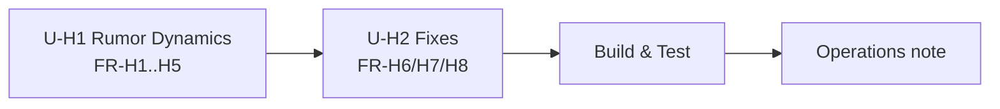

# 실행 계획 — 루머 동역학 & Phase 2 하드닝 (코드리뷰 후속)

**사이클 타입**: 브라운필드 재개, **풀 AI-DLC 단계**(Q6=B), 스코프 = findings 목록(명확화3=A).
**요구사항**: `inception/requirements/rumor-phase2-hardening-requirements.md` (FR-H1..H8 / NFR-H1..H5).

## 1. 단계 실행/스킵 결정

| 단계 | 실행? | 근거 |
|------|-------|------|
| Workspace Detection | ✅ (완료) | 브라운필드 재개 |
| Reverse Engineering | ⏭ SKIP | 기존 코드/문서 최신, RE 산출물 존재 |
| Requirements Analysis | ✅ (승인됨) | FR-H1..H8 / NFR-H1..H5 |
| User Stories | ⏭ SKIP | 신규 페르소나 없음 — 기존 GameMaster/월드빌더 페르소나가 커버. UI는 기존 SessionPanel 확장 |
| **Workflow Planning** | ✅ (본 문서) | 항상 실행 |
| **Application Design** | ✅ EXECUTE | 루머 동역학은 신규 순수 엔진 함수 + 포트 메서드(배치) + 피드백 서비스 로직 → 컴포넌트/메서드 설계 필요 |
| **Units Generation** | ✅ EXECUTE | 다중 유닛으로 분해(동역학 / 소소한 수정) |
| Infrastructure Design | ⏭ SKIP | 신규 인프라 없음(NFR-H4). 스키마 변경 필요 시 `init-schema` idempotent 가산 컬럼으로 한정 |
| Functional Design (per-unit) | ✅ EXECUTE | 신규 데이터/동역학 로직·파라미터 설계 |
| NFR Requirements/Design (per-unit) | ⚙ LIGHT | 단일 light 노트로 고정(결정성/가산성/테스트) — Phase 1/2와 동일 방식 |
| Code Generation (per-unit) | ✅ EXECUTE | 항상 |
| Build & Test | ✅ EXECUTE | 전체 오프라인 스위트 + PBT |
| Operations | ✅ (문서 노트) | operations.md 갱신(신규 인프라 없음) |

## 2. 유닛 분해(제안) — Units Generation에서 확정

- **U-H1 — Rumor Dynamics** (FR-H1 감쇠&prune / FR-H2 증식자격 / FR-H3 지역 피드백 / FR-H4 결정적 파라미터 / **FR-H5 배치 upsert**)
  - 배치 `upsert_rumors`(H5)는 prune/decay의 벌크 쓰기에 필요하므로 이 유닛에 포함.
  - 신규 순수 함수(dynamics 확장), TurnAdvancer 통합, 리포지토리 prune/batch, API/web 피드백 표면화.
- **U-H2 — Fixes** (FR-H6 프론트 `Promise.all` / FR-H7 `set_wiki` 순서 조사·수정 / FR-H8 barrier terrain 드롭 조사·수정)
  - 서로 독립적인 소규모 항목. H7/H8은 **조사 우선** → 실제 결함이면 수정.
- **순서**: U-H1 → U-H2 (U-H1이 핵심 기능이자 위험도 높음; U-H2는 독립적이라 이후 처리). 상호 의존 없음.

## 3. 리스크 / 롤백 / 테스트
- **Risk: Medium-High.** FR-H1~H3(동역학)은 세계 밸런스에 영향이 크고, 기존 Phase 2 턴 동작을
  바꾼다(루머 정리·증식 게이팅·피드백). FR-H5는 3개 어댑터 포트 확장. FR-H7은 월드빌드 경로 수정.
- **Rollback: Moderate.** 전부 additive + 파라미터화(임계/가중을 0 또는 무한대로 두면 기존 동작에
  근접). 캐노니컬 레이어 불변. 유닛 단위 되돌리기 가능.
- **Testing: Moderate-Complex.** 순수 동역학 PBT(감쇠·prune·증식자격·피드백 불변식), TurnAdvancer
  통합 테스트(정리/게이팅/피드백/배치), 배치 어댑터 오프라인(SQLite), 프론트 vitest, [4]/[5] 회귀.
- **회귀 관리**: 신규 파라미터의 "무효화 기본값"으로 기존 Phase 2 테스트가 깨지지 않게 하거나,
  변경된 기대치는 명시적으로 갱신. NPC 쿼리 규칙·캐노니컬 경로 불변 유지.

## 4. 확장(Extensions)
| Extension | Enabled |
|---|---|
| Security Baseline | No |
| Property-Based Testing | Yes (Partial) |

## 5. 다음 산출물
- Application Design: `inception/application-design/rumor-phase2-hardening/*`
- Units Generation: `.../unit-of-work{,-dependency,-story-map}.md`
- 이후 유닛별 Construction (FD → NFR-light → Code Gen) → Build & Test → Operations.
