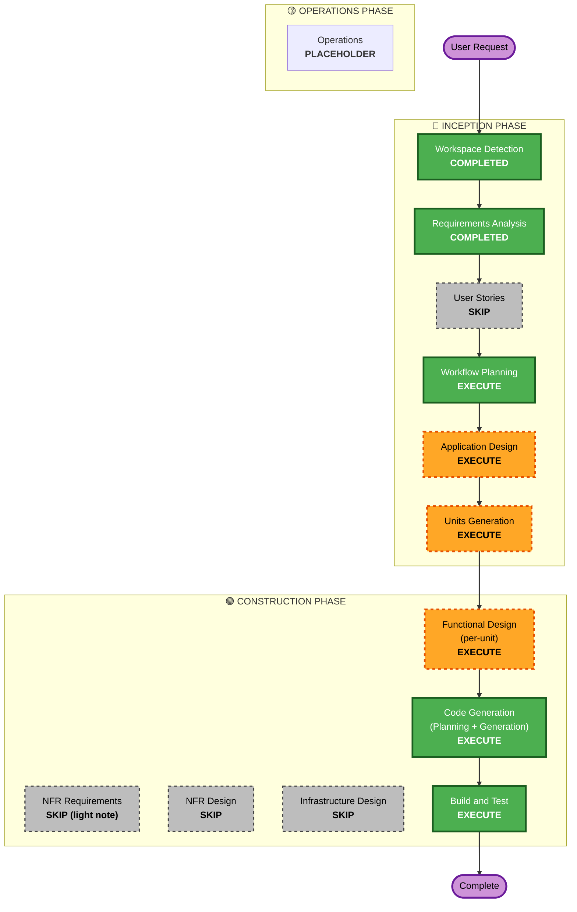

# UX Improvement — Execution Plan

## Detailed Analysis Summary

### Change Impact Assessment
- **User-facing changes**: **Yes** — 앱 전체 재스타일(Tailwind/Doodly), 전체 루머 생성·재생성 UX, 지역별 턴 변동 알림, 한국어 표시(원문 토글).
- **Structural changes**: 소폭 — 신규 백엔드 **Translator**(LLMProvider 포트 뒤) 컴포넌트, 세션 콘텐츠 모델에 en/ko 번역 필드 추가. 프론트는 디자인 시스템 도입(컴포넌트 구조 유지).
- **Data model changes**: **Yes (가산적)** — `SessionRumor`/`SessionEvent`/`TimelineEntry`(및 FR-UX3.6로 결정될 경우 캐노니컬 `Knowledge`)에 번역 필드. PostgreSQL 세션 스키마 후방호환 마이그레이션.
- **API changes**: 소폭 가산적 — 세션 응답에 ko/en 포함. 전체 생성은 프론트 병렬(Q6=B)이라 신규 백엔드 엔드포인트 불필요(FD에서 확정).
- **NFR impact**: **Yes** — 번역 LLM 비용/저장·재사용(NFR-UX2), 진행률/논블로킹 UX(NFR-UX1), 포트 추상화 유지(NFR-UX3), SEC-A~E 실무 항목.

### Component Relationships (brownfield)
- **Primary(backend)**: `locus/session/`(models, repository, postgres_session_repo, game_master/turn, rumor/event services) + 신규 `translation`(Translator, LLMProvider 재사용) · `api/routers/session.py`.
- **Primary(frontend)**: `web/src/`(App, MapOverlay, RegionPanel, SessionBar, SessionPanel, Toolbar, AugmentPanel, api.ts, types.ts) + 신규 Tailwind 설정/디자인 토큰 + 알림·i18n 유틸.
- **Shared**: `locus/llm/`(LLMProvider 포트), `locus/models/`(직렬화). **Dependent**: 프론트는 백엔드 ko/en 데이터에 의존.
- **불변**: 캐노니컬 그래프 스키마(가산 외), 인증(no-auth 유지).

### Risk Assessment
- **Risk Level**: **Medium** (프론트 광범위하나 저위험; 번역은 스키마/생성 파이프라인 변경으로 중위험).
- **Rollback Complexity**: **Moderate** (번역 필드는 가산적·후방호환; 프론트 재스타일은 되돌리기 쉬움).
- **Testing Complexity**: **Moderate** (백엔드 pytest 목 + 프론트 vitest; 번역·알림 그룹핑·전체생성 부분실패 시나리오 추가).

## Workflow Visualization

## Phases to Execute

### 🔵 INCEPTION PHASE
- [x] Workspace Detection (COMPLETED — brownfield resume)
- [x] Requirements Analysis (COMPLETED — APPROVED 2026-08-11)
- [x] User Stories (SKIPPED)
  - **Rationale**: 기존 personas/stories가 액터(디자이너/GameMaster)를 커버; 이전 사이클들과 동일하게 스킵.
- [x] Workflow Planning (IN PROGRESS)
- [ ] Application Design - **EXECUTE**
  - **Rationale**: 신규 컴포넌트(Translator, 알림 셰이핑) + 세션 모델 번역 필드 + 컴포넌트/서비스 메서드·비즈니스 룰 정의 필요. FR-UX3.6(캐노니컬 Knowledge 번역 경계) 결정 포함.
- [ ] Units Generation - **EXECUTE**
  - **Rationale**: 백엔드(번역)·프론트(디자인/기능)로 자연 분해; 순차 의존성 있음. 유닛 경계·순서 확정 필요.

### 🟢 CONSTRUCTION PHASE (per-unit loop)
- [ ] Functional Design (per-unit) - **EXECUTE**
  - **Rationale**: 번역 필드/생성 파이프라인, 알림 지역별 그룹핑 규칙, 전체생성 빈지역 판정·부분실패, 원문 토글 등 데이터 모델·비즈니스 로직 설계 필요.
- [ ] NFR Requirements - **SKIP (light note per unit)**
  - **Rationale**: 신규 인프라/성능 목표 없음. NFR-UX1..6 + SEC-A~E는 요구사항에 고정 → 유닛별 light 노트로 반영(이전 사이클 관례).
- [ ] NFR Design - **SKIP**
  - **Rationale**: NFR Requirements 스킵(라이트)와 대응.
- [ ] Infrastructure Design - **SKIP**
  - **Rationale**: 신규 인프라 없음 — 번역은 기존 OpenAI/LLMProvider 재사용, 신규 서비스·DB 없음(세션 테이블 가산 컬럼만).
- [ ] Code Generation (per-unit) - **EXECUTE (ALWAYS)**
  - **Rationale**: 구현 계획 + 코드/테스트 생성.
- [ ] Build and Test - **EXECUTE (ALWAYS)**
  - **Rationale**: 오프라인 pytest+vitest GREEN 유지, 라이브 시나리오 문서화.

### 🟡 OPERATIONS PHASE
- [ ] Operations - PLACEHOLDER (필요 시 operations.md에 번역/UX 노트 추가)

## Proposed Units (Units Generation에서 확정)
자연 분해(순차 의존):
- **X1 — Localization Backend**: Translator(LLMProvider 재사용) + 세션 콘텐츠 en/ko 번역 필드(생성 시점 저장) + 세션 API 응답에 ko/en 노출 + 후방호환 마이그레이션. (FR-UX3.2/3.3/3.5, FR-UX3.6 경계, SEC-A/C/E)
- **X2 — Frontend Design System**: Tailwind 도입 + "Doodly" 디자인 토큰 + 앱 전체 컴포넌트 재스타일(동작·`data-testid` 계약 보존). (FR-UX1.*, SEC-B/D)
- **X3 — Frontend UX Features**: 전체 루머 생성(빈지역만·확인형 덮어쓰기·병렬 진행률) + 지역 상세 재생성 개선 + **지역별 턴 변동 알림** + 한국어 표시·원문 토글 + UI 라벨 한국어화. (FR-UX2.*, FR-UX3.1/3.4)

**순서/의존**: X1 → X2 → X3 (X3는 X1의 ko/en 데이터 + X2의 디자인 시스템에 의존). *대안*: X2·X3 병합(둘 다 프론트) — Units Generation에서 사용자와 확정.

## Estimated Timeline
- **Total executing stages**: Application Design + Units Generation + (per-unit ×3: FD + CodeGen) + Build&Test.
- 규모: 프론트 광범위 재스타일 + 백엔드 번역 계층. 이전 사이클(P1~P3, S1~S3)과 유사한 다-유닛 구성.

## Success Criteria
- **Primary Goal**: Tailwind/Doodly 재스타일 + 루머 생성 UX 개선 + 지역별 변동 알림 + 한국어 로컬라이징(원문 토글).
- **Key Deliverables**: X1 번역 백엔드, X2 디자인 시스템, X3 UX 기능; 오프라인 테스트 GREEN, 라이브 시나리오 문서.
- **Quality Gates**: 백엔드 pytest + 프론트 vitest GREEN(회귀 0), ruff/black + tsc/vite clean, SEC-A~E 반영, 번역 목킹 오프라인 동작.

## Extension Configuration
- Security Baseline = **No** (SEC-A~E만 일반 NFR로 적용) · Property-Based Testing = **Partial**.
