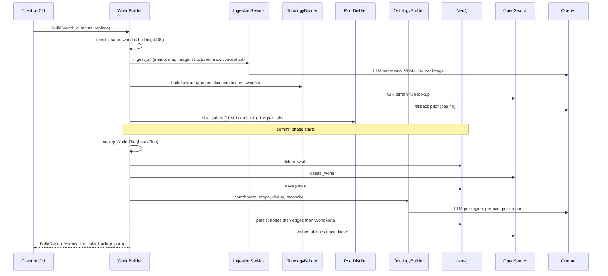
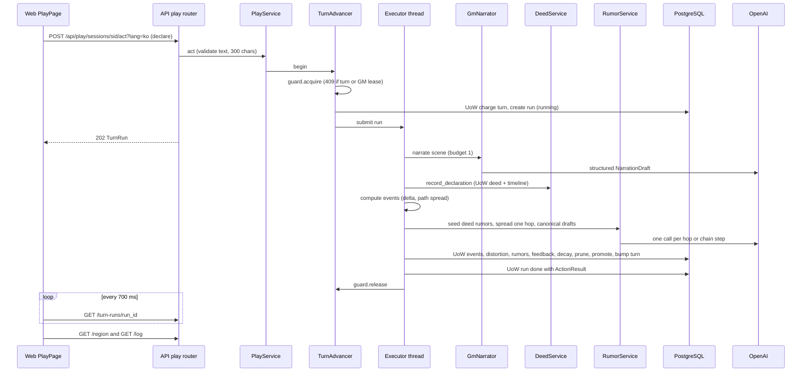
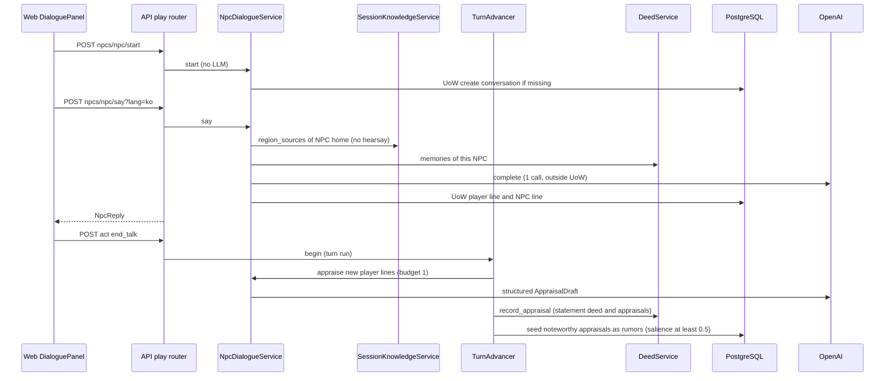
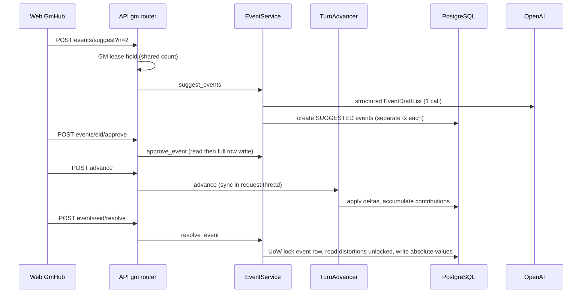

# System Architecture

> Reverse Engineering — Follow-up Cycle (2026-10-07). 기준 커밋 `240e82d`. 2026-09-29 판(개편 전)을 대체한다.

## System Overview

Locus는 한 저장소 안의 모놀리스다. 구성은 다음과 같다.
- **백엔드**: Python 3.11+ 패키지 `locus/`(다섯 경계) + FastAPI 합성 루트 `api/`.
- **프론트엔드**: React/Vite/TS SPA `web/`.
- **저장소 셋**: Neo4j(캐노니컬 그래프), OpenSearch(지식·엔티티·NPC·prior 문서, BM25+kNN), PostgreSQL(세션·번역 캐시).
- **외부 서비스**: OpenAI(LLM·VLM·임베딩, LangChain 어댑터).

운영 형태와 경계:
- Docker Compose로 띄운다. nginx(web)가 SPA를 내고 `/api`를 app(uvicorn, `--workers 1`)으로 넘긴다.
- 프로세스 안의 상태가 둘 있어 워커를 하나로 둔다. `WorldCache`, 그리고 `TurnGuard`·배경 실행기다.
- 인증이 없다.
- 경계 규칙: `shared ← knowledge ← {world, play}`, `localization → shared`만, `locus/**`는 `api`를 import하지 않는다. `tests/test_boundaries.py`가 강제한다.

## Architecture Diagram

```mermaid
flowchart TB
    Browser["브라우저<br/>web SPA (React)"]
    subgraph Web["web 컨테이너 (nginx)"]
        Static["정적 파일 dist"]
        Proxy["api 프록시<br/>빌드 600s, 나머지 130s"]
    end
    subgraph App["app 컨테이너 (uvicorn, workers 1)"]
        Api["api/<br/>main · deps · errors · schemas · uploads"]
        RWorld["라우터 api/world<br/>world.py · world_editor.py"]
        RKnow["라우터 api/knowledge"]
        RPlay["라우터 api/play"]
        RGm["라우터 api/gm"]
        subgraph Locus["locus/"]
            Shared["shared<br/>models · config · llm · storage"]
            Know["knowledge<br/>loader · WorldCache · consensus · query"]
            World["world<br/>build · ingestion · topology · ontology<br/>wiki · augmentation · editor · worldfile · demo"]
            Play["play<br/>session · player · turn · npc · deeds<br/>rumor · event · gm · storage"]
            L10n["localization<br/>TranslationService"]
        end
    end
    Neo4j[("Neo4j 5.15")]
    OS[("OpenSearch 2.13")]
    PG[("PostgreSQL 16")]
    OpenAI["OpenAI API"]
    CLI["CLI: python -m locus"]

    Browser --> Static
    Browser --> Proxy
    Proxy --> Api
    Api --> RWorld
    Api --> RKnow
    Api --> RPlay
    Api --> RGm
    RWorld --> World
    RKnow --> Know
    RPlay --> Play
    RGm --> Play
    Api --> L10n
    World --> Know
    Play --> Know
    Know --> Shared
    World --> Shared
    Play --> Shared
    L10n --> Shared
    Shared --> Neo4j
    Shared --> OS
    Shared --> OpenAI
    Play --> PG
    L10n --> PG
    CLI --> World
    CLI --> Play
```

텍스트 대안:
- 브라우저 → nginx(web): 정적 파일, 그리고 `/api` 프록시(빌드 경로 600초, 나머지 130초).
- nginx → app(uvicorn 한 워커) → `api/` 합성 루트 → 라우터 넷.
  - `/api/world`는 world 경계로, `/api/knowledge`는 knowledge 경계로 간다.
  - `/api/play`와 `/api/gm`은 play 경계로 간다.
  - 번역은 `api/schemas.py`가 localization을 불러 붙인다.
- world와 play는 knowledge를 읽고, 모든 경계는 shared를 쓴다.
- shared는 Neo4j, OpenSearch, OpenAI에 닿는다. play와 localization은 PostgreSQL에 닿는다.
- CLI(`python -m locus`)도 합성 루트로서 world와 play를 직접 조립한다.

## Component Descriptions

### `locus/shared`
- **Purpose**: 공통 모델·설정·포트·어댑터.
- **Responsibilities**:
  - `Settings`(pydantic-settings, `.env`)와 조정값 `tuning.py`.
  - LLM·VLM·임베딩 포트, OpenAI 어댑터(SDK 재시도 0 + tenacity 3회, 30초 타임아웃), `LLMCallCounter`.
  - `GraphRepository`·`SearchRepository` 포트, Neo4j·OpenSearch 어댑터, 순수 `graph_mapping`, `persist_graph`(노드 → 엣지 → 임베딩 → 색인).
  - `SharedContainer`/`assemble_shared(strict=…)`.
- **Dependencies**: 없음(최하위).
- **Type**: Shared library.

### `locus/knowledge`
- **Purpose**: 스냅샷과 지역별 합의.
- **Responsibilities**:
  - `WorldLoader`: 라벨 7종과 엣지를 읽어 `WorldSnapshot`을 만든다. 깨진 항목은 `load_warnings`로 건너뛴다.
  - `WorldCache`: 프로세스 하나, 세대 번호와 WorldMeta 버전 표식을 쓴다.
  - `compute_consensus`/`best_path_weights`(순수), `QueryEngine`.
- **Dependencies**: shared.
- **Type**: Application (domain).

### `locus/world`
- **Purpose**: 월드 만들기와 편집.
- **Responsibilities**:
  - `WorldBuilder`: 준비 단계는 그래프에 쓰지 않는다. 커밋 단계는 백업 → 삭제 → 저장이고, 같은 월드의 동시 빌드는 409다.
  - 빌드 단계별 서비스: 수집 · 토폴로지 · 온톨로지 · wiki.
  - `Editors` 묶음: 지역·연결·지식·NPC·엔티티 편집기와 `EditorWrites.writing()`(meta touch + 캐시 무효화).
  - `AugmentationService`/`Engine`, `WorldFileExporter`/`Importer`, `DemoWorlds`, `NpcDraftService`, `WikiAdmin`, `CrossWorldWikiExplorer`, `WorldCatalog`.
- **Dependencies**: shared, knowledge.
- **Type**: Application.

### `locus/play`
- **Purpose**: 세션·턴·대화·행적·소문·사건.
- **Responsibilities**:
  - 서비스 15개를 `PlayContainer`에 담는다.
  - `TurnAdvancer`가 턴 진입점 하나다. 그 아래 `TurnGuard`(세션당 턴 하나 + GM 리스 공유 카운트), `ThreadTurnExecutor`(데몬 스레드 하나, FIFO), `LlmBudget`(턴당 8), `RegionQuota`(지역당 활성 소문 20)가 있다.
  - 포트 10개 + `PlayUnitOfWork` + PostgreSQL 어댑터 하나. 인메모리 쌍둥이는 테스트 전용이다.
- **Dependencies**: shared, knowledge. world와 localization은 import하지 않는다.
- **Type**: Application.

### `locus/localization`
- **Purpose**: 번역 캐시.
- **Responsibilities**: `TranslationService.enrich`(캐시 전용, 해시 검증), 백그라운드 warm(스레드 풀), purge.
- **Dependencies**: shared.
- **Type**: Application.

### `api/`
- **Purpose**: 합성 루트와 REST.
- **Responsibilities**:
  - `assemble_all`: 경계마다 `_try`로 실패를 가둔다. 실패한 경계의 라우트만 503이 된다.
  - lifespan: 끊긴 run을 `failed(interrupted)`로 바꾸고, 종료 때 실행기를 닫는다(30초).
  - `BodyLimitMiddleware`(48 MiB, World File 21 MiB), 422 처리기, 오류 매핑, DTO와 `*_ko`.
- **Dependencies**: 다섯 경계 전부.
- **Type**: Application (composition root).

### `web/`
- **Purpose**: SPA 네 화면.
- **Responsibilities**: 라우트(`/`, `/editor/:worldId`, `/play/:sessionId`, `/gm/:sessionId`), 기능별 폴더(`features/{home,editor,play,gm}`), 프리미티브(`ui/`), API 클라이언트(`api/`), i18n, capabilities.
- **Dependencies**: `/api/*`.
- **Type**: Application (frontend).

### `locus/__main__.py` (CLI)
- **Purpose**: 운영자·개발자 명령.
- **Responsibilities**: `init-schema`, `world build|export|import|demo|list`.
  - 명령마다 필요한 자원만 strict로 조립한다.
  - 교체 전에 열린 세션을 확인하고, 있으면 `--force`가 있어야 닫는다.
  - CLI의 `TurnGuard`는 API 프로세스와 따로다.
- **Type**: Application (composition root).

## Data Flow

### 월드 빌드 (BT-W1)

텍스트 대안:
1. 같은 월드를 빌드하는 중이면 409로 거절한다. 공급자마다 호출 수 세기 래퍼를 씌운다.
2. **준비 단계**(그래프에 쓰지 않음)를 돈다.
   - 수집: 메모마다 LLM 1회, 그림마다 VLM 1 + LLM 1, 구조화 지도는 순수 파싱이다.
   - 토폴로지: 계층, 연결 후보(양방향 두 엣지), 가중치를 만든다. 지형 규칙은 wiki에서 찾고, 빗나가면 LLM 폴백(상한 40)을 쓴다.
   - prior 증류(LLM 1)와 prior 연결(쌍마다 LLM 1)을 한다.
3. **커밋 단계**를 돈다.
   - 백업(실패해도 계속 — RE-W04) → 그래프·검색에서 월드 삭제 → prior 저장.
   - 온톨로지: 지역마다 보강 사실 LLM 1, 중복 후보 쌍마다 LLM 1, 고아 엔티티마다 임베딩과 LLM을 부른다.
   - 노드 → 엣지 → WorldMeta를 저장하고, 임베딩 한 번에 색인한다.
4. 리포트를 돌려준다. 호출자(API/CLI)는 확인된 열린 세션을 닫는다. API만 지식 번역을 지운다.
- LLM 호출에 상한이 없다(세기만 함, RE-W08). 온톨로지가 삭제 뒤에 돌아 커밋 창이 길다(RE-W17).

### 플레이어 선언 한 턴 (BT-P3, BT-P5)

텍스트 대안:
1. 웹이 `act`(선언)를 보낸다. 서비스가 글을 1차로 검증하고, 턴 엔진이 가드를 쥔다. 다른 턴이나 GM 리스가 있으면 409다.
2. 엔진이 가드 안에서 세션·스냅숏·플레이어를 다시 읽어 다시 검증한다.
3. UoW 하나로 턴 청구와 run(running) 생성을 한다. 그다음 배경 실행기에 넘기고 202를 돌려준다.
4. 배경 스레드가 일을 이어 간다.
   - 서술: LLM 1회를 부르고, 실패하면 대체 서술을 쓴다. 선언 행적과 타임라인을 기록한다.
   - 사건 계산: 크기 × 0.3을 최대곱 경로(≥ 0.15)로 번지게 한다.
   - 소문: 행적 씨앗(LLM 없음), 한 칸 전파(칸마다 LLM 1), 사건 대상 지역의 캐노니컬 초안(사슬 단계마다 LLM 1).
   - 저장: UoW 하나로 사건·왜곡도·소문·되먹임·감쇠·가지치기·승격·턴 증가를 한다. 끝으로 run을 DONE으로 바꾸고 가드를 푼다.
5. 웹은 700ms마다 run을 읽고(상한 없음 — RE-F08), 끝나면 지역과 기록을 다시 읽는다.
- 실패하면 보상한다: 청구를 환불하고, 0턴이면 이동을 되돌리고 그 run의 행적을 지운다. 재시작으로 끊긴 run은 보상하지 않는다(RE-P03).

### NPC 대화 한 줄과 대화 마침 판단 (BT-P4)

텍스트 대안:
1. 대화 열기는 LLM 없이 된다.
2. 한 줄을 보내면 문맥을 만든다. 문맥은 NPC 집 지역의 합의(전해 들음 제외, 소문이 출처를 가림)와 그 NPC의 행적 기억이다. LLM 1회를 UoW 밖에서 부르고, 두 줄을 UoW로 저장한다.
3. [대화 끝내기]는 턴 run이다. 첫 턴 앞에 새 플레이어 줄이 있으면 판단 LLM 1회를 부른다. 그 결과로 발언 행적과 목격 판단을 기록한다.
4. 같은 턴에 전할 만한 판단(salience ≥ 0.5)이 씨앗 소문이 된다. 다음 턴부터 한 칸씩 퍼진다.

### GM 사건 제안 → 승인 → 턴 → 해소 (BT-G3)

텍스트 대안:
1. 제안은 GM 리스를 쥔다. GM끼리는 함께 쥔다. 보일 지역(최대 30)과 최근 사건·행적으로 LLM 1회를 부르고, 초안마다 SUGGESTED를 저장한다.
2. 승인은 상태 조건 없이 행 전체를 쓴다(RE-P06).
3. 다음 턴에서 ACTIVE 사건이 왜곡도를 올리고 경로로 번진다. 실제로 바뀐 양을 `contributions`에 쌓는다.
4. 해소는 사건 행만 `FOR UPDATE`로 잠근다. 지역 왜곡도는 잠그지 않고 읽어 절대값으로 쓴다. 그래서 두 해소가 겹치면 한 쪽 복원을 잃는다(U8 #9).

## Integration Points

- **External APIs**: OpenAI.
  - 채팅 모델 `gpt-4o`: 구조화 출력과 complete. 빌드, 대화, 서술, 판단, 소문 사슬, 사건 제안, 보강 판정·다듬기, NPC 초안, 번역에 쓴다.
  - VLM `gpt-4o`: 지도 그림·컨셉 아트.
  - 임베딩 `text-embedding-3-small`(1536): 색인과 검색.
  - LangChain `langchain-openai`로 부른다.
  - 키가 없으면 LLM 의존 서비스가 조립되지 않고, 해당 라우트가 503이다. 화면은 `GET /api/capabilities`로 버튼을 끈다.
- **Databases**:
  - **Neo4j**: 라벨 7종(`Region`, `Entity`, `Knowledge`, `WikiPrior`, `NPC`, `EventSeed`, `WorldMeta`)과 관계 9종이다. 라벨마다 id 유일 제약과 world_id 인덱스가 있다.
  - **OpenSearch**: 단일 인덱스 `locus_search`, kNN HNSW(nmslib)다. 문서는 Knowledge·Entity·WikiPrior·NPC다.
  - **PostgreSQL**: 세션 테이블 11개(FK 없음)와 `translations` 하나다.
- **Third-party Services**: 없음. GitHub Actions(CI)가 있다.

## Infrastructure Components

- **Deployment Model**: Docker Compose(`docker-compose.yml`).
  - 기본 프로필(인프라): neo4j 5.15-community + APOC, opensearch 2.13.0(보안 꺼짐), postgres 16-alpine. 셋 다 healthcheck가 있고 `127.0.0.1`에 묶인다.
  - `service` 프로필: app(루트 `Dockerfile`, `python:3.11-slim`, `init-schema && uvicorn --workers 1`, healthcheck `/health`)과 web(`web/Dockerfile`, `node:22-alpine` → `nginx:alpine`).
    - 둘 다 `0.0.0.0`에 묶인다(`API_PORT`, `WEB_PORT`).
  - `tools` 프로필: opensearch-dashboards(healthcheck 없음).
- **볼륨**: neo4j·opensearch·postgres는 `./data/…` 바인드다. 앱 데이터(World File 백업)는 named volume `locus_data`다.
- **비밀값**: `NEO4J_PASSWORD`, `SESSION_DB_PASSWORD`. 비어 있으면 compose가 바로 실패한다.
- **Networking**: bridge `locus-net` 하나. nginx `client_max_body_size 49m`, 빌드 경로 600초, 나머지 `/api` 130초.
- **CI**: `.github/workflows/ci.yml`. 모든 push와 main 대상 PR에 돈다.
  - backend(Python 3.11, ruff, black, pytest)
  - frontend(Node 22, tsc, vitest)
  - audit(`npm audit --omit=dev`)
  - images(두 이미지 빌드, 패키지 데이터 확인, `import api.main`)
- **운영 문서**: `aidlc-docs/operations/operations.md`(사이클별 절).
