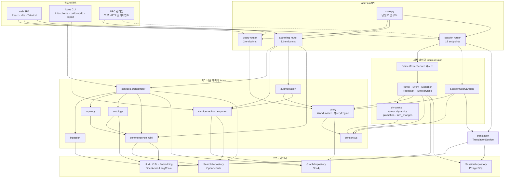
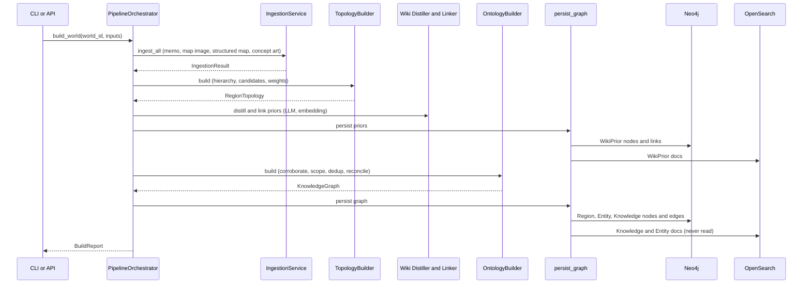
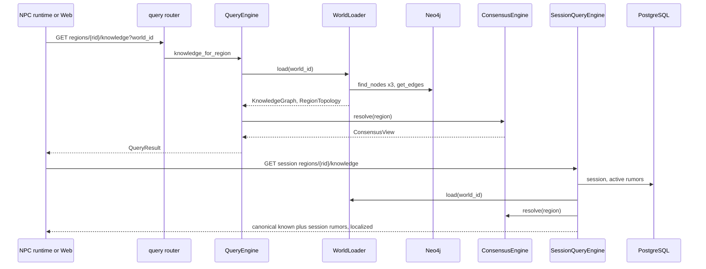

# System Architecture

> Reverse Engineering — Purpose Restructure Cycle (2026-09-29). 기준 커밋 `ee61277`.

## System Overview

- **형태**: 계층형 모듈러 모놀리스. 저장소 하나에 백엔드와 프론트엔드가 함께 있다.
  - Python 코어 패키지 `locus/` (14 하위 패키지)
  - FastAPI 앱 `api/` (라우터 3개, 34 엔드포인트)
  - React SPA `web/`
- **두 레이어**:
  - **캐노니컬 레이어**: 월드별 정적 그래프. Neo4j와 OpenSearch에 저장한다.
  - **세션 레이어**: 한 판의 동적 상태와 번역 캐시. PostgreSQL에 저장한다. 캐노니컬을 id로 참조만 하고, 캐노니컬에 쓰지 않는다.
- **외부 I/O**: 전부 포트(Protocol) 뒤에 있다(`GraphRepository`, `SearchRepository`, `LLMProvider`/`VLMProvider`/`EmbeddingProvider`, `SessionRepository`). 오프라인 테스트는 이 포트들을 mock한다.
- **조립**: 조립 루트 하나(`api/main.py::_wire_default`)가 캐노니컬·세션·번역 서비스를 함께 만들어 `app.state`에 넣는다. 라우터는 서비스를 문자열 이름으로 꺼낸다. CLI(`locus/__main__.py`)는 캐노니컬 저장소만 따로 조립한다.

## Architecture Diagram

텍스트 대안:
- 클라이언트는 셋이다.
  - web SPA는 query·authoring·session 라우터를 모두 호출한다.
  - CLI는 orchestrator와 exporter를 직접 호출한다.
  - NPC 런타임은 query 라우터(선택적으로 session 라우터)를 호출한다.
- 라우터별 의존:
  - query 라우터 → `QueryEngine` → `consensus`.
  - authoring 라우터 → orchestrator(ingestion→topology→wiki→ontology), editor·exporter, augmentation, wiki 관리.
  - session 라우터 → `GameMasterService` 파사드 → 하위 서비스 5개 → 순수 수학 모듈. 하위 서비스는 `WorldLoader`와 `consensus`를 읽는다. `SessionQueryEngine`과 `TranslationService`도 이 라우터에서 부른다.
- 어댑터별 사용처:
  - Neo4j: orchestrator, query, editor.
  - OpenSearch: orchestrator, editor, wiki.
  - OpenAI: ingestion, ontology, wiki, 세션 하위 서비스, 번역.
  - PostgreSQL: 세션 하위 서비스, 번역.

## Component Descriptions

### `locus/models`
- **Purpose**: 도메인 어휘. 모듈 경계를 넘는 모든 Pydantic 모델이 여기 있다.
- **Responsibilities**: 노드·엣지·집계·뷰·리포트 모델, enum.
- **Dependencies**: pydantic만.
- **Type**: Model

### `locus/config`
- **Purpose**: 환경 변수 기반 설정.
- **Responsibilities**: LLM·Neo4j·OpenSearch·세션 DB·루머 동역학·번역 설정.
- **Dependencies**: pydantic-settings, **`locus.session.rumor_dynamics`** (역방향 의존).
- **Type**: Infrastructure

### `locus/llm`
- **Purpose**: 공급자에 중립적인 LLM·VLM·임베딩 포트와 OpenAI 어댑터.
- **Responsibilities**: 구조화 출력, 재시도(tenacity 3회, 30초 제한).
- **Dependencies**: config, langchain-openai, tenacity.
- **Type**: Client

### `locus/ingestion`
- **Purpose**: 입력 자료를 후보 구조로 바꾼다.
- **Responsibilities**: 메모·지도 이미지·구조화 지도·컨셉아트 처리기, 병합.
- **Dependencies**: llm, models.
- **Type**: Application

### `locus/topology`
- **Purpose**: 지역 계층과 가중치 있는 연결망 (핵심 산출물 1).
- **Responsibilities**: 계층 해석, 연결 후보 수집, 가중치 계산.
- **Dependencies**: models, commonsense_wiki (근거 문구에만).
- **Type**: Application

### `locus/ontology`
- **Purpose**: 지역 스코프 지식 그래프.
- **Responsibilities**: 스코핑, 고증, 중복 제거, 엔티티 정합.
- **Dependencies**: llm, commonsense_wiki, models.
- **Type**: Application

### `locus/consensus`
- **Purpose**: 지역별 "아는 것"을 계산한다 (핵심 산출물 2).
- **Responsibilities**: 상속, 전역, 최대 곱 경로 전파, 소문 분류.
- **Dependencies**: models (순수, I/O 없음).
- **Type**: Application

### `locus/query`
- **Purpose**: NPC 서빙.
- **Responsibilities**: 월드 로드(`WorldLoader`), 지역 지식 질의, 지역 비교. 세션 전용 `canonical_known`도 여기 있다.
- **Dependencies**: consensus, storage, models.
- **Type**: Application

### `locus/commonsense_wiki`
- **Purpose**: 월드별 상식 prior.
- **Responsibilities**: 조회(LLM 폴백), 증류, 연결, 관리, 교차 월드 검색.
- **Dependencies**: llm, storage, models.
- **Type**: Application

### `locus/augmentation`
- **Purpose**: 기획자 보강 Q&A.
- **Responsibilities**: 탐지, 질문 생성, 답 적용, 되돌리기. 세션은 메모리에 보관한다. LangGraph 래퍼가 있지만 호출되지 않는다.
- **Dependencies**: storage, models (loader·editor·wiki는 덕 타이핑).
- **Type**: Application

### `locus/services`
- **Purpose**: 파이프라인 조립과 편집·내보내기.
- **Responsibilities**: `PipelineOrchestrator`, `GraphEditor`, `Exporter`.
- **Dependencies**: ingestion, topology, ontology, commonsense_wiki, storage, query.loader, llm.
- **Type**: Application

### `locus/storage`
- **Purpose**: 영속 포트와 어댑터, 도메인↔저장소 매핑.
- **Responsibilities**: Neo4j·OpenSearch 어댑터, `graph_mapping`, `persist_graph`, `SchemaInitializer`, **PostgreSQL 세션 어댑터**(세션 모델에만 의존하는데 이 패키지에 있다).
- **Dependencies**: models, llm.base, neo4j, opensearch-py, sqlalchemy, psycopg.
- **Type**: Infrastructure

### `locus/session`
- **Purpose**: 게임 세션 시뮬레이터.
- **Responsibilities**: 세션 생애주기, 루머, 이벤트, 왜곡도, 턴, 타임라인, 세션 NPC 질의, 인메모리 저장소.
- **Dependencies**: models, query(`WorldLoader`, `canonical_known`), consensus, storage.base, llm.base.
- **Type**: Application

### `locus/translation`
- **Purpose**: 표시용 번역 캐시.
- **Responsibilities**: 캐시 조회, 백그라운드 워밍, LLM 번역.
- **Dependencies**: llm.base, **session.models / session.repository**.
- **Type**: Application

### `api/`
- **Purpose**: HTTP 서빙과 조립.
- **Responsibilities**: 조립 루트, 라우터 3개, 오류 매핑.
- **Dependencies**: fastapi, locus 전체.
- **Type**: Application

### `web/`
- **Purpose**: 단일 페이지 UI.
- **Responsibilities**: 지도 오버레이, 지역 지식, 보강, 세션 바, GameMaster 패널, 알림.
- **Dependencies**: React, Tailwind, `/api` 프록시.
- **Type**: Application

### `examples/demo_world`, `locus/demo.py`
- **Purpose**: 번들 데모(Aldermoor).
- **Responsibilities**: 런타임에는 `map.png`만 읽는다. 메모와 지도 JSON은 `demo.py`에 인라인으로 중복되어 있다.
- **Type**: Test/Sample

## Data Flow

### 월드 빌드 (BT-C1)

텍스트 대안: CLI/API → orchestrator → 수집 → 토폴로지 → prior 증류·연결 → prior 저장(Neo4j+OpenSearch) → 온톨로지(고증, 스코핑, 중복 제거, 정합) → 그래프 저장(Neo4j 노드·엣지 + OpenSearch 문서) → `BuildReport`.

### NPC 지역 지식 질의 (BT-C2, BT-S6)

텍스트 대안:
- 캐노니컬 질의: 월드 전체 로드(Neo4j 조회 4회, 캐시 없음) → 합의 계산 → `QueryResult`.
- 세션 질의: 세션과 활성 루머를 PostgreSQL에서 읽고 → 같은 월드 로드와 합의 계산 → direct+inherited+global에 세션 루머를 덧씌우고 → 번역 캐시로 `_ko`를 채운다.

### 턴 진행 (BT-S5)

텍스트 흐름 (`locus/session/turn.py:78-183`):
1. **이벤트 적용.** 월드를 로드하고 ACTIVE 이벤트를 모은다. 강도 × 0.3을 연결 가중치(≥0.15)로 전파하고 기여를 누적한다. one_shot 이벤트는 해결 처리한다.
2. **루머 추가.** 이벤트 대상 지역마다 LLM 왜곡 체인을 동기로 호출한다. 원본은 지지도 0.3 이상이어야 하지만, 캐노니컬 원본에는 이 조건이 없다.
3. **되먹임.** 지지도가 높은 루머의 밀도 × 0.1만큼 지역 왜곡도를 올린다.
4. **지지도.** 이벤트 지역은 +0.1, 강화되지 않은 지역은 −0.05.
5. **가지치기.** 지지도 < 0.05이면 `active=False`로 만든다.
6. **승격·강등.** 기준은 0.6이다.
7. **저장과 알림.** `upsert_rumors`로 일괄 저장하고, 턴 번호를 올리고, `RegionTurnChange`를 만들어 `TurnResult`를 돌려준다.

- 전체가 여러 트랜잭션으로 나뉘어 있고, 잠금이 없으며, LLM을 HTTP 요청 안에서 동기로 호출한다.

## Integration Points

- **External APIs**:
  - OpenAI를 LangChain으로 호출한다(`ChatOpenAI`, `OpenAIEmbeddings`). 기본 모델은 `gpt-4o` / `text-embedding-3-small`이다.
  - 수집, 고증, 중복 제거, 정합, wiki, 보강 질문, 루머 왜곡, 이벤트 제안, 번역에 쓴다.
  - 공급자로 `openai`만 지원한다.
- **Databases**:
  - Neo4j 5.15: 캐노니컬 그래프. 로더는 `CONNECTED_TO`와 `SCOPED_TO`만 읽는다.
  - OpenSearch 2.13: `locus_search` 인덱스 하나. 실제로 읽는 것은 WikiPrior뿐이다.
  - PostgreSQL 16: 세션 테이블 5개와 `translations`.
- **Third-party Services**: 없음.

## Infrastructure Components

- **CDK Stacks**: 없음. 클라우드 IaC(Terraform, CloudFormation 등)도 없다.
- **Deployment Model**: 로컬 Docker Compose.
  - 기본 서비스: neo4j, opensearch, postgres, dashboard.
  - `service` 프로파일: app(uvicorn), web(nginx).
  - 루트 `Dockerfile`이 `api/`를 복사하지 않아 `service` 프로파일의 app 컨테이너가 기동하지 못한다. web은 app의 health를 기다리므로 web도 뜨지 않는다.
- **Networking**:
  - `locus-net` 브리지 네트워크.
  - DB 포트가 모든 인터페이스에 공개되어 있다.
  - OpenSearch 보안은 꺼져 있다.
  - API 인증이 없고 CORS도 없다(same-origin 프록시에 의존).
