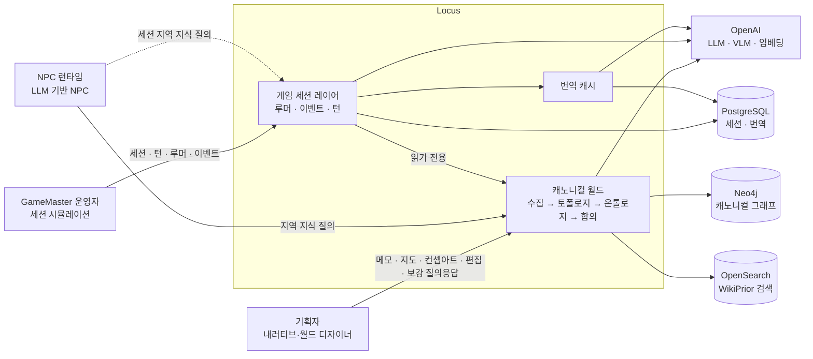

# Business Overview

> Reverse Engineering — Purpose Restructure Cycle (2026-09-29). 기준 커밋 `ee61277` (main).
> 근거: 코드 전체 정독(캐노니컬 파이프라인 / 세션·번역·API / 프론트엔드·테스트·도구), 오프라인 테스트 실행(pytest 281 + vitest 24 GREEN), 인메모리 시뮬레이션으로 결함 재현.
> 이 문서는 표준 RE 절에 더해 **"목적 지도"** 절을 둔다. 이번 사이클의 요청이 "목적을 더 명료하게"이기 때문이다.

## Business Context Diagram

텍스트 대안:
- 기획자 → 캐노니컬 월드: 자료 입력, 편집, 보강 Q&A.
- GameMaster 운영자 → 게임 세션 레이어: 세션, 턴, 루머, 이벤트.
- NPC 런타임 → 캐노니컬 월드: 지역 지식 질의 (`GET /api/query/regions/{rid}/knowledge`).
- NPC 런타임 → 게임 세션 레이어: 세션 지역 지식 질의 (`GET /api/session/sessions/{sid}/regions/{rid}/knowledge`). 세션을 아는 클라이언트만 쓸 수 있다.
- 게임 세션 레이어는 캐노니컬 월드를 읽기만 하고 쓰지 않는다.
- 외부: OpenAI(LLM·VLM·임베딩), Neo4j(캐노니컬 그래프), OpenSearch(WikiPrior 검색), PostgreSQL(세션·번역 캐시).

## Business Description

- **Business Description**:
  - **처음 선언한 목적** (2026-06-07 requirements.md): 흩어진 세계관 자료(비정형 메모, 지도 이미지, 컨셉아트)를 입력받아 두 가지를 자동으로 만든다.
    1. 지역 간 연결 네트워크 토폴로지.
    2. 지역별로 스코프가 지정된 지식 그래프, 곧 "지역 X에 사는 NPC가 아는 것".
  - 이 두 산출물을 LLM 기반 NPC의 컨텍스트 소스로 제공해 수동 스크립트를 대체한다. 1차 사용자는 기획자, 2차 소비자는 NPC 런타임이다.
  - **지금 코드가 실제로 하는 일**: 위 파이프라인에 더해, PostgreSQL 위의 **게임 세션 시뮬레이터**가 코드와 UI의 가장 큰 몫을 차지한다. 이 시뮬레이터는 GameMaster 턴, LLM 루머 왜곡 체인, 지지도·승격, 이벤트에 따른 지역 왜곡도 동역학을 다룬다. 한국어 번역 캐시와 손그림 스타일 UI도 붙어 있다.
  - 결과적으로 **제품 축이 두 개**다. 캐노니컬 "공간 지식 빌더"와 "루머·이벤트 시뮬레이터"이며, 둘은 NPC 서빙 경로 하나로만 이어진다.

- **Business Transactions**:

  **캐노니컬 — 공간 지식 빌더**

  | ID | Transaction | 트리거 | 요약 | 목적 |
  |---|---|---|---|---|
  | BT-C1 | 월드 빌드 | CLI `build-world`, `POST /authoring/worlds/{w}/build`(UI 미사용), `.../build/demo`(UI) | 입력을 수집하고 → 계층·연결 가중치로 토폴로지를 만들고 → WikiPrior를 증류·연결하고 → 지식을 지역에 스코프하고 → LLM 고증을 추가하고 → 중복 제거·엔티티 정합을 거쳐 → Neo4j와 OpenSearch에 저장한다 | 핵심 |
  | BT-C2 | NPC 지역 지식 질의 | `GET /api/query/regions/{rid}/knowledge` | 월드 전체를 로드하고 합의(direct/inherited/global/propagated/rumor)를 계산해 `QueryResult`를 돌려준다. 결과는 저장하지 않는다 | 핵심 서빙 |
  | BT-C3 | 지역 비교 | `GET /api/query/diff` | 두 지역의 공유·고유 지식 id를 돌려준다 | 보조 (UI 미사용) |
  | BT-C4 | 내보내기 | CLI `export`, `GET /authoring/worlds/{w}/export` | 원시 그래프(지역·연결·엔티티·지식·스코프)를 내보낸다. 지역별 합의 결과는 포함하지 않는다 | 보조 (UI 지도 페이로드) |
  | BT-C5 | 그래프 편집 | `PUT regions/knowledge`, `DELETE nodes` | 노드 upsert·삭제. 토폴로지 편집 수단은 없다 | 기획자 도구 |
  | BT-C6 | 지식 보강 Q&A | `POST augment/session`, `answer`, `revert` | 빈틈·저신뢰·wiki 충돌·고아를 탐지하고 → LLM이 질문을 만들고 → 답을 그래프 편집으로 적용한다 | 기획자 도구 (현재 UI에서 동작하지 않음) |
  | BT-C7 | Wiki 관리·교차 월드 참조 | `POST priors`, `GET related-priors` | WikiPrior upsert, 다른 월드의 prior 검색 | 부가 (UI 없음, 교차 검색은 실환경에서 깨짐) |
  | BT-C8 | 스키마 초기화 | CLI `init-schema`, API 기동 | Neo4j 제약, OpenSearch 인덱스, **PostgreSQL 세션 테이블까지** 만든다 | 인프라 |

  **세션 — 루머·이벤트 시뮬레이터**

  | ID | Transaction | 트리거 | 요약 |
  |---|---|---|---|
  | BT-S1 | 세션 시작·종료·조회 | `POST/GET /session/worlds/{w}/sessions`, `close` | 세션을 만들 때 지역마다 왜곡도 0.3을 넣는다. 재개·삭제는 없다 |
  | BT-S2 | 루머 생성·재생성 | `POST .../rumors`, `.../rumors/regen` | 합의 결과(direct+propagated)와 기존 루머를 원본으로 삼아 강도별 3단 LLM 왜곡 체인을 만든다. 재생성은 승격된 루머를 보존한다 |
  | BT-S3 | 지지도·왜곡도 조정 | `PUT .../support`, `PUT .../distortion` | 수동으로 조정하고 타임라인에 기록한다 |
  | BT-S4 | 이벤트 생성·제안·승인·해결·폐기 | `events` 계열 5개 | 카테고리·강도·수명주기를 가진 이벤트. LLM 제안은 지역 UUID만 보고 만든다 |
  | BT-S5 | 턴 진행 | `POST .../advance-turn` | 이벤트 적용·토폴로지 전파 → 루머 추가 → 루머가 지역에 되먹임 → 지지도 진화·감쇠 → 가지치기 → 승격·강등 → 지역별 변동 알림 |
  | BT-S6 | 세션 NPC 질의 | `GET /session/sessions/{sid}/regions/{rid}/knowledge` | 캐노니컬 지식(direct+inherited+global)에 세션 루머를 덧씌운다. **시뮬레이터가 NPC 쪽으로 이어지는 유일한 경로** |
  | BT-S7 | 타임라인 | `GET .../timeline` | 턴별 변경 기록 |
  | BT-L1 | 번역 읽기 + 백그라운드 워밍 | 루머·이벤트 목록, 세션 NPC 질의 | 캐시에 있으면 `_ko`로 채우고, 없으면 백그라운드에서 LLM으로 번역한다. 캐노니컬 `/api/query`는 번역하지 않는다 |

- **Business Dictionary**:

  | 용어 | 뜻 | 주의 |
  |---|---|---|
  | Spatial Knowledge (공간 지식) | 한 지역에 사는 NPC가 공유하는 지역적 합의 지식 | 핵심 개념이지만 **저장된 산출물은 아니다**. 질의할 때마다 계산한다 |
  | World (`world_id`) | 한 게임 세계. 모든 그래프를 world로 나눈다 | `World` 모델은 정의만 있고 쓰이지 않는다 |
  | Region | 계층(continent>province>town>district, 그리고 terrain)을 가진 지역 노드 | `district`는 만들어지지 않는다 |
  | ConnectionEdge | 지역 간 연결(adjacent/route/river/blocked)과 가중치 | 가중치 = 기본값 × 지형 보정 |
  | Knowledge / ScopeLink | 지식 진술과, 그것이 속한 지역 링크 | 저장되는 것은 DIRECT 스코프뿐이다 |
  | Consensus | direct·inherited·global·propagated(경로 가중치 ≥0.5)·rumor(0.15~0.5)로 나눈 지역별 지식 뷰 | 질의할 때 계산 |
  | **rumor (캐노니컬)** | 연결이 약해 거리 기반으로 "소문으로만 아는" 지식. 텍스트는 바뀌지 않는다 | 아래 SessionRumor와 **같은 이름, 다른 뜻** |
  | **SessionRumor** | LLM이 실제로 왜곡한 세션 내 소문 텍스트 | |
  | **distortion_degree** | 캐노니컬: 1 − 경로 가중치 / 세션: 지역 왜곡도(GM이 조정, 이벤트로 변함) | **같은 이름, 다른 뜻** |
  | **session** | 보강 Q&A 세션(메모리) / 게임 세션(PostgreSQL) | **같은 이름, 다른 뜻**. `SessionStatus` enum도 둘 |
  | WikiPrior (상식 Wiki) | 조건→효과 형태의 상식 prior. 월드마다 자기 입력에서 증류한다 | 처음 개념은 "실세계 디지털 트윈"이었으나 월드별 자기 증류로 바뀌었다. 프롬프트에는 아직 "real-world"라고 남아 있다 |
  | Corroboration (고증) | WikiPrior를 근거로 LLM이 지역마다 최대 2개 사실을 추가 생성 | 월드 자기 입력에서 나온 prior로 같은 월드를 보강하는 **순환 구조** |
  | Augmentation | 그래프 빈틈을 기획자에게 묻고 답을 반영하는 Q&A 루프 | |
  | GameMaster / Turn | 세션을 한 단계씩 진행하는 주체 / 단위 | |
  | support / promotion | 루머의 공신력 / 0.6 이상이면 세션 안에서 direct 지식처럼 노출 | |
  | SessionEvent | 전쟁·역병·정치·재해·축제·발견 이벤트. 지역 왜곡도를 바꾼다 | |

## Component Level Business Descriptions

### 수집 (`locus/ingestion`)
- **Purpose**: 기획자의 비정형 자료를 후보 지역·엔티티·관계·지식으로 바꾼다.
- **Responsibilities**: 메모(LLM), 지도 이미지(VLM→LLM), 구조화 지도(GeoJSON·Locus JSON, LLM 없음), 컨셉아트(VLM, 신뢰도 상한 0.4)를 처리하고 결과를 병합한다.

### 토폴로지 (`locus/topology`)
- **Purpose**: **핵심 산출물 1.** 지역 계층과 가중치 있는 연결망을 만든다.
- **Responsibilities**: parent 이름을 id로 해석하고, 연결 후보를 모으고, 가중치를 계산한다. Wiki는 근거 문구에만 쓰이고 가중치에는 영향을 주지 않는다.

### 온톨로지 (`locus/ontology`)
- **Purpose**: 지식을 지역에 귀속시켜 지역 스코프 지식 그래프를 만든다.
- **Responsibilities**: `scope_knowledge`(핵심), LLM 고증 추가(부가), 임베딩과 LLM으로 중복 제거(보조), 엔티티 정합과 고아 연결(보조).

### 합의 (`locus/consensus`) · 질의 (`locus/query`)
- **Purpose**: **핵심 산출물 2를 실제로 계산하는 곳.** "지역 X의 NPC가 아는 것"을 돌려준다.
- **Responsibilities**: 계층 상속, 전역 지식, 최대 곱 경로 기반 전파와 소문 분류, 공유·고유 구분. 결과는 저장하지 않고 질의 때마다 계산한다.

### 상식 Wiki (`locus/commonsense_wiki`)
- **Purpose**: 조건→효과 prior로 토폴로지 근거 문구와 고증 지식을 뒷받침한다.
- **Responsibilities**: 빌드마다 prior를 증류·연결하고 조회한다(검색이 없으면 LLM 폴백). 관리와 교차 월드 검색도 맡는다.

### 보강 (`locus/augmentation`)
- **Purpose**: 기획자와의 Q&A로 그래프 품질을 올린다.
- **Responsibilities**: 문제를 탐지하고, 질문을 만들고, 답을 그래프 편집으로 적용하고, 되돌린다.

### 서비스 (`locus/services`)
- **Purpose**: 파이프라인 조립(orchestrator), 편집(editor), 내보내기(exporter).

### 게임 세션 (`locus/session`)
- **Purpose**: 캐노니컬 월드 위에서 한 판(play-through)의 동적 상태를 시뮬레이션한다.
- **Responsibilities**: 세션 생애주기, 루머 생성·왜곡 체인, 지지도·승격, 이벤트와 왜곡도 동역학, 턴 진행, 타임라인, 세션 NPC 질의.

### 번역 (`locus/translation`)
- **Purpose**: 표시용 한국어 번역을 캐시한다.
- **Responsibilities**: 캐시만 읽고, 없는 것은 백그라운드에서 번역한다. 저장소는 세션 PostgreSQL에 묶여 있다.

### API (`api/`) · 웹 (`web/`)
- **Purpose**: 위 전부를 HTTP(34 엔드포인트)와 단일 페이지 UI로 노출한다.
- **Responsibilities**: 조립 루트 하나(`api/main.py`)가 캐노니컬·세션·번역을 함께 엮는다. UI는 지도 오버레이, 지역 지식 패널, 보강 패널, 세션 바, GameMaster 패널로 되어 있다.

## 목적 지도 (Purpose Map) — 이번 사이클을 위한 추가 절

### 목적 태그
- **TOPOLOGY**: 지역 연결망 (핵심 산출물 1)
- **KNOWLEDGE**: 지역 스코프 지식과 합의 (핵심 산출물 2)
- **NPC-SERVE**: NPC 런타임에 컨텍스트를 제공
- **DESIGNER**: 기획자 도구 (빌드·편집·보강)
- **WIKI**: 상식 prior
- **SIMULATION**: 게임 세션, 루머, 이벤트, 턴
- **L10N**: 번역·로컬라이징
- **INFRA**: 공용 기반

### 코드·UI·테스트가 목적별로 어디에 쓰이는가

| 목적 | 백엔드 코드 (약 8.9k줄) | 프론트 코드 (약 2.0k줄) | 백엔드 테스트 (272 함수) |
|---|---|---|---|
| 핵심: TOPOLOGY + KNOWLEDGE + NPC-SERVE (+ 수집·INFRA) | 약 42% (3.8k) | 약 18% | 약 31% (KNOWLEDGE 8 + INFRA 8 + TOPOLOGY 6 + 수집 5 + 서빙 4) |
| 온톨로지 보조 (고증·중복 제거·정합) | 약 7% | – | KNOWLEDGE에 포함 |
| DESIGNER (보강·편집 API) | 약 8% | 약 9% | 약 9% |
| WIKI | 약 5% | 0% | 약 6% |
| **SIMULATION** | **약 35% (3.1k)** | **약 51%** | **약 47%** |
| L10N | 약 2% | 약 6% | 약 8% |
| 디자인 시스템 / 셸 | – | 약 15% | – |

- 사이클별 성장:
  - MVP 때 UI는 625줄이었고, 거의 전부 TOPOLOGY·KNOWLEDGE·DESIGNER였다.
  - 이후 늘어난 약 1,340줄의 대부분은 SIMULATION·L10N·디자인 시스템이다.
  - 최근 커밋 대부분도 세션 쪽이다.

### 선언한 목적과 실제의 어긋남 (사실만 정리)

1. **핵심 산출물 2를 저장하지도, 내보내지도 않는다.**
   - "지역 X의 NPC가 아는 것"은 질의할 때마다 월드 전체를 로드해 계산한다.
   - `export`는 원시 그래프만 내보내므로, 오프라인 NPC 시스템은 합의 로직을 다시 구현해야 한다.
2. **입력 쪽 UI가 없다.**
   - UI에서 가능한 빌드는 하드코딩된 데모(`with_map=false`)뿐이다.
   - 페르소나 P1의 성공 모습("메모+지도를 넣으면 초안 그래프")을 UI로 이룰 수 없다.
   - API로도 이미지를 JSON에 실어 보낼 수 없다(bytes 필드).
3. **기획자 피드백 루프가 동작하지 않는다.** 보강 Q&A가 target을 보내지 않고, revert는 항상 404이며, Entity를 대상으로 한 confirm·edit는 500이 난다.
4. **토폴로지를 편집할 수 없다.** 연결·가중치 편집 엔드포인트가 없다. 반면 wiki·교차 월드·보강에는 엔드포인트가 여럿 있다.
5. **UI가 사실상 시뮬레이션 콘솔이다.**
   - UI의 가장 큰 몫이 페르소나 파일에 없는 "GameMaster 운영자"를 향한다.
   - NPC 서빙 결과는 이름 없는 목록 하나로만 보인다(공유·고유를 항목별로 표시하지 않고, 출처·지역 비교도 없다).
6. **캐노니컬 코드가 세션을 안다.**
   - `config`가 세션 타입을 import한다.
   - 캐노니컬 enum과 뷰에 세션·번역 필드(`SESSION_*`, `*_ko`)가 들어 있다.
   - `init-schema`가 PostgreSQL 테이블까지 만든다.
7. **부가 기능이 비용의 대부분을 쓰지만, 핵심 산출물을 개선한다는 근거는 없다.**
   - wiki 증류·연결, 고증, 정합, Knowledge·Entity의 OpenSearch 색인(읽는 곳이 없음)이 여기에 든다.
   - 고증은 월드 자기 입력에서 증류한 prior로 같은 월드를 보강하는 순환 구조다.
8. **핵심 산출물을 조용히 손상시키는 결함이 있다.**
   - 지역 병합 시 연결이 사라진다 [재현].
   - 여러 입력 사이에서 엔티티 id가 끊긴다 [재현].
   - 재빌드하면 월드가 중복된다.
   - 지역을 해석하지 못한 지식은 스코프 없이 사라진다.
   - 관계를 다시 읽지 않는다.
   - `KnowledgeView.title`이 채워지지 않는다.
9. **시뮬레이터에도 폭주 결함이 있다.** persistent 이벤트 하나가 있으면 루머와 LLM 호출이 턴마다 약 4배로 는다(9 → 36 → 144 → 576 호출) [재현]. 승격된 루머 하나가 그 지역 전체의 감쇠를 끈다.

### 두 제품 축 사이의 실제 경계

- 세션 레이어가 캐노니컬에서 실제로 필요로 하는 것은 읽기 기능 네 가지다.
  1. 월드의 지역 id.
  2. 가중치 있는 연결.
  3. 한 지역의 합의 뷰.
  4. 지식의 진술·제목·신뢰도.
- 세션 레이어는 캐노니컬에 쓰지 않는다. 자체 포트, PostgreSQL·인메모리 어댑터, 계약 테스트, 순수 수학 모듈을 갖추고 있어 **분리할 수 있는 상태에 가깝다.**
- 역방향 의존(config→session, 캐노니컬 모델의 `SESSION_*`·`*_ko`, `init-schema`, 단일 조립 루트)은 끊어야 한다.
