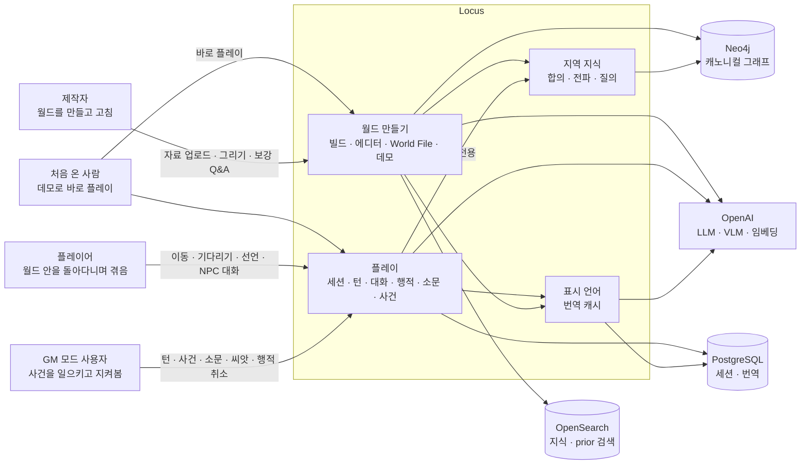

# Business Overview

> Reverse Engineering — Follow-up Cycle (2026-10-07). 기준 커밋 `240e82d` (`feat/purpose-restructure`). 이 문서는 2026-09-29 판(기준 `ee61277`, 개편 전)을 대체한다.
> 근거: 코드를 네 영역으로 나눠 읽었다(캐노니컬 월드 / 플레이·API / 프론트엔드·화면 / 품질·도구·의존성). 게이트를 실행했다(pytest 948, vitest 202, 커버리지 94%). 결함은 인메모리·SQLite·가짜 API로 재현했다.
> 이 문서는 표준 RE 절에 더해 **"목적 대비 지금 상태"** 절을 둔다. 이번 주기가 다음 주기 목록을 처리해 솔로 TRPG를 다듬는 일이기 때문이다.

## Business Context Diagram

텍스트 대안:
- 처음 온 사람은 홈의 데모 카드 [바로 플레이]로 데모 월드를 불러오고(LLM 없음) 곧바로 플레이 세션에 들어간다.
- 제작자는 자료(메모·지도·그림)로 월드를 빌드하거나(LLM), 에디터에서 지역과 연결을 그리고 지식·NPC를 고친다. World File로 저장하고 불러온다.
- 플레이어는 연결을 따라 이동하고, 기다리고, 행동을 선언하고, 그 지역 NPC와 대화한다. 행동마다 턴이 흐른다.
- GM 모드 사용자는 같은 세션에서 턴을 돌리고, 사건을 만들거나 LLM 제안을 승인하고, 씨앗 사건을 시작하고, 소문과 왜곡도를 만지고, 행적을 취소한다.
- 플레이는 캐노니컬 월드를 읽기만 한다. 세션 상태와 번역 캐시는 PostgreSQL에, 월드 그래프는 Neo4j에, 검색 문서는 OpenSearch에 있다.

## Business Description

- **Business Description**:
  - **목적 문장**(`inception/requirements/purpose-restructure-requirements.md` §0, README 첫 줄, `pyproject` description): "Locus는 세계관 자료로 월드를 만들고, 그 월드 안에서 소문과 사건이 지형을 따라 퍼지며 지역마다 NPC가 다르게 아는 것을 직접 겪는 솔로 TRPG다."
  - **지금 코드가 하는 일**: 목적 문장과 거의 맞는다. 2026-09-29에 있던 두 제품 축(공간 지식 빌더 / 루머 시뮬레이터)은 U1~U8을 거치며 하나의 흐름이 됐다. 흐름은 월드 만들기 → 플레이 → GM 모드다.
    - 테스트 분포가 이 흐름과 맞는다: play 47.7%, world 28.7%.
    - 홈의 원클릭 데모, 플레이어 화면, GM 화면, 월드 에디터가 모두 있다.
  - **배포 형태**: Docker Compose로 띄운다. 프로필은 셋이다: 인프라만(기본), 앱까지(`service`), 대시보드(`tools`). 인증이 없는 로컬·데모용이다. 포트폴리오·데모가 목적이다(2026-09-29 Q2=C).
  - **LLM 없이도** 데모 불러오기, 이동, 기다리기, 턴, 사건, 씨앗, 왜곡도, 편집이 동작한다. 소문 생성, NPC 대화, 사건 제안, 빌드, 번역은 키가 있어야 한다.

- **Business Transactions** (상세 단계: `architecture.md` Data Flow, 라우트: `api-documentation.md`):

  | ID | 트랜잭션 | 누가 | 진입 | LLM |
  |---|---|---|---|---|
  | BT-W1 | 자료로 월드 빌드: 수집 → 토폴로지 → prior 증류 → (교체) → 온톨로지 → 저장 | 제작자 | `POST /api/world/worlds/{w}/build(/upload)`, `…/demo/{name}/build`, CLI `world build` | 있음, 상한 없음 |
  | BT-W2 | 매니페스트 데모 불러오기 | 처음 온 사람·제작자 | `POST /api/world/worlds/{w}/demo/{name}`, CLI `world demo` | 없음(API 경로는 키가 있으면 임베딩) |
  | BT-W3 | World File 내보내기 | 제작자 | `GET …/file`, `GET …/export`, CLI `world export` | 없음 |
  | BT-W4 | World File 불러오기: 교체, 열린 세션 닫기, 재매핑 | 제작자 | `POST …/file(/upload)`, CLI `world import` | 없음 |
  | BT-W5 | 에디터 편집: 지역·연결·지식·스코프·NPC, 지역 삭제 순서 | 제작자 | `/api/world/worlds/{w}/regions…` 등 | 없음 |
  | BT-W6 | 보강 Q&A: 빈틈 찾기 → 답 → 되돌리기 → 다시 묻기 | 제작자 | `/api/world/…/augmentation/runs…` | 판정·다듬기(run당 60) |
  | BT-W7 | 상식 근거(WikiPrior) 저장·목록·인용·삭제 | 제작자 | `…/priors`, `…/prior-refs` | 없음 |
  | BT-W8 | NPC 초안 제안(저장 안 함) | 제작자 | `POST …/regions/{r}/npc-drafts` | 1회 |
  | BT-K1 | 캐노니컬 지역 지식 질의, 두 지역 비교, brief | 제작자·외부 | `/api/knowledge/worlds/{w}/…` | 없음 |
  | BT-P1 | 세션 시작(플레이어 / GM 전용)·닫기 | 플레이어·GM | `POST /api/play/worlds/{w}/sessions`, `…/close` | 없음 |
  | BT-P2 | 플레이어 화면 읽기: 지역·사실·전해 들음·소문·이동·NPC | 플레이어 | `GET /api/play/sessions/{s}/region` | 없음 |
  | BT-P3 | 행동 = 턴 run: 이동, 기다리기, 대화 끝내기, 선언 | 플레이어 | `POST …/act` (202) → `GET …/turn-runs/{id}` | 선언 서술 1, 판단 1, 전파·초안 |
  | BT-P4 | NPC 대화 한 줄 | 플레이어 | `POST …/npcs/{n}/start`, `…/say` | 줄당 1회 |
  | BT-P5 | 턴 진행: 사건 동역학 → 행적 씨앗 → 한 칸 전파 → 캐노니컬 초안 → 되먹임·감쇠·가지치기·승격 | 엔진 | 플레이어 행동, GM `POST /api/gm/…/advance` | 턴당 최대 8 |
  | BT-P6 | 플레이어 여정 기록 | 플레이어 | `GET …/log` | 없음 |
  | BT-G1 | 소문 생성·재생성·일괄·지지도 조정 | GM | `/api/gm/…/rumors…` | 생성·재생성 |
  | BT-G2 | 지역 왜곡도 설정 | GM | `PUT …/regions/{r}/distortion` | 없음 |
  | BT-G3 | 사건 생성·제안→승인·해소(복원)·폐기 | GM | `/api/gm/…/events…` | 제안 1회 |
  | BT-G4 | 월드 사건 씨앗 시작 | GM | `POST …/seeds/{id}/start` | 없음 |
  | BT-G5 | 행적 보기·취소(void) | GM | `GET …/deeds`, `POST …/deeds/{d}/void` | 없음 |
  | BT-G6 | 세계 상태 지도·타임라인·플레이어 띠 | GM | `GET …/state`, `…/timeline`, `…/player` | 없음 |
  | BT-L1 | 표시 언어: 번역 캐시 읽기·백그라운드 warm·purge | 모두 | `?lang=` 읽기, `GET /api/langs` | warm마다 |
  | BT-O1 | 스키마 초기화·상태·LLM 유무 | 운영자·화면 | CLI `init-schema`, `GET /health`, `GET /api/capabilities` | 없음 |

- **Business Dictionary**:

  | 용어 | 뜻 |
  |---|---|
  | 월드(World) | `world_id`로 나뉜 하나의 세계. 메타는 `WorldMeta` 노드(이름, 설명, 형식 번호, `updated_at`, `last_writer`)다 |
  | 지역(Region) | 단계 `continent/province/town/district/terrain`, 부모(`parent_id`), 설명, 지도 위치(0~1) |
  | 연결(Connection) | 두 지역 사이 양방향 엣지 쌍. 종류는 `adjacent/route/river/blocked`이고, 가중치 0~1은 기본값 × 지형 보정이다. 이동 비용은 `ceil(1/가중치)`(1~5턴)다 |
  | 지식(Knowledge) | 제목과 진술, 신뢰도. 전역(`is_global`)일 수 있다 |
  | 스코프(Scope) | 지식이 어느 지역에 직접 속하는가(`SCOPED_TO`). 스코프가 없는 비전역 지식은 "스코프 없음"이다 |
  | 합의(Consensus) | 한 지역 NPC가 아는 것: 직접(direct) · 상위 지역에서 물려받음(inherited) · 전역(global) · 연결로 전파(propagated, 경로 가중 ≥ 0.5) · 전해 들음(hearsay, ≥ 0.15) |
  | 전해 들음(Hearsay) | 멀리서 희미하게 닿은 지식. `path_decay = 1 − 경로 가중`이다. NPC 대화 문맥에는 넣지 않는다 |
  | 상식 근거(WikiPrior) | 월드별 상식 규칙(조건 → 효과, 도메인). 연결 근거, 보강 사실, 보강 판정에 쓰인다 |
  | 보강 run | 빈틈 탐지(끊긴 참조, 스코프 없음, 공백, 낮은 신뢰도, 고아, wiki 충돌) → 질문 → 답 → 변경 기록 → 최신부터 되돌리기 |
  | World File v1 | 월드 전체를 담은 JSON(지역, 연결, 엔티티, 관계, 지식, 스코프, prior, prior 링크, NPC, 사건 씨앗). 저장 형식이자 불러오기 형식이다 |
  | 매니페스트 데모 | `locus/world/demo/worlds/manifest.json`의 항목(이름, 제목, 파일, 시작 지역, 소스). 지금은 Emberleaf Isle 하나다 |
  | 세션 | 한 월드 위의 플레이 한 판. 턴 번호를 가진다. 플레이어가 있는 세션과 GM 전용 세션이 있다 |
  | 턴 run | 플레이어 행동 하나가 배경에서 도는 단위. 202로 받고 폴링한다. 실패하면 보상한다(청구 환불, 0턴이면 이동 복원) |
  | 행적(Deed) | 플레이어가 한 일. 도착, 발언(대화를 마칠 때), 선언이 있고, 그 지역 NPC가 목격자다 |
  | 판단(Deed Appraisal) | 목격한 NPC가 그 행적을 전할 만한지(noteworthy), 얼마나 두드러지는지(salience ≥ 0.5), 어떤 기울기로(slant), 어떻게 다시 말하는지(retelling) |
  | 씨앗 소문 / 한 칸 전파 | 판단이 소문이 되고, 그 소문이 턴마다 통과 가능한 연결을 따라 이웃 지역으로 한 칸씩 퍼지며 왜곡된다 |
  | 소문(Session Rumor) | 지식이나 행적에서 나온 비튼 진술. 왜곡 정도, 지지도(support), 승격(promoted ≥ 0.6), 활성(active)을 가진다. 기원은 캐노니컬 또는 행적이다 |
  | 왜곡도(Distortion) | 지역마다 소문이 얼마나 비틀리는지(0~1, 기본 0.3). 사건과 되먹임 몫이 움직인다 |
  | 되먹임 몫(Feedback share) | 강한 소문이 지역 왜곡도를 올린 누적분. 상한 0.3이고, 강한 소문이 없으면 턴마다 0.05씩 돌려준다 |
  | 사건(Session Event) | 분류(war/plague/politics/disaster/festival/discovery), 크기, 수명(persistent / one_shot), 상태(suggested/active/resolved). 턴마다 왜곡도를 올리고 최대곱 경로로 번진다. 해소하면 기여를 돌려놓는다 |
  | 사건 씨앗(Event Seed) | 월드에 들어 있는 사건 후보. GM이 [시작]하면 ACTIVE 사건이 된다 |
  | GM 리스 | GM 쓰기가 턴과 겹치지 않게 하는 가드. GM끼리는 함께 쥔다(공유 카운트) |
  | 표시 언어 | ko/en(`SUPPORTED_LANGS`). 저장 언어는 영어이고, 번역은 캐시(`translations` 테이블)에서만 읽는다 |

## Component Level Business Descriptions

### `locus/shared` — 공통 바탕
- **Purpose**: 모든 경계가 쓰는 모델, 설정, 조정값, LLM 포트, 저장소 포트·어댑터.
- **Responsibilities**: 도메인 모델(`Region`…`EventSeed`, `WorldSnapshot`), `Settings`와 `tuning.py`(Knowledge/World/PlayTuning), LLM·VLM·임베딩 포트와 OpenAI 어댑터(재시도, 호출 수 세기), Neo4j·OpenSearch 어댑터와 순수 매핑, `persist_graph`, 프롬프트 위생 `one_line`, `assemble_shared()`.

### `locus/knowledge` — 지역마다 아는 것
- **Purpose**: "이 지역 NPC가 아는 것"을 계산한다.
- **Responsibilities**: 그래프 → 스냅샷 로더, 프로세스 하나의 `WorldCache`(세대 번호 + WorldMeta 버전 확인), 순수 합의 `compute_consensus`, 최대곱 경로 가중 `best_path_weights`, `QueryEngine`(지역 지식, 비교, brief).

### `locus/world` — 월드 만들기
- **Purpose**: 자료에서 월드를 만들고, 손으로 고치고, 저장·불러오기·데모를 한다.
- **Responsibilities**:
  - **빌드**: `build.py` `WorldBuilder`(준비/커밋, 백업, 같은 월드 동시 빌드 거절)가 이끈다. 단계는 `ingestion/`(메모·지도 그림·구조화 지도·컨셉 아트), `topology/`(계층·연결·가중치), `ontology/`(보강 사실·스코프·중복 제거·엔티티 조정), `wiki/`(prior 조회·증류·연결·관리·교차 월드)다.
  - **편집과 보강**: `editor/`(편집기 묶음, 지역 삭제 순서), `augmentation/`(빈틈 Q&A, 되돌리기)이 맡는다.
  - **저장·데모·NPC**: `worldfile/`(v1, 재매핑, 참조 검증), `demo/`(매니페스트), `npc_drafts.py`가 맡는다.

### `locus/play` — 플레이
- **Purpose**: 정적인 월드 위에서 세션과 턴을 돌린다. 플레이어와 GM이 쓴다.
- **Responsibilities**:
  - **세션과 플레이어**: `session_service.py`, `player/`(이동 규칙, `PlayService`, 플레이어 로그)가 맡는다.
  - **턴**: `turn/`이 맡는다. 진입점은 `TurnAdvancer` 하나이고, 가드, 배경 실행기, 턴당 LLM 예산, 지역 할당, 요약이 함께 있다.
  - **NPC와 행적**: `npc/`(순수 범위, 프롬프트, 대화와 행적 판단), `deeds/`(행적·판단·체류·기억·취소), `gm/narrator.py`(선언 서술)가 맡는다.
  - **소문과 사건**: `rumor/`(정도 사슬 생성, 한 칸 전파 계획, 동역학, 되먹임, 승격), `event/`(사건, 동역학, 제안, 씨앗)가 맡는다.
  - **읽기 서비스와 저장소**: `region_knowledge.py`(합의 해석 하나를 NPC·플레이어·세션 질의가 나눠 씀), `world_state.py`(GM 겹쳐 보기), `storage/`(PostgreSQL 어댑터, 인메모리 쌍둥이, 스키마, 단조 시각)가 맡는다.

### `locus/localization` — 표시 언어
- **Purpose**: 영어로 저장한 내용을 표시 언어로 보여 준다.
- **Responsibilities**: `TranslationService`(캐시 전용 읽기, 백그라운드 warm, purge), `Translator`(LLM 1회), PostgreSQL·인메모리 저장소. play는 이 경계를 import하지 않는다.

### `api/` — 합성 루트와 HTTP
- **Purpose**: 경계를 조립하고 REST로 낸다.
- **Responsibilities**:
  - `main.py`: 조립(경계마다 실패를 가둠), lifespan(끊긴 run 정리, 실행기 종료), `/health`·`/api/capabilities`·`/api/langs`.
  - `deps.py`: 경계별 의존성과 503 처리, 표시 언어 검증.
  - `errors.py`: 오류 매핑. `schemas.py`: DTO와 `*_ko` 번역 붙이기. `uploads.py`: 본문 크기 미들웨어와 이미지 검사.
  - 라우터: `/api/world`, `/api/knowledge`, `/api/play`, `/api/gm`, 모두 77개.

### `web/` — 화면
- **Purpose**: 홈, 월드 에디터, 플레이어 화면, GM 화면.
- **Responsibilities**: React 18 + react-router 7 + Tailwind v4 "Doodly" 디자인 시스템(`ui/`), ko/en 사전과 표시 언어 상태(`i18n.ts`), LLM 유무(`capabilities.ts`), API 클라이언트(`api/`). 상세: `screen-inventory.md`.

### `scripts/`, CI, compose
- `scripts/live_scenario.py`: 운영자가 실제 스택에 돌리는 15단계 시나리오.
- `scripts/setup-volumes.sh`: `./data` 바인드 폴더를 만든다.
- `.github/workflows/ci.yml`: backend·frontend·audit·images 잡.
- `docker-compose.yml`: neo4j·opensearch·postgres·(dashboard)·app·web.

## 목적 대비 지금 상태 — 이번 주기를 위한 추가 절

목적 문장의 네 부분이 지금 코드에서 어디까지 서 있는지, 그리고 무엇이 그 약속을 깎는지를 사실만 정리한다. 결함 번호는 `code-quality-assessment.md`와 `screen-inventory.md`를 가리킨다.

| 목적 문장의 부분 | 지금 서 있는 것 | 약속을 깎는 것 |
|---|---|---|
| **세계관 자료로 월드를 만든다** | 빌드(메모·지도·구조화 지도·그림 → 지역·연결·지식), 에디터(그리기·인스펙터·보강·wiki), World File 저장·불러오기, LLM 없는 데모 | 빌드가 NPC·씨앗을 만들지 않고, 교체가 그것들을 지운다(RE-W18). 빌드 비용에 상한이 없다(RE-W08). 백업이 실패해도 교체한다(RE-W04). 커밋 창이 길다(RE-W17). 컨셉 아트가 지식이 되지 않는다. 데모 매니페스트 검사에 빈틈이 있다(#11). World File의 중복 id와 한 방향 연결(#10, RE-W12) |
| **소문과 사건이 지형을 따라 퍼진다** | 행적 소문은 통과 가능한 연결을 따라 턴마다 한 칸씩 퍼지며 왜곡된다. 사건은 같은 턴에 최대곱 경로로 왜곡도를 번지게 한다. 캐노니컬 소문은 사건 대상 지역에서 생긴다 | GM 쓰기 경합이 퍼짐의 결과를 어긋나게 한다: 동시 해소(#9), 씨앗 이중 시작(#12), 취소된 행적 소문의 부활(RE-P01). 지워진 지역의 사건이 계속 돈다(RE-P04). README가 "사건도 한 칸씩 퍼진다"고 잘못 적는다 |
| **지역마다 NPC가 다르게 안다** | 합의 해석 하나(`region_sources`)를 NPC 대화·플레이어 화면·세션 질의가 함께 쓴다. NPC 문맥에는 전해 들음을 넣지 않고, 소문이 그 출처 지식을 가린다 | **합의 전파가 엣지 순서에 따라 다르게 나온다(RE-W01)**. 같은 월드도 로드할 때마다 지역 지식이 달라질 수 있다. 다른 프로세스의 교체 중에 캐시가 연결 없는 스냅샷을 잡을 수 있다(RE-W02) |
| **직접 겪는 솔로 TRPG** | 클릭 한 번으로 데모 플레이에 들어간다. 이동·기다리기·선언·대화가 턴이 된다. GM 모드를 오갈 수 있다. ko/en을 고를 수 있다 | 화면 다듬기 42건(UX-01~42): 플레이 화면에 지도가 없고, 내부 수치와 원문 enum이 보이고, 월드 내용이 영어이며, 손글씨 버튼이 읽기 어렵고, 좁은 화면에서 깨진다. GM [턴 진행] 이중 클릭(RE-F02), 확인 없는 세션 닫기(RE-F04) |

- **테스트가 약속과 맞는 정도**: play가 가장 두껍다(47.7%). 그런데 "다르게 안다"의 핵심인 `knowledge/`의 직접 테스트는 3.6%이고, 화면 레이아웃·반응형·접근성 테스트는 없다. 위 표에서 가장 목적에 가까운 두 결함(RE-W01, UX 레이아웃)은 지금 게이트로 잡히지 않는다.
- **운영 쪽 사실**:
  - Ubuntu 26 러너 전환까지 12일 남았다(2026-10-19).
  - dev npm audit가 5건으로 늘었다.
  - Python 의존성은 고정돼 있지 않다.
  - PR #4는 아직 병합되지 않았다.
