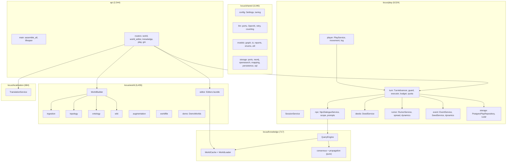

# Code Structure

> Reverse Engineering — Follow-up Cycle (2026-10-07). 기준 커밋 `240e82d`. 2026-09-29 판을 대체한다.
> 줄 수는 `wc -l`(공백·주석 포함)이다.

## Build System

- **Type**: setuptools(Python) + npm(web) + Docker Compose.
- **Configuration**:
  - `pyproject.toml`:
    - 패키지 정의: `locus` 0.1.0, `requires-python >=3.11`, `license = "MIT"`(SPDX), 콘솔 스크립트 `locus = locus.__main__:main`.
    - `packages.find include=["locus*"]`라서 **`api/`는 휠에 들어가지 않는다**(RE-T07).
    - 패키지 데이터 `world/demo/worlds/*.json`, `world/demo/worlds/*/*`.
    - 도구 설정: ruff(E,W,F,I,B,C4, 줄 100), black(100), mypy(`check_untyped_defs`, `ignore_missing_imports`), pytest `addopts --cov=locus`.
  - `requirements.txt`·`requirements-dev.txt`: pyproject와 같아야 한다. `tests/test_packaging.py`가 강제한다. **lock 파일은 없다.**
  - `web/package.json`: scripts `dev`, `build`(`tsc -b && vite build`), `preview`, `test`(`vitest run`), `lint`(`tsc --noEmit`). `package-lock.json`이 v3이다.
  - `web/vite.config.ts`: react·tailwind 플러그인, dev 프록시 `/api` → `:8000`, vitest jsdom.
  - `Dockerfile`(app), `web/Dockerfile`(web), `web/nginx.conf`, `docker-compose.yml`, `env.example`, `.github/workflows/ci.yml`.

## Key Classes/Modules

텍스트 대안:
- `shared`: 설정, LLM 포트·어댑터, 모델, 저장소 포트·어댑터가 있다.
- `knowledge`: `WorldCache`와 로더, 순수 합의, `QueryEngine`이 있다.
- `world`: `WorldBuilder`가 수집·토폴로지·온톨로지·wiki를 이끈다. 편집기 묶음, 보강, World File, 데모가 함께 있다.
- `play`: `TurnAdvancer`가 NPC·행적·소문·사건 서비스와 저장소를 쓴다. `PlayService`가 플레이어 행동을 턴 엔진에 넘긴다.
- `localization`: `TranslationService`가 있다.
- `api`: 라우터가 빌더·편집기·턴 엔진·번역을 부른다.

### Existing Files Inventory

**`locus/shared/`** (3,046줄)
- `config/settings.py` — `Settings`(.env), 검증기, `knowledge_tuning()`/`world_tuning()`/`play_tuning()`, `get_settings()`
- `config/tuning.py` — `KnowledgeTuning`·`WorldTuning`·`PlayTuning`(28 필드)와 기본 표
- `llm/base.py` — `LLMProvider`·`VLMProvider`·`EmbeddingProvider` 포트
- `llm/factory.py` — `ProviderFactory`(키 없으면 `RuntimeError`)
- `llm/openai_provider.py` — LangChain 어댑터(재시도 0 + 30초)
- `llm/retry.py` — `with_retry`(tenacity 3회, `Retry-After`, 상한 8초)
- `llm/counting.py` — `LLMCallCounter`
- `models/enums.py` — `RegionLevel`, `EntityType`, `ScopeType`, `ConnectionKind`, `PriorType`, `WikiDomain`, `SourceKind`, `EventCategory`, `EventLifecycle`
- `models/graph.py` — 노드·엣지 도메인 모델, `new_id`, `fallback_title`
- `models/io.py` — `IngestionResult`, `RegionTopology`, `KnowledgeGraph`, `WorldSnapshot`, `SearchDoc`/`SearchHit`, 합의 뷰, `RegionBrief`
- `models/reports.py` — `BuildWarning`, `BuildReport`, `ImportReport`, `GraphSummary`
- `models/util.py` — `clamp01`, `normalize_name`, `index_by_name`, `LEVEL_RANK`, `rank_of`
- `storage/base.py` — `Node`/`Edge`/`EdgeKey`, `ConstraintViolation`, `GraphRepository`·`SearchRepository` 포트
- `storage/neo4j_repo.py` — Neo4j 어댑터(라벨 없는 읽기·삭제, 항목별 auto-commit)
- `storage/opensearch_repo.py` — OpenSearch 어댑터, `index_mapping`, `build_search_body`
- `storage/graph_mapping.py` — 순수 매핑 모델↔Node/Edge/SearchDoc
- `storage/persistence.py` — `persist_graph`, `touch_world_meta`
- `storage/schema.py` — `SchemaInitializer`, `ensure_world_schema`
- `storage/sql.py` — `make_engine`, 방언별 `upsert_stmt`
- `text.py` — `MATERIAL`, `one_line`
- `wiring.py` — `SharedContainer`, `assemble_shared`

**`locus/knowledge/`** (717줄)
- `cache.py` — `WorldCache`(세대 번호, WorldMeta 버전)
- `loader.py` — `WorldLoader.load`, `version()`
- `consensus.py` — `compute_consensus`, `ConsensusEngine`
- `propagation.py` — `best_path_weights`
- `query.py` — `QueryEngine`과 순수 보조 함수
- `wiring.py` — `KnowledgeContainer`, `assemble_knowledge`

**`locus/world/`** (6,455줄)
- `build.py` — `WorldBuilder`(준비/커밋, 백업, 동시 빌드 거절)
- `wiring.py` — `WorldContainer`, `assemble_world`
- `refs.py` — `ConnectionKey`, `NameRef`
- `npc_drafts.py` — `NpcDraftService`
- `ingestion/` — `service.py`(`WorldInputs`, `IngestionService`, `merge_results`), `text_ingestor.py`, `map_image_ingestor.py`, `structured_map_ingestor.py`, `concept_art_ingestor.py`(진행 중), `mapping.py`, `schemas.py`
- `topology/` — `builder.py`, `hierarchy.py`, `naming.py`, `weights.py`
- `ontology/` — `builder.py`, `corroboration.py`, `dedup.py`, `reconciler.py`, `similarity.py`, `schemas.py`
- `wiki/` — `base.py`(`CommonsenseWiki`), `distiller.py`(진행 중), `linker.py`, `admin.py`, `cross_world.py`(진행 중), `schemas.py`
- `augmentation/` — `service.py`, `engine.py`, `detectors.py`, `questions.py`, `apply.py`, `run_store.py`, `types.py`, `graph.py`(진행 중)
- `editor/` — `writes.py`, `regions.py`, `connections.py`, `knowledge.py`, `npcs.py`, `entities.py`, `catalog.py`, `bundle.py`, `models.py`
- `worldfile/` — `schema.py`, `export.py`, `import_.py`, `remap.py`
- `demo/__init__.py` — `DemoWorlds`, `check_packaged`. `demo/worlds/`는 데이터다: `manifest.json`, `emberleaf.world.json`(지역 12·연결 20·엔티티 8·지식 23·스코프 21·prior 2·NPC 15·씨앗 3), `emberleaf/{memo.md,map.json}`

**`locus/play/`** (8,524줄)
- `__init__.py` — 공개 재수출(파사드 없음)
- `base.py` — `SessionClosedError`, 이름표 보조, `SessionAppService`
- `errors.py` — 플레이 오류 8종
- `models.py` — 플레이 도메인 모델 전체
- `ports.py` — 저장소 Protocol 10개 + `PlayUnitOfWork` + `PlayRepository`
- `wiring.py` — `PlayContainer`, `assemble_play`
- `session_service.py` — 세션 시작(GM·플레이어)·닫기·목록
- `distortion_service.py` — 왜곡도 목록·GM 설정
- `region_knowledge.py` — `region_sources`, `SessionKnowledgeService`
- `world_state.py` — `region_rows`, `summarize_state`, `WorldStateService`
- `deeds/` — `service.py`(`DeedService`), `caps.py`
- `event/` — `service.py`, `dynamics.py`, `seeds.py`, `suggester.py`, `suggest_context.py`
- `gm/narrator.py` — `GmNarrator`
- `npc/` — `dialogue.py`(`NpcDialogueService`), `scope.py`, `prompts.py`
- `player/` — `movement.py`, `service.py`(`PlayService`), `log.py`
- `rumor/` — `service.py`, `generator.py`, `spread.py`, `dynamics.py`, `feedback.py`, `promotion.py`
- `storage/` — `postgres_repo.py`(1,328), `memory_repo.py`, `schema.py`(테이블 11), `clock.py`
- `turn/` — `advancer.py`(970), `executor.py`, `guard.py`, `budget.py`, `quota.py`, `summary.py`, `changes.py`

**`locus/localization/`** (684줄)
- `service.py`, `translator.py`, `models.py`, `ports.py`, `storage/{postgres_repo,memory_repo,schema}.py`, `wiring.py`

**`locus/__main__.py`** (355줄) — CLI `init-schema`, `world build|export|import|demo|list`, 별칭 `build-world`·`export`

**`api/`** (2,544줄)
- `main.py` — `create_app`, `assemble_all`, lifespan, 메타 라우트
- `deps.py` — `Containers`, `get_*`, `need_service`, `display_lang`
- `errors.py` — `PLAY_ERRORS`, `http_error`
- `schemas.py` — DTO, `enrichment_for`, `localize*`, `purge_translations`
- `uploads.py` — `BodyLimitMiddleware`, 업로드 칸 검사
- `routers/world.py`(516), `routers/world_editor.py`(326), `routers/gm.py`(404), `routers/play.py`(228), `routers/knowledge.py`(56)

**`web/src/`** (77파일, 7,851줄 + 테스트 9파일 3,742줄)
- 최상위:
  - 진입·라우팅: `main.tsx`, `App.tsx`(라우트 5)
  - 데이터·상태: `i18n.ts`(887, ko/en 323키), `types.ts`(699, DTO), `capabilities.ts`
  - 지도·세션 컴포넌트: `MapOverlay.tsx`, `SessionBar.tsx`, `layout.ts`, `viz.ts`
  - 스타일·테스트 설정: `index.css`, `setupTests.ts`
- `api/` — `http.ts`, `index.ts`, `world.ts`, `play.ts`, `gm.ts`, `knowledge.ts`, `meta.ts`
- `routes/` — `HomePage.tsx`, `EditorPage.tsx`, `PlayPage.tsx`(352), `GmPage.tsx`, `AppNav.tsx`
- `features/home/` — `DemoCards.tsx`, `DemoCard.tsx`
- `features/editor/`:
  - 지도: `MapCanvas.tsx`, `drag.ts`
  - 인스펙터: `RegionInspector.tsx`, `RegionForm.tsx`, `ConnectionList.tsx`, `KnowledgeList.tsx`, `NpcEditorList.tsx`, `NpcDraftCards.tsx`, `ConfirmDelete.tsx`
  - 탭 패널: `UnscopedPanel.tsx`, `AugmentPanel.tsx`, `AugmentQuestion.tsx`, `WikiPanel.tsx`
  - 빌드·파일: `BuildPanel.tsx`, `BuildReportPanel.tsx`, `WorldFileBar.tsx`
- `features/gm/`:
  - 허브와 패널: `GmHub.tsx`, `ManualTurnPanel.tsx`, `EventPanel.tsx`, `SeedPanel.tsx`, `DistortionPanel.tsx`, `RumorPanel.tsx`, `TimelinePanel.tsx`
  - GmPage가 직접 두는 것: `DeedPanel.tsx`, `PlayerStrip.tsx`, `WorldStateOverlay.tsx`, `RegionKnowledgePanel.tsx`
  - 일괄 실행: `useBulkRumors.ts`, `bulk.ts`
- `features/play/`:
  - 장면: `RegionScene.tsx`, `NpcList.tsx`, `DialoguePanel.tsx`
  - 행동: `ActionBar.tsx`, `MovePanel.tsx`, `NarrationCard.tsx`, `PlayLog.tsx`
  - 보조: `summary.ts`, `LangToggle.tsx`(모든 화면의 AppNav가 씀), `NewSessionForm.tsx`
- `ui/` — `Button`, `Panel`, `Card`, `Badge`, `Field`, `Range`, `CommitRange`, `Modal`, `Toast`, `NotificationCenter`, `LocalizedText`, `LlmNotice`, `InProgressBadge`, `index.ts`

**`tests/`** (110파일, 20,434줄) — `tests/<boundary>/` + `tests/api/` + 루트(`test_boundaries.py`, `test_packaging.py`, `test_demo_as_data.py`, `test_cli.py`, `test_live_scenario.py`). 도우미는 `tests/shared/storage/fakes.py`, `tests/play/{helpers,strategies}.py`, `tests/world/{strategies.py, editor/helpers.py}`, `tests/api/play_fixtures.py`, `tests/conftest.py`(hypothesis 프로필)다.

**`scripts/`** — `live_scenario.py`(운영자용 15단계), `setup-volumes.sh`

## Design Patterns

### 다섯 경계 + 합성 루트
- **Location**: `locus/{shared,knowledge,world,play,localization}`, `api/`, `locus/__main__.py`.
- **Purpose**: 의존 방향을 한쪽으로 고정한다.
- **Implementation**: 경계마다 `assemble_<boundary>()`와 타입 컨테이너를 둔다. 서비스 로케이터는 없다. `tests/test_boundaries.py`가 AST로 import 행렬을 검사한다.

### Ports & Adapters
- **Location**: `shared/storage/base.py`, `shared/llm/base.py`, `play/ports.py`, `localization/ports.py`.
- **Purpose**: 모든 외부 I/O를 가짜로 바꿔 끼워 오프라인 테스트를 한다.
- **Implementation**: Protocol 포트, 지연 import 어댑터, 인메모리 쌍둥이(`tests/shared/storage/fakes.py`, `play/storage/memory_repo.py`).

### Pure Functional Core
- **Location**: `knowledge/consensus.py`·`propagation.py`, `play/rumor/spread.py`·`dynamics.py`, `play/event/dynamics.py`, `play/player/movement.py`, `play/npc/scope.py`, `world/worldfile/remap.py`, `world/augmentation/detectors.py`, `world/ingestion/mapping.py`, `world/topology/{hierarchy,naming,weights}.py`.
- **Purpose**: 규칙을 PBT로 검증한다.
- **Implementation**: 상태 없는 함수다. 서비스는 읽고 → 순수 계산 → 쓰기를 한다.

### Single-Responsibility Services, no facade
- **Location**: `play/*`, `world/editor/*`.
- **Purpose**: 기능 하나에 클래스 하나를 둔다(사용자 선호와 같다).
- **Implementation**: `PlayContainer`에 서비스 15개, `Editors` 묶음에 편집기 5개가 있다. 라우터가 컨테이너에서 필요한 서비스를 꺼낸다.

### Single Turn Entry Point + Unit of Work
- **Location**: `play/turn/advancer.py`, `play/storage/postgres_repo.py`.
- **Purpose**: 턴 하나를 계산 → 초안(LLM) → 저장(UoW 하나)으로 나눈다. LLM은 UoW 밖에서만 부른다.
- **Implementation**: `TurnAdvancer.advance/begin`, `TurnGuard`, 배경 실행기, `LlmBudget`, 실패 보상 `_fail`이 있다.

### Prepare/Commit Build with Backup
- **Location**: `world/build.py`, `world/worldfile/import_.py`.
- **Purpose**: 준비 단계의 실패는 옛 월드를 남긴다.
- **Implementation**: 커밋 전에 World File로 백업하고, `finally`에서 캐시를 무효화한다. 트랜잭션은 없다. 백업이 실패해도 진행한다(RE-W04).

### Write Order instead of Transactions
- **Location**: 지역 삭제 ①~⑥(`world/editor/regions.py`), NPC 쓰기 순서, 보강 되돌리기의 `revert_started`.
- **Purpose**: 끊겨도 끊긴 참조가 남지 않게 하고, 재시도로 끝낸다.

### Snapshot Cache with Generation + Version Marker
- **Location**: `knowledge/cache.py`.
- **Purpose**: 프로세스 안에서는 세대 번호로, 다른 프로세스의 쓰기는 WorldMeta 버전으로 감지한다(빈틈: RE-W02).

### Read-through Translation Cache with Background Warm
- **Location**: `localization/service.py`, `api/schemas.py`.
- **Purpose**: 번역이 응답을 막지 않게 한다.
- **Implementation**: `source_hash`로 무효화하고, in-flight 중복을 제거하며, 스레드 풀에서 warm한다.

### Command Log + Latest-first Undo
- **Location**: `world/augmentation/apply.py`.
- **Purpose**: 보강 답을 되돌린다.
- **Implementation**: `ChangeSet`(노드 전/후 + 엣지 diff)을 남기고, run 밖에서 고쳐졌으면 409를 준다.

### Demo as Data
- **Location**: `world/demo/__init__.py` + `manifest.json`.
- **Purpose**: 코드에 데모 이름을 두지 않는다(`tests/test_demo_as_data.py`).

### Frontend
- 기능 폴더와 라우트 컴포넌트, 프리미티브(`ui/`)를 쓴다. 상태 라이브러리는 없다(모듈 상태 + `useSyncExternalStore`, 효과 + 시퀀스 ref).
- 늦은 답 무시 방식이 셋 섞여 있다. 쓰기 래퍼는 화면마다 따로 있다(`screen-inventory.md` §4).

## Critical Dependencies

### FastAPI 0.141.1 / Starlette 1.6.0 / uvicorn 0.52.1
- **Usage**: `api/` 전체, `yield` 의존성(GM 리스), lifespan, multipart 업로드.
- **Purpose**: HTTP 합성 루트.

### Pydantic 2.13 / pydantic-settings 2.15
- **Usage**: 모든 도메인 모델(`extra="forbid"`), DTO, `Settings`.

### neo4j 5.28.4 (서버 5.15)
- **Usage**: `shared/storage/neo4j_repo.py`.
- **Purpose**: 캐노니컬 그래프. 라벨 없는 Cypher가 많다(RE-W13).

### opensearch-py 2.8.0 (서버 2.13.0)
- **Usage**: `shared/storage/opensearch_repo.py`.
- **Purpose**: 지식·prior 검색, kNN.

### SQLAlchemy 2.0.51 + psycopg 3.3.4
- **Usage**: `play/storage`, `localization/storage`, `shared/storage/sql.py`.
- **Purpose**: 세션·번역. Core 쿼리, `ON CONFLICT` upsert, `FOR UPDATE`.

### LangChain (langchain-core 1.5.3, langchain-openai 1.4.3) / openai 2.53.0
- **Usage**: `shared/llm/openai_provider.py`(지연 import).
- **Purpose**: LLM·VLM·임베딩. 구조화 출력.

### LangGraph 1.2.10
- **Usage**: `world/augmentation/graph.py`뿐이다. 진행 중이고 연결되지 않았다.
- **Purpose**: 없음(필수 의존성으로 선언만 됨).

### tenacity 9.1.4
- **Usage**: `shared/llm/retry.py`. 모든 예외에 재시도한다(RE-W20).

### React 18.3 / react-router 7.18 / Vite 8 / Tailwind 4.3 / TypeScript 5.9
- **Usage**: `web/`.
- **Purpose**: SPA, 디자인 토큰(`@theme`), 빌드.
