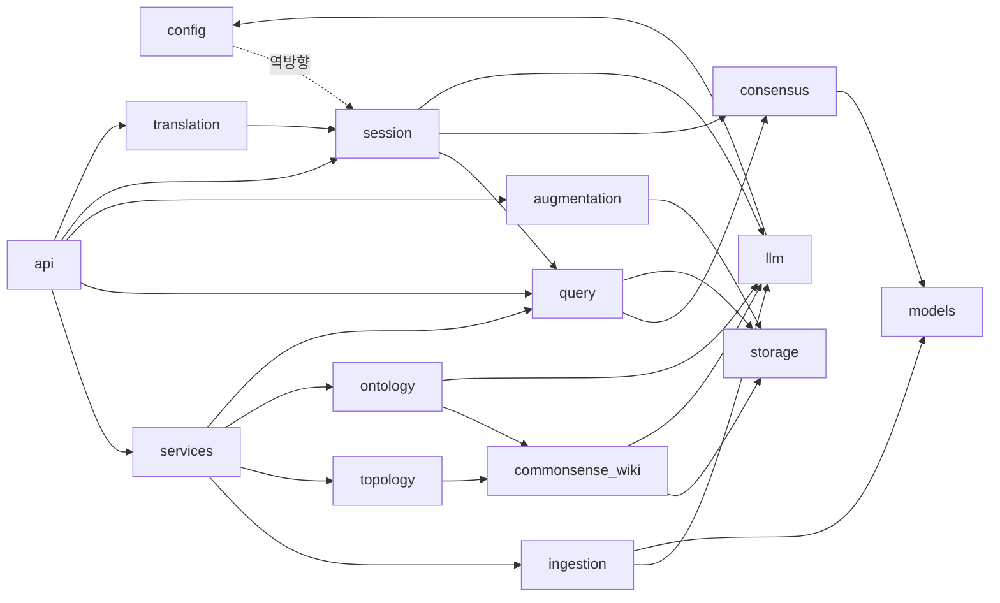

# Code Structure

> Reverse Engineering — Purpose Restructure Cycle (2026-09-29). 기준 커밋 `ee61277`. 줄 수는 공백·주석 포함 `wc -l` 값이다.

## Build System

- **Type**: Python setuptools(`pyproject.toml`) + npm(`web/package.json`).
- **Configuration**:
  - `pyproject.toml`
    - 패키지 `locus*`만 포함한다. `api/`는 패키지에 들지 않아서 Docker 이미지에서 빠진다.
    - 콘솔 스크립트는 `locus = locus.__main__:main`.
    - ruff(E,W,F,I,B,C4; line 100), black(100), mypy(`check_untyped_defs`, 강제하지 않음).
    - pytest 기본 `--cov=locus`.
  - `requirements.txt` / `requirements-dev.txt`: `sqlalchemy`와 `psycopg`가 빠져 있어 pyproject와 어긋난다.
  - `web/package.json`: 스크립트는 `dev`, `build`, `test`(vitest), `lint`(`tsc --noEmit`). ESLint와 Prettier는 없다.
  - `docker-compose.yml`, `Dockerfile`, `web/Dockerfile`(node:20 빌드 → nginx), `web/nginx.conf`(SPA fallback + `/api` 프록시).
  - CI 없음. `.github/`, pre-commit, Makefile이 없다.

## Key Classes/Modules

텍스트 대안:
- 대부분의 패키지가 `models`에 의존한다.
- 역방향 의존이 둘 있다.
  - `config → session`: `settings.rumor_dynamics_params`.
  - `translation → session`: 번역 캐시가 `SessionRepository`에 들어 있다.

### Existing Files Inventory

#### `locus/` 최상위
- `locus/__init__.py` (3) — `__version__`
- `locus/__main__.py` (122) — CLI `init-schema` / `build-world` / `export`. 테스트 커버리지 0%.
- `locus/demo.py` (46) — Aldermoor 데모 입력(인라인 메모·지도 + `examples/demo_world/map.png`)

#### `locus/models` — 도메인 어휘
- `enums.py` (95) — RegionLevel, EntityType, ScopeType, ConnectionKind, PriorType, WikiDomain, SourceKind(`SESSION_*` 포함)
- `graph.py` (202) — `LocusModel`, `Provenance`, `Coord`, `World`(미사용), Region, Entity, Relation, Knowledge, WikiPrior, WikiPriorLink, ConnectionEdge, ScopeLink, `new_id`, `fallback_title`
- `io.py` (121) — IngestionResult, RegionTopology, KnowledgeGraph, SearchDoc/Hit, KnowledgeView(`*_ko` 포함), ConsensusView, QueryResult, RegionDiff
- `reports.py` (54) — BuildWarning, BuildReport, WikiBuildReport(미사용), GraphSummary
- `__init__.py` (82) — 재노출

#### `locus/config`
- `settings.py` (116) — `Settings`(LLM, Neo4j, OpenSearch, 세션 DB, RUMOR_*, TRANSLATION_*, `debug`(미사용)), `get_settings`

#### `locus/llm`
- `base.py` (50) — LLMProvider, VLMProvider, EmbeddingProvider 포트
- `factory.py` (61) — `ProviderFactory` (openai만)
- `openai_provider.py` (113) — OpenAI 어댑터 3종 (커버리지 35%)
- `retry.py` (35) — `with_retry`, `CALL_TIMEOUT_SECONDS`

#### `locus/ingestion`
- `service.py` (80) — `WorldInputs`, `IngestionService`, `merge_results`
- `text_ingestor.py` (70) — 메모 → LLM `TextExtraction`
- `map_image_ingestor.py` (89) — 지도 이미지 → VLM → LLM `MapExtraction`, 장벽 지형 → 연결 힌트
- `structured_map_ingestor.py` (164) — GeoJSON / Locus JSON 파서 (LLM 없음)
- `concept_art_ingestor.py` (46) — 컨셉아트 → VLM → 저신뢰 엔티티
- `mapping.py` (211) — 정규화, 변환, 병합, 저신뢰 표시 (`to_terrain_entity` 미사용)
- `schemas.py` (81) — LLM 출력 DTO

#### `locus/topology`
- `builder.py` (124) — `TopologyBuilder`, `collect_connection_candidates`
- `hierarchy.py` (57) — `assign_hierarchy`
- `weights.py` (53) — `BASE_WEIGHT`, `TERRAIN_MODIFIER`, `compute_weight`

#### `locus/ontology`
- `builder.py` (127) — `OntologyBuilder`, `scope_knowledge`, `remap_scopes`
- `corroboration.py` (103) — WikiPrior 기반 LLM 고증
- `dedup.py` (132) — 임베딩 후보 + LLM 판정 + union-find
- `reconciler.py` (204) — VLM 엔티티 교차 병합, 고아 엔티티 지역 연결
- `similarity.py` (35) — `cosine`, `candidate_pairs`
- `schemas.py` (39) — LLM 판정 DTO

#### `locus/consensus`
- `engine.py` (159) — `ConsensusParams`, `compute_consensus`, `ConsensusEngine`
- `propagation.py` (34) — `best_path_weights` (최대 곱 경로)

#### `locus/query`
- `loader.py` (30) — `WorldLoader` (월드 전체 로드, 캐시 없음)
- `engine.py` (80) — `QueryEngine`, `view_items`, `canonical_known`(세션 전용), `split_shared_unique`, `diff_sets`

#### `locus/commonsense_wiki`
- `base.py` (114) — `CommonsenseWiki` 조회 + LLM 폴백
- `distiller.py` (73) — `PriorDistiller`
- `linker.py` (102) — `WikiPriorLinker`
- `admin.py` (41) — `WikiAdmin`
- `cross_world.py` (79) — `CrossWorldWikiExplorer` (실환경에서 필터가 맞지 않음)
- `schemas.py` (28) — LLM DTO

#### `locus/augmentation`
- `types.py` (84) — IssueType, AnswerAction, SessionStatus, Issue, Question, Answer, ChangeSet, Session
- `detectors.py` (153) — 빈틈, 끊긴 관계, 저신뢰, wiki 충돌, 고아 탐지
- `questions.py` (61) — `QuestionGenerator`
- `apply.py` (79) — `apply_answer`, `revert`
- `engine.py` (34) — `AugmentationEngine`
- `service.py` (64) — `AugmentationService`
- `session_store.py` (31) — `InMemorySessionStore`
- `graph.py` (37) — LangGraph 래퍼 (**호출되지 않음**)

#### `locus/services`
- `orchestrator.py` (133) — `PipelineOrchestrator`
- `editor.py` (39) — `GraphEditor`
- `exporter.py` (21) — `Exporter`

#### `locus/storage`
- `base.py` (95) — `Node`, `Edge`, `TraversalSpec`, `Path`, GraphRepository·SearchRepository 포트
- `neo4j_repo.py` (207) — `Neo4jGraphRepository`
- `opensearch_repo.py` (167) — `OpenSearchRepository`, `index_mapping`, `build_search_body`
- `graph_mapping.py` (336) — 도메인↔노드·엣지·검색 문서 매핑
- `persistence.py` (92) — `persist_graph`
- `schema.py` (20) — `SchemaInitializer`
- `postgres_session_repo.py` (706) — `PostgresSessionRepository` (세션 전용인데 이 패키지에 있음)

#### `locus/session`
- `models.py` (248) — GameSession, SessionRumor, RegionDistortion, TimelineEntry, SessionEvent, Translation, RegionTurnChange, enum
- `repository.py` (83) — `SessionRepository` 포트 (약 27 메서드)
- `memory_repo.py` (213) — 인메모리 어댑터
- `base.py` (79) — `SessionClosedError`, `clamp`, `require_region`, `SessionAppService`
- `service.py` (59) — `SessionService`
- `game_master.py` (127) — `GameMasterService` 파사드
- `rumor_service.py` (191) — `RumorService`
- `rumor_generator.py` (87) — `RumorGenerator`, `RumorDraft`
- `event_service.py` (183) — `EventService`
- `event_suggester.py` (72) — `EventSuggester`
- `distortion_service.py` (31) — `DistortionService`
- `turn.py` (229) — `TurnAdvancer`, `TurnResult`
- `turn_changes.py` (72) — `shape_region_changes`
- `dynamics.py` (107) — 이벤트 델타·전파·복원 (`merge_add` 등은 사실상 죽은 코드)
- `rumor_dynamics.py` (125) — 지지도 감쇠·가지치기·원본 자격·되먹임
- `rumor_feedback_service.py` (50) — `RumorFeedbackService`
- `promotion.py` (33) — `evaluate`
- `query.py` (102) — `SessionQueryEngine`
- `__init__.py` (89) — 재노출 (docstring이 낡음)

#### `locus/translation`
- `translator.py` (50) — `Translator`
- `service.py` (146) — `source_hash`, `TranslationService`

#### `api/`
- `main.py` (138) — `create_app`, `_wire_default` (단일 조립 루트), `/health`
- `routers/query.py` (44) — NPC 서빙 2개
- `routers/authoring.py` (117) — 기획자 12개
- `routers/session.py` (245) — 세션 19개

#### `web/src` (1,968줄, 테스트 제외)
- `main.tsx` (10), `App.tsx` (121) — 셸, 상태, 레이아웃
- `Toolbar.tsx` (50) — world id, Load, Build demo, 로컬 지도 이미지
- `MapOverlay.tsx` (126), `layout.ts` (23), `viz.ts` (22) — SVG 토폴로지 오버레이
- `RegionPanel.tsx` (93) — 캐노니컬·세션 지역 지식 목록
- `AugmentPanel.tsx` (94) — 보강 Q&A (동작하지 않음)
- `SessionBar.tsx` (95) — 세션 목록·생성·종료
- `SessionPanel.tsx` (518) — GameMaster 허브 (UI 코드의 26%)
- `api.ts` (184) — fetch 래퍼 + 25 메서드
- `types.ts` (172) — 손으로 쓴 DTO 타입 (백엔드와 이미 어긋남)
- `i18n.ts` (88) — 한국어 사전 (대부분 GM 문자열)
- `index.css` (63) — Tailwind v4 테마 토큰, 스케치 유틸리티
- `ui/` — Button, Panel, Card, Badge, Field, Range, LocalizedText, Modal, Toast, NotificationCenter, index
- `__tests__/pure.test.ts` (44), `__tests__/components.test.tsx` (344)

#### 기타
- `examples/demo_world/` — `memo.txt`, `map.json`, `map.png`, `generate_map.py`
- `scripts/setup-volumes.sh` — `./data` 바인드 마운트 디렉터리 생성
- `tests/` — 35 파일, 272 테스트 함수 (§ code-quality-assessment 참조)

## Design Patterns

### Ports & Adapters (Hexagonal)
- **Location**: `storage/base.py`, `llm/base.py`, `session/repository.py`, `augmentation/session_store.py`.
- **Purpose**: 외부 I/O를 mock할 수 있게 해서 오프라인 테스트를 가능하게 한다.
- **Implementation**: `typing.Protocol` 포트와 운영 어댑터(Neo4j, OpenSearch, OpenAI, PostgreSQL). 캐노니컬 쪽에는 공유 인메모리 어댑터가 없고 테스트 파일마다 fake를 따로 만든다. 세션 쪽에는 인메모리 어댑터와 계약 테스트가 있다.

### Pipeline Orchestrator
- **Location**: `services/orchestrator.py`.
- **Purpose**: 수집 → 토폴로지 → wiki → 온톨로지 → 저장 순서를 정한다.
- **Implementation**: 생성자 주입 + `from_factory`. 단, `CommonsenseWiki`를 안에서 직접 만들고, `set_wiki`로 상태를 바꾸며, `hasattr`로 덕 타이핑한다. DI 원칙과 어긋나고, 동시 빌드에서 경합이 생길 수 있다.

### Pure Functional Core
- **Location**: `consensus/*`, `topology/weights.py`, `session/{dynamics,rumor_dynamics,promotion,turn_changes}.py`, `ingestion/mapping.py`.
- **Purpose**: 결정적 계산을 I/O에서 떼어 테스트(PBT 포함)하기 쉽게 한다.
- **Implementation**: 모듈 수준 순수 함수 + 상수 또는 파라미터 dataclass.

### Single-Responsibility Services + Facade
- **Location**: `session/{rumor,event,distortion,turn,rumor_feedback}_service.py` + `game_master.py`.
- **Purpose**: 기능마다 서비스를 하나씩 두고(사용자 선호) 파사드로 묶는다.
- **Implementation**: 하위 서비스를 주입하고, 주입이 없으면 기본값을 만든다. 파사드는 넘기기만 해서 레이어 하나를 더할 뿐이다(`_repo` 미사용, `**kwargs`로 타입 소실).

### Aggregate
- **Location**: `session/models.py::SessionEvent`.
- **Purpose**: 이벤트 상태 전이(`approve`, `resolve`, `accumulate`)를 모델 안에 캡슐화한다.

### Read-through Cache with Background Warm
- **Location**: `translation/service.py`.
- **Purpose**: 번역 때문에 읽기가 막히지 않게 한다.
- **Implementation**: 캐시(source_hash 검증)가 맞으면 채우고, 없는 것은 `ThreadPoolExecutor`로 번역해 일괄 upsert한다.

### Composition Root
- **Location**: `api/main.py::_wire_default`.
- **Purpose**: DI 조립을 한 곳에 모은다.
- **Implementation**: 캐노니컬·세션·번역을 함께 조립한다. 제품 축 두 개가 한 루트에 섞여 있다.

## Critical Dependencies

### LangChain / langchain-openai
- **Version**: 1.3.14 / 1.4.3 (선언 `>=0.1` / `>=0.0.5`)
- **Usage**: `llm/openai_provider.py`에서만 쓴다.
- **Purpose**: OpenAI 구조화 출력, VLM, 임베딩.

### neo4j driver
- **Version**: 5.28.4
- **Usage**: `storage/neo4j_repo.py`
- **Purpose**: 캐노니컬 그래프 저장소

### opensearch-py
- **Version**: 2.8.0
- **Usage**: `storage/opensearch_repo.py`
- **Purpose**: 하이브리드 검색 (실제로 읽는 것은 WikiPrior뿐)

### SQLAlchemy + psycopg
- **Version**: 2.0.51 + 3.3.4
- **Usage**: `storage/postgres_session_repo.py` (Core, ORM 아님)
- **Purpose**: 세션과 번역 캐시

### FastAPI
- **Version**: 0.141.1
- **Usage**: `api/`
- **Purpose**: HTTP 서빙 (`on_event` 사용 중이고, deprecated 경고가 난다)

### LangGraph
- **Version**: 1.2.10
- **Usage**: `augmentation/graph.py`에서만 쓰는데, 이 파일은 호출되지 않는다.
- **Purpose**: 없음. 죽은 코드를 위한 필수 의존성이다.
