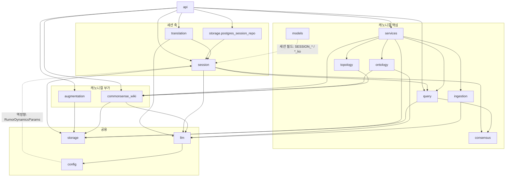

# Dependencies

> Reverse Engineering — Purpose Restructure Cycle (2026-09-29).

## Internal Dependencies

텍스트 대안:
- 대부분의 패키지가 `models`에 의존한다(그림에서는 생략).
- 캐노니컬 핵심 체인: `services` → ingestion / topology / ontology / query → consensus.
- 캐노니컬 부가: `topology`와 `ontology`가 `commonsense_wiki`에 의존한다. 이 의존은 핵심 경로 안으로 들어와 있다.
- 세션 축: `session` → query, consensus, storage.base, llm. `translation` → session. `postgres_session_repo` → session.
- 역방향(캐노니컬 → 세션): `config` → `session.rumor_dynamics`. `models`에 세션·번역 필드가 있다(import가 아니라 개념이 샌 것).

### ingestion depends on llm
- **Type**: Runtime
- **Reason**: 메모·이미지·컨셉아트 해석에 LLM·VLM을 쓴다. 구조화 지도 파서는 LLM이 없다.

### topology depends on commonsense_wiki
- **Type**: Runtime (선택적, `set_wiki`로 주입)
- **Reason**: 지형 규칙을 조회해 연결 근거 문구를 만든다. 가중치에는 영향이 없다.

### ontology depends on commonsense_wiki, llm
- **Type**: Runtime
- **Reason**: 고증 생성(wiki 조회 + LLM), 중복 제거·정합 판정(LLM + 임베딩).

### query depends on consensus, storage
- **Type**: Runtime
- **Reason**: Neo4j에서 월드 전체를 로드하고 합의를 계산한다.

### services depends on ingestion, topology, ontology, commonsense_wiki, query, storage
- **Type**: Runtime
- **Reason**: orchestrator가 파이프라인을 조립하고, `CommonsenseWiki`를 안에서 직접 만든다. exporter는 `WorldLoader`를 쓴다.

### augmentation depends on storage (+ duck-typed query / services / wiki)
- **Type**: Runtime
- **Reason**: 탐지는 로드한 그래프로, 적용은 editor로 한다. 타입 힌트가 없는 덕 타이핑이다.

### session depends on query, consensus, storage.base, llm
- **Type**: Runtime
- **Reason**:
  - `WorldLoader`: 지역 확인, 합의 원본.
  - `canonical_known`: 세션 NPC 뷰.
  - `ConsensusEngine` / `best_path_weights`: 루머 원본, 이벤트 전파.
  - `GraphRepository`: 세션 시작 시 지역 목록.
  - `LLMProvider`: 루머 왜곡, 이벤트 제안.

### translation depends on session
- **Type**: Runtime
- **Reason**: `Translation` 모델과 캐시 메서드가 `session.models`와 `SessionRepository` 안에 있다. 그래서 세션 DB 없이는 캐노니컬을 번역할 수 없다.

### config depends on session (역방향)
- **Type**: Runtime (lazy import)
- **Reason**: `Settings.rumor_dynamics_params()`가 세션 파라미터 객체를 만든다.

### api depends on 전부
- **Type**: Runtime
- **Reason**: 조립 루트 하나가 캐노니컬·세션·번역을 함께 조립한다.

## External Dependencies

| Dependency | Declared | Resolved | Purpose | License |
|---|---|---|---|---|
| pydantic / pydantic-settings | >=2,<3 | 2.13.4 / 2.15.0 | 모델, 설정 | MIT |
| fastapi | >=0.110 | 0.141.1 | HTTP API | MIT |
| uvicorn | >=0.27 | 0.52.1 | ASGI 서버 | BSD-3 |
| neo4j | >=5,<6 | 5.28.4 | 캐노니컬 그래프 드라이버 | Apache-2.0 |
| opensearch-py | >=2,<3 | 2.8.0 | 검색 클라이언트 | Apache-2.0 |
| sqlalchemy | >=2,<3 | 2.0.51 | 세션 저장소 | MIT |
| psycopg[binary] | >=3.1,<4 | 3.3.4 | PostgreSQL 드라이버 | **LGPL-3.0** |
| langchain / langchain-openai | >=0.1 / >=0.0.5 | 1.3.14 / 1.4.3 | LLM 추상화 | MIT |
| langgraph | >=0.0.30 | 1.2.10 | **죽은 코드에서만 사용** | MIT |
| openai | >=1.0 | 2.53.0 | 직접 import 없음 (langchain-openai 경유) | Apache-2.0 |
| tenacity | >=8 | 9.1.4 | 재시도 | Apache-2.0 |
| httpx | (미선언) | 0.28.1 | FastAPI TestClient에 필요. openai를 통해 우연히 설치됨 | BSD-3 |
| pytest / pytest-cov / hypothesis | dev | 9.1 / 7.1 / 6.165 | 테스트 | MIT / MIT / MPL-2.0 |
| black / ruff / mypy | dev | 26.5 / 0.16 / 2.3 | 정적 검사 | MIT |
| react / react-dom | ^18.3.1 | 18.3.1 | UI | MIT |
| tailwindcss / @tailwindcss/vite | ^4.3.3 | 4.3.3 | 스타일 | MIT |
| @fontsource/gaegu | ^5.3.0 | 5.3.0 | 한글 손글씨 폰트 (자체 호스팅) | OFL-1.1 |
| vite | ^8.0.16 | 8.0.16 | 번들러 | MIT |
| @vitejs/plugin-react | ^4.3.0 | 4.7.0 | JSX. **peer 범위가 vite 4~7이라 vite 8과 충돌** | MIT |
| vitest | ^4.1.9 | 4.1.9 | 프론트 테스트 | MIT |
| @testing-library/* , jsdom | dev | 16.3.2 / 10.4.1 / 6.9.1, 24.1.3 | 컴포넌트 테스트 | MIT |
| typescript | ^5.5 | 5.9.3 | 타입 | Apache-2.0 |
| Neo4j Community 5.15 + APOC | image | – | 그래프 DB | GPLv3 (APOC Apache-2.0) |
| OpenSearch / Dashboards 2.13 | image | – | 검색 | Apache-2.0 |
| PostgreSQL 16 | image | – | 세션 DB | PostgreSQL License |

프로젝트 라이선스가 서로 어긋난다. `pyproject.toml`은 `Proprietary`, `LICENSE` 파일은 MIT다.
