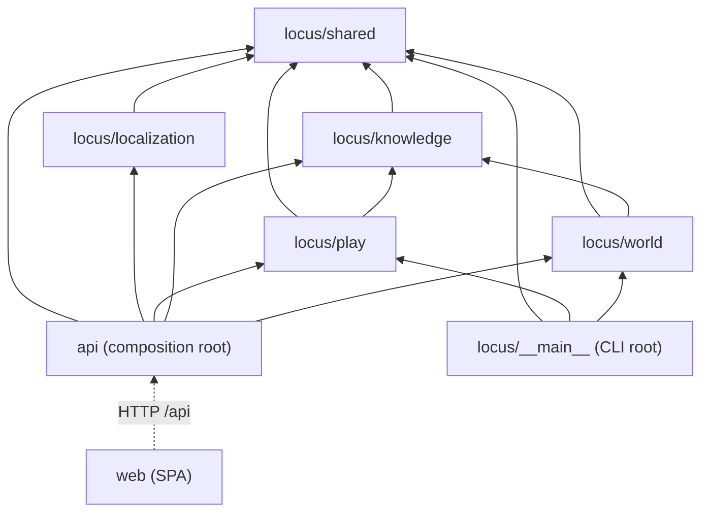

# Dependencies

> Reverse Engineering — Follow-up Cycle (2026-10-07). 기준 커밋 `240e82d`. 2026-09-29 판을 대체한다.

## Internal Dependencies

텍스트 대안:
- `shared`는 아무것도 import하지 않는다.
- `knowledge`는 `shared`를 import한다.
- `world`와 `play`는 `shared`와 `knowledge`를 import한다. 서로는 import하지 않는다.
- `localization`은 `shared`만 import한다.
- `api`와 CLI는 합성 루트로서 모든 경계를 import한다. `locus/**`는 `api`를 import하지 않는다.
- `web`은 HTTP로만 `api`에 닿는다.
- 이 행렬은 `tests/test_boundaries.py`가 AST로 강제한다(상대 import 금지, 최상위 모듈은 `__main__`·`__init__`만). grep으로 확인한 결과 `importlib`·`__import__` 우회는 없다.

### knowledge depends on shared
- **Type**: Compile
- **Reason**: 모델(`WorldSnapshot`, 합의 뷰), `GraphRepository` 포트, `KnowledgeTuning`.

### world depends on knowledge, shared
- **Type**: Compile
- **Reason**:
  - `WorldCache`(스냅샷 읽기와 무효화), 합의는 에디터·보강·NPC 초안이 쓴다.
  - 포트·모델·LLM·`persist_graph`·`WorldTuning`도 쓴다.

### play depends on knowledge, shared
- **Type**: Compile
- **Reason**:
  - `ConsensusEngine`과 `region_known`(`region_sources`), `best_path_weights`(사건 전파), `SnapshotSource`.
  - 모델·LLM·SQL 보조·`PlayTuning`도 쓴다.
  - world를 import하지 않는다. 월드 쓰기 경로가 없다.

### localization depends on shared
- **Type**: Compile
- **Reason**: LLM 포트, SQL 보조. play는 localization을 import하지 않는다. 번역은 `api/schemas.py`가 붙인다.

### api depends on all
- **Type**: Compile/Runtime
- **Reason**: 조립(`assemble_*`), 라우터, DTO.
- 경계 사이에서 하는 일이 둘 있다:
  - world 라우트는 play를 선택적으로 받아 열린 세션을 확인하고 닫는다.
  - 지식 삭제·월드 교체 때 번역을 지운다.

### CLI depends on world, play, shared
- **Type**: Runtime
- **Reason**: 빌드·불러오기 전에 열린 세션을 확인하고 닫는다(`SessionService`, `PostgresPlayRepository`). CLI의 `TurnGuard`는 API 프로세스와 따로다.

## External Dependencies

### 백엔드 런타임 (`pyproject.toml` = `requirements.txt`)
| 패키지 | 선언 | 설치 | 최신(2026-10-07) | 용도 | 라이선스 |
|---|---|---|---|---|---|
| pydantic | `>=2.0,<3` | 2.13.4 | 2.13.5 | 모델 전반 | MIT |
| pydantic-settings | `>=2.0,<3` | 2.15.0 | — | `Settings` | MIT |
| neo4j | `>=5.0.0,<6` | 5.28.4 | 6.4.0(범위 밖) | Neo4j 어댑터 | Apache-2.0 |
| opensearch-py | `>=2.0.0,<3` | 2.8.0 | 3.2.0(범위 밖) | OpenSearch 어댑터 | Apache-2.0 |
| langchain | `>=0.1.0`(상한 없음) | 1.3.14 | 1.4.3 | **직접 import 없음** | MIT |
| langchain-openai | `>=0.0.5`(상한 없음) | 1.4.3 | 1.6.7 | OpenAI 어댑터(지연 import) | MIT |
| langgraph | `>=0.0.30`(상한 없음) | 1.2.10 | 1.2.14 | 진행 중인 래퍼 하나만(연결 안 됨) | MIT |
| openai | `>=1.0.0`(상한 없음) | 2.53.0 | 3.26.0 | **직접 import 없음**(langchain-openai를 거쳐 씀) | Apache-2.0 |
| tenacity | `>=8.0.0`(상한 없음) | 9.1.4 | — | LLM 재시도 | Apache-2.0 |
| fastapi | `>=0.110.0`(상한 없음) | 0.141.1 | 0.142.2 | `api/` | MIT |
| uvicorn | `>=0.27.0`(상한 없음) | 0.52.1 | 0.54.0 | 실행 명령 | BSD-3-Clause |
| sqlalchemy | `>=2.0,<3` | 2.0.51 | 2.1.3(범위 안) | 세션·번역 저장소 | MIT |
| psycopg[binary] | `>=3.1,<4` | 3.3.4 | 3.3.6 | URL 드라이버 `postgresql+psycopg` | **LGPL-3.0-only** |
| python-multipart | `>=0.0.9`(상한 없음) | 0.0.32 | — | 업로드(`UploadFile/Form`) | Apache-2.0 |

### 백엔드 dev (`[dev]` = `requirements-dev.txt`)
| 패키지 | 선언 | 설치 | 최신 | 라이선스 |
|---|---|---|---|---|
| pytest | `>=8.0.0` | 9.1.1 | — | MIT |
| pytest-cov | `>=4.1.0` | 7.1.0 | — | MIT |
| hypothesis | `>=6.90.0` | 6.165.3 | 6.168.5 | MPL-2.0 |
| black | `>=24.0.0` | 26.5.1 | 26.10.0 | MIT |
| ruff | `>=0.3.0` | 0.16.2 | 0.16.10 | MIT |
| mypy | `>=1.8.0` | 2.3.0 | 2.4.0 | MIT |

### 프론트엔드 (`web/package.json`, `package-lock.json`으로 고정)
| 패키지 | 선언 | 설치 | 최신 | 종류 | 라이선스 |
|---|---|---|---|---|---|
| react / react-dom | `^18.3.1` | 18.3.1 | 19.3.0 | dep | MIT |
| react-router-dom | `^7.18.4` | 7.18.4 | — | dep | MIT |
| @fontsource/gaegu | `^5.3.0` | 5.3.0 | — | dep | OFL-1.1(글꼴, 번들에 포함) |
| tailwindcss / @tailwindcss/vite | `^4.3.3` | 4.3.3 | — | dev | MIT |
| vite | `^8.0.16` | 8.0.16 | 8.3.3 | dev | MIT |
| @vitejs/plugin-react | `^5.2.0` | 5.2.0 | 6.1.2 | dev | MIT |
| typescript | `^5.5.0` | 5.9.3 | 7.0.2 | dev | Apache-2.0 |
| vitest | `^4.1.9` | 4.1.9 | 4.1.11 / 5.0.3 | dev | MIT |
| jsdom | `^24.1.0` | 24.1.3 | 30.1.2 | dev | MIT |
| @testing-library/react / dom / jest-dom | `^16` / `^10.4.1` / `^6.4` | 16.3.2 / 10.4.1 / 6.9.1 | 16.3.3 / 10.4.2 / 7.0.1 | dev | MIT |
| @types/react / react-dom | `^18.3.0` | 18.3.31 / 18.3.7 | 19.3.0 | dev | MIT |

### 선언과 사용이 어긋나는 것 (RE-T05)
- **선언했지만 직접 import하지 않는다**: `langchain`(메타 패키지), `openai`. `langgraph`는 연결 안 된 모듈 하나만 쓴다.
- **쓰지만 선언하지 않았다**:
  - `langchain_core`: langchain-openai를 거쳐 들어온다.
  - `httpx`: TestClient를 쓰는 테스트 17파일이 필요로 한다. dev extras에 없다. Starlette 1.6이 httpx2로 옮기라고 경고한다.
- **간접 사용, 정상**: `uvicorn`(실행 명령), `python-multipart`(FastAPI), `psycopg`(URL 드라이버), `@testing-library/dom`(react 16의 peer), `jsdom`(vitest 환경).
- 로컬 `node_modules`에 lock 밖 패키지가 6개 있다(`@emnapi/*`, `@napi-rs/wasm-runtime`, `@tybys/wasm-util`, `tslib`). `npm ci`로 사라진다.

### 재현성과 보안 위생
- **Python lock 파일이 없다.** 상한 없는 런타임 의존성 8개와 dev 6개 전부가 빌드할 때마다 최신을 받는다. CI가 실제로 받은 버전은 어디에도 기록되지 않는다(RE-T04).
- **npm audit**: 런타임은 0건이다. dev는 5건이다(moderate 3, high 2): `@vitest/mocker` 4.1.9(경로 탐색), `baseline-browser-mapping` 2.10.34(DoS), `browserslist` 4.28.2(high), `source-map-js` 1.2.1(high). 모두 `npm audit fix`로 고칠 수 있다.
- **Docker 베이스 이미지**: `python:3.11-slim`, `node:22-alpine`, `nginx:alpine`, `postgres:16-alpine`은 움직이는 태그이고 다이제스트 고정이 없다. neo4j 5.15(2023-12)와 opensearch 2.13.0은 고정이지만 오래됐다.
- **라이선스**: 프로젝트는 MIT(SPDX)다. 런타임의 psycopg는 LGPL-3.0-only다(동적 링크, 고지 대상). Gaegu 글꼴은 OFL-1.1이고, hypothesis는 MPL-2.0(dev)이다.
