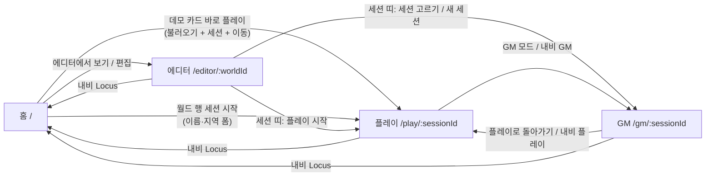

# Screen Inventory (화면 목록)

> Reverse Engineering — Follow-up Cycle (2026-10-07). 기준 커밋 `240e82d` (`feat/purpose-restructure`).
> 표준 RE 산출물에 더한 문서다. 이번 주기의 첫 항목이 사람이 정한 **화면 고도화**이기 때문이다. 요구사항은 이 문서의 화면 목록과 다듬을 곳(UX-01~UX-42)을 근거로 쓴다.
> 표시: **[재현]** = 실행해서 확인함. **[코드]** = 코드만 읽고 판단함.
> 캡처(`screens/*.png`)의 조건은 다음과 같다.
> - 실제 프론트 빌드에 가짜 API를 붙였다. 가짜 API는 Emberleaf World File을 읽고 LLM이 꺼진 상태다. headless Chrome으로 1280px과 390px에서 찍었다.
> - 이동 목록과 연결 목록에 같은 항목이 두 번 보이는 것은 가짜 서버 탓이다(양방향 엣지를 그대로 냈다). 실제 결함이 아니다.
> - 대화 문장은 가짜 데이터다.
> 경로는 따로 적지 않으면 `web/src/` 기준이다.

## 1. 한눈에 보기

| 경로 | 화면 | 하는 일 | 캡처 |
|---|---|---|---|
| `/` | 홈 `routes/HomePage.tsx` | 데모 카드, 월드 목록, 자료로 만들기, 세션 시작 | `screens/home-1280.png` |
| `/editor/:worldId` | 월드 에디터 `routes/EditorPage.tsx` | 지도에 지역·연결 그리기, 인스펙터, 스코프 없음, 보강, wiki, 빌드, World File | `screens/editor-inspector-1280.png`, `screens/editor-390.png` |
| `/play/:sessionId` | 플레이어 화면 `routes/PlayPage.tsx` | 지역 장면, NPC 대화, 기다리기·선언·이동, 여정 기록 | `screens/play-1280.png`, `screens/play-dialogue-1280.png`, `screens/play-390.png` |
| `/gm/:sessionId` | GM 화면 `routes/GmPage.tsx` | 세션 바, 플레이어 띠, 세계 상태 지도, 지역 지식, GM 허브, 행적 | `screens/gm-region-1280.png`, `screens/gm-390.png` |
| `/play` | 세션 없음 안내 | `play-empty` 패널 | — |
| `*` | `<Navigate to="/" replace />` (`App.tsx:30`) | 따로 404 화면이 없다 | — |

- 공통 머리는 `AppNav`다(`routes/AppNav.tsx:15-50`). 링크는 `Locus`(→`/`), `에디터`, `GM`, `플레이`이고, 오른쪽 끝에 언어 토글 `LangToggle`이 있다.
- `GM` 링크는 세션을 모를 때 회색 span이다. 이유는 title 툴팁으로만 알린다.
- 시작할 때 `GET /api/langs`를 한 번 읽는다(`App.tsx:14-23`). 화면마다 `GET /api/capabilities`도 한 번 읽는다(`capabilities.ts:10-20`).
- 규모: `web/src` 77파일, 7,851줄(테스트 제외)이다. 2026-08-19 스냅샷의 약 4배다. 테스트는 9파일, 3,742줄, 202개다.

## 2. 화면 사이 흐름

텍스트 대안:
- **처음 온 사람 → 플레이**: 홈의 데모 카드 [바로 플레이]를 누르면 클릭 한 번에 플레이 화면으로 간다. 월드가 없으면 LLM 없이 불러오고, 이름 "여행자"와 매니페스트의 시작 지역으로 세션을 만든 뒤 `/play/{sid}`로 간다(`features/home/DemoCard.tsx:67-88`).
  - 다만 데모를 불러온 뒤에는 같은 월드가 "데모 월드" 카드와 아래 월드 행에 두 번 보인다.
  - 월드 행에는 [세션 시작]이 또 있다. 그래서 플레이로 가는 길이 둘이고, 하나는 이름·지역을 고르는 폼을 거친다.
- **GM 모드 진입**: 플레이 화면 [GM 모드](`PlayPage.tsx:277`), 내비 "GM", 에디터 세션 띠의 세션 선택이나 [새 세션](`WorldFileBar.tsx:107`)으로 들어간다.
- **GM → 플레이**: 플레이어 띠 [플레이로 돌아가기](`features/gm/PlayerStrip.tsx:69-75`)나 내비 "플레이"로 돌아간다. 플레이어 없는 GM 세션에는 띠가 없다.
- **에디터 진입·나가기**:
  - 들어가는 길은 홈 카드 [에디터에서 보기], 월드 행 [편집], 내비 "에디터"다. 내비 "에디터"는 worldId를 알 때만 그 월드로 간다.
  - 나가는 길은 내비 "Locus"다. 에디터에서 하던 플레이로 바로 돌아가는 길은 없다.

## 3. 화면별 상세

### 3.1 `/` 홈

- **트리**: `HomePage` → `AppNav` · `LlmNotice` · `Panel("월드")` [`DemoCards` → `DemoCard`×n(+`Modal`) · 빈 상태 · 월드 행 `Card`×n · [자료로 만들기]] · `NewSessionForm`(모달) · `BuildPanel`(모달).
- **보이는 것**(`HomePage.tsx:48-111`):
  - 페이지 전체가 패널 하나("월드")다.
  - 데모 카드에는 제목, "불러옴", 설명, credits, [바로 플레이], [에디터에서 보기]가 있다.
  - 월드 행에는 이름, id, "지역 N", "수정 {날짜}", 빨간 "열린 세션 N", [편집], [세션 시작]이 있다.
  - 게임 소개나 처음 온 사람을 위한 안내 문구는 없다. [재현]

| 행동 | API → HTTP |
|---|---|
| 진입 | `GET /api/world/worlds`, `GET /api/world/demos`, capabilities, langs |
| [바로 플레이] (월드 없음) | `POST /api/world/worlds/{name}/demo/{name}?replace=false&confirm=false` → `POST /api/play/worlds/{id}/sessions` → `/play/{sid}` |
| [바로 플레이] (월드 있음) | 카드 안에 [지금 월드로 플레이]와 [새로 불러와 플레이]가 뜬다. 둘째는 교체 `Modal`이고, 열린 세션이 있으면 둘째 `Modal`이 한 번 더 뜬다(`confirm=true`) |
| [에디터에서 보기] | 월드가 있으면 바로 `/editor/{name}`, 없으면 불러온 뒤 이동 |
| 월드 행 [편집] / [세션 시작] | `/editor/{id}` / `GET …/export`(지역 목록만 쓰는데 월드 전체를 읽음) → 폼 → `POST …/sessions` |
| [자료로 만들기] | `BuildPanel`(월드 id를 손으로 친다) → `POST /api/world/worlds/{id}/build/upload` |

- **상태**:
  - 월드 목록에 로딩 표시가 없다. 오류는 `String(e)` 한 줄이다.
  - 빈 상태는 "아직 월드가 없습니다"와 [자료로 만들기]다.
  - LLM 꺼짐은 `LlmNotice`가 알린다.
- **ko/en**:
  - 데모 제목·설명·credits는 매니페스트의 영어 원문이다.
  - 날짜는 표시 언어가 아니라 브라우저 로캘을 따른다(`HomePage.tsx:73`). [재현]
- **테스트**: `home.test.tsx` 17, `components.test.tsx`의 App 라우팅.

### 3.2 `/editor/:worldId` 월드 에디터

- **트리**: `EditorPage` → `AppNav` · `LlmNotice` · `WorldFileBar`(+`SessionBar` picker, `Modal`) · 오류 줄 · `Toast` · 빈 상태 · 상태 줄(+지도 파일 input) · [`MapCanvas`(도구 띠, `MapOverlay`, 새 지역·연결 대화상자) | 오른쪽 열: 탭 넷 `region`/`unscoped`/`augment`/`wiki`] · `BuildPanel`.
  - `region` 탭은 `RegionInspector`다. 그 안에 `RegionForm`, `ConnectionList`, `KnowledgeList`, `NpcEditorList`+`NpcDraftCards`, `ConfirmDelete`가 있다.
  - 나머지 탭은 `UnscopedPanel`, `AugmentPanel`(`AugmentQuestion`×n), `WikiPanel`이다.
- **보이는 것**(`EditorPage.tsx:130-198`):
  - 맨 위부터 LLM 상자, 파일 띠(이름·id·[저장(내려받기)]·[불러오기]·[자료로 만들기]·세션 띠), 상태 줄(id·지역·연결·엔티티·지식, 지도 파일 input)이 쌓인다.
  - 그 아래 도구 버튼 셋과 800×500 지도가 있고, 오른쪽이 탭이다.
  - 지도는 위에서 약 190px 아래에서 시작한다. [재현]

| 행동 | API → HTTP |
|---|---|
| 진입 | `GET …/worlds/{w}/export`, `GET /api/world/worlds`(열린 세션 수만) |
| [저장(내려받기)] / [불러오기] | `GET …/worlds/{w}/file` / 교체 `Modal` → `POST …/file?replace=true&confirm=…` |
| 지도 끌기 | 4px 넘게 끌면 `PUT …/regions/{id}`(지역 전체를 씀) |
| 지역 추가 / 연결 긋기 | 폼 → `POST …/regions` / 폼 → `PUT …/connections` |
| 인스펙터 | `GET …/regions/{r}/editor?lang=`, 저장 `PUT …/regions/{r}`, 삭제 `GET …/delete-plan` → `DELETE …/regions/{r}`, 연결·지식·스코프·NPC 쓰기, [NPC 제안] `POST …/npc-drafts`(LLM) |
| 스코프 없음 / 보강 / wiki | `GET …/knowledge/unscoped` · `POST …/augmentation/runs`, answer, revert, unignore · `GET …/prior-refs`, `DELETE …/priors/{id}` |
| 세션 띠 | `GET /api/play/worlds/{w}/sessions`. [새 세션]은 플레이어 없는 GM 세션을 만들고 `/gm/{sid}`로 간다. [플레이 시작]은 폼을 거쳐 `/play/{sid}`로 간다 |

- **상태**:
  - 월드를 읽는 동안 로딩 표시가 없다. 404면 빈 상태를 보이고 도구를 끈다.
  - 인스펙터만 "불러오는 중…"을 보인다.
  - 오류는 `String(e)` 원문이다(예: `Error: 409 Conflict: {json}`).
  - 지역 삭제 결과는 흐름 안의 `Toast`로 알리고, 자동으로 닫히지 않는다.
- **ko/en**:
  - 단계(`continent`…), 연결 종류(`adjacent`…), 보강 상태, 무시한 질문 키, 변경 설명이 원문 그대로 나온다.
  - 탭 라벨 `wiki`도 영어다.
  - 지역·NPC 글은 번역하지 않는다. 지식은 번역 캐시가 있을 때만 번역된다. [재현]
- **테스트**: `editor.test.tsx` 49, `components.test.tsx` 일부.

### 3.3 `/play/:sessionId` 플레이어 화면

- **트리**: `PlayPage` → `AppNav` · `NotificationCenter` · [GM 모드] · 오류 줄 · `LlmNotice` · `RegionScene`(`NpcList`) · `DialoguePanel` · 지난 행동 변화 목록 · `NarrationCard` · `ActionBar` · `MovePanel` · `PlayLog`.
- **보이는 것**(`PlayPage.tsx:270-351`):
  - 한 열(`max-w-2xl`)로 세로로 쌓인다. 1280px에서는 오른쪽 절반이 비고, [GM 모드]만 오른쪽 끝에 떠 있다. [재현]
  1. 지역 패널: 지역명, "경로 › … · town · 턴 N", 설명, 이곳의 사람들(NPC 카드), 아는 것(`direct`/`inherited` 배지), 들은 이야기("전언"·"감쇠 0.64"), 떠도는 소문(`d0.42`).
  2. 대화 중이면 대화 패널.
  3. 지난 행동의 지역별 변화와 "세계의 응답" 카드.
  4. [기다리기 (1턴)], 선언 상자, "0/300자", [선언하기 (1턴)].
  5. 갈 수 있는 곳(지역명 · 종류 · N턴, [이동]).
  6. 여정 기록(최신 30줄).
  - **지도가 없다.**

| 행동 | API → HTTP |
|---|---|
| 진입 | `GET /api/play/sessions/{sid}`, `GET …/region?lang=`, `GET …/log?limit=30`, `GET …/npcs`, `GET …/turn-runs?status=running` |
| [이동]·[기다리기]·[선언하기]·[대화 끝내기] | `POST …/act?lang=`(202) → `GET …/turn-runs/{runId}`를 700ms마다 읽음 → 끝나면 알림과 다시 읽기 |
| [말하기] / [보내기] | `POST …/npcs/{id}/start` / `POST …/npcs/{id}/say?lang=`(LLM 1회) |

- **상태**:
  - 첫 읽기 동안 로딩 표시가 없다.
  - 세션 id가 없으면 안내 패널을 보이지만, 홈으로 가는 링크는 없다.
  - LLM이 꺼지면 대화 입력이 잠긴다.
  - 턴이 진행 중이면 "세계가 움직이는 중…"을 보이고 버튼을 끈다.
  - 409는 알림으로 바뀐다.
  - **닫힌 세션은 버튼만 회색이고 "종료됨" 안내가 없다.**
  - 빈 목록은 "—" 한 글자다.
- **ko/en**:
  - 원문 그대로인 것: 스코프, 단계, 이동 종류.
  - 플레이어에게 내부 수치(`d0.42`, "감쇠 0.64")가 보인다.
  - 지역명·NPC는 영어다. 지식·소문은 번역 캐시가 데워진 뒤에만 번역되므로, LLM이 꺼져 있으면 끝까지 영어다.
  - 서버가 보내는 막힌 이동의 이유를 화면이 쓰지 않는다.
- **테스트**: `play.test.tsx` 15, `dialogue.test.tsx`·`deeds.test.tsx`·`gm.test.tsx` 일부.

### 3.4 `/gm/:sessionId` GM 화면

- **트리**: `GmPage` → `AppNav` · `SessionBar` · 오류 줄+[다시 시도] · `PlayerStrip` · 월드 줄(+지도 파일 input) · [`WorldStateOverlay` 토글·범례 + `MapOverlay` | 오른쪽 열: `RegionKnowledgePanel` · `GmHub` · `DeedPanel`].
  - `GmHub` 안에는 `LlmNotice`, `ManualTurnPanel`, `EventPanel`, `SeedPanel`, `DistortionPanel`+`RumorPanel`, `TimelinePanel`, `Modal`, `NotificationCenter`가 있다.
- **보이는 것**(`GmPage.tsx:106-220`):
  - 세션 select("s1 · 턴 4 · open"), [새 세션], [닫기].
  - 플레이어 띠 "여행자 · Saltwake Harbor · 4턴 [플레이로 돌아가기]"와 월드 줄.
  - [세계 상태] 토글과 범례, 지도(플레이어 고리, 상태 색, "2/0 ✦1" 배지).
  - 1280px에서도 오른쪽 열이 지도 옆에 오지 못하고 아래로 떨어진다. 페이지 세로가 약 2,130px다. [재현]

| 행동 | API → HTTP |
|---|---|
| 진입 | `GET /api/play/sessions/{sid}`, 월드가 바뀌었으면 `GET …/export` |
| 허브 읽기 | `GET /api/gm/sessions/{sid}/timeline`, `…/events?lang=`, `…/distortions`, 지역을 고르면 `…/regions/{r}/rumors?lang=`, `…/state` |
| [턴 진행] | `POST …/advance`(동기) |
| [이벤트 제안] / 승인·폐기·해소·생성 | `POST …/events/suggest?n=`(LLM) / `POST …/approve`, `DELETE …/events/{e}`, `POST …/resolve`, `POST …/events` |
| [전체 생성]·[전체 재생성] | 지역마다 `POST …/rumors` 또는 `…/rumors/regen`을 5개씩 동시에 |
| 씨앗 [시작] | `POST …/seeds/{id}/start` |
| 왜곡·공신력 슬라이더 | `PUT …/regions/{r}/distortion`, `PUT …/rumors/{id}/support` |
| 행적 [취소] | 확인 → `POST …/deeds/{d}/void` |
| 세션 [닫기] | `POST /api/play/sessions/{sid}/close`, **확인 없음** |

- **상태**:
  - 세션 읽기 중 로딩 줄을 보인다.
  - 세션 읽기가 실패하면 [다시 시도]가 뜬다. 그런데 이 버튼은 월드를 다시 읽지 않아 지도가 빈 채 남는다. [재현]
  - 이벤트·소문·타임라인에는 빈 상태 문구가 없다.
  - LLM 꺼짐 안내가 허브 안 상자와 버튼 옆 글로 두 번 나온다.
- **ko/en**:
  - 원문 그대로인 것: 사건 상태·분류·생명주기, `m0.40`, 세션 select의 `open`, 판단의 `slant`, "열의 0.72".
  - 행적 무효화 버튼이 ko에서 "취소"다. 대화상자의 취소(cancel)와 헷갈린다.
- **테스트**: `gm.test.tsx` 35, `components.test.tsx`(GmHub 12 외), `deeds.test.tsx`(DeedPanel 3).

## 4. 디자인 시스템 (지금 상태)

- **토큰**(`index.css:11-26`, Tailwind v4 `@theme`):
  - 색: paper `#faf6ec`, paper-card `#fffdf7`, ink `#201e1a`, ink-soft `#5b554c`, line, highlight `#ede3c8`, danger `#7a2e22`.
  - 대비는 모두 AA 이상이다(계산: ink-soft/paper 6.83).
  - 다크 모드는 없다(X2 결정).
- **글꼴**:
  - 제목용은 Gaegu(손글씨, 자체 호스팅), 본문은 system-ui다.
  - `Button`·`Badge`의 기본 클래스에도 `font-display`가 붙어 있어 **모든 버튼·배지가 손글씨**다(`ui/Button.tsx:7`, `ui/Badge.tsx:21`). X2 규칙 BR-X2-4("제목만 손글씨")보다 넓게 적용됐다.
  - 한글 woff2 두 굵기(약 760 kB)가 첫 화면에 내려온다. JS 번들(96.6 kB gzip)의 약 8배다.
- **프리미티브**(`ui/`): `Button`(primary/ghost/danger, sm/md), `Panel`, `Card`, `Badge`(5 tone 중 2개는 쓰는 곳 없음), `Field`, `Range`, `CommitRange`, `Modal`, `Toast`, `NotificationCenter`, `LocalizedText`, `LlmNotice`, `InProgressBadge`.
- **일관성**:
  - `Select` 프리미티브가 없다. 날 `<select>` 13개가 같은 클래스 문자열을 복사해 쓴다(18번).
  - 대화상자 껍데기가 넷이다: `ui/Modal`, `MapCanvas` 안의 `Dialog`, `BuildPanel`, `NewSessionForm`. z-index도 40/50으로 다르다.
  - 알림 방식이 셋이다: 떠 있는 `NotificationCenter`, 에디터의 흐름 안 `Toast`, 패널마다 빨간 줄 34곳.
  - 오류 문장은 `String(e)`가 42곳이다.
  - 빈 상태가 "—", 문장, 아무것도 없음으로 섞여 있다.
- **반응형**:
  - Tailwind 브레이크포인트(`sm:`/`md:`/`lg:`)를 한 번도 쓰지 않는다.
  - 지도는 800×500 고정이다. 부모 flex가 내용 폭으로 커져서 `maxWidth:100%`가 걸리지 않는다.
  - 390px에서 에디터와 GM은 가로 스크롤이 생긴다(scrollWidth 812). [재현] X2 규칙 BR-X2-12와 어긋난다.
- **접근성**:
  - 지도는 마우스 전용이다. 마커와 연결에 role·tabIndex·키 처리가 없다.
  - `Modal`에 Esc 닫기, 포커스 이동·가두기, `aria-labelledby`가 없다.
  - 알림에 `aria-live`가 없다.
  - 아이콘만 있는 ✕ 버튼 넷에 접근성 이름이 없다.
  - 탭에 `tabpanel`과 화살표 키 이동이 없다.

## 5. 다듬을 곳 (UX-01 ~ UX-42)

번호는 요구사항에서 그대로 인용할 수 있게 고정한다. 모두 **확실한 것**(코드로 확인, [재현] 표시는 실행이나 캡처로 확인)이다.

### 5.1 전체 공통
| # | 내용 | 근거 |
|---|---|---|
| UX-01 | 버튼·배지·작은 제목까지 손글씨다. `text-xs`/`text-sm` 한글이 읽기 어렵다 | `ui/Button.tsx:7`, `ui/Badge.tsx:21` [재현] |
| UX-02 | 브레이크포인트가 없다. 390px에서 에디터·GM에 가로 스크롤이 생긴다 | `MapOverlay.tsx:7-8,73` [재현] |
| UX-03 | 1280px에서도 지역을 고르면 오른쪽 열(인스펙터, GM 지식·허브·행적)이 지도 밑으로 떨어진다. 그래서 지도와 결과 사이를 스크롤로 오간다 | `EditorPage.tsx:168` `min-w-80`, `GmPage.tsx:193` `min-w-72` [재현] |
| UX-04 | 원문 enum과 내부 수치가 한국어 화면에 섞인다. enum은 단계·연결 종류·스코프·사건 상태/분류/생명주기·세션 상태·보강 상태이고, 수치는 `d0.42`·`m0.40`·감쇠·열의·`t4`다 | §3 각 ko/en [재현] |
| UX-05 | 월드 내용(지역명·설명·NPC·데모 카드·씨앗 제목)은 영어 원문이다. 번역은 캐시가 데워진 뒤에만, 지식·소문·사건·행적 문장에만 된다. LLM이 없으면 끝까지 영어다 | `api/schemas.py:155-185` [재현] |
| UX-06 | 오류가 원문으로 보인다(`Error: 409 Conflict: {json}`). `String(e)`가 42곳이다 | [코드] |
| UX-07 | 날짜가 브라우저 로캘을 따른다 | `HomePage.tsx:73` [재현] |
| UX-08 | 사용자에게 개발자 지시문("…`.env`에 `OPENAI_API_KEY`를 넣고 다시 띄우면…")이 보인다. GM에서는 두 번 나온다 | `i18n.ts:361`, `GmHub.tsx:147`, `ManualTurnPanel.tsx:70` [재현] |
| UX-09 | 파일 input이 날것이라 브라우저 문구("Choose File / No file chosen")가 그대로 나온다 | `EditorPage.tsx:154`, `GmPage.tsx:161`, `BuildPanel.tsx:118` [재현] |
| UX-10 | 로딩과 빈 상태를 가르지 않는다. DeedPanel은 읽기 전에 "아직 행적이 없습니다"가 잠깐 보인다. 이벤트·소문·타임라인에는 빈 상태가 없다 | `DeedPanel.tsx:24` 등 [코드] |
| UX-11 | 대화상자 넷, 알림 방식 셋, select 스타일 복사 18번이 있다 | §4 [코드] |

### 5.2 홈 `/`
| # | 내용 | 근거 |
|---|---|---|
| UX-12 | 패널 하나에 같은 월드가 데모 카드와 월드 행으로 두 번 나오고, 플레이로 가는 버튼도 둘이다. 게임 소개 문장이 없다 | `HomePage.tsx:48-111` [재현] |
| UX-13 | 홈에서 내비 "에디터"가 현재 페이지로 표시된다 | `AppNav.tsx:18,27` [재현] |
| UX-14 | 데모 카드의 "불러옴"은 작은 회색 한 단어다. 열린 세션 수는 빨간 글씨라 오류처럼 보인다 | `DemoCard.tsx:108`, `HomePage.tsx:77` [재현] |
| UX-15 | [자료로 만들기]가 맨 아래 작은 버튼이고, 월드 id를 손으로 친다. 허용 문자 안내가 없다 | `BuildPanel.tsx:100-103` [코드] |
| UX-16 | 빌드가 실패하거나 교체로 끝나도 월드 목록을 다시 읽지 않는다 | `HomePage.tsx:107-110` [코드] |

### 5.3 에디터 `/editor/:worldId`
| # | 내용 | 근거 |
|---|---|---|
| UX-17 | 지도 위쪽이 겹겹이다: LLM 상자 → 파일 띠 → 상태 줄(id가 두 번 나옴) → 도구 띠. 지도는 약 190px 아래에서 시작한다 | `EditorPage.tsx:130-198` [재현] |
| UX-18 | 대륙·지방·마을이 지도에서 똑같은 점이다. 13px 라벨이 선과 겹치고, 선택한 점이 자기 라벨을 가린다 | `MapOverlay.tsx:165-197` [재현] |
| UX-19 | 인스펙터 한 패널에 필드·연결·지식·NPC·제안이 접기 없이 세로로 쌓인다. [저장] 바로 옆이 빨간 [지역 삭제]다 | `RegionInspector.tsx:169-192`, `RegionForm.tsx:69-79` [재현] |
| UX-20 | 가중치를 목록에서는 숫자 칸으로, 새 연결 폼에서는 슬라이더로 다룬다 | `ConnectionList.tsx:39-52`, `MapCanvas.tsx:236-240` [코드] |
| UX-21 | ✕ 버튼 넷에 이름이 없다. NPC [고치기]가 지식 키를 빌려 쓴다 | `NpcEditorList.tsx:52` [코드] |
| UX-22 | 빌드 리포트의 "스코프 없음 N" 링크가 아무 일도 하지 않는다 | `BuildReportPanel.tsx:30-33`, `BuildPanel.tsx:124` [재현] |
| UX-23 | 보강 상태가 원문이고, "답 3/30"의 30이 하드코드다. 무시한 질문이 내부 key로 보인다 | `AugmentPanel.tsx:138,169-177` [코드] |
| UX-24 | 탭 라벨에 영어 `wiki`가 섞인다. 지도를 누르면 무조건 지역 탭으로 바뀌어, 보강 탭에 쳐 둔 답이 사라진다 | `i18n.ts:225-228`, `EditorPage.tsx:165-166` [코드] |
| UX-25 | 추가 도구로 만든 지역이 선택되지 않는다(인스펙터가 열리지 않음) | `EditorPage.tsx:70-72,107-112` [재현] |
| UX-26 | 지도 배경 이미지는 이 브라우저에서만 쓰이고 저장되지 않는다. 에디터와 GM에서 따로 골라야 한다. 빌드에 쓴 지도 이미지도 화면 배경으로 이어지지 않는다 | `EditorPage.tsx:157`, `GmPage.tsx:167` [코드] |
| UX-27 | 세션 띠 [새 세션]은 플레이어 없는 GM 세션을 말없이 만든다. "세션 시작"이라는 같은 말이 홈과 에디터에서 다른 일을 한다 | `SessionBar.tsx:55-64`, `WorldFileBar.tsx:100` [코드] |

### 5.4 플레이 `/play/:sessionId`
| # | 내용 | 근거 |
|---|---|---|
| UX-28 | 한 열로 세로로 쌓여 1280px에서 오른쪽 절반이 빈다. 지도가 없어 지금 어디에 있는지 공간으로 볼 수 없다 | `PlayPage.tsx:270-351` [재현] |
| UX-29 | 주 행동([기다리기]·선언·이동)이 긴 지역 패널 아래에 있다. 대화를 열면 행동 버튼이 더 내려간다. [기다리기]는 작은 ghost 버튼이다 | `PlayPage.tsx:299-345` [재현] |
| UX-30 | 턴이 끝나면 같은 변화가 알림, 화면 안 목록, 기록 줄로 세 번 나온다 | `PlayPage.tsx:153-156,322-331` [코드] |
| UX-31 | 닫힌 세션에 안내 줄이 없다. `/play` 안내에 홈 링크가 없다 | `PlayPage.tsx:260,286-290` [코드] |
| UX-32 | 막힌 이동의 이유를 보이지 않는다 | `MovePanel.tsx:27-31` [재현] |
| UX-33 | [GM 모드]와 내비 "GM"이 같은 일을 한다 | `PlayPage.tsx:275-285` [코드] |

### 5.5 GM `/gm/:sessionId`
| # | 내용 | 근거 |
|---|---|---|
| UX-34 | 허브 한 패널에 턴·제안·일괄·이벤트 목록과 폼·씨앗·왜곡·소문·타임라인 전체가 있다. 타임라인은 상한 없이 오래된 것부터 쌓여, 최신이 맨 아래다 | `GmHub.tsx:145-227`, `TimelinePanel.tsx:10-16` [재현] |
| UX-35 | 세션 [닫기]가 확인 없이 세션을 영구 종료한다. 라벨 "닫기"는 대화상자 닫기와 같은 말이다 | `SessionBar.tsx:81-91,129-138` [코드] |
| UX-36 | GM 지도 마커가 끌리는 것처럼 보이지만, 놓으면 제자리로 돌아간다 | `GmPage.tsx:187`, `MapOverlay.tsx:40` [재현] |
| UX-37 | 세션 select가 id 앞 8자와 원문 상태를 보인다. 닫힌 세션도 섞인다 | `SessionBar.tsx:106-110` [재현] |
| UX-38 | 이벤트 생성 폼에 라벨이 없다. 설명이 비어도 버튼이 켜져 있고, 만든 뒤 설명 칸이 비워지지 않는다. "suggested" 배지가 빨간색이다 | `EventPanel.tsx:6-10,86-142` [코드] |
| UX-39 | 행적 무효화 버튼이 ko에서 "취소"다 | `i18n.ts:160` [재현] |
| UX-40 | 상태 배지 "2/0 ✦1"과 범례의 뜻을 한 번에 알기 어렵다. 플레이어 고리와 선택 표시가 겹치면 라벨이 가려진다 | `MapOverlay.tsx:157-197` [재현] |
| UX-41 | 공신력 라벨은 슬라이더를 끄는 동안 따라가지 않는다. 왜곡 라벨은 따라간다 | `RumorPanel.tsx:54`, `DistortionPanel.tsx:29-31` [코드] |
| UX-42 | GM 쓰기 한 번마다 세션·지역 지식(다시 마운트되며 깜빡임)·행적·플레이어 띠·상태를 모두 다시 읽는다. 허브도 자기 목록 넷을 또 읽는다 | `GmPage.tsx:86-89,196` [코드] |

### 5.6 추정 (실제 화면을 봐야 확인)
- 좁은 화면에서 `NotificationCenter`(`w-72`, 오른쪽 위에 고정)가 내비와 언어 토글을 덮을 수 있다.
- 지도를 줄어들게 고치면(UX-02) 문제가 하나 생긴다. SVG는 `viewBox`의 기본값 `meet`로 그리는데, 클릭·끌기 좌표는 컨테이너 rect로 정규화한다(`MapOverlay.tsx:58-60`, `features/editor/drag.ts:17-26`). 그래서 추가·끌기 위치가 어긋날 수 있다. 지금은 지도가 줄지 않아 잠재 결함이다.
- 지역이 수십 개면 원형 자동 배치(`layout.ts:17-21`)와 라벨이 겹친다.
- 타임라인·행적이 수백 줄이면 GM 페이지가 매우 길어진다.
- 느린 망에서는 한글 손글씨 글꼴 때문에 글자가 늦게 바뀐다(FOUT).

## 6. 화면 다듬기에 직접 걸리는 테스트 공백

- 시각 회귀, 반응형, 접근성(axe), 실제 브라우저 E2E 테스트가 없다. jsdom은 레이아웃을 계산하지 않는다. 그래서 UX-02·UX-03·UX-18 같은 레이아웃 결함은 지금 게이트로 잡을 수 없다.
- 이번 캡처는 가짜 API와 headless Chrome으로 한 번 찍은 것이다. 저장소에 그 도구는 없다.
- 직접 테스트가 없는 컴포넌트: `RegionForm`, `ConnectionList`의 종류 바꾸기, `KnowledgeList`·`NpcEditorList`의 고치기, `BuildReportPanel`, `WorldFileBar` [저장], `SessionBar` [닫기], `TimelinePanel`, `MovePanel`의 막힌 이유, `NotificationCenter` 자동 닫힘, `Modal`/`Toast`/`LocalizedText` 단독.
